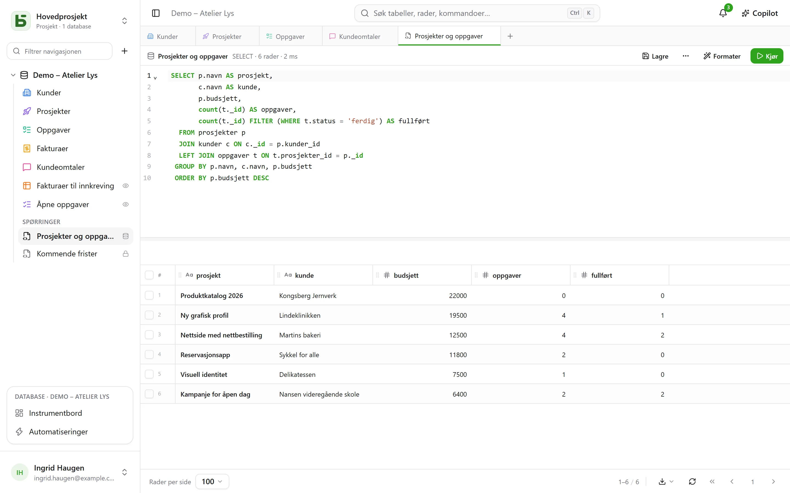
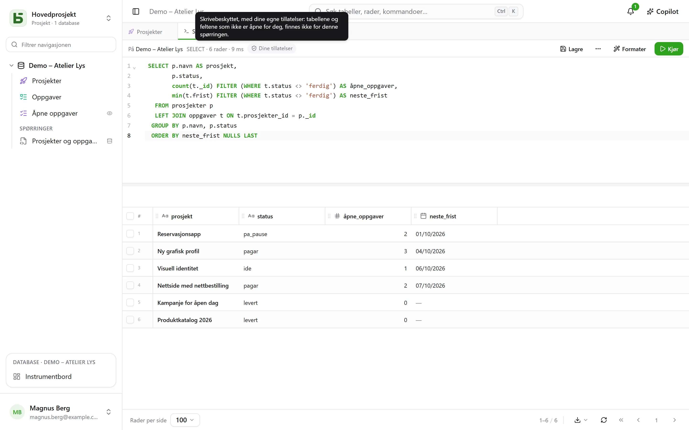
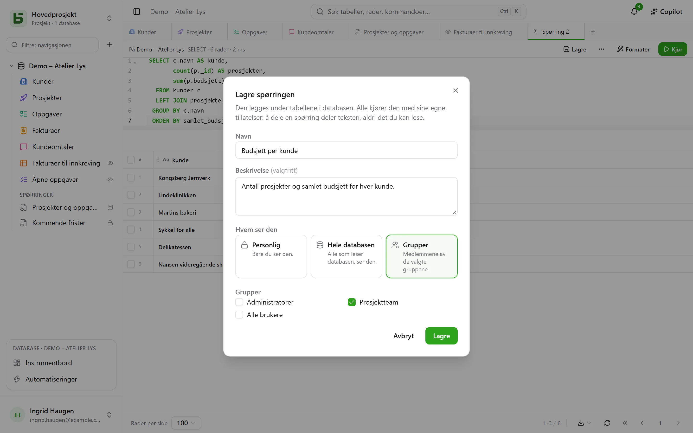
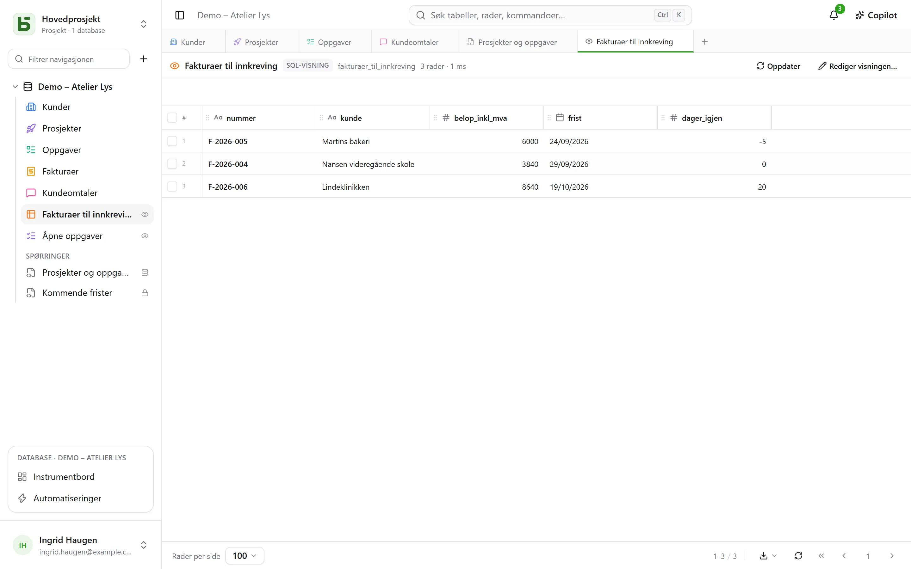
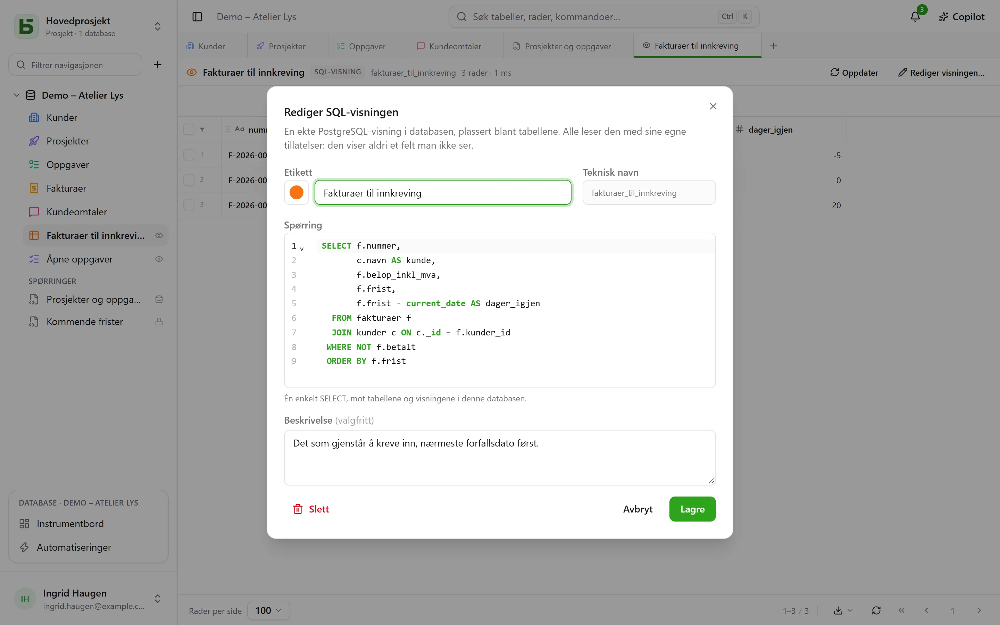

Tabellene dine er ekte PostgreSQL-tabeller, og grensesnittet spør dem i SQL, under deres ekte
navn. Hvert medlem av databasen kan skrive en spørring og **lagre** den under tabellene – for
seg selv, for hele databasen eller for noen grupper –, og den som administrerer databasen, kan gjøre den til en
**SQL-visning**: en ekte PostgreSQL-visning, plassert blant tabellene, som `psql` og verktøyene dine også
leser.



## Hver med sine tillatelser

**+** i fanelinjen, eller databasens **⋯**-meny → **SQL-spørring**, åpner en
SQL-fane: en editor med fargekoding og autofullføring, **Ctrl+Enter** for å kjøre, og
resultatet i det samme rutenettet som tabellene dine. Hva spørringen kan lese, avhenger av hvem som kjører den:

- med nivået **Administrere** på databasen: hele databasen, skriving inkludert;
- med nivåene **Lese** eller **Redigere** kjøres spørringen **skrivebeskyttet, med dine
  egne tillatelser**. En tabell som er stengt for deg, finnes ikke for den; et felt som er
  skjult for deg, forsvinner fra `SELECT *` og avvises hvis du navngir det, selv om du kvalifiserer tabellen;
  skriving avvises. Resultatet har merket **Dine tillatelser**.



Det er ikke skjermen som sorterer bort: PostgreSQL selv håndhever tillatelsene dine, kolonne for kolonne, med
en rolle som er din egen. En spørring kan derfor ikke vise deg noe som rutenettet, API-et eller
MCP-serveren ikke ville vist deg.

## Lagre en spørring

**Lagre**, i fanens verktøylinje, plasserer spørringen under databasens tabeller, i
delen **Spørringer**. Den åpnes igjen med ett klikk; **⋯** → **Lagre som…** lager en
kopi, og **Navn og deling…** (i fanen eller i menyen i sidepanelet) gir den nytt navn, endrer
hvem som ser den, eller sletter den – **Slett** finnes også i menyen dens, ved høyreklikk. En
fane som viste den, beholder teksten sin.



| Omfang | Hvem som ser den | Hvem som kan opprette og endre den |
|---|---|---|
| **Personlig** – en hengelås | bare deg | alle som ser databasen, for seg selv |
| **Hele databasen** | alle som ser databasen | nivået **Administrere** på databasen |
| **Grupper** | medlemmene av de valgte gruppene | nivået **Administrere** på databasen |

**Å dele en spørring deler teksten, aldri det forfatteren kan lese.** Alle kjører den
med sine egne tillatelser: den samme spørringen, åpnet av to personer, viser hver av dem det vedkommende
har lov til å se – eller forteller at en kolonne ikke finnes for vedkommende.

En spørring som åpnes fra sidepanelet, **kjøres med en gang, skrivebeskyttet**: du ser
resultatet uten å ha bestemt noe. **Kjør** kjører den deretter på nytt slik den er. En prikk
ved siden av navnet viser at du har endret teksten siden den ble lagret; **Lagre**
lagrer den der hvis du kan endre den, og foreslår ellers å lage en ny.

## SQL-visningene

En **SQL-visning** er en ekte PostgreSQL-visning i databasens skjema. Den plasseres **blant
tabellene**, med farge og ikon som en tabell, og et lite **øye** til høyre som viser
at det er en visning. Et klikk åpner den i en fane: radene i rutenettet, **Oppdater** for å
lese dem på nytt.



Den opprettes via databasens **⋯**-meny → **Ny SQL-visning…**, eller fra en SQL-fane:
**⋯** → **Opprett SQL-visning…**, og fanens spørring blir definisjonen. Dialogen
ber om:

- **etikett** og **utseende** – farge, ikon eller bilde, valgt som for en
  tabell;
- det **tekniske navnet**, avledet fra etiketten hvis du ikke oppgir et – det du skriver etter
  `FROM`;
- **spørringen**: én enkelt `SELECT`, mot databasens tabeller og andre visninger. PostgreSQL
  avviser det den avviser, og editoren peker på stedet.



Visningen leses deretter under navnet sitt, fra grensesnittet så vel som fra `psql` eller BI-verktøyet ditt:

```sql
SELECT * FROM b_t4z56fq_demo_atelier_lumen.factures_a_encaisser;
```

**En visning viser aldri et felt du ikke ser.** Alle leser den med sine egne tillatelser,
på hver tabell og hver kolonne den leser; sidepanelet viser den bare for dem som kan lese alt
den leser. Den leser bare **sin egen** database: en annen database, eller basedbs katalog,
avvises allerede ved opprettelsen. Å opprette, endre eller slette den krever nivået **Administrere**
på databasen. **Slett**, i menyen i sidepanelet, fjerner den for alle, skript og verktøy
inkludert; tabellene den leser, blir ikke berørt.

### Når strukturen endres

- Å **gi nytt navn** til en tabell eller et felt ødelegger ikke en visning: PostgreSQL følger med.
- Å **endre formelen** i et beregnet felt som den leser, fjerner den et øyeblikk, og legger den så tilbake på den
  nye kolonnen. Hvis den ikke lenger holder, forblir den **til retting** – en trekant viser det i
  sidepanelet – med definisjonen bevart: **Rediger visningen…**, rett, lagre.
- En tabell tømmes ikke permanent så lenge en visning leser den, og en visning slettes ikke så lenge en
  annen visning leser den: avvisningen navngir visningen det gjelder.

## Spørring, SQL-visning eller spørsmål?

| | Hva det er | Hvor den bor | Til |
|---|---|---|---|
| **Lagret spørring** | en SQL-tekst | under tabellene, delen «Spørringer» | finne igjen en spørring, dele den som tekst |
| **SQL-visning** | en ekte PostgreSQL-visning | blant tabellene | gi en lesing et navn, for grensesnittet **og** for `psql`, skriptene dine, verktøyene dine |
| **Spørsmål** | en lesing bygget med musen eller i SQL, og visualiseringen av den | i [instrumentbordene](/basedb/nb/fonctionnalites/tableaux-de-bord/) | et tall, et diagram, en krysstabell, under filtre |

## Begrensninger

- Rutenettet viser høyst det antallet **rader per side** som er valgt nederst på skjermen; «avkortet»
  viser det. En spørring stoppes etter 15 sekunder.
- En SQL-visning leses i SQL og i grensesnittet; REST-API-et og MCP-serveren eksponerer den ikke.
- En SQL-visning blir værende i miljøet der den ble opprettet: å opprette et miljø, sammenligne
  strukturen eller lagre en mal tar den ikke med ennå.
