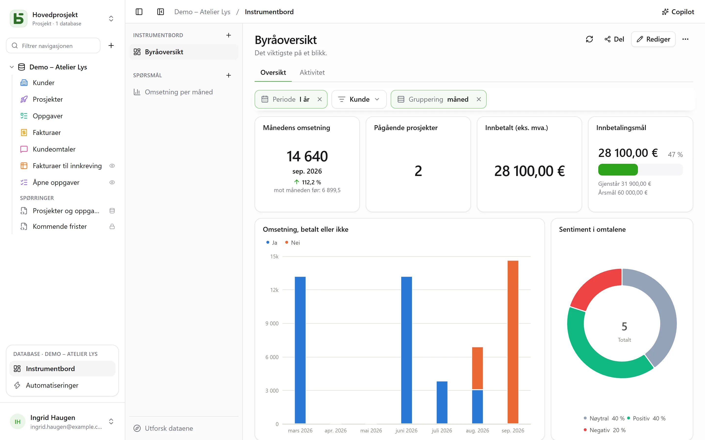
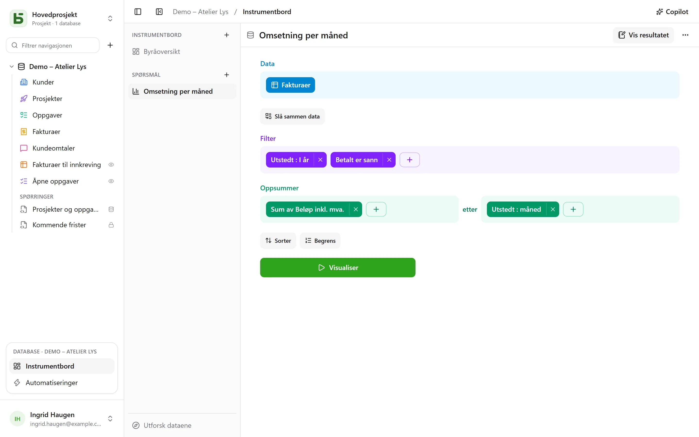
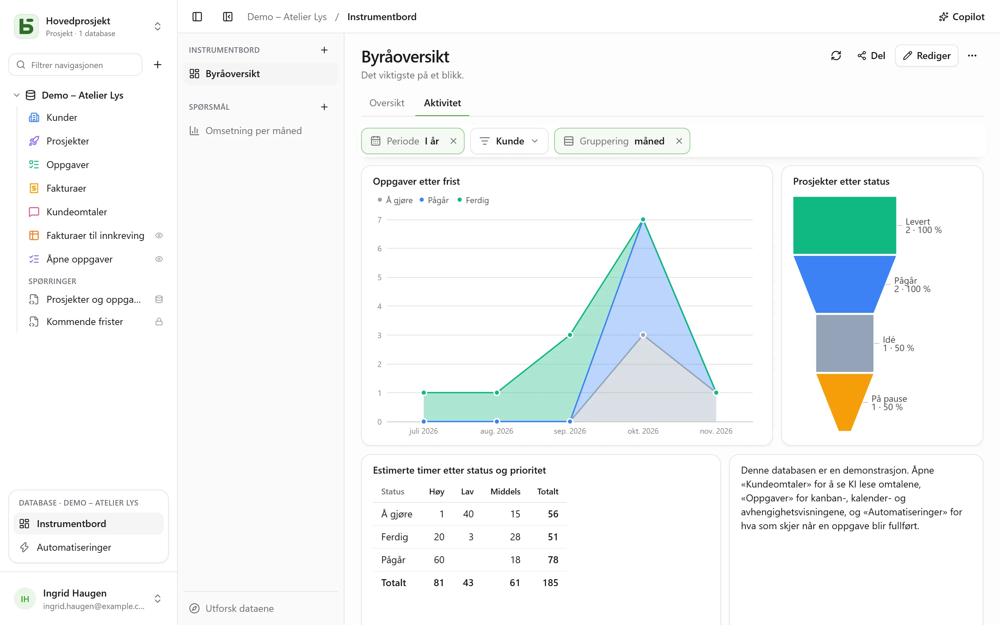

Et **instrumentbord** samler på én side det et team ser på hver dag: tallene
som betyr noe, utviklingen deres måned for måned, fordelingen av en status, de
neste fristene. Hvert kort viser et **spørsmål** – en lesing av databasen,
bygget med musen eller skrevet i SQL – og **filtre** øverst på siden styrer
kortene som er koblet til dem.



Alt åpnes fra **Instrumentbord**, i blokken for den åpne databasen nederst i
sidepanelet. Til venstre ligger databasens instrumentbord og lagrede spørsmål, og
**Utforsk dataene** for å stille et spørsmål uten å lagre noe. Alle som kan lese databasen,
kan se dem, utforske dem og lagre egne spørsmål; å bygge et instrumentbord og dele et
spørsmål krever nivået **Administrere**.

Et lagret spørsmål er **personlig** – bare du ser det –, for **hele databasen** eller for
**grupper**. Menyen, med høyreklikk eller **⋯**, åpner det i en fane ved siden av tabellene,
endrer navnet og delingen, eller sletter det. **+** i fanelinjen tilbyr også **Nytt spørsmål**
og **Nytt SQL-spørsmål**.

**Lagre**, i toppfeltet til et spørsmål, tar vare på det; et spørsmål du ikke kan endre, tilbyr i
stedet **Lagre en kopi**, som blir din egen. **⋯** (**Flere handlinger**) tilbyr også **Navn og
deling…**, **Lagre en kopi…** og **Slett spørsmålet**; en fane som viste det, beholder innholdet
sitt, som nå er ulagret igjen.

## Still et spørsmål med musen

Et spørsmål bygges i trinn, det ene under det andre:



| Trinn | Hva du velger der |
|---|---|
| **Data** | starttabellen, og kolonnene som vises når ingenting oppsummeres |
| **Slå sammen data** | en annen tabell i databasen, koblet via en relasjon – som foreslås automatisk – eller via to kolonner av samme slag; venstre, indre, høyre eller full join |
| **Filter** | per kolonne, med det typen tilbyr: er / er ikke, inneholder, mellom, tom …; for en dato en **periode**: i dag, de siste 30 dagene, denne måneden, forrige kvartal, fra … til …; eller et uttrykk skrevet som i verktøylinjen til visningene |
| **Oppsummer** | mål – antall rader, sum, gjennomsnitt, median, minimum, maksimum, distinkte verdier, standardavvik, løpende summer – **etter** én til tre kolonner |
| **Sorter**, **Begrens** | rekkefølgen på radene, og høyst hvor mange |

En dato grupperes **per dag, uke, måned, kvartal eller år**, eller etter plassering – ukedag,
måned i året, time på døgnet; et tall i intervaller. Et flervalgfelt
teller hver rad i hvert av valgene sine. Periodene leses i din tidssone, og
uken starter på dagen som er angitt i innstillingene dine.

**Visualiser** kjører spørsmålet. Resultatet vises på den måten som passer best – et
tall, en linje, stolper, en tabell – og kan endres nederst på skjermen:

| Visualisering | For å vise |
|---|---|
| **Tall**, **Trend**, **Fremdrift**, **Måler** | en verdi; den siste perioden mot den forrige og mot den samme i fjor; fremdriften mot et mål |
| **Stolper**, **Liggende stolper**, **Linje**, **Område**, **Kombinert** | mål langs en dimensjon, i serier side om side, stablet eller til 100 % |
| **Sektor**, **Trakt** | andeler, trinn |
| **Punktdiagram** | to mål mot hverandre, et tredje som størrelse |
| **Tabell**, **Krysstabell** | radene, sorterbare; radene etter én dimensjon, kolonnene etter en annen, med totalsummer |
| **Kart** | Frankrikes regioner eller departementer, eller land, farget etter en verdi; eller punkter etter breddegrad og lengdegrad |

**Oppsett** styrer hva som vises, og resultatet kan lastes ned som **CSV**.

### Tilpass et diagram

| Visualisering | Hva **Oppsett** tilbyr |
|---|---|
| **Stolper, linjer, områder, kombinert** | fargen og navnet på hver serie; stabling, med totalen over stablene; stolpebredden; utjevnede linjer eller trappelinjer, med eller uten punkter; rekkefølgen på kategoriene; aksetitlene, inndelingene, helningen på etikettene, grensene, en logaritmisk skala; verdiene på diagrammet; et mål |
| **Sektor** | en ring og tykkelsen på den, en halvsirkel, en rose; totalen i midten; antall andeler før «Andre»; fargen og navnet på hver andel; etikettene på andelene eller ved siden av; plasseringen av forklaringen |
| **Trakt** | fargen og navnet på hvert trinn, rekkefølgen på dem |
| **Tall, trend, fremdrift, måler** | fargen, farger etter verdien, en forklaring under tallet, sammenligningen – og om en nedgang er gode nyheter |
| **Tabell, krysstabell** | gi nytt navn til og endre rekkefølgen på kolonnene, stolper i cellene, farger etter verdien – per celle eller per rad –, tettheten, rader per side, radnumrene, totalsummene |
| **Kart** | fargetonen, navnene på regionene |

For alle: tallformatet – desimaler, prefiks og suffiks, forkortet til `1,2 k`.

## Utforsk med ett klikk

Et klikk på en stolpe, et punkt eller en andel åpner det den representerer:

- **Vis disse radene**: radene bak punktet, filtrert etter det det representerer;
- **Detaljer per uke**: en periode åpnet i en finere inndeling – et år i
  kvartaler, en måned i uker;
- **Fordel etter…**: det samme målet, for dette punktet, etter en annen kolonne;
- **Bare denne verdien**, **Utelat denne verdien**.

Hvert steg er et eget spørsmål, som kan lagres om du vil; tilbakepilen går tilbake
til forrige steg. En rad i en tabell åpner raddetaljene sine.

På et instrumentbord tilbyr det samme klikket også **Filtrer instrumentbordet: «Lyon»**, med
antallet kort det gjelder: et **midlertidig** filter, aldri lagret, vist stiplet
i filterlinjen og fjernbart med ett klikk, som gjelder for hvert kort der spørsmålet
leser den samme kolonnen – via tabellen eller via en join. Det tilbys bare hvis ingen av instrumentbordets filtre
allerede er koblet til denne kolonnen på kortet, og det forblir nedtonet («eneste kort») når
ingen andre kort leser den. SQL-spørsmål tar ikke hensyn til det.

## Skriv et spørsmål i SQL

Et **SQL-spørsmål** er en `SELECT` mot tabellene i databasen, under deres ekte navn. Det
kjøres **skrivebeskyttet, med dine egne tillatelser** – for alle, også
administratorer: en tabell som er stengt for deg, finnes ikke, et skjult felt avvises, og
skriving er umulig. For bare å legge en spørring under tabellene, uten diagram, eller
gjøre den til en ekte PostgreSQL-visning, se [Spørringer og SQL-visninger](/basedb/nb/fonctionnalites/requetes-et-vues-sql/).

En **variabel** skrives `{{nom}}`; en del som skal fjernes når den ikke har noen verdi, står mellom
`[[` og `]]`:

```sql
SELECT statut, count(*) AS taches
  FROM taches
 WHERE {{periode}} [[AND priorite = {{priorite}}]]
 GROUP BY statut
```

En variabel er en tekst, et tall, en dato – eller et **kolonnefilter**: `{{periode}}`
blir da en hel betingelse på den valgte kolonnen, `echeance` her, eller `TRUE` når ingenting
er valgt. Det er dette som lar et filter på instrumentbordet styre et SQL-spørsmål
som alle andre.

## Sett opp et instrumentbord

**Rediger** setter instrumentbordet i redigeringsmodus:

- **Spørsmål** plasserer et lagret spørsmål – et personlig spørsmål kopieres inn dit –, eller
  oppretter et som hører til kortet;
- **Tittel** legger til en seksjonstittel, **Tekst** en formatert tekst — overskrifter, lister,
  lenker — som kan sitere tall (se nedenfor);
- **Innebygd side** viser en `https://`-adresse i en isolert ramme, som verken får
  økt eller data;
- **Fane** fordeler kortene på flere sider; et dobbeltklikk gir en fane nytt navn.

Kortene flyttes med håndtaket og endrer størrelse fra hjørnet, på et rutenett med
24 kolonner. **Lagre** tar vare på alt; **Avbryt** går tilbake til versjonen fra før. En korttittel
åpner, i lesemodus, spørsmålet sitt for utforsking, instrumentbordets filtre inkludert.

### Tall i teksten

En tekst siterer en verdi med et navn mellom doble krøllparenteser: «Denne måneden er det
`{{chiffre_affaires}}` i omsetning på `{{commandes}}` bestillinger.» Hvert navn blir en
pille, som kobles til med ett klikk – eller via **Variabel** i editorens verktøylinje – til:

| Kilde | Hva teksten viser |
|---|---|
| **et kort** på instrumentbordet | det kortet viser, under sine egne filtre |
| **et lagret spørsmål** for hele databasen | verdien dens, og instrumentbordets filtre kobles til den som til et kort |
| **et spørsmål bevart i teksten** | verdien dens; det er slik man siterer et personlig spørsmål |
| **et filter** på instrumentbordet | den valgte verdien, slik kommandoen sier den |

Verdien til et spørsmål er den som **Tall** ville vist: dets første mål, på siste rad. Den
beregnes med leserens tillatelser, og vises alltid som tekst. En tekst siterer høyst 20 verdier;
et navn skrives med små bokstaver, tall og `_`. Tekster skrevet i Markdown før editoren leses
som før, og blir rike så snart de skrives om. Copilot skriver derimot sine tekster i Markdown.

## Filtrene

**Filter** legger til en kontroll øverst på instrumentbordet: en **dato** (en periode), en
**kategori** (verdier å krysse av for), en **tekst**, et **tall** eller en **datogruppering**
som lar linjene gå fra måned til uke eller år.

Et filter styrer kortene som er koblet til det – ett, flere eller alle. Når det opprettes,
kobler det seg selv til kolonnene som passer; når det er valgt, viser det på hvert kort
kolonnen det filtrerer, som kan endres eller fjernes, og **Koble til alle kompatible kort**
fyller ut resten. Det kan ha en **standardverdi** – «I år», for eksempel.

I lesemodus kan et klikk på et punkt også justere et filter: **Filtrer etter «Lyon»** på et
kort der kolonnen med byer er koblet til filteret «Ville».



## Copilot

**Copilot**, i toppfeltet til Instrumentbord-delen, åpner til høyre en samtale på
naturlig språk om databasen: «omsetningen per måned», «legg til et filter per kunde»,
«hvorfor faller august?». Hvert forslag kommer som et kort, som tas i bruk med ett klikk:

| Forslag | Hva det gjør |
|---|---|
| **Et spørsmål** | kjøres og tegnes i samtalen; det åpnes i editoren eller legges til på instrumentbordet |
| **Endringer i instrumentbordet**, eller et nytt instrumentbord | kort som legges til, endres eller fjernes, tekster, filtre som selv kobler seg til kortene som har kolonnen, faner, navn – én enkelt lagring, som **kan angres** fra kortet |
| **Verdier for de viste filtrene** | «vis meg forrige måned»: filtrene justeres, ingenting lagres |

Å stille et spørsmål eller justere filtrene er åpent for alle som kan lese databasen; å endre eller opprette
et instrumentbord krever nivået **Administrere**.

Som standard sendes **bare strukturen** til KI-leverandøren, sammen med samtalen:
tabellene og feltene deres, databasens instrumentbord og lagrede spørsmål, og det viste
instrumentbordet – fanene, filtrene, definisjonen av kortene (spørsmålene og tekstene deres).
Verken radene, resultatene på kortene eller **verdiene som er valgt i filtrene**, som
kan være data: fra et filter sendes bare det faktum at det har en verdi. Et felt som er merket
som usynlig for agenter, sendes ikke, heller ikke spørsmålet på et kort som refererer til det.

Avkrysningsboksen **Tillat lesing av dataene** legger for samtalen til verdiene i de
viste filtrene og resultatene på kortene under disse filtrene (høyst 50 rader per lesing,
listet under svaret), slik at tallene kan kommenteres med belegg. Se
[Kunstig intelligens](/basedb/nb/fonctionnalites/ia/).

## Del et instrumentbord

**Del**, i toppfeltet til et instrumentbord, er tilgjengelig for den som har nivået **Administrere** på
databasen. To muligheter:

- **Del databasen…** inviterer personer til databasen: de åpner instrumentbordet i basedb, og
  hvert kort leser med deres egne tillatelser;
- **Opprett lenke** gir en lenke til **bare** dette instrumentbordet, som ikke krever noen tillatelser til databasen.

| Lenkens tilgang | Hvem som leser |
|---|---|
| **Offentlig** | alle som har lenken, uten konto |
| **Innloggede medlemmer** | et medlem av arbeidsområdet, etter innlogging – ved behov bare fra bestemte grupper |

Lenkesiden viser instrumentbordets faner, filtre og kort, **skrivebeskyttet**:
ingen utforsking, ingen tilgang til radene, ingen egne spørsmål. Kortene leser med **tillatelsene til
personen som publiserte lenken**, vurdert på nytt ved hver lesing: mister vedkommende tilgangen til databasen, blir
lenken **stanset**. Bryteren **Aktiv lenke** slår den av uten at den går tapt, og **Generer på nytt**
ugyldiggjør den gamle.

Kryss av for **Tillat innbygging på et annet nettsted**: dialogen gir en **innbyggingskode**
`<iframe>`, for å vise instrumentbordet i et intranett eller en wiki. Det er den samme mekanismen som for
[delte visninger](/basedb/nb/fonctionnalites/vues-partagees/).

## Hver med sine tillatelser

Hvert kort leser **med tillatelsene til den som ser på**: det samme instrumentbordet viser hver enkelt det vedkommende har
lov til å se – unntatt via en delingslenke, som leser med tillatelsene til personen som publiserte den. Et kort som gjelder en tabell eller et felt som er stengt for deg, viser
«Utilgjengelige data», i stedet for et tall som ville lyve ved å utelate noe. Å lagre et
spørsmål deler bare spørsmålet, aldri det forfatteren kan lese.

## Begrensninger

- Et spørsmål returnerer høyst 2 000 rader; et sammendrag klarer seg nesten alltid med det.
- Hvert kort kjører spørringen sin ved åpning og ved hvert filter, uten hurtigbuffer.
- Kartgrunnlagene dekker det franske fastlandet (regioner, departementer) og verdens
  land. Kilde: IGN, Admin Express (Licence ouverte); Natural Earth.
