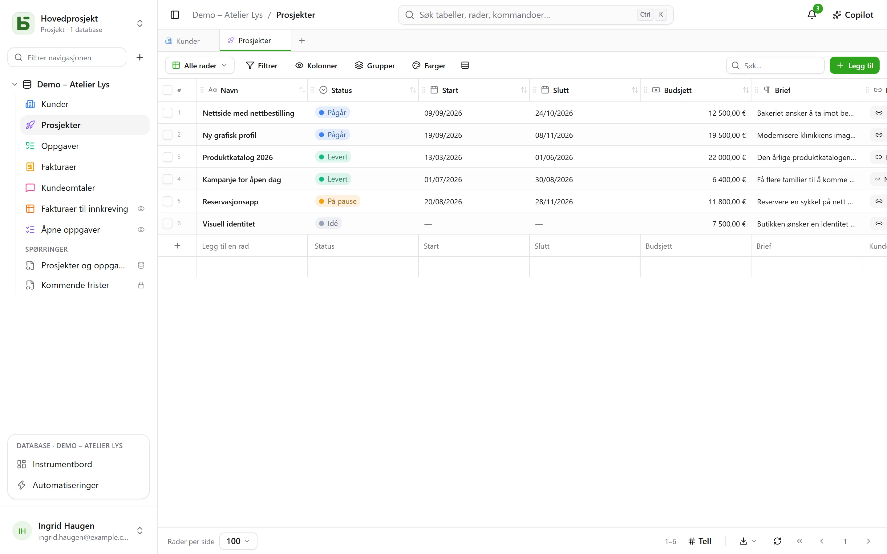
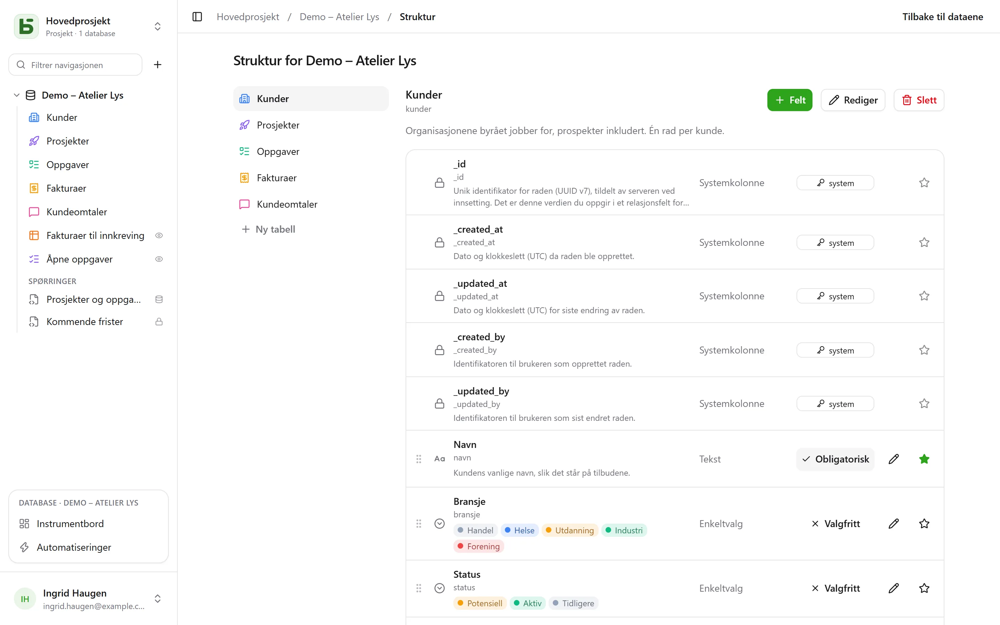

Hver tabell i basedb er en PostgreSQL-tabell; hvert felt en typet kolonne. Etiketten
du skriver inn («Échéance») blir et lesbart fysisk navn (`echeance`) gjennom en stabil
**slugifisering**: uten aksenter, med små bokstaver, uten reserverte ord.

## Typene

| Type | PostgreSQL-kolonne | Merknader |
|---|---|---|
| Kort tekst | `text` | én linje |
| Lang tekst | `text` | Markdown: et utdrag i rutenettet, formatert visning når du holder musen over, en egen editor; kan [referere til en kolonne](#formatert-tekst-og-variabler) |
| Formatert tekst | `text` + `CHECK` | HTML som renses ved skriving, skrevet i en visuell editor – [se nedenfor](#formatert-tekst-og-variabler) |
| Tall | `numeric` | aldri flyttall: et beløp driver ikke |
| Valuta, Prosent, Varighet, Vurdering | `numeric` | et tall og dets [visningsformat](#visningsformater): `12,50 €`, `15 %`, `1:30`, ★★★★☆ |
| Avmerkingsboks | `boolean` | |
| Dato | `date` | |
| Dato og klokkeslett | `timestamptz` | et absolutt tidspunkt, vist i leserens tidssone |
| Enkeltvalg | `text` + `CHECK` | farge, ikon eller bilde per alternativ |
| Flervalg | `text[]` + `CHECK` | kan filtreres med array-operatorene |
| E-post | `text` + `CHECK` | en adresse som databasen kontrollerer, åpnes med ett klikk |
| Telefon, Strekkode, Adresse | `text` | en kort tekst og dens format: ringelenke, fast tegnbredde, lenke til kartet |
| URL | `text` + `CHECK` | fullføres ved inntasting (`exemple.fr` → `https://exemple.fr`) |
| Person | `uuid` | et medlem av arbeidsområdet; å velge noen [varsler vedkommende](/basedb/nb/fonctionnalites/collaboration/) |
| Autonummer | `bigint` identity | nummererer også radene som finnes fra før; ingen skriver det inn |
| Relasjon | `uuid` + `FOREIGN KEY` | en ekte fremmednøkkel til måltabellen |
| Multippel relasjon | `uuid[]` | flere koblede rader, der integriteten opprettholdes av en trigger |
| Formel | generert kolonne `STORED` | beregnes av PostgreSQL – eller ved lesing, se [Formler](#formler) |
| Oppslag, Aggregering, Antall | ingen | beregnes ved lesing, via en relasjon |
| Knapp | ingen | åpner en adresse eller starter en [automatisering](/basedb/nb/fonctionnalites/automatisations/) |
| Fil, Bilde | `jsonb` (metadata) | selve bytene går til [fillagringen](/basedb/nb/fonctionnalites/fichiers/) |

Hver tabell har også sine **systemkolonner**: `_id` (UUID v7), `_created_at`,
`_updated_at`, `_created_by`, `_updated_by` – vedlikeholdt av en trigger, aldri skrivbare
via API-et. Rutenettet samler dem under **Systeminformasjon**, i kolonnemenyen:
de finnes på hver tabell, og er nyttige på få.



## Begrensninger som databasen håndhever

Det grensesnittet lover, garanterer PostgreSQL. Et enkeltvalg er en `CHECK`-begrensning;
en relasjon en `FOREIGN KEY`; en URL eller en e-postadresse et regulært
uttrykk. En skriving i direkte SQL som bryter dem, avvises, akkurat som i grensesnittet:

```text
Check constraints:
  "ck_opportunites__statut__enum" CHECK (statut = ANY (ARRAY['nouveau', 'qualifie', …]))
Foreign-key constraints:
  "fk_opportunites__clients_id" FOREIGN KEY (clients_id) REFERENCES b_t4z56fq_ventes.clients(_id)
```

## Visningsformater

Valuta, Prosent, Varighet, Vurdering, Telefon, Strekkode og Adresse velges som typer,
men de er **formater**: kolonnen forblir et tall eller en tekst, det er bare visningen som endres.

| Format | På | Leses og skrives inn |
|---|---|---|
| Valuta | et tall | `12 500,00 €` – euro, dollar, pund, sveitsisk franc, kanadisk dollar, yen |
| Prosent | et tall | `15 %` |
| Varighet | et antall sekunder | `1:30`, og skrives inn som `1h30`, `90 min` |
| Vurdering | et tall | fra 1 til 10 stjerner, settes med ett klikk |
| Telefon | en kort tekst | en ringelenke |
| Strekkode | en kort tekst | med fast tegnbredde |
| Adresse | en kort tekst | en lenke til kartet; i raddetaljene foreslår **Finn adresse** adressene som samsvarer, skrevet i sin helhet; visningen [Kart](/basedb/nb/fonctionnalites/vues/#kart) plasserer den |

Et format kan endres i etterkant (**Visningsformat**, når du redigerer feltet) uten å røre de
lagrede verdiene. Det begrenser ikke verdien: en vurdering på 7 på en skala til 5 forblir 7.

## Standardverdier

Når du redigerer et felt, fastsetter **Standardverdi** hva en rad som opprettes uten den, får:

| Valg | På | Den opprettede raden får |
|---|---|---|
| En fast verdi | de fleste typer | den valgte verdien — en status «Ny», en prioritet 3 |
| Dagens dato | en dato | dagen den ble opprettet, i personens tidssone |
| Tidspunktet for opprettelsen | en dato og klokkeslett | det nøyaktige klokkeslettet |
| Personen som oppretter raden | en person | den som opprettet den — «Ansvarlig: meg» |

Den nye raddetaljen og skjemaene åpnes forhåndsutfylt; å tømme feltet lar det stå tomt.
Standardverdien gjelder for all opprettelse — grensesnitt, API, MCP, import, delt skjema,
automatisering —, også på et felt personen ikke kan endre: det er tabellens regel. Eksisterende
rader endres ikke, og en direkte SQL-innsetting mottar ingen: det er basedb som håndhever den,
ikke kolonnen.

## Formler

En formel skrives på engelsk (de franske navnene fungerer også), med feltene i hakeparenteser og argumentene skilt med `,`:

```text
ROUND([Montant HT] * (1 + [Taux de TVA]), 2)
IF([Payée], FALSE, DAYS(TODAY(), [Échéance]) > 0)
DAYS([Fin], [Début])
```

Editoren foreslår felt å sette inn og har et panel med funksjonene; en feilmelding navngir feltet eller
tegnet det gjelder.

| Familie | Funksjoner |
|---|---|
| Logikk | `IF`, `IFBLANK`, `ISBLANK`, `AND`, `OR`, `NOT`, `TRUE`, `FALSE` |
| Tall | `ROUND`, `ABS`, `CEILING`, `FLOOR`, `MIN`, `MAX` |
| Tekst | `UPPER`, `LOWER`, `TRIM`, `LEFT`, `RIGHT`, `LEN`, `TEXT`, `VALUE` |
| Datoer | `YEAR`, `MONTH`, `DAY`, `WEEKDAY`, `DAYS`, `ADD_DAYS`, `DATE`, `TODAY`, `NOW` |
| Operatorer | `+ - * /`, `&` for å slå sammen tekst, `= <> < <= > >=` |

En formel blir en **generert kolonne** i PostgreSQL: `psql` og verktøyene dine leser den
som alle andre. En formel som avhenger av dagens dato (`TODAY()`, `NOW()`) eller som refererer til et
oppslag eller en aggregering, **beregnes ved lesing**: den kan filtreres og sorteres i basedb, men
finnes ikke i direkte SQL.

En formel refererer verken til en annen formel eller direkte til en relasjon – det gjør et oppslag.
Å hente ut eller erstatte en del av en tekst kommer senere.

## Oppslag, aggregeringer og antall

Tre felt leser **via en relasjon**, i den ene eller den andre retningen – «prosjektets
kunde», men også «oppgavene som er koblet via Projet»:

- et **oppslag** henter en verdi fra den koblede raden, eller listen over verdier: byen til
  kunden for et prosjekt;
- en **aggregering** beregner på de koblede radene: antall verdier, sum, gjennomsnitt, minimum,
  maksimum – omsetningen til en kunde, gjennomsnittsvurderingen i tilbakemeldingene fra kunden;
- et **antall** teller de koblede radene: antall oppgaver i et prosjekt.

De beregnes ved hver lesing, **med tillatelsene til den som leser**: hvis den koblede tabellen er
stengt for deg, er feltet det også. De kan filtreres og sorteres. De følger én enkelt relasjon, kan ikke
skrives til, har ingen kolonne – og finnes derfor ikke i direkte SQL – og er verken med
i importen, i skjemaene eller i historikken.

## Relasjonene

En **relasjon** kobler en rad til en rad i en annen tabell i samme database. Rutenettet
viser **visningsverdien** til målraden – kolonnen du angir som visningsfelt
for tabellen – og filtrene går gjennom relasjonen (`clients_id.ville eq "Lyon"`). Radene
som peker på en rad, vises i raddetaljene dens.

Kryss av for **Flere rader per post**, så blir relasjonen **multippel**: en oppgave
avhenger av flere oppgaver, en artikkel hører til flere kategorier. De koblede radene
vises som merker, velges med et søk og åpnes med ett klikk fra
raddetaljene. Når en målrad slettes, fjernes den fra listene som refererte til den – eller slettingen avvises, hvis du
har valgt det. Filtrene `has_any`, `has_all` og `is_null` gjelder, og også de går
gjennom relasjonen (`taches_ids.titre contains "logo"`). En multippel relasjon kan ennå ikke sorteres,
grupperes eller importeres.

## Knapp

Et **Knapp**-felt har ingen verdi: det handler. Det **åpner en adresse** – `https://` eller
`mailto:`, som kan referere til raden (`mailto:{{E-mail}}`) – eller **starter en automatisering**
som utløses av en knapp på samme tabell. Det vises i cellen, på kortet og i
raddetaljene.

## Beskrivelser

En database, en tabell og et felt har en **beskrivelse**, som kan endres uten migrering. Den
kopieres inn i `COMMENT ON` som `psql` leser, i den genererte dokumentasjonen og i det en
agent leser via `describe_table`.

## Formatert tekst og variabler

**Formatert tekst** er HTML-varianten av lang tekst, valgt når feltet opprettes
(«Formatert tekst (HTML)»): overskrifter, fet, kursiv, understreket, gjennomstreket, lister, sitater, kode,
lenker og skillelinjer, i en visuell editor. HTML-en **renses ved skriving**, enten den kommer
fra grensesnittet, API-et, MCP-serveren eller en import, og en `CHECK`-begrensning avviser i tillegg
farlige konstruksjoner som skrives direkte i SQL (`<script>`, `on…`-attributter, `javascript:`).
Verken bilder, tabeller eller farger: det databasen ikke ville beholde, tilbys ikke.

En lang tekst – enkel eller formatert – kan **referere til en kolonne i sin egen rad**. Menyen **Kolonne** i
editoren setter inn referansen ved markøren: et merke i formatert tekst, `{{Ville}}` i
Markdown.

> Levering planlagt `{{Livraison}}` i `{{Ville}}`.

- Kolonnen lagrer referansen slik den er skrevet – `{{ville}}`, med det fysiske navnet: det er det
  `psql` leser.
- Overalt ellers – rutenettet, raddetaljene, API-et, MCP-serveren, de delte visningene,
  automatiseringene – leses teksten **med verdien fra raden**: «Levering planlagt
  02.10.2026 i Lyon.» Endrer du byen, endres teksten.
- Et enkeltvalg leses med etiketten sin, en person med navnet sitt, en dato i ditt
  format; en verdi som settes inn i formatert tekst, er aldri markup.
- En kolonne som leseren ikke har lov til å lese, gir ingenting: verken verdien eller navnet.

Formatert tekst kan ikke fylles ut av KI: en modell skriver tekst, ikke renset HTML.

## Endre strukturen

Databasens **Struktur**-skjerm – i **⋯**-menyen i sidepanelet – viser tabellene og feltene deres: legg til, gi nytt navn, gjør obligatorisk, endre rekkefølge,
beskriv, angi visningsfeltet.



Å endre strukturen krever nivået **Administrere**. Uten det kan skjermen bare leses og tilbyr
ingenting: ingen knapp, ingen blyant, ingen dra-håndtak – at et felt er obligatorisk og hvilket som er visningsfelt, står oppgitt, men kan ikke
endres. Serveren avviser uansett hver endring; skjermen later ikke lenger som om den
godtar dem.

Å legge til, gi nytt navn til eller endre typen på et felt går via **migreringsmotoren**: en plan i
trinn, korte låser og en navngitt avvisning når en verdi ikke kan konverteres.

Å **gi nytt navn** til en database, en tabell eller et felt gjøres i én og samme dialog. Etiketten endres
alltid, uten migrering. En administrator ser under den «Gi nytt navn også i databasen:
`clients` → `comptes`»: er den avkrysset, endres også det fysiske navnet, og konsekvensanalysen
vises – spørringene, SQL-visningene og automatiseringene som refererer til det gamle navnet. Det gamle
navnet fortsetter å fungere gjennom et **kompatibilitetsalias** – en visning – mens du oppdaterer
spørringene dine.

Sletting fjerner ingenting med en gang: tabellen eller databasen flyttes til side
(`zz_supprime_…`) og kan fortsatt leses i SQL. En slettet database kan gjenopprettes; å hente tilbake en enkelt
tabell fra grensesnittet [kommer senere](/basedb/nb/feuille-de-route/). Den endelige **tømmingen**
er forbeholdt administrasjonen, tretti dager etterpå, og begynner med en kontrollert CSV-eksport.
