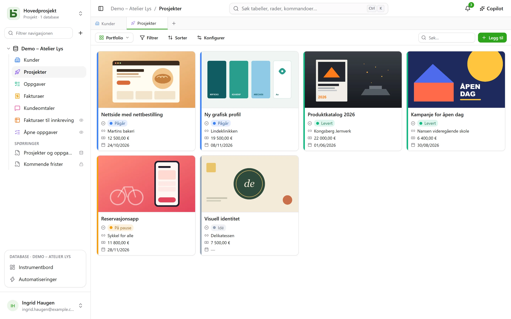
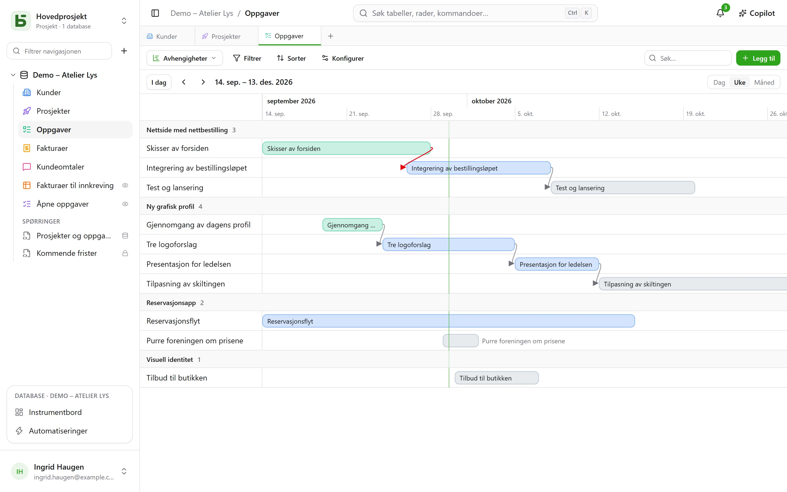
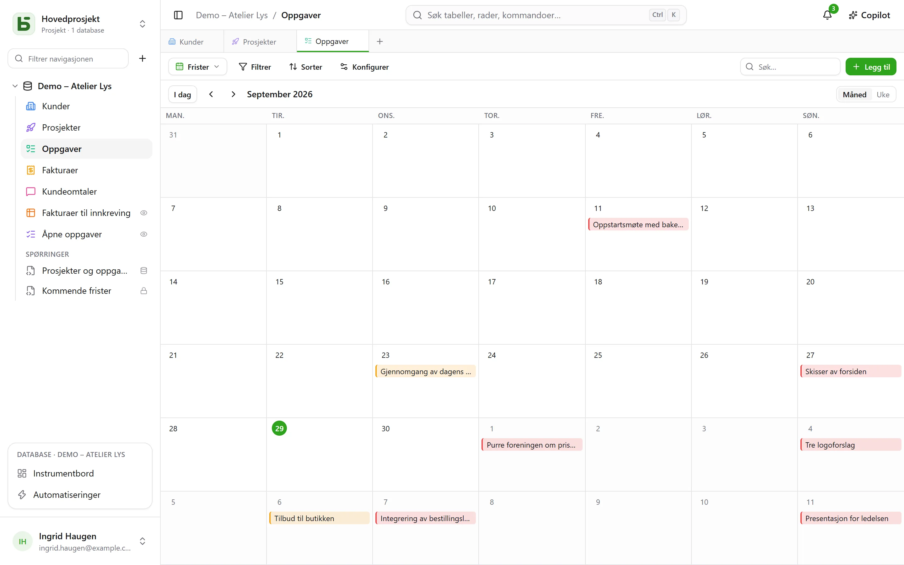
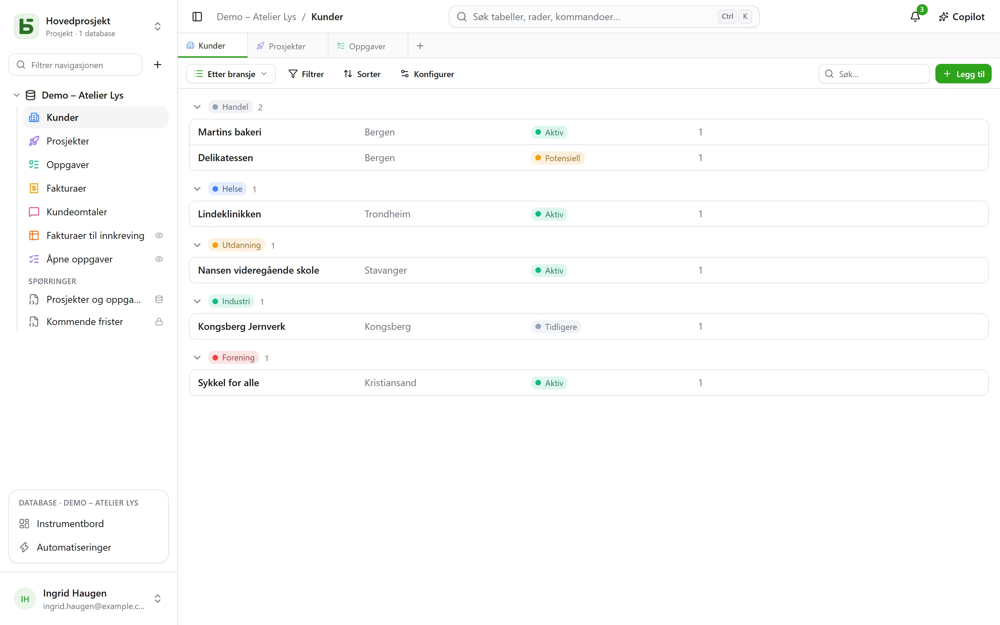

En tabell kan vises på **ti måter**. En visning kopierer ingen data, og gir ingen tillatelser
utover dem tabellen selv gir.

:::note
Disse visningene er måter å vise **én** tabell på. En [SQL-visning](/basedb/nb/fonctionnalites/requetes-et-vues-sql/)
er noe annet: en ekte PostgreSQL-visning, skrevet i SQL mot tabellene i databasen og plassert blant
dem i sidepanelet.
:::

| Visning | Hva den viser | Hva den trenger |
|---|---|---|
| **Rutenett** | rader, filtrert, sortert, gruppert, med utvalgte kolonner | – |
| **Kanban** | kort i kolonner | et enkeltvalgfelt |
| **Kalender** | rader på datoen sin, per måned eller per uke | et datofelt |
| **Tidslinje** | stolper mellom to datoer, og avhengighetene mellom dem | en startdato |
| **Galleri** | kort, med et forsidebilde | – |
| **Liste** | én linje per post, i sammenleggbare grupper | – |
| **Kart** | hver rad plassert på et kart | en adresse, eller en breddegrad og en lengdegrad |
| **Skjema** | en side med spørsmål for å opprette en rad | – |
| **Spørreundersøkelse** | de samme spørsmålene, ett per skjermbilde | – |
| **Quiz** | vurderte spørsmål, ett per skjermbilde, og poengsummen til slutt | – |

## Visningsvelgeren

Den står til venstre for «Filtrer». «Alle rader» er tabellens rutenett, som ingen
har lagret og ingen kan slette; deretter kommer de **felles visningene**, i
rekkefølgen den som bygger databasen har valgt, og så **Mine visninger**. Nederst ordner
**Opprett en visning** de ti slagene i to familier: dem som **ser radene**, og dem som **samler
inn svar** (skjema, spørreundersøkelse, quiz).

- En **felles visning** ses av alle. Å opprette, konfigurere, gi nytt navn til,
  endre rekkefølgen på eller slette den krever nivået **Administrere**. Den kan være **låst**: en
  hengelås viser det, og ingen kan endre den før den er låst opp.
- En **personlig visning** ses bare av deg, og krever bare at du kan lese tabellen.
  **Opprett personlig visning**, eller **Lagre som visning** etter at du har filtrert og sortert:
  hver enkelt tar vare på sine egne måter å lese på, uten å endre noe for andre. **Dupliser** på en
  felles visning lager en personlig kopi.

## Verktøylinjen

Over rutenettet, i denne rekkefølgen:

- **Filtrer** kombinerer betingelser per felt;
- **Kolonner** velger hva som vises – systemkolonnene står for seg, under
  «Systeminformasjon»;
- **Grupper** ordner radene etter et felt med én verdi – enkeltvalg, relasjon,
  person, dato, tall, tekst, avmerkingsboks … – i sammenleggbare grupper, hver med sitt
  antall for hele filteret;
- **Farger** fargelegger radene etter et enkeltvalgfelt, eller etter **regler** – et filter og
  en farge, høyst tjue – som strek, bakgrunn eller begge deler;
- **Radhøyde**: lav, middels, høy, svært høy;
- **Søk…**, til høyre, søker i alle kolonnene mens du skriver; Esc
  tømmer søket. Det gjelder også for kanban, kalender, tidslinje, galleri
  og liste, og lagres aldri i visningen.

Under hver kolonne et **Sammendrag** som beregnes på alle radene i filteret, ikke bare på
siden: utfylte, tomme, unike verdier, sum, gjennomsnitt, minimum, maksimum, avkryssede bokser.

## Kanban, kalender, tidslinje

- **Kanban** ordner kortene etter et enkeltvalgfelt; å dra et kort endrer raden,
  og en «+» øverst i en kolonne oppretter en rad som allerede har det valget. Hvert kort viser en
  tittel, et forsidebilde, de valgte feltene og en **beskrivelse** som refererer til
  verdiene i raden – «Levering planlagt `{{Date}}` for `{{Client}}`» –, skrevet i
  visningens innstillinger med knappen **Sett inn felt**.
- **Kalenderen** plasserer hver rad på datoen sin, eventuelt med en sluttdato; å dra en
  rad fra én dag til en annen flytter den.
- **Tidslinjen** tegner stolper mellom en startdato og en sluttdato, gruppert etter
  et enkeltvalgfelt eller en relasjon. Med innstillingen **Avhenger av** – en relasjon fra tabellen
  til seg selv – kobler en pil hver oppgave til dem den avhenger av, rød når den
  går bakover i tid.

## Galleri og liste

- **Galleriet** viser kort: et **forsidebilde** (beskåret eller helt), en
  størrelse (små, middels, store kort), en farge etter et enkeltvalgfelt.
- **Listen** viser én linje per post, **gruppert** etter et enkeltvalgfelt, en
  relasjon eller en person.

I kanban, galleri og liste kan kortene og linjene **ordnes for hånd** ved å
dra dem – opptil 5 000; en valgt sortering går foran denne rekkefølgen.

## Kart

**Kartet** plasserer hver rad på stedet sitt, basert på:

- en **adresse** — en kort tekst, aller helst i formatet **Adresse** (se
  [Tabeller og felt](/basedb/nb/fonctionnalites/tables-et-champs/)): «12 rue des Lilas, Lyon»;
- eller en **breddegrad** og en **lengdegrad**, to tallfelt, plassert direkte.

En nål tar **fargen** til et enkeltvalgfelt, viser radens **tittel** når du holder musen over,
og åpner raddetaljene ved klikk. Kartet følger visningens filter og sortering, opptil 2 000
rader.

En adresse **plasseres én gang for alle** av instansens geokodingstjeneste — som standard
OpenStreetMaps —, i det tempoet den setter: på et helt nytt kart dukker nålene opp etter hvert
som svarene kommer, med omtrent én i sekundet, og umiddelbart de neste gangene. En pastill
teller de plasserte radene, adressene som fortsatt skal plasseres, og dem som ikke kunne
plasseres: en adresse som ikke finnes, må presiseres (by, postnummer), aldri stille utelatt.

:::note[Det som forlater serveren din]
Adressetekstene sendes til geokodingstjenesten, og nettleseren til hver leser laster kartbunnen
fra flistjeneren. Den som drifter instansen, kan velge andre tjenester, eller ikke ville ha
noen: se [Miljøvariabler](/basedb/nb/hebergement/variables/#kart-og-adresser).
:::

## Skjema og spørreundersøkelse

Du krysser av for spørsmålene og ordner dem; hvert av dem har en tekst, en hjelpetekst, et eksempel
på svar, og kan gjøres obligatorisk. Skjemaet har sin tittel, sin innledning, teksten på knappen og
takkemeldingen sin. Det fylles ut i basedb, eller [deles med en lenke](/basedb/nb/fonctionnalites/formulaires-partages/).

Ingenting må stilles inn for å komme i gang: et nytt skjema spør om det en person svarer — ikke
statusen, personen som er tildelt, eller relasjonene som teamet fyller ut senere, med mindre de er
obligatoriske —, bærer fargen til tabellen sin og et lyst tema, og hvert tomme felt viser et
tilpasset eksempel. Alt annet kan endres når man vil:

- **Utseende**: åtte temaer – Lyst, Myk, Daggry, Hav, Skog, Natt, Papir, Minimal –, en
  aksentfarge, en skrift, en venstrejustert eller sentrert justering;
- **Fyll ut på forhånd med dagens dato**: et datospørsmål er allerede fylt ut med dagen – og
  klokkeslettet, for dato og klokkeslett – som personen beholder eller endrer;
- **Spør bare hvis…**: et spørsmål stilles bare hvis et tidligere svar krever det («Følelse er
  Negativ», «Vurdering er høyst 2»). Et skjult spørsmål er verken påkrevd eller sendt inn;
- **Flere innstillinger**: knappene for velkomst og innsending, numrene, fremdriftslinjen, automatisk
  overgang til neste, meldingen og en avslutningsknapp («Tilbake til nettstedet»), konfettien.

**Spørreundersøkelsen** fyller hele skjermen: en velkomst som sier hvor lang tid det tar, deretter
ett spørsmål om gangen, som glir inn. Alt kan også gjøres med tastaturet: **Enter** for å gå
videre, bokstavene **A**, **B**, **C**… for et valg, **J** eller **N** for ja eller nei, tall for en
vurdering – et enkeltvalg går alene videre til neste spørsmål. Innsendingen feires: en hake som
tegnes og konfetti i skjemaets farger.

## Quiz

En quiz er en spørreundersøkelse som teller poeng. Under hvert spørsmål oppgir du dets **riktige
svar** og det det gir — **1 poeng** hvis ingenting oppgis, opptil 100:

| Spørsmål | Riktig svar |
|---|---|
| enkeltvalg | ett valg |
| flervalg | valgene som skal krysses av — alle og bare dem |
| avmerkingsboks | ja eller nei |
| tall, vurdering | et tall |
| dato | en dag |
| kort tekst, e-post, URL | ett eller flere godkjente svar, atskilt med `;` — uten hensyn til store og små bokstaver eller aksenter |

Et spørsmål uten et riktig svar — et fornavn, en kommentar — stilles uten å bli vurdert. Det
trengs minst ett vurdert spørsmål for å opprette quizen.

Delen **Vurdering** styrer resten:

- **Retting**: **etter hvert spørsmål** — svaret sjekkes med det samme, i grønt, eller i rødt
  med det riktige svaret, og poengsummen vokser øverst på skjermen —, **til slutt** —
  poengsummen og deretter rettingen —, eller **aldri** — bare poengsummen, de riktige svarene
  forblir hemmelige;
- **Beståelsesgrense**: en prosentandel av poengene; sluttskjermen sier da «Bestått!» eller
  «Ikke denne gangen…»;
- **Lagre poengsummen i**: et tallfelt i tabellen, som mottar poengsummen for hvert svar. Sorter
  rutenettet etter det: der har du rangeringen. Et felt kalt «Poengsum», «Poeng» eller «Karakter»
  velges automatisk.

Sluttskjermen viser poengsummen i en ring som fylles, prosentandelen, og deretter, unntatt ved
«aldri», hvert vurderte spørsmål med svaret som ble gitt, og det riktige. Et spørsmål som et
tidligere svar har skjult, telles ikke med i totalen.

:::note
I applikasjonen kan den som kan lese visningen, også lese de riktige svarene. Via en
[delt lenke](/basedb/nb/fonctionnalites/formulaires-partages/#en-delt-quiz), forlater de aldri
serveren: det er den som retter og teller.
:::

## Del en visning

En datavisning – rutenett, kanban, kalender, tidslinje, galleri, liste – kan **deles
skrivebeskyttet** med en lenke, bygges inn på et annet nettsted, og en kalender kan bli en
kalenderstrøm. Se [Delte visninger](/basedb/nb/fonctionnalites/vues-partagees/).

## Det leseren ikke ser

En visning **tilpasses på nytt for hver leser**: et felt som er skjult for leseren, forsvinner fra
kolonnene, kortene og spørsmålene. En visning der filteret refererer til et skjult felt, vises
ikke i det hele tatt: vist uten filteret ville den vise mer enn den ble laget for å
vise.
