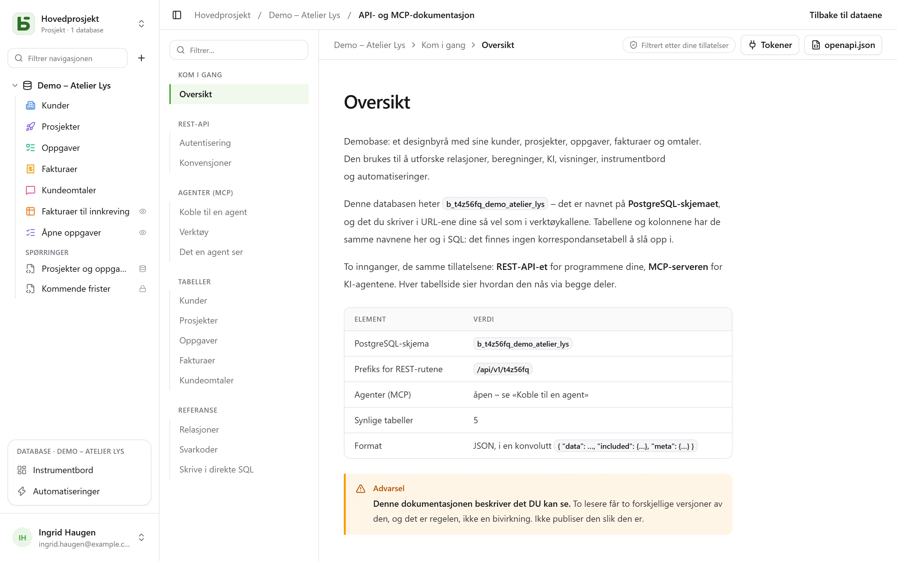

REST-API-et er det samme som grensesnittet bruker: **det finnes ingen private ruter**.
URL-ene bruker de fysiske navnene – de samme som du også leser i SQL.

```text
/api/v1/<tenant>/data/<base>/<table>
/api/v1/t4z56fq/data/b_t4z56fq_ventes/opportunites
```

## Et token

I grensesnittet, databasens **⋯**-meny → **API og agenter** → **API- og MCP-tokener…**: den som har
nivået **Administrere** på databasen, eller på dens prosjekt, oppretter der et
**integrasjonstoken** som er begrenset til denne databasen, skrivebeskyttet som standard, etter
at passordet er bekreftet — en konto uten passord, som logger inn via en identitetsleverandør,
kan ikke gjøre det ennå. Det vises bare én gang; legg det i en miljøvariabel.

Et token leser; det oppretter og endrer hvis det ble opprettet med skrivetilgang, og **sletter
hvis det ble opprettet for det** – rettighetene «Lesing, skriving og sletting» – unntatt en rad
som en kaskaderelasjon ville ta med andre rader. Det har aldri flere tillatelser enn personen
som opprettet det.

```bash
export BASEDB_TOKEN=bdb_…
curl "http://localhost:3000/api/v1/t4z56fq/data/b_t4z56fq_ventes/opportunites?limit=20" \
  -H "Authorization: Bearer $BASEDB_TOKEN"
```

## Lese

| Parameter | Rolle |
|---|---|
| `filter` | et lesbart uttrykk: `statut eq "gagne" and montant gte 10000` |
| `sort` | `-montant,nom` |
| `fields` | kolonnene som skal returneres |
| `limit`, `after` | paginering med kryptert markør: `meta.next_cursor` fra en side, sendt som `after`, gir den neste (`meta.has_next_page`) |
| `links=display` | relasjonene med visningsverdien sin |
| `count=exact` | totalen, begrenset til 100 000 |
| `variables=raw` | lange tekster slik de er skrevet, `{{colonne}}` inkludert, i stedet for med [verdiene fra raden](/basedb/nb/fonctionnalites/tables-et-champs/#formatert-tekst-og-variabler) |

Operatorene: `eq`, `ne`, `eq_ci`, `contains`, `starts_with`, `ends_with`, `in`, `is_null`,
`gt`, `gte`, `lt`, `lte`, `between`, kombinert med `and`, `or`, `not` og parenteser. Et
filter kan gå gjennom en relasjon: `clients_id.ville eq "Lyon"`.

## Skrive

```bash
curl -X POST "http://localhost:3000/api/v1/t4z56fq/data/b_t4z56fq_ventes/opportunites" \
  -H "Authorization: Bearer $BASEDB_TOKEN" -H "content-type: application/json" \
  -d '{"values": {"nom": "Audit RGPD", "statut": "nouveau", "montant": 12000}}'
```

`PATCH …/<table>/<_id>` endrer en rad med den samme kroppen `{"values": {…}}`.
Feilene har én felles form: `{ "code": "…", "details": {…}, "request_id": "…" }`, med en
stabil kode per årsak.

Hver skriving returnerer headeren `x-basedb-transaction`: sendes den til
`POST /api/v1/<tenant>/history/undo` (`{"transaction": "…"}`), angres skrivingen, som med Ctrl+Z i
grensesnittet – avvist hvis raden er endret siden.

## Utover radene

Med det samme tokenet:

| Rute | Rolle |
|---|---|
| `GET …/data/<base>/<table>/aggregate` | sammendrag over alle radene i et filter: `aggregates=montant:sum,nom:filled`, `group=statut` |
| `GET …/data/<base>/<table>/<_id>/comments`, `POST` | les og skriv kommentarene til en rad |
| `POST /api/v1/<tenant>/automations/<id>/run` | start en automatisering som utløses av en knapp, på en rad (`{"record": "…"}`) |
| `GET /api/v1/<tenant>/meta/bases/<base>/dashboards` | instrumentbordene i en database |
| `GET /api/v1/<tenant>/meta/users` | medlemmene av arbeidsområdet, for et Person-felt |
| `GET /api/v1/<tenant>/meta/templates` | databasemalene i galleriet |
| `GET /api/v1/<tenant>/events?base=<base>&table=<table>` | følge en tabell i sanntid: signaler, som deretter leses på nytt av rutene over (se [Webhooks](/basedb/nb/integrations/webhooks/#uten-webhook-følge-en-tabell)) |

[Delte visninger](/basedb/nb/fonctionnalites/vues-partagees/) kan leses uten konto:
`GET /api/v1/views/<jeton>` og `…/rows` i JSON, `…/calendar.ics` i iCalendar.

Å bygge – opprette en automatisering, et instrumentbord, en integrasjon – er fortsatt forbeholdt
en økt i grensesnittet: et token leser og skriver rader, det endrer ikke databasen.

## Opprette en database fra en mal

En applikasjon som installerer seg, oppretter databasen sin med **ett kall**: serveren tar i
bruk malen – tabeller, felt, relasjoner, eksempelrader, visninger, instrumentbord,
automatiseringer – og hvis et trinn mislykkes, lar den ingen database bli værende.

```bash
curl -X POST "http://localhost:3000/api/v1/t4z56fq/admin/bases" \
  -H "Authorization: Bearer $ACCES" -H "content-type: application/json" \
  -d '{"template": "crm", "label": "Ventes", "rows": false}'
```

`template` er nøkkelen til en mal i galleriet, eller en hel mal i
[malformatet](/basedb/nb/fonctionnalites/modeles/). Med headeren
`Accept: application/x-ndjson` kommer svaret linje for linje: én linje `{"step": …}` per trinn,
så den opprettede databasen. Dette kallet krever tilgangstokenet til en person som kan opprette
en database (`POST /auth/session/access`, etter innlogging): et integrasjonstoken åpner bare en
eksisterende database.

## Verifisere et token

Tokenene til basedb kan ikke verifiseres utenfor basedb. En applikasjon som får ett – et
verktøy åpnet fra basedb med tokenet til personen, for eksempel – spør hva det er verdt
(introspeksjon, RFC 7662), med sitt eget integrasjonstoken:

```bash
curl -X POST "http://localhost:3000/auth/introspect" \
  -H "Authorization: Bearer $BASEDB_TOKEN" \
  --data-urlencode "token=$JETON_RECU"
```

```json
{ "active": true, "token_type": "access_token",
  "sub": "0195a…", "email": "claire@example.com", "name": "Claire Martin",
  "tenant": "t4z56fq", "groups": ["Commerciaux"], "exp": 1790000000 }
```

Et token som ikke er gyldig – ukjent, utløpt, tilbakekalt, avsluttet økt, annet arbeidsområde –
svarer `{"active": false}`, uten å si hvorfor. Svaret leses i sanntid: en utlogging vises
umiddelbart. For et integrasjonstoken forteller svaret også hvilken database det åpner (`base`),
tilgangen dets (`read` eller `write`) og flatene dets.

## Den genererte dokumentasjonen

Hver database har sin side **API- og MCP-dokumentasjon**: for hver tabell endepunktene,
kolonnene og eksempler i cURL og JavaScript. Den er **filtrert etter tillatelsene dine** – to
lesere får to ulike versjoner –, skrevet **på skjermens språk**, og finnes også i OpenAPI 3.1
(`/api/v1/<tenant>/meta/bases/<base>/openapi.json`). Navnene, stiene og feilkodene er de samme
på alle språk.


