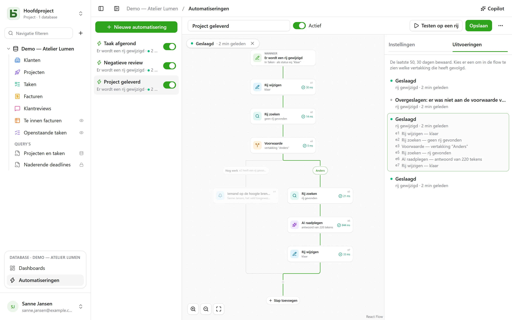

Een automatisering zegt **wanneer**, **als** en **dan**: als een taak op “Fait” komt, het
tijdstip noteren; als er een negatieve review binnenkomt, de verantwoordelijke een melding sturen en naar Slack schrijven; elke
maandag om 9.00 uur de rij voor het teamoverleg aanmaken. En als één actie niet genoeg is, volgt ze een
**flow**: een rij zoeken, de ene of de andere vertakking nemen afhankelijk van wat die rij zegt, stappen
herhalen op elke rij die aan een filter voldoet, in een stap hergebruiken wat een eerdere stap heeft
gevonden of geschreven, drie dagen **wachten** voor een herinnering, een **PDF** als bijlage versturen.

Je opent ze via **Automatiseringen**, in het blok van de geopende database onderaan de
zijbalk, en ze vragen het niveau **Beheren**.



## De flow

De flow wordt van boven naar beneden getekend: de trigger, daarna elke stap. Een **+** op een lijn
opent de lijst met stappen, gerangschikt per categorie — Rijen, Communiceren, Documenten, AI,
Logica — met een zoekveld, en voegt de gekozen stap op die plek toe; een kaart opent haar
instellingen aan de rechterkant. Een eenvoudige automatisering — een trigger en een actie — past
op twee kaarten, en stel je in zoals voorheen.

## Wanneer

| Trigger | Instellingen |
|---|---|
| **Een rij wordt aangemaakt** | de tabel |
| **Een rij wordt gewijzigd** | de tabel, en desgewenst alleen de velden die in de gaten gehouden moeten worden |
| **Op een vast tijdstip** | elk uur, elke dag of elke week, op het gekozen tijdstip en in de gekozen tijdzone |
| **Er wordt op een knop geklikt** | een [veld Knop](/basedb/nl/fonctionnalites/tables-et-champs/#knop) van de tabel |
| **Een rij wordt verwijderd** | de tabel; de stappen citeren de rij zoals ze was |
| **Een rij komt in een filter** | de tabel en het filter: de automatisering start wanneer een rij erin komt, en start pas opnieuw nadat ze eruit is gegaan — “een factuur raakt achterstallig”, niet “een achterstallige factuur wordt gewijzigd” |
| **Een datum breekt aan** | een veld Datum van de tabel, een verschuiving — drie dagen ervoor, op de dag zelf, een week erna — en het tijdstip: herinneringen bij een vervaldatum, contractverjaardagen |
| **Een webhook wordt ontvangen** | niets: de automatisering krijgt haar eigen adres, dat een andere toepassing aanroept ([details](#een-dienst-die-basedb-aanroept)) |

Een trigger op rijen ziet **alle** schrijfacties: de interface, de API, een agent, een
gedeeld formulier, en zelfs directe SQL — automatiseringen vertrekken vanuit de geschiedenis, die ze
allemaal vastlegt.

## Alleen als

Een optionele voorwaarde, in de [filtertaal](/basedb/nl/integrations/api-rest/#lezen) —
`statut eq "fait"`, `montant gte 10000 and payee eq false` — geëvalueerd op de rij **op het moment
van handelen**. Een uitvoering waarvan de voorwaarde niet is vervuld, wordt “overgeslagen”, en meldt dat.

## Dan

Tot veertig stappen, in volgorde; de eerste die mislukt, stopt de volgende — behalve in een
blok **Proberen** ([details](#proberen)).

| Stap | Wat ze doet |
|---|---|
| **Rij bewerken** | schrijft waarden in de rij die de trigger activeerde — of in de rij die een stap heeft gevonden of aangemaakt |
| **Rij aanmaken** | in deze tabel of een andere tabel van de database |
| **Rij zoeken** | de eerste rij van een tabel die aan een filter voldoet, zodat de volgende stappen haar kunnen citeren of wijzigen |
| **Iemand een melding sturen** | een [melding](/basedb/nl/fonctionnalites/collaboration/#meldingen) aan gekozen personen, of aan de persoon in een veld Persoon |
| **Een e-mail versturen** | aan mensen van het team, aan de persoon in een veld Persoon, aan het adres in een veld E-mail — een klant, een leverancier — of aan getypte adressen; het onderwerp en de tekst citeren de rij en de vorige stappen |
| **Webhook aanroepen** | een HTTPS-verzoek naar een dienst — methode, adres, headers en body naar eigen inzicht ([details](#een-dienst-aanroepen)); het antwoord kun je daarna citeren |
| **Naar Slack sturen** | een bericht in een [gekoppeld](/basedb/nl/integrations/synchronisation/#slack) kanaal |
| **AI raadplegen** | een antwoord van de [AI-provider](/basedb/nl/fonctionnalites/ia/) op een instructie die de rij en de vorige stappen citeert — opstellen, samenvatten, indelen —, gelezen als een tekst, een getal, ja of nee, een datum of een keuze uit een lijst |
| **Voorwaarde** | meerdere vertakkingen: de eerste waarvan de voorwaarde is vervuld, wordt genomen, “Anders” als geen enkele dat is; de vertakkingen komen daarna weer samen |
| **Voor elke rij** | de stappen die ze bevat, één keer voor elke rij van een tabel die aan een filter voldoet ([details](#voor-elke-rij)) |
| **Rij verwijderen** | de rij die de trigger activeerde, of de rij die een stap heeft gevonden — ze gaat naar de prullenbak |
| **Tellen en optellen** | het aantal rijen van een filter, hun som, hun gemiddelde, hun minimum of maximum, om daarna te citeren of te testen |
| **Een PDF genereren** | het [document](/basedb/nl/fonctionnalites/documents/) van een rij, opgeslagen in een veld Bestand of bijgevoegd aan een e-mail |
| **Wachten** | een duur, of tot de datum van een veld ([details](#wachten)) |
| **Proberen** | stappen, en andere stappen als een ervan mislukt ([details](#proberen)) |
| **Een automatisering starten** | een andere automatisering van de database, op een rij van haar tabel |

Een zoekactie die niets vindt, stopt de flow niet: de stappen die haar rij moesten wijzigen,
worden overgeslagen. Om in dat geval iets anders te doen, voegt **Als er geen rij wordt
gevonden…**, onder de zoekactie, een voorwaarde toe die dat test.

Een **voorwaarde** test een rij met een filter, of een **waarde**: het antwoord van de AI, de
code van een webhook, een totaal — “`{{e2.reponse}}` is gelijk aan Urgent”, “`{{e3.somme.montant}}`
is groter dan of gelijk aan 1000”. Getallen worden als getal vergeleken, teksten zonder accenten of
hoofdletters.

## Voor elke rij

De stap **Voor elke rij** leest de rijen van een tabel die aan haar filter voldoen — leeg: alle
—, in de gekozen volgorde, tot haar limiet (standaard 50, hooguit 200), en voert daarna één keer
voor elke rij de stappen uit die in haar kader staan. “Elke maandag de onbetaalde facturen
aanmanen” schrijf je als: **Op een vast tijdstip**, daarna **Voor elke rij** van de facturen
`payee eq false and relancee eq false`, en in de lus een e-mail aan de contactpersoon van de
factuur en **Rij wijzigen** die “Relancée” aanvinkt.

In de lus noemt het id van de stap de **rij van de ronde**: `{{e1.client}}` citeert haar, en
**Rij wijzigen** stelt haar voor tussen de te wijzigen rijen. Na de lus geeft `{{e1.nombre}}` aan
hoeveel rijen ze heeft doorlopen — voor een samenvatting op Slack, bijvoorbeeld. Het filter kan
citeren wat eraan voorafgaat: geactiveerd door een betaalde factuur, doorloopt
`facture eq {{_id}}` haar detailregels.

Boven de limiet wachten de resterende rijen op de volgende uitvoering, die dat meldt: laat de
rijen die al verwerkt zijn uit het filter vallen — een vakje “relancée”, een datum — om ze
allemaal te verwerken in de loop van de uitvoeringen. Een lus kan geen andere lus bevatten, en
een uitvoering stopt na twee minuten.

## Wachten

De stap **Wachten** zet de uitvoering op pauze — drie uur, twee dagen — of tot de datum van een
veld van een rij, met een verschuiving en een tijdstip: “de dag voor de vervaldatum, om 9.00
uur”. De uitvoering verschijnt als **Gepauzeerd** op het tabblad **Uitvoeringen**, met de datum
waarop ze verdergaat.

Ze gaat verder bij de volgende stap door haar rijen **opnieuw te lezen**: “drie dagen na het
versturen van de offerte, als die nog niet is geaccepteerd, aanmanen” schrijf je als **Wachten**
3 dagen, daarna een voorwaarde op de status van de offerte, zoals die op dat moment is. De
automatisering uitschakelen stopt gepauzeerde uitvoeringen; een wachtstap plaats je niet in een
lus en niet in een blok **Proberen**, en ze duurt hoogstens een jaar.

## Proberen

Het blok **Proberen** heeft twee vertakkingen. De eerste wordt uitgevoerd; als een van haar
stappen mislukt, gaat de flow verder met de tweede, **Bij mislukking**, die de mislukking citeert
— `{{e4.erreur}}`, de code, en `{{e4.etape}}`, de stap —, en gaat daarna verder na het blok. Zo
kun je iemand een melding sturen wanneer een dienst niet antwoordt, zonder alles te stoppen.

Eenvoudiger: een webhook kan zichzelf tot drie keer **opnieuw proberen** na een storing van de
dienst, en een lus kan **doorgaan** ondanks een mislukte rij.

## Een PDF en een e-mail

**Een PDF genereren** maakt het document van een rij — met een
[documentsjabloon](/basedb/nl/fonctionnalites/documents/) van haar tabel, of de fiche van al
haar velden — en kan het opslaan in een veld Bestand. **Een e-mail versturen** kan het daarna
bijvoegen, met de bestanden van een veld Bestand of Afbeelding:

- een e-mail **aan elk apart**, of **één voor iedereen**, met ontvangers **in cc**;
- een bericht in **opgemaakte tekst** — vet, lijsten, links — dat de rij citeert;
- een **antwoordadres**: het jouwe standaard, of dat van een veld E-mail;
- tot 50 ontvangers, 10 bijlagen en 15 MB.

“Als een offerte op Geaccepteerd komt, de factuur naar de klant versturen, de boekhouding in
cc”: **Een rij komt in een filter** `statut eq "accepte"`, **Een PDF genereren** met het
sjabloon Factuur, **Een e-mail versturen** naar het veld E-mail van de klant, de factuur
bijgevoegd.

## Een dienst die basedb aanroept

Met de trigger **Een webhook wordt ontvangen** krijgt de automatisering haar eigen geheime
adres, te geven aan de toepassing die haar moet starten — een webshop, een extern formulier, een
automatiseringstool:

```bash
curl -X POST "https://basedb.example.com/api/v1/hooks/<secret>" \
  -H "content-type: application/json" \
  -d '{"client": {"nom": "Dupont"}, "total": 120}'
```

De stappen citeren wat er is verstuurd: `{{trigger.client.nom}}`, `{{trigger.total}}`; een
formulier lees je op dezelfde manier, een tekst via `{{trigger.texte}}`. Het adres kopieer je
vanuit de instellingen van de trigger; **Adres veranderen** vervangt het, en het oude adres
stopt onmiddellijk. Een aanroep krijgt `202`, de automatisering draait binnen de seconde.

## Een dienst aanroepen

De stap **Webhook aanroepen** stuurt standaard, in `POST`, de gegevens van de automatisering: de
gekozen rij en wat de vorige stappen hebben gevonden of geschreven. Om met een dienst te praten
zoals die het verwacht, stel je in:

- de **methode**: `POST`, `PUT`, `PATCH`, `GET` of `DELETE` — de laatste twee zonder body;
- het **adres**, dat na de host kan citeren — `https://api.exemple.fr/clients/{{e2.numero}}`;
  elke waarde wordt daarin gecodeerd;
- **headers**, waarvan de waarde kan citeren: `Idempotency-Key: {{_id}}`;
- de **body**: de gegevens van de automatisering, een **JSON om te schrijven**, een
  **formulier** (een paar `sleutel=waarde` per regel) of een **tekst**. In een JSON is een citaat
  tussen aanhalingstekens tekst, en buiten aanhalingstekens een waarde — een getal, ja of nee,
  een lijst:

```json
{ "facture": "{{e1.numero}}", "montant": {{e1.montant}}, "payee": {{e1.payee}} }
```

Een API-sleutel of een token zet je in een **geheime** header (het slotje): versleuteld met de
sleutel van de instantie, wordt hij nooit meer getoond — niet op het scherm, niet door de API,
niet aan Copilot — en gaat alleen naar de host waarvoor je hem hebt opgegeven. Verandert de host
van het adres, dan geef je hem opnieuw op; **Vervangen** voert een nieuwe in.

## AI raadplegen

Net als een [AI-veld](/basedb/nl/fonctionnalites/ia/#de-ai-optie-van-een-veld) stuurt de stap zijn
instructie naar de provider, waarin elke verwijzing door haar waarde is vervangen:

```text
Cet avis de {{auteur}} demande-t-il une action de notre part ? {{avis}}
```

Je kiest het **verwachte antwoord** — een vrije of korte tekst, een getal, ja of nee, een datum,
een webadres, of een keuze uit een lijst, die je uit een keuzeveld kunt overnemen. Het model
wordt daarvan op de hoogte gesteld, en een antwoord dat er geen bevat, laat de stap mislukken. De volgende stappen
citeren het met `{{e1.reponse}}`: in de titel van een aangemaakte taak, een bericht, of een keuzeveld,
waar het bij de keuze met hetzelfde label wordt ingedeeld.

Wat de instructie citeert, gaat naar de provider: de stap vraagt je **toestemming**, die je opnieuw geeft
wanneer de instructie verandert. Elke aanroep wordt gelogd en telt, samen met de AI-velden, mee in
`BASEDB_AI_FIELD_QUOTA` (standaard 300 per uur). De AI doet niets uit zichzelf: het zijn de
stappen erna die schrijven of meldingen sturen.

## Citeren

Waarden, berichten en filters citeren wat eraan voorafgaat, via de knop **{ }** naast
elke tekst:

- `{{Titre}}`, `{{_id}}`: de rij die de trigger activeerde;
- `{{e2.titre}}`, `{{e2._id}}`: de rij die door stap `e2` is gevonden, aangemaakt of gewijzigd — elke
  stap toont zijn id op zijn kaart;
- `{{e3.statut}}`, `{{e3.reponse.numero}}`: wat webhook `e3` heeft geantwoord;
- `{{e4.reponse}}`: het antwoord van AI-stap `e4`;
- `{{e5.client}}` in de lus `e5`, de rij van de ronde; `{{e5.nombre}}` erna, het aantal doorlopen
  rijen;
- `{{e6.nombre}}`, `{{e6.somme.montant}}`, `{{e6.moyenne.montant}}`, `{{e6.max.echeance}}`: wat
  stap `e6` heeft geteld;
- `{{e7.erreur}}`, `{{e7.etape}}`: de mislukking die blok **Proberen** `e7` heeft opgevangen;
- `{{e8.nom}}`: de naam van de PDF van stap `e8`;
- `{{trigger.client.nom}}`: wat een binnenkomende webhook heeft verstuurd;
- `{{_maintenant}}`: het tijdstip van de uitvoering.

Een waarde die uit één enkele verwijzing bestaat, geeft de waarde zelf door: een relatie, een persoon, een
keuze — zo wordt een aangemaakte rij gekoppeld aan de rij die een zoekactie heeft gevonden. In een
filter is een verwijzing altijd een vergeleken waarde, nooit filtertaal.

Een stap kan alleen citeren wat met zekerheid vóór hem is gebeurd: wat een vertakking heeft gevonden,
kun je na de voorwaarde niet meer citeren. De editor meldt dat op de kaart vóór het opslaan.

## De Copilot

**Copilot**, in de kop, opent rechts een gesprek in natuurlijke taal over de
automatiseringen van de database: “als een taak naar review gaat, stuur de toegewezen persoon
een melding”, “voeg een AI-samenvatting toe aan de notities”, “waarom is de laatste uitvoering
mislukt?”. Hij antwoordt en **stelt** een complete automatisering **voor** — de automatisering die je op het scherm hebt,
aangepast, of een nieuwe —, met de lijst van wat er verandert.

De Copilot slaat niets op: **Op de flow plaatsen** toont het voorstel in de editor,
waar je het naleest voordat je opslaat — en **Annuleren**, op de kaart, zet de flow terug zoals hij
was. Een nieuwe automatisering opent in de editor, om aan te maken. Elk voorstel wordt
gecontroleerd zoals een opslagactie dat zou worden; wat niet klopt, wordt verworpen en gemeld.

Standaard gaat **alleen de structuur** naar de AI-provider, samen met het gesprek: de tabellen
en hun velden, de automatiseringen van de database, die op het scherm zoals de editor haar toont, en
haar laatste uitvoeringen — hun statussen en foutcodes, nooit een waarde. Personen
en Slack-kanalen gaan mee onder markeringen (`p1`, `s1`), nooit met hun id. Het vakje
**Lezen van gegevens toestaan** laat de Copilot, voor dit gesprek, rijen lezen
(hooguit 50 per leesactie), waarbij elke leesactie onder zijn antwoord wordt vermeld.

## Testen, volgen

**Testen op een rij** voert de opgeslagen automatisering uit op een gekozen rij, echt en
wel. Het tabblad **Uitvoeringen** bewaart de laatste 50, gedurende 30 dagen: in afwachting, bezig, geslaagd,
overgeslagen met de reden, mislukt met de code. Kies er een en die wordt op de flow geplaatst — de genomen
vertakking wordt getekend, elke doorlopen stap zegt wat ze heeft gedaan en hoe lang dat duurde, de rest is
vervaagd. In een lus geeft elke stap ook aan hoeveel keer ze heeft gedraaid.

## Namens wie ze handelt

Een automatisering handelt met de **rechten van de persoon die haar het laatst heeft opgeslagen**,
bij elke uitvoering opnieuw bepaald: verliest die persoon een recht, dan mislukt de stap die dat recht nodig had
in plaats van eroverheen te stappen, en vindt een zoekactie alleen wat die persoon mag lezen.
De geschiedenis toont dat als “Automatisering ‘Tâche terminée’ · namens …”, en haar schrijfacties
maak je ongedaan zoals alle andere.

## Beperkingen

- Wat een automatisering schrijft, triggert geen andere automatisering: wat op elkaar moet volgen, schrijf je
  in één flow, of via **Een automatisering starten**, hooguit drie niveaus diep.
- Een zoekactie levert één rij op, de eerste; een lus doorloopt er hooguit 200 per uitvoering.
  Een uitvoering duurt hoogstens twee minuten, wachttijden niet meegerekend.
- Geen scripts. Een e-mail wordt verstuurd via de
  [verzendserver](/basedb/nl/hebergement/variables/#e-mails) van de instantie.
- Een [databasesjabloon](/basedb/nl/fonctionnalites/modeles/) neemt alleen automatiseringen mee zonder
  zoekactie, lus, voorwaarde of AI-stap, en nooit een webhook.
- Een webhook volgt geen omleiding en wacht maximaal 10 seconden; een andere reactie dan 2xx laat
  de stap mislukken, na haar nieuwe pogingen.
- Een datum die aanbreekt wordt elke minuut gezocht; alleen datums die zijn aangebroken na het
  opslaan van de automatisering, tellen mee.
- 100 uitvoeringen per uur per automatisering; een gemist uurlijks tijdstip wordt maar
  één keer ingehaald.
- De vertraging tussen de schrijfactie en de actie is in de orde van een seconde.
