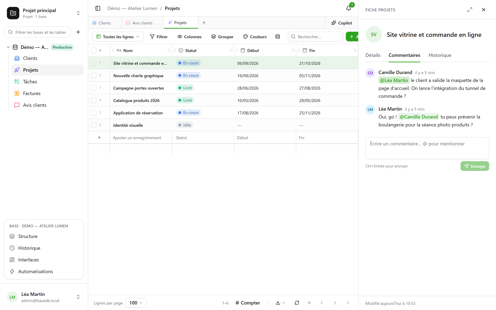
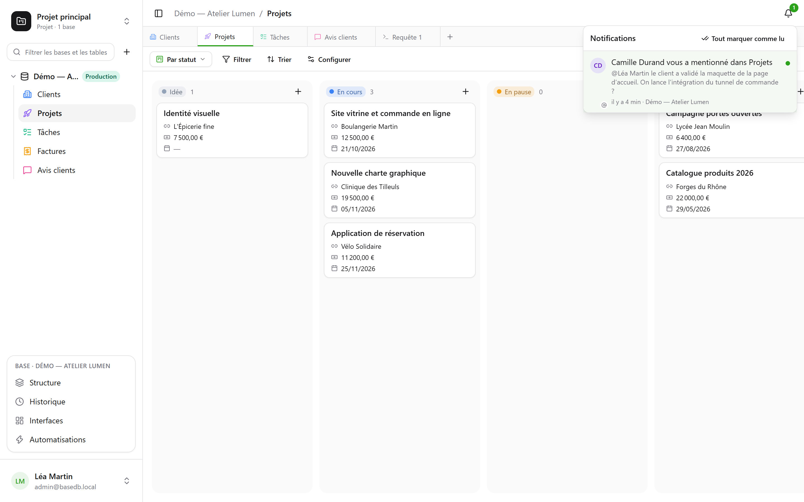

Meerdere mensen werken tegelijk aan dezelfde database: ieder ziet de schrijfacties van de
anderen binnenkomen, weet wie waarnaar kijkt, en bespreekt een rij op de plek waar ze staat.

## Opmerkingen

De rijdetails van een rij hebben een tabblad **Opmerkingen**, tussen “Details” en “Geschiedenis”. Typ
`@` om een lid te **vermelden**, Ctrl+Enter om te verzenden. Iedereen kan zijn eigen
opmerkingen bewerken of verwijderen.

Wie de rij mag lezen, mag er ook een opmerking bij plaatsen. Een vermelde persoon die haar niet mag lezen,
krijgt geen melding — en de auteur wordt daarvan op de hoogte gebracht in plaats van te denken dat het bericht is verstuurd.

## Meldingen

De bel, rechtsboven, telt wat nog niet gelezen is. Er komen vier soorten dingen binnen:

- iemand **vermeldt** je in een opmerking;
- iemand **antwoordt** in een gesprek waarin jij hebt geschreven;
- iemand **wijst je aan** in een veld Persoon — vanuit de interface, de API, een formulier
  of een automatisering;
- een [automatisering](/basedb/nl/fonctionnalites/automatisations/) **stuurt je een melding**.

Een melding openen opent de rij. **Alles als gelezen markeren** zet de teller op nul; de
meldingen worden 90 dagen bewaard.

## Realtime

De schrijfacties van anderen verschijnen **zonder herladen**: een gewijzigde cel, een verplaatste
kaart, een toegevoegde rij — of ze nu uit de interface, de API, een agent of directe SQL
komen. De server stuurt alleen een **signaal**, nooit gegevens: het scherm leest opnieuw, met
jouw rechten. Een cel die je aan het bewerken bent, wordt nooit onder je
vingers vervangen.

## Aanwezigheid

De gezichten van de mensen die naar **dezelfde tabel** kijken, verschijnen bovenaan het scherm; die van
wie **dezelfde rij** heeft geopend, in de kop van de rijdetails. In het raster verschijnt de aanwijzer van
de anderen op de cel waar ze overheen bewegen.

## Een link naar elk scherm

Het adres van de browser volgt wat je bekijkt: een tabel, een van haar weergaven, de rijdetails van
een rij, een dashboard, een automatisering, een vraag, jouw instellingen. Plak het in een
bericht: je collega komt op dezelfde plek terecht, met zijn eigen rechten. Sla het op als favoriet;
de knoppen vorige en volgende van de browser brengen je terug naar waar je was.

| Adres | Wat het opent |
|---|---|
| `/bases/ventes/tables/opportunites` | de tabel “Opportunités” van de database “Ventes” |
| `/bases/ventes/tables/opportunites?vue=…` | een van haar weergaven |
| `/bases/ventes/tables/opportunites?ligne=…` | de rijdetails van een van haar rijen |
| `/bases/ventes/tableaux-de-bord/…` | een dashboard |
| `/bases/ventes/automatisations/…` | een automatisering |
| `/parametres/apparence` | jouw instellingen |

Een adres noemt een **plek**, niet de status waarin je het hebt achtergelaten: filters, sortering en
kolombreedtes blijven die van elke browser. Een database en een tabel worden erin geschreven met hun
PostgreSQL-naam: hernoemd, leidt het oude adres nergens meer naartoe. Een adres dat nergens naartoe
leidt — een typefout, een verwijderd object, of iets wat je niet mag zien — toont “Deze pagina
bestaat niet”.

## Ongedaan maken

Ctrl+Z maakt je laatste schrijfactie ongedaan — zie [de geschiedenis](/basedb/nl/fonctionnalites/historique/#ongedaan-maken-ctrlz).

## Beperkingen

- Meldingen blijven in basedb: er wordt voorlopig geen enkele per e-mail verstuurd.
- Bij meer dan honderd rijen die in één keer wijzigen, herlaadt het scherm de hele pagina in plaats van
  rij voor rij.
