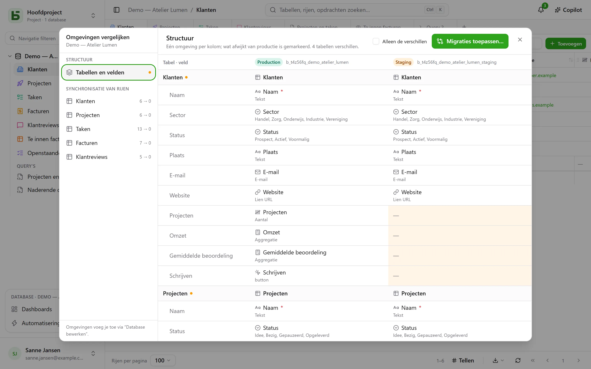

Een database kan **omgevingen** hebben: productie, acceptatie, ontwikkeling… Elke omgeving is een
volwaardige database — met een eigen schema, eigen tabellen, rijen en rechten — en ze delen allemaal de
**afstamming** van de database, van haar tabellen en van haar velden.

## In de interface

De zijbalk toont **één regel per database**, met een badge die de geopende omgeving aangeeft en
waarmee je van omgeving wisselt. De badge verschijnt pas als er meer is dan alleen productie.

Omgevingen voeg je toe, hernoem je en verwijder je in **Database bewerken…**: een
nieuwe omgeving ontstaat uit een **kopie van de structuur** van een andere, zonder de rijen.

## Omgevingen vergelijken

Vanuit het menu van de database, onder **Meer acties**, opent **Omgevingen vergelijken…** een dialoogvenster:

- **Structuur**: de omgevingen in kolommen, tabellen en velden in rijen; wat afwijkt van
  productie is gemarkeerd.
- **Migraties toepassen…** bereidt het plan voor om van de ene omgeving naar de andere te gaan, stap
  voor stap. Het vinkt nooit automatisch aan wat een recentere wijziging in het
  doel ongedaan zou maken.
- **Rijen synchroniseren**: tabel voor tabel rijen van de ene omgeving naar
  de andere overzetten, op id.

## Hoe basedb weet wie wat heeft gewijzigd

De vergelijking steunt op de **structuurgeschiedenis**: elke aanmaak, wijziging of
verwijdering van een tabel of veld wordt door een trigger op de catalogus vastgelegd, en is te lezen in
het tabblad “Structuur” van de geschiedenis. De afstammings-id’s verbinden een veld in acceptatie
met zijn tegenhanger in productie, ook als het is hernoemd.

## In SQL

Elke omgeving is een schema: `b_t4z56fq_ventes` voor productie,
`b_t4z56fq_ventes_recette` voor acceptatie. Je query’s wisselen van omgeving door van
schema te wisselen — of van `search_path`.
