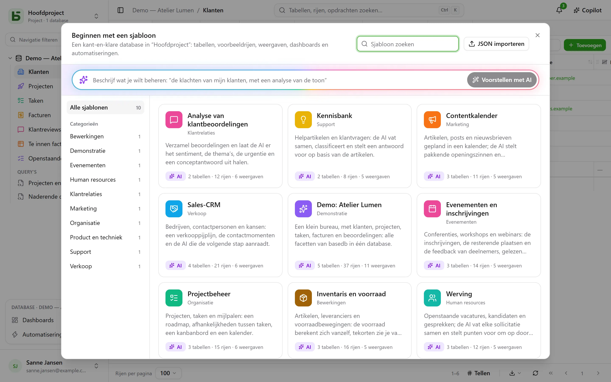

Een **sjabloon** maakt met één klik een hele database aan: de tabellen en hun relaties, voorbeeldrijen,
weergaven, een dashboard, automatiseringen, en velden die de AI
zelf invult. De [sjablonengalerie](/basedb/nl/modeles/) toont de sjablonen die basedb aanbiedt.

## Starten vanuit een sjabloon

**Nieuwe database**, daarna **Starten vanuit een sjabloon, of aan de AI vragen**: de galerie opent.



Elk sjabloon kun je volledig lezen voordat je het gebruikt — de tabellen en hun velden, de weergaven,
de automatiseringen, en de instructie van elk AI-veld. **Database aanmaken** vraagt
om een label en, als er AI-velden zijn, om je toestemming om de waarden die ze citeren
naar de AI-provider van de instantie te sturen. Zonder die toestemming zijn het gewone
velden, gevuld met hun voorbeeldwaarden.

**Voorbeeldgegevens laden**, standaard aangevinkt, vult de tabellen met voorbeeldrijen om de
database in actie te zien. Uitgevinkt blijven de tabellen leeg, klaar voor je eigen gegevens —
weergaven, dashboards en automatiseringen worden toch aangemaakt.

Een leeg project biedt ook de **demodatabase** aan: een klein bureau met zijn klanten,
projecten, taken, facturen en reviews, dat alle facetten van basedb laat zien.

## In je taal

De officiële sjablonen worden **in de taal van het scherm** gelezen en aangemaakt: tabellen,
velden, keuzes, voorbeeldrijen, weergaven, dashboards, automatiseringen en AI-instructies. De
voorbeeldrijen veranderen van wereld met de taal: de “Boulangerie Martin” van Lyon wordt “Bakkerij
De Boer” in Utrecht in het Nederlands.

Een sjabloon dat in je instantie is geïmporteerd, of vanuit een database opgeslagen, is door
iemand geschreven: het wordt gelezen zoals het is geschreven.

## Aan de AI vragen

Beschrijf bovenaan de galerie je behoefte in één zin — “het opvolgen van klachten van
mijn klanten, met een analyse van de toon”. De AI stelt een complete database voor: tabellen, geloofwaardige
voorbeeldrijen, weergaven, een dashboard, en AI-velden waar het gebruik zich ervoor leent. Je
leest haar als een sjabloon, je kunt haar **verfijnen** (“voeg een tabel met leveranciers toe”),
en haar daarna aanmaken. De AI krijgt alleen je zin — geen enkel gegeven uit welke database dan ook — en er wordt
niets aangemaakt vóór je klik.

## Een sjabloon in JSON schrijven

Een sjabloon is een JSON-document. Dit is het skelet:

```json
{
  "format": 1,
  "key": "suivi-tickets",
  "label": "Suivi de tickets",
  "summary": "Une phrase pour la galerie.",
  "category": "Produit et technique",
  "icon": "bug",
  "color": "#ef4444",
  "tables": [
    {
      "key": "tickets",
      "label": "Tickets",
      "fields": [
        { "label": "Titre", "kind": "short_text" },
        { "label": "Statut", "kind": "select", "options": ["Nouveau", "En cours", "Résolu"] },
        { "label": "Ouvert le", "kind": "date" },
        { "label": "Description", "kind": "long_text" },
        { "label": "Catégorie", "kind": "select", "options": ["Bug", "Demande"],
          "ai": { "prompt": "Classe ce ticket : {{Titre}} — {{Description}}" } },
        { "label": "Âge (jours)", "kind": "formula", "formula": "JOURS(AUJOURDHUI(); [Ouvert le])" }
      ]
    },
    { "key": "produits", "label": "Produits", "fields": [{ "label": "Nom", "kind": "short_text" }] }
  ],
  "links": [{ "from": "tickets", "label": "Produit", "to": "produits" }],
  "rows": {
    "produits": [{ "$key": "app", "Nom": "Application mobile" }],
    "tickets": [{ "Titre": "Crash au démarrage", "Statut": "En cours", "Ouvert le": "-3d", "Produit": "@app" }]
  },
  "views": [
    { "table": "tickets", "label": "Tableau", "kind": "kanban", "spec": { "group_by": "Statut" } }
  ],
  "dashboards": [
    { "label": "Vue d’ensemble", "blocks": [
      { "kind": "number", "title": "Ouverts", "table": "tickets", "filter": "[Statut] ne \"Résolu\"" },
      { "kind": "chart", "title": "Par catégorie", "table": "tickets", "group_by": "Catégorie", "style": "pie" }
    ] }
  ],
  "automations": []
}
```

De belangrijkste regels:

- **Alles wordt geciteerd via het label**: een veld in een weergave, een filter (`[Statut] ne "Résolu"`), een
  formule (`[Prix] * [Quantité]`), een AI-instructie of een bericht (`{{Titre}}`). Een keuze
  geef je op via haar label.
- Het **eerste veld** van een tabel is het weergaveveld: een tekst, een getal, een datum,
  een e-mail of een adres.
- Een **relatie** wordt gedeclareerd in `links`, nooit als een veld; een rij verwijst ernaar met
  `"@clé"`, de `$key` van een rij in de doeltabel.
- Een **datum** kan relatief zijn ten opzichte van de dag waarop het sjabloon wordt toegepast: `"today"`, `"+3d"`,
  `"-2w"`, `"+1m"`; een datum-tijd voegt het tijdstip toe, `"+1d 14:30"`. Een persoon schrijf je als `"$moi"`.
- Een **AI-veld** heeft `"ai": { "prompt": "…" }` en kan een voorbeeldwaarde krijgen, die alleen
  wordt geschreven als de AI niet wordt gebruikt.
- Een sjabloon bevat **nooit** een deelinstelling, een recht, een webhook, een bestand of een andere persoon
  dan `"$moi"`: het komt soms van elders, en mag niets openzetten.

De volledige referentie — alle veldtypes, alle sleutels van weergaven, de limieten — staat in
hoofdstuk 20 van de architectuurdocumentatie, in de repository.

## Een sjabloon publiceren voor alle instanties

De sjablonen van de officiële galerie zijn de bestanden in de map
[`packages/templates/catalog`](https://github.com/eodia/basedb/tree/main/packages/templates/catalog)
van de repository, één bestand per sjabloon, genoemd naar zijn `key`. De openbare site maakt er de
[galerie](/basedb/nl/modeles/) van en publiceert de volledige catalogus op het adres
[`/basedb/modeles/catalogue.json`](/basedb/modeles/catalogue.json). Elke instantie leest hem
wanneer iemand de galerie opent, en bewaart hem een uur: een bestand wijzigen en de site opnieuw
publiceren volstaat om de galerie van alle instanties te veranderen.

Elk sjabloon wordt bij het bouwen van de site gecontroleerd, door dezelfde validator als de server:
een ongeldig sjabloon laat de build mislukken in plaats van bij de gebruikers terecht te komen.

Een officieel sjabloon wordt één keer geschreven, in het Frans. De teksten ervan in een andere
taal zijn een woordenboek,
[`packages/templates/i18n/<langue>/<clé>.json`](https://github.com/eodia/basedb/tree/main/packages/templates/i18n)
— de Franse tekst, gevolgd door de vertaling ervan —, dat de site naast de catalogus publiceert
(`/basedb/modeles/i18n/<langue>.json`). De instantie vult er elke tekst mee in en volgt elk label
overal waar het wordt aangehaald — formules, filters, weergaven, instructies —, en leest het
resultaat daarna na: een woordenboek dat het sjabloon zou breken, wordt niet gebruikt, het Franse
sjabloon wel. Een tekst die in het woordenboek ontbreekt, blijft Frans.

De instantie leest het adres `BASEDB_TEMPLATES_URL` — standaard dat van de openbare site. Laat het
verwijzen naar een eigen catalogus, of zet het op `off` om er geen enkele te lezen: de instantie serveert dan de
sjablonen die in haar versie zijn ingebouwd.

## De sjablonen van je instantie

Een beheerder kan **een JSON-sjabloon importeren** in zijn instantie, vanuit de galerie
(“JSON importeren”): het komt in de galerie van al zijn gebruikers, en vervangt een sjabloon
met dezelfde sleutel. Een voorstel van de AI kun je er met één klik aan toevoegen.

Elke database kan ook een sjabloon worden: **Opslaan als sjabloon** in het menu van de
database, onder **Meer acties**. De tabellen, velden, AI-instructies, relaties, gedeelde weergaven, dashboards en
automatiseringen — en, als je dat wilt, tot 50 rijen per tabel — worden gedownload als
JSON, klaar om in de officiële catalogus of in die van de instantie te worden opgenomen. Een automatisering die
een rij zoekt, vertakkingen neemt of een eerdere stap citeert, blijft voorlopig buiten
beschouwing, en het scherm meldt dat.
