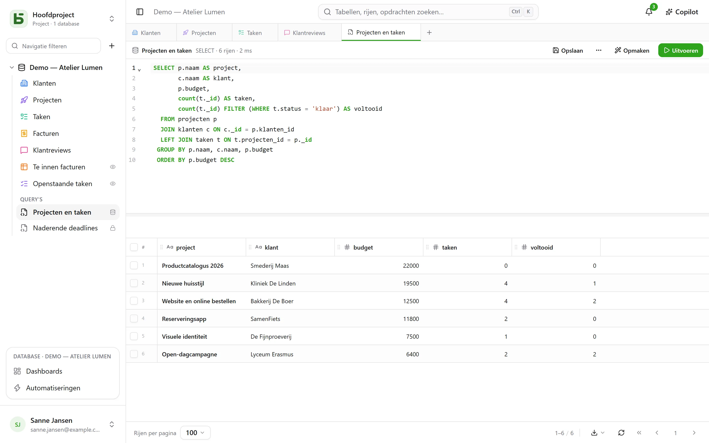
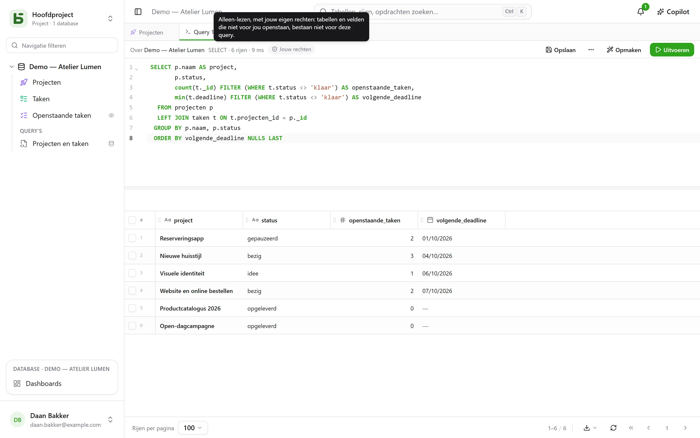
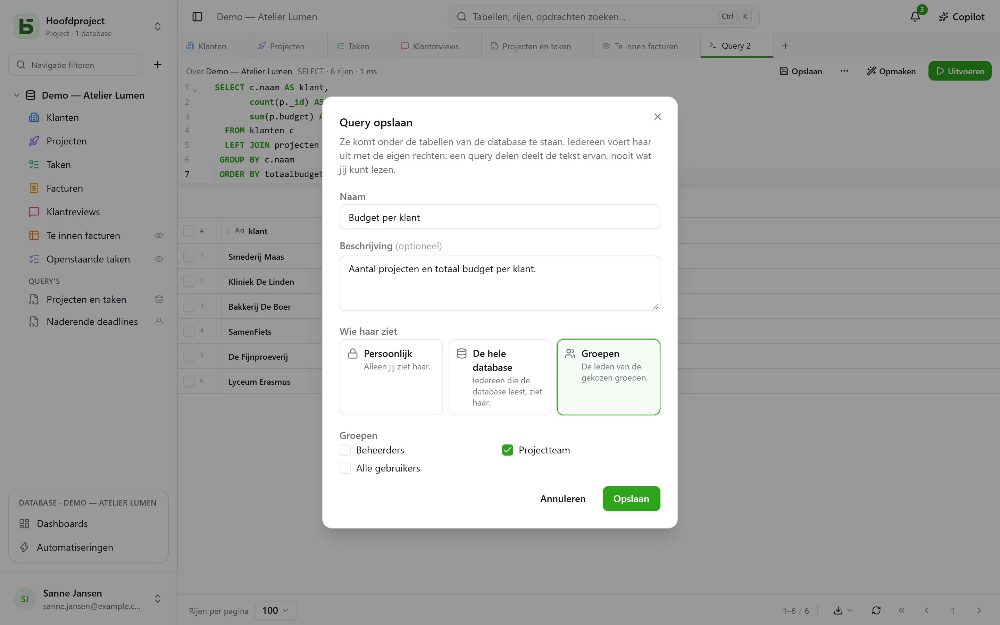
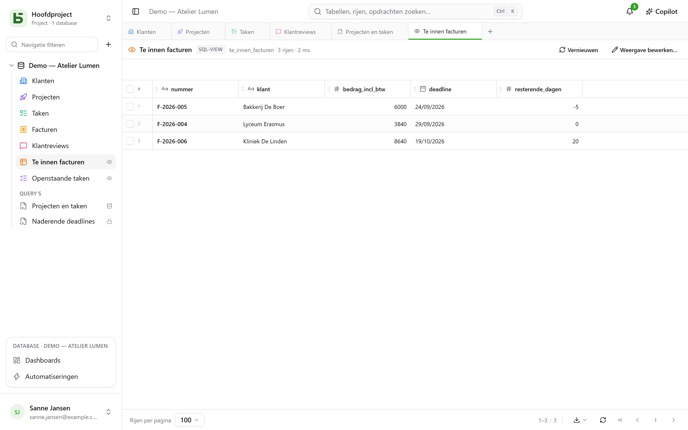
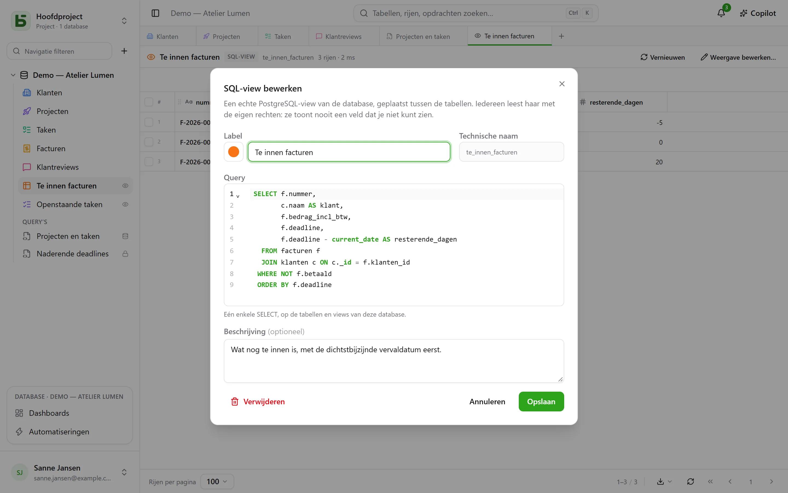

Je tabellen zijn echte PostgreSQL-tabellen, en de interface bevraagt ze in SQL, onder hun echte
naam. Elk lid van de database kan een query schrijven en die **opslaan** onder de tabellen — voor
zichzelf, voor de hele database of voor een paar groepen —, en wie de database beheert, kan er een
**SQL-view** van maken: een echte PostgreSQL-view, tussen de tabellen geplaatst, die `psql` en je tools
ook lezen.



## Ieder met zijn eigen rechten

De **+** in de tabbladbalk, of het menu **⋯** van de database → **SQL-query**, opent een
SQL-tabblad: een editor met syntaxiskleuring en aanvulling, **Ctrl+Enter** om uit te voeren, en het
resultaat in hetzelfde raster als je tabellen. Wat de query mag lezen, hangt af van wie hem uitvoert:

- met het niveau **Beheren** op de database: de hele database, schrijfacties inbegrepen;
- met de niveaus **Lezen** of **Bewerken** wordt de query **alleen-lezen uitgevoerd, met je
  eigen rechten**. Een tabel die voor jou gesloten is, bestaat voor de query niet; een veld dat voor jou
  verborgen is, verdwijnt uit `SELECT *` en wordt geweigerd als je het noemt, ook als je de tabel erbij vermeldt;
  een schrijfactie wordt geweigerd. Het resultaat draagt het label **Jouw rechten**.



Het is niet het scherm dat filtert: PostgreSQL past zelf je rechten toe, kolom voor kolom, op
een rol die alleen van jou is. Een query kan je dus niets laten zien wat het raster, de API of de
MCP-server je niet zouden laten zien.

## Een query opslaan

**Opslaan**, in de balk van het tabblad, zet de query onder de tabellen van de database, in de
rubriek **Query’s**. Je opent hem opnieuw met één klik; **⋯** → **Opslaan als…** maakt er een
kopie van, **Naam en delen…** (in het tabblad of in zijn menu in de zijbalk) hernoemt hem, wijzigt
wie hem ziet, of verwijdert hem — **Verwijderen** staat ook in zijn menu, via een rechtsklik. Een
tabblad dat hem toonde, behoudt zijn tekst.



| Bereik | Wie hem ziet | Wie hem mag aanmaken en wijzigen |
|---|---|---|
| **Persoonlijk** — een hangslot | alleen jij | iedereen die de database ziet, voor zichzelf |
| **Hele database** | iedereen die de database ziet | het niveau **Beheren** op de database |
| **Groepen** | de leden van de gekozen groepen | het niveau **Beheren** op de database |

**Een query delen deelt de tekst ervan, nooit wat de auteur mag lezen.** Iedereen voert hem uit
met zijn eigen rechten: dezelfde query, geopend door twee personen, toont aan elk van hen wat die
mag zien — of zegt dat een kolom voor die persoon niet bestaat.

Een query die je vanuit de zijbalk opent, **wordt meteen uitgevoerd, alleen-lezen**: je ziet
het resultaat zonder iets te hebben besloten. **Uitvoeren** voert hem daarna opnieuw uit zoals hij is. Een punt
naast de naam geeft aan dat je de tekst hebt gewijzigd sinds het opslaan; **Opslaan**
bewaart hem daar als je hem mag wijzigen, en stelt anders voor om er een nieuwe van te maken.

## SQL-views

Een **SQL-view** is een echte PostgreSQL-view in het schema van de database. Hij staat **tussen de
tabellen**, met zijn kleur en pictogram zoals een tabel, en een klein **oog** rechts dat aangeeft
dat het een view is. Een klik opent hem in een tabblad: zijn rijen in het raster, **Vernieuwen** om
ze opnieuw te lezen.



Je maakt hem via het menu **⋯** van de database → **Nieuwe SQL-view…**, of vanuit een SQL-tabblad:
**⋯** → **SQL-view maken…**, en de query van het tabblad wordt zijn definitie. Het dialoogvenster
vraagt om:

- zijn **label** en zijn **uiterlijk** — kleur, pictogram of afbeelding, gekozen zoals voor een
  tabel;
- zijn **technische naam**, afgeleid van het label als je er geen opgeeft — de naam die je na
  `FROM` schrijft;
- zijn **query**: één enkele `SELECT`, op de tabellen en de andere views van de database. PostgreSQL
  weigert wat het weigert, en de editor wijst de plek aan.



De view lees je daarna onder zijn naam, vanuit de interface net zo goed als vanuit `psql` of je BI-tool:

```sql
SELECT * FROM b_t4z56fq_demo_atelier_lumen.factures_a_encaisser;
```

**Een view toont nooit een veld dat je niet mag zien.** Iedereen leest hem met zijn eigen rechten,
op elke tabel en elke kolom die hij leest; de zijbalk toont hem alleen aan wie alles mag
lezen wat hij leest. Hij leest alleen **zijn eigen** database: een andere database, of de catalogus van basedb,
worden al bij het aanmaken geweigerd. Hem aanmaken, wijzigen of verwijderen vraagt het niveau **Beheren**
op de database. **Verwijderen**, in zijn menu in de zijbalk, haalt hem weg voor iedereen, scripts
en tools inbegrepen; de tabellen die hij leest, blijven onaangetast.

### Als de structuur verandert

- Een tabel of veld **hernoemen** breekt een view niet: PostgreSQL volgt hem.
- **De formule wijzigen** van een berekend veld dat de view leest, haalt hem even weg en zet hem daarna terug op de
  nieuwe kolom. Klopt hij niet meer, dan blijft hij **te corrigeren** — een driehoek geeft dat aan in
  de zijbalk — met behoud van zijn definitie: **View bewerken…**, corrigeren, opslaan.
- Een tabel wordt niet definitief verwijderd zolang een view haar leest, en een view wordt niet verwijderd zolang een
  andere view hem leest: de weigering noemt de betrokken view.

## Query, SQL-view of vraag?

| | Wat het is | Waar het leeft | Waarvoor |
|---|---|---|---|
| **Opgeslagen query** | een SQL-tekst | onder de tabellen, rubriek “Query’s” | een query terugvinden, hem als tekst delen |
| **SQL-view** | een echte PostgreSQL-view | tussen de tabellen | een leesactie een naam geven, voor de interface **en** voor `psql`, je scripts, je tools |
| **Vraag** | een leesactie gebouwd met de muis of in SQL, en de visualisatie ervan | in de [dashboards](/basedb/nl/fonctionnalites/tableaux-de-bord/) | een getal, een grafiek, een draaitabel, onder filters |

## Beperkingen

- Het raster toont hooguit het aantal **rijen per pagina** dat onderaan het scherm is gekozen; “afgekapt”
  geeft dat aan. Een query stopt na 15 seconden.
- Een SQL-view lees je in SQL en in de interface; de REST-API en de MCP-server stellen hem niet beschikbaar.
- Een SQL-view blijft in de omgeving waarin hij is aangemaakt: een omgeving aanmaken, de structuur
  vergelijken of een sjabloon opslaan neemt hem nog niet mee.
