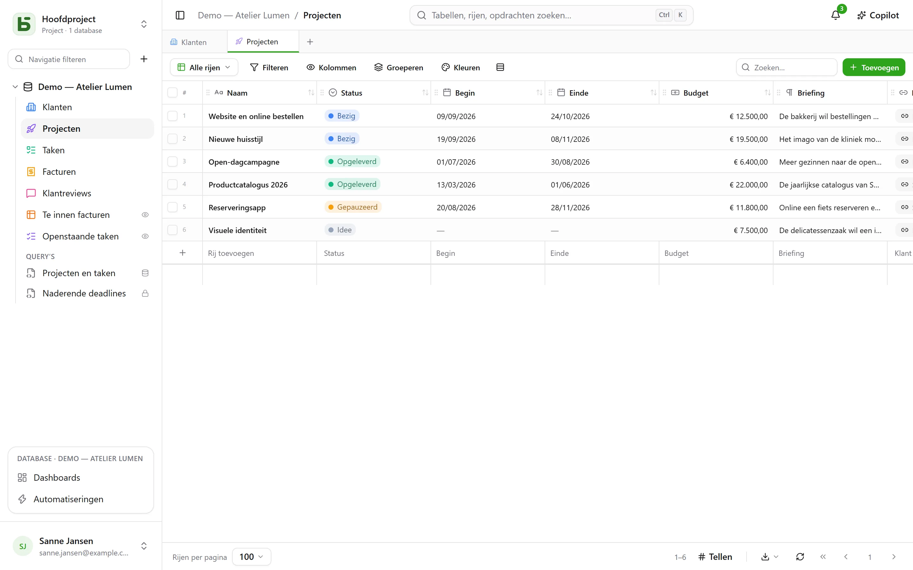
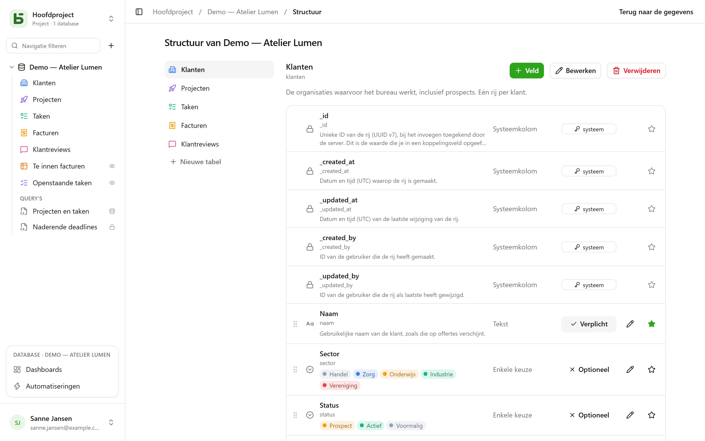

Elke tabel van basedb is een PostgreSQL-tabel; elk veld een getypeerde kolom. Het label
dat je invoert (“Échéance”) wordt een leesbare fysieke naam (`echeance`) via een stabiele
**slugificatie**: zonder accenten, in kleine letters, zonder gereserveerde woorden.

## De types

| Type | PostgreSQL-kolom | Opmerkingen |
|---|---|---|
| Korte tekst | `text` | één regel |
| Lange tekst | `text` | Markdown: een fragment in het raster, de weergave bij hover, een eigen editor; kan [een kolom citeren](#opgemaakte-tekst-en-variabelen) |
| Opgemaakte tekst | `text` + `CHECK` | HTML die bij het schrijven wordt opgeschoond, geschreven in een visuele editor — [zie verderop](#opgemaakte-tekst-en-variabelen) |
| Getal | `numeric` | nooit een float: een bedrag krijgt geen afrondingsfouten |
| Valuta, Percentage, Duur, Beoordeling | `numeric` | een getal en zijn [weergaveformaat](#weergaveformaten): `12,50 €`, `15 %`, `1:30`, ★★★★☆ |
| Selectievakje | `boolean` | |
| Datum | `date` | |
| Datum en tijd | `timestamptz` | een absoluut tijdstip, weergegeven in de tijdzone van de lezer |
| Enkele keuze | `text` + `CHECK` | kleur, pictogram of afbeelding per optie |
| Meerkeuze | `text[]` + `CHECK` | filterbaar met de array-operatoren |
| E-mail | `text` + `CHECK` | een adres dat de database controleert, met één klik te openen |
| Telefoon, Streepjescode, Adres | `text` | een korte tekst en zijn formaat: bellink, vaste breedte, link naar de kaart |
| URL | `text` + `CHECK` | aangevuld bij het invoeren (`exemple.fr` → `https://exemple.fr`) |
| Persoon | `uuid` | een lid van de werkruimte; wie je aanwijst, krijgt een [melding](/basedb/nl/fonctionnalites/collaboration/) |
| Automatisch nummer | `bigint` identity | nummert ook de rijen die er al zijn; niemand voert het in |
| Relatie | `uuid` + `FOREIGN KEY` | een echte foreign key naar de doeltabel |
| Meervoudige relatie | `uuid[]` | meerdere gekoppelde rijen, waarvan een trigger de integriteit bewaakt |
| Formule | gegenereerde kolom `STORED` | berekend door PostgreSQL — of bij het lezen, zie [Formules](#formules) |
| Opzoeken, Aggregatie, Aantal | geen | berekend bij het lezen, via een relatie |
| Knop | geen | opent een adres of start een [automatisering](/basedb/nl/fonctionnalites/automatisations/) |
| Bestand, Afbeelding | `jsonb` (metadata) | de bytes gaan naar de [bestandsopslag](/basedb/nl/fonctionnalites/fichiers/) |

Elke tabel heeft ook zijn **systeemkolommen**: `_id` (UUID v7), `_created_at`,
`_updated_at`, `_created_by`, `_updated_by` — bijgehouden door een trigger, nooit te schrijven
via de API. Het raster zet ze onder **Systeeminformatie**, in het kolommenmenu:
ze staan op elke tabel, en zijn op weinig tabellen nuttig.



## Constraints die de database bewaakt

Wat de interface belooft, garandeert PostgreSQL. Een enkele keuze is een `CHECK`-constraint;
een relatie een `FOREIGN KEY`; een URL of een e-mailadres een reguliere
expressie. Een schrijfactie in directe SQL die ze schendt, wordt geweigerd, net als in de interface:

```text
Check constraints:
  "ck_opportunites__statut__enum" CHECK (statut = ANY (ARRAY['nouveau', 'qualifie', …]))
Foreign-key constraints:
  "fk_opportunites__clients_id" FOREIGN KEY (clients_id) REFERENCES b_t4z56fq_ventes.clients(_id)
```

## Weergaveformaten

Valuta, Percentage, Duur, Beoordeling, Telefoon, Streepjescode en Adres kies je zoals types,
maar het zijn **formaten**: de kolom blijft een getal of een tekst, alleen de weergave verandert.

| Formaat | Op | Wordt gelezen en ingevoerd als |
|---|---|---|
| Valuta | een getal | `12 500,00 €` — euro, dollar, pond, Zwitserse frank, Canadese dollar, yen |
| Percentage | een getal | `15 %` |
| Duur | een aantal seconden | `1:30`, en wordt ingevoerd als `1h30`, `90 min` |
| Beoordeling | een getal | van 1 tot 10 sterren, met één klik ingesteld |
| Telefoon | een korte tekst | een bellink |
| Streepjescode | een korte tekst | met vaste breedte |
| Adres | een korte tekst | een link naar de kaart; in de rijdetails stelt **Adres zoeken** de bijpassende adressen voor, voluit geschreven; de weergave [Landkaart](/basedb/nl/fonctionnalites/vues/#landkaart) plaatst haar |

Een formaat pas je achteraf aan (**Opmaak**, bij het bewerken van het veld) zonder de
opgeslagen waarden te raken. Het begrenst de waarde niet: een beoordeling van 7 op een schaal van 5 blijft 7.

## Standaardwaarden

Bij het bewerken van een veld bepaalt **Standaardwaarde** wat een rij krijgt die zonder deze
waarde wordt aangemaakt:

| Keuze | Op | De aangemaakte rij krijgt |
|---|---|---|
| Een vaste waarde | de meeste types | de gekozen waarde — een status “Nouveau”, een prioriteit 3 |
| De datum van vandaag | een datum | de dag van aanmaak, in de tijdzone van de persoon |
| Het moment van aanmaak | een datum en tijd | het exacte tijdstip |
| De persoon die de rij aanmaakt | een persoon | wie haar heeft aangemaakt — “Verantwoordelijke: ik” |

De nieuwe rijdetails en de formulieren openen al ingevuld; het veld leegmaken laat het leeg. De
standaardwaarde geldt voor elke aanmaak — interface, API, MCP, import, gedeeld formulier,
automatisering —, ook op een veld dat de persoon niet mag wijzigen: dat is de regel van de
tabel. Bestaande rijen veranderen niet, en een invoeging via directe SQL krijgt er geen: basedb
past die toe, niet de kolom.

## Formules

Een formule schrijf je in het Engels (de Franse namen werken ook), met velden tussen vierkante haken en argumenten gescheiden door `,`:

```text
ROUND([Montant HT] * (1 + [Taux de TVA]), 2)
IF([Payée], FALSE, DAYS(TODAY(), [Échéance]) > 0)
DAYS([Fin], [Début])
```

De editor stelt velden voor om in te voegen en toont een paneel met de functies; een fout noemt het veld of
het teken dat het probleem veroorzaakt.

| Familie | Functies |
|---|---|
| Logica | `IF`, `IFBLANK`, `ISBLANK`, `AND`, `OR`, `NOT`, `TRUE`, `FALSE` |
| Getallen | `ROUND`, `ABS`, `CEILING`, `FLOOR`, `MIN`, `MAX` |
| Tekst | `UPPER`, `LOWER`, `TRIM`, `LEFT`, `RIGHT`, `LEN`, `TEXT`, `VALUE` |
| Datums | `YEAR`, `MONTH`, `DAY`, `WEEKDAY`, `DAYS`, `ADD_DAYS`, `DATE`, `TODAY`, `NOW` |
| Operatoren | `+ - * /`, `&` om tekst samen te voegen, `= <> < <= > >=` |

Een formule wordt een **gegenereerde kolom** in PostgreSQL: `psql` en je tools lezen haar
zoals de andere kolommen. Een formule die van de dag afhangt (`TODAY()`, `NOW()`) of die een
opzoekveld of een aggregatie citeert, wordt **bij het lezen berekend**: je kunt erop filteren en sorteren in basedb, maar
ze bestaat niet in directe SQL.

Een formule citeert geen andere formule en ook niet rechtstreeks een relatie — een opzoekveld doet dat wel.
Een deel van een tekst extraheren of vervangen volgt later.

## Opzoekvelden, aggregaties en aantallen

Drie velden lezen **via een relatie**, in de ene of de andere richting — “de klant van het
project”, maar ook “de taken die via Projet gekoppeld zijn”:

- een **opzoekveld** haalt een waarde uit de gekoppelde rij op, of de lijst van waarden: de stad van de
  klant van een project;
- een **aggregatie** rekent over de gekoppelde rijen: aantal waarden, som, gemiddelde, minimum,
  maximum — de omzet van een klant, de gemiddelde beoordeling van zijn reviews;
- een **aantal** telt de gekoppelde rijen: het aantal taken van een project.

Ze worden bij elke leesactie berekend, **met de rechten van wie leest**: als de gekoppelde tabel voor jou
gesloten is, is het veld dat ook. Je kunt erop filteren en sorteren. Ze volgen één relatie,
je kunt er niet in schrijven, ze hebben geen kolom — en bestaan dus niet in directe SQL — en komen niet
voor in de import, in formulieren of in de geschiedenis.

## Relaties

Een **relatie** koppelt een rij aan een rij van een andere tabel in dezelfde database. Het raster
toont de **weergavewaarde** van de doelrij — de kolom die je daarvoor aanwijst
in haar tabel — en filters gaan door de relatie heen (`clients_id.ville eq "Lyon"`). De rijen
die naar een rij verwijzen, verschijnen in haar rijdetails.

Vink **Meerdere rijen per record** aan en de relatie wordt **meervoudig**: een taak
hangt af van meerdere taken, een artikel hoort bij meerdere categorieën. De gekoppelde rijen
verschijnen als labels, worden gekozen via een zoekveld en openen met één klik vanuit de
rijdetails. Een doelrij verwijderen haalt haar uit de lijsten die haar citeerden — of wordt geweigerd, als je
daarvoor hebt gekozen. De filters `has_any`, `has_all` en `is_null` zijn van toepassing, en gaan ook
door de relatie heen (`taches_ids.titre contains "logo"`). Op een meervoudige relatie kun je nog niet sorteren,
groeperen of importeren.

## Knop

Een veld **Knop** heeft geen waarde: het doet iets. Het **opent een adres** — `https://` of
`mailto:`, dat de rij kan citeren (`mailto:{{E-mail}}`) — of **start een automatisering**
met een knoptrigger op dezelfde tabel. Het verschijnt in de cel, op de kaart en in
de rijdetails.

## Beschrijvingen

Een database, een tabel en een veld hebben een **beschrijving**, aan te passen zonder migratie. Ze wordt
overgenomen in de `COMMENT ON` die `psql` leest, in de gegenereerde documentatie, en in wat een
agent leest via `describe_table`.

## Opgemaakte tekst en variabelen

**Opgemaakte tekst** is de HTML-variant van lange tekst, gekozen bij het aanmaken van het veld
(“Opgemaakte tekst (HTML)”): koppen, vet, cursief, onderstreept, doorgehaald, lijsten, citaten, code,
links en scheidingslijnen, in een visuele editor. De HTML wordt **bij het schrijven opgeschoond**, of hij nu
uit de interface, de API, de MCP-server of een import komt, en een `CHECK`-constraint weigert bovendien
de gevaarlijke vormen die rechtstreeks in SQL worden geschreven (`<script>`, attributen `on…`, `javascript:`).
Geen afbeeldingen, tabellen of kleuren: wat de database niet zou bewaren, wordt niet aangeboden.

Een lange tekst — eenvoudig of opgemaakt — kan **een kolom van zijn eigen rij citeren**. Het menu **Kolom** van
de editor voegt de verwijzing in bij de cursor: een label in opgemaakte tekst, `{{Ville}}` in
Markdown.

> Levering gepland op `{{Livraison}}` in `{{Ville}}`.

- De kolom bewaart de verwijzing zoals die geschreven is — `{{ville}}`, met de fysieke naam: dat is wat
  `psql` leest.
- Overal elders — het raster, de rijdetails, de API, de MCP-server, gedeelde weergaven,
  automatiseringen — wordt de tekst gelezen **met de waarde van de rij**: “Levering gepland op
  02/10/2026 in Lyon.” Wijzig je de stad, dan wijzigt de tekst.
- Een enkele keuze wordt gelezen via haar label, een persoon via zijn naam, een datum in jouw
  formaat; een waarde die in opgemaakte tekst wordt ingevoegd, is nooit opmaakcode.
- Een kolom die de lezer niet mag lezen, levert niets op: niet de waarde en niet de naam.

Opgemaakte tekst kan niet door AI worden ingevuld: een model schrijft tekst, geen opgeschoonde HTML.

## De structuur wijzigen

Het scherm **Structuur** van de database — in het menu **⋯** in de zijbalk — toont de tabellen en hun velden: toevoegen, hernoemen, verplicht maken, herordenen,
beschrijven, het weergaveveld aanwijzen.



De structuur wijzigen vraagt het niveau **Beheren**. Zonder dat niveau kun je het scherm bekijken, maar het biedt
niets aan: geen knop, geen potlood, geen sleepgreep — verplichte velden en het weergaveveld worden vermeld, niet
aangeboden. De server weigert elke wijziging sowieso; het scherm doet niet meer alsof het die
accepteert.

Een veld toevoegen, hernoemen of het type ervan wijzigen gaat via de **migratie-engine**: een plan in
stappen, korte locks, en een benoemde weigering als een gegeven niet kan worden geconverteerd.

**Een naam wijzigen** van een database, een tabel of een veld doe je in één dialoogvenster. Het label verandert
altijd, zonder migratie. Een beheerder ziet daaronder “Naam ook in de database wijzigen:
`clients` → `comptes`”: aangevinkt wijzigt dit ook de fysieke naam, en verschijnt de impactanalyse
— de query’s, SQL-views en automatiseringen die de oude naam citeren. De oude
naam blijft beschikbaar via een **compatibiliteitsalias** — een view — zolang je je
query’s bijwerkt.

Verwijderen wist niet meteen iets: de tabel of de database wordt verbannen
(`zz_supprime_…`) en blijft leesbaar in SQL. Een verwijderde database kun je herstellen; een losse tabel
terughalen vanuit de interface [komt nog](/basedb/nl/feuille-de-route/). De definitieve **verwijdering** is
voorbehouden aan het beheer, dertig dagen later, en begint met een gecontroleerde CSV-export.
