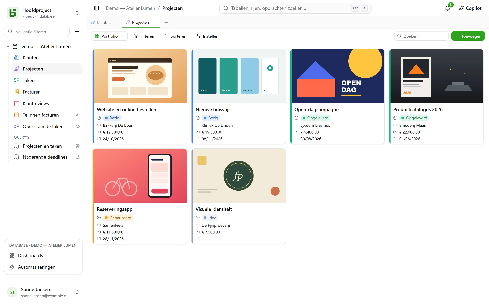
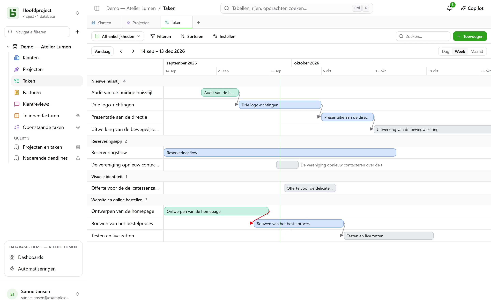
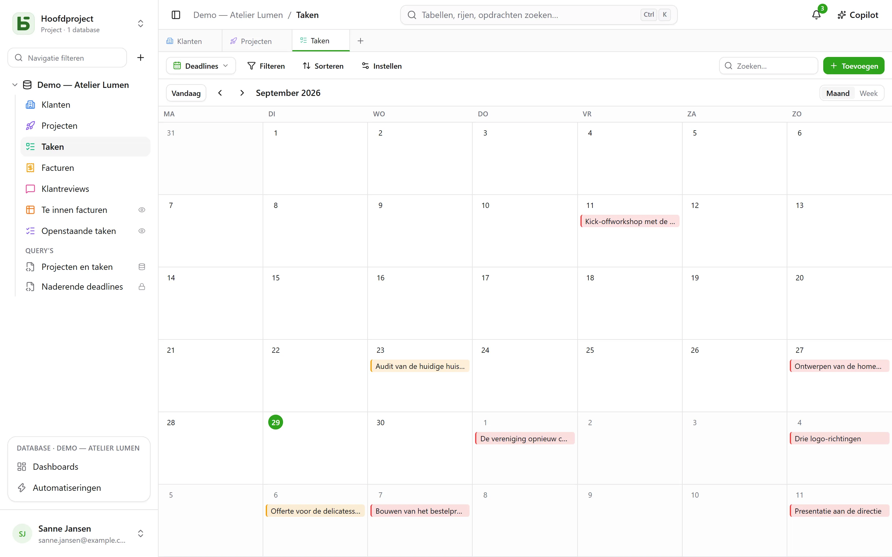
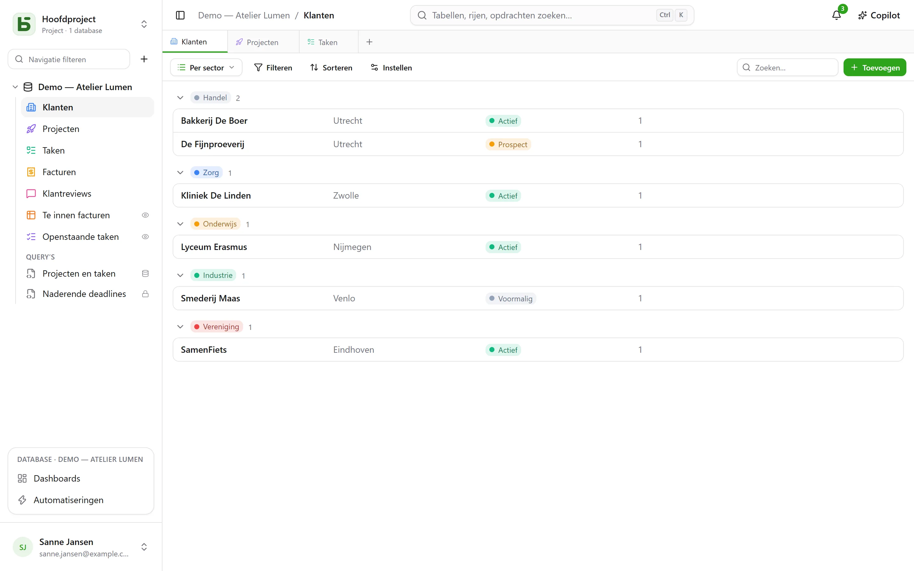

Een tabel laat zich op **tien manieren** tonen. Een weergave kopieert geen gegevens, en geeft geen enkel recht
meer dan de tabel zelf.

:::note
Deze weergaven zijn manieren om **één** tabel te tonen. Een [SQL-view](/basedb/nl/fonctionnalites/requetes-et-vues-sql/)
is iets anders: een echte PostgreSQL-view, in SQL geschreven op de tabellen van de database, en daartussen
geplaatst in de zijbalk.
:::

| Weergave | Wat ze toont | Wat ze nodig heeft |
|---|---|---|
| **Raster** | rijen, gefilterd, gesorteerd, gegroepeerd, met gekozen kolommen | — |
| **Kanban** | kaarten in kolommen | een enkele keuze |
| **Kalender** | rijen op hun datum, per maand of per week | een datumveld |
| **Tijdlijn** | balken tussen twee datums, en hun afhankelijkheden | een startdatum |
| **Galerie** | kaarten, met een omslagafbeelding | — |
| **Lijst** | één regel per record, in inklapbare groepen | — |
| **Landkaart** | elke rij op haar plek op de kaart | een adres, of een breedtegraad en een lengtegraad |
| **Formulier** | een pagina met vragen om een rij aan te maken | — |
| **Enquête** | dezelfde vragen, één per scherm | — |
| **Quiz** | vragen met punten, één per scherm, en de score aan het einde | — |

## De weergavekiezer

Die staat links van “Filteren”. “Alle rijen” is het raster van de tabel, dat niemand
heeft opgeslagen en niemand kan verwijderen; daarna komen de **gezamenlijke weergaven**, in
de volgorde die de bouwer van de database heeft gekozen, en dan **Mijn weergaven**. Onderaan
verdeelt **Weergave maken** de tien soorten in twee families: **Rijen bekijken** en
**Antwoorden verzamelen** (formulier, enquête, quiz).

- Een **gezamenlijke weergave** ziet iedereen. Haar maken, instellen, hernoemen,
  herordenen of verwijderen vraagt het niveau **Beheren**. Ze kan **vergrendeld** zijn: een
  hangslot geeft dat aan, en niemand wijzigt haar meer voordat ze is ontgrendeld.
- Een **persoonlijke weergave** zie alleen jij, en vraagt alleen dat je de tabel mag lezen.
  **Persoonlijke weergave maken**, of **Opslaan als weergave** na filteren en sorteren:
  iedereen bewaart zijn eigen manieren van lezen, zonder iets te veranderen voor de anderen. **Dupliceren** van een
  gezamenlijke weergave maakt er een persoonlijke kopie van.

## De werkbalk

Boven het raster, in deze volgorde:

- **Filteren** combineert voorwaarden per veld;
- **Kolommen** kiest wat er getoond wordt — de systeemkolommen staan apart, onder
  “Systeeminformatie”;
- **Groeperen** deelt de rijen in op een veld met één waarde — enkele keuze, relatie,
  persoon, datum, getal, tekst, selectievakje… — in inklapbare groepen, elk met zijn
  aantal over het hele filter;
- **Kleuren** kleurt de rijen volgens een enkele keuze, of volgens **regels** — een filter en
  een kleur, hooguit twintig — als streep, als achtergrond, of allebei;
- **Rijhoogte**: kort, gemiddeld, hoog, extra hoog;
- **Zoeken…**, rechts, zoekt in alle kolommen terwijl je typt; Esc
  wist de zoekopdracht. Die geldt ook voor de kanban, de kalender, de tijdlijn, de galerie
  en de lijst, en wordt nooit in de weergave opgeslagen.

Onder elke kolom een **Samenvatting**, berekend over alle rijen van het filter, niet alleen over
de pagina: gevuld, leeg, unieke waarden, som, gemiddelde, minimum, maximum, aangevinkte vakjes.

## Kanban, kalender, tijdlijn

- De **kanban** deelt de kaarten in volgens een enkele keuze; een kaart slepen wijzigt de rij,
  een “+” boven een kolom maakt een rij aan die die keuze al heeft. Elke kaart toont een
  titel, een omslagafbeelding, de gekozen velden, en een **beschrijving** die de
  waarden van de rij citeert — “Levering gepland op `{{Date}}` voor `{{Client}}`” —, geschreven in de
  instellingen van de weergave met de knop **Veld invoegen**.
- De **kalender** plaatst elke rij op haar datum, eventueel met een einddatum; een
  rij van de ene dag naar de andere slepen verschuift haar.
- De **tijdlijn** tekent balken tussen een startdatum en een einddatum, gegroepeerd op
  een enkele keuze of een relatie. Met de instelling **Afhankelijk van** — een relatie van de tabel
  naar zichzelf — verbindt een pijl elke taak met de taken waarvan ze afhangt, rood wanneer die
  terug in de tijd gaat.

## Galerie en lijst

- De **galerie** toont kaarten: een **omslagafbeelding** (bijgesneden of volledig), een
  formaat (kleine, middelgrote, grote kaarten), een kleur volgens een enkele keuze.
- De **lijst** toont één regel per record, **gegroepeerd** op een enkele keuze, een
  relatie of een persoon.

In de kanban, de galerie en de lijst **orden je de kaarten en regels met de hand** door ze
te slepen — tot 5 000; een gekozen sortering gaat voor op deze volgorde.

## Landkaart

De **landkaart** plaatst elke rij op haar plek, op basis van:

- een **adres** — een korte tekst, bij voorkeur in het formaat **Adres** (zie
  [Tabellen en velden](/basedb/nl/fonctionnalites/tables-et-champs/)): “12 rue des Lilas, Lyon”;
- of een **breedtegraad** en een **lengtegraad**, twee getalvelden, zonder verdere bewerking
  gebruikt.

Een pin krijgt de **kleur** van een enkele keuze, toont de **titel** van de rij bij hover, en
opent haar rijdetails bij een klik. De landkaart volgt het filter en de sortering van de
weergave, tot 2 000 rijen.

Een adres wordt **eenmalig gelokaliseerd** door de geocodeerservice van de instantie — die van
OpenStreetMap standaard —, in het tempo dat deze oplegt: op een nieuwe landkaart verschijnen de
pins geleidelijk terwijl de antwoorden binnenkomen, ongeveer één per seconde, en meteen de
volgende keren. Een badge telt de geplaatste rijen, de adressen die nog gelokaliseerd moeten
worden en die welke dat niet konden worden: een onvindbaar adres moet worden verduidelijkt
(stad, postcode), en wordt nooit stilzwijgend genegeerd.

:::note[Wat je server verlaat]
De tekst van de adressen gaat naar de geocodeerservice, en de browser van elke lezer laadt de
achtergrondkaart vanaf de tegelserver. De beheerder van de instantie kan andere diensten kiezen,
of er geen enkele willen: zie
[Omgevingsvariabelen](/basedb/nl/hebergement/variables/#landkaarten-en-adressen).
:::

## Formulier en enquête

Je vinkt de vragen aan en zet ze in volgorde; elke vraag heeft een titel, een hulptekst, een
voorbeeldantwoord, en kan verplicht worden gemaakt. Het formulier heeft een titel, een
introductie, het label van de knop en een bedankbericht. Het wordt ingevuld in basedb, of
[via een link gedeeld](/basedb/nl/fonctionnalites/formulaires-partages/).

Er hoeft niets ingesteld te worden om te beginnen: een nieuw formulier vraagt wat iemand
antwoordt — niet de status, de toegewezen persoon of de relaties die het team later invult,
tenzij die verplicht zijn —, draagt de kleur van zijn tabel en een licht thema, en elk leeg
veld toont een passend voorbeeld. Al de rest wijzig je wanneer je wilt:

- **Uiterlijk**: acht thema’s — Licht, Zacht, Dageraad, Oceaan, Bos, Nacht, Papier, Minimalistisch —,
  een accentkleur, een lettertype, een uitlijning links of gecentreerd;
- **Vooraf invullen met de datum van vandaag**: een datumvraag staat al ingevuld met de dag van
  vandaag — bij datum en tijd ook met het tijdstip —, die de invuller houdt of wijzigt;
- **Alleen vragen als…**: een vraag wordt alleen gesteld als een eerder antwoord daarom vraagt
  (“Sentiment is Negatief”, “Beoordeling is hoogstens 2”). Een verborgen vraag is niet
  verplicht en wordt niet verzonden;
- **Meer opties**: de knoppen voor onthaal en verzending, de nummering, de voortgangsbalk, het
  automatisch doorgaan, het bericht en een eindknop (“Terug naar de site”), de confetti.

De **enquête** neemt het hele scherm in: een onthaal dat zegt hoeveel tijd het kost, dan één
vraag tegelijk, die glijdend verschijnt. Alles kan ook met het toetsenbord: **Enter** om
verder te gaan, de letters **A**, **B**, **C**… voor een keuze, **J** of **N** voor ja of nee,
de cijfers voor een beoordeling — een enkele keuze gaat vanzelf naar de volgende vraag. Het
verzenden wordt gevierd: een vinkje dat zich tekent en confetti in de kleuren van het
formulier.

## Quiz

Een quiz is een enquête die punten telt. Onder elke vraag geef je het **juiste antwoord** en wat
het oplevert — **1 punt** als je niets invult, tot 100:

| Vraag | Juist antwoord |
|---|---|
| enkele keuze | een keuze |
| meerkeuze | de keuzes die aangevinkt moeten worden, alle en niet meer dan die |
| selectievakje | ja of nee |
| getal, beoordeling | een getal |
| datum | een dag |
| korte tekst, e-mail, URL | een of meer geaccepteerde antwoorden, gescheiden door `;` — zonder rekening te houden met hoofdletters of accenten |

Een vraag zonder juist antwoord — een voornaam, een opmerking — wordt gesteld zonder te worden
beoordeeld. Er is er minstens één nodig om de quiz aan te maken.

De sectie **Beoordeling** regelt de rest:

- **Nakijken**: **na elke vraag** — het antwoord wordt meteen gecontroleerd, groen, of rood met
  het juiste antwoord, en de score groeit boven aan het scherm —, **aan het einde** — de score,
  dan het antwoordmodel —, of **nooit** — alleen de score, de juiste antwoorden blijven geheim;
- **Slagingsgrens**: een percentage van de punten; het eindscherm zegt dan “Geslaagd!” of
  “Deze keer niet…”;
- **Score opslaan in**: een getalveld van de tabel, dat de score van elk antwoord ontvangt.
  Sorteer het raster erop: dat is de ranglijst. Een veld met de naam “Score”, “Punten” of
  “Beoordeling” wordt automatisch gekozen.

Het eindscherm toont de score in een ring die zich vult, het percentage, en dan, behalve bij
“nooit”, elke beoordeelde vraag met het gegeven antwoord en het juiste. Een vraag die door een
eerder antwoord verborgen is, telt niet mee in het totaal.

:::note
In de applicatie kan wie de weergave mag lezen ook de juiste antwoorden lezen. Via een
[gedeelde link](/basedb/nl/fonctionnalites/formulaires-partages/#een-gedeelde-quiz) verlaten ze
nooit de server: die corrigeert en telt.
:::

## Een weergave delen

Een gegevensweergave — raster, kanban, kalender, tijdlijn, galerie, lijst — wordt **alleen-lezen
gedeeld** via een link, kan in een andere site worden ingesloten, en een kalender wordt een
agendafeed. Zie [Gedeelde weergaven](/basedb/nl/fonctionnalites/vues-partagees/).

## Wat de lezer niet ziet

Een weergave wordt **opnieuw geprojecteerd voor haar lezer**: een veld dat voor hem verborgen is, verdwijnt uit de
kolommen, de kaarten en de vragen. Een weergave waarvan het filter een verborgen veld citeert, wordt helemaal niet
getoond: zonder haar filter zou ze meer laten zien dan waarvoor ze is gemaakt.
