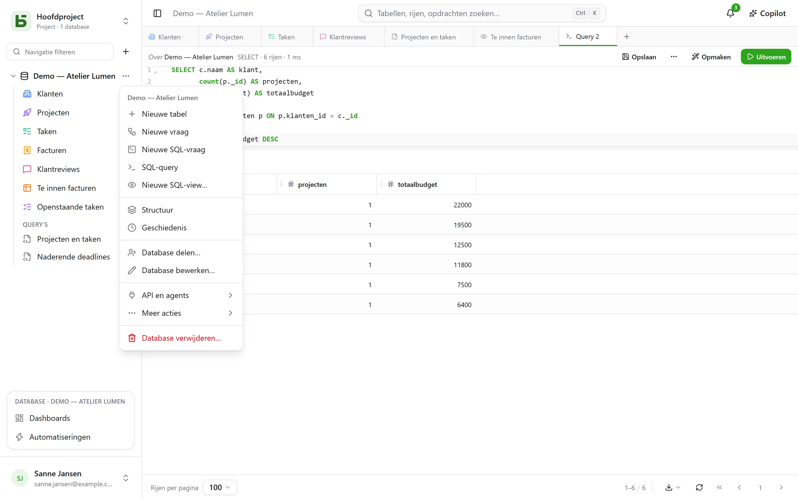

Deze rondleiding duurt tien minuten en behandelt de basis: aan het eind heb je een tabel, een
kanbanweergave en een openbaar formulier dat erin schrijft.

:::tip[Alles in één keer zien]
Een leeg project biedt de **demodatabase** aan: een klein bureau met zijn klanten, projecten,
taken, facturen en reviews, met formules, weergaven van elke soort, een dashboard en
automatiseringen. **Nieuwe database** opent ook de [sjablonengalerie](/basedb/nl/fonctionnalites/modeles/),
waar je je database aan de AI kunt beschrijven.
:::

## 1. Een database maken

Alles is georganiseerd per **project**: de keuzelijst bovenaan de zijbalk wisselt van project of
maakt er een aan. In de zijbalk maakt de **+** rechts van het filter een database aan. Geef hem een label
— “Ventes” — en, als je wilt, een beschrijving, een kleur, een pictogram.

De database wordt een **PostgreSQL-schema**: de fysieke naam (`b_t4z56fq_ventes`) verschijnt in
het formulier en in de gegenereerde documentatie.

## 2. Een tabel en de velden ervan maken

Via het menu **⋯** van de database: **Nieuwe tabel**. Voeg daarna de velden toe via
**Structuur** — in hetzelfde menu — en de knop
**Veld**:

| Veld | Type |
|---|---|
| Nom | Korte tekst |
| Statut | Enkele keuze — Nouveau, Qualifié, Gagné, Perdu |
| Montant | Valuta |
| Échéance | Datum |
| Client | Relatie → Clients |
| Notes | Lange tekst (Markdown) |

Later voeg je op dezelfde manier een formule (`DAYS([Échéance], TODAY())`), een opzoekveld
(de stad van de klant) of een aggregatie (het totaalbedrag per klant) toe — zie
[Tabellen en velden](/basedb/nl/fonctionnalites/tables-et-champs/).

Je kunt ook **een bestand importeren** — een Excel-werkmap (`.xlsx`), een CSV of een JSON: de
import raadt de types, laat je ze corrigeren, maakt de tabel aan of vult een bestaande tabel
aan, en meldt per rij wat hij weigert. Van een werkmap met meerdere werkbladen kies je het
werkblad; datums, bedragen en selectievakjes worden overgenomen zoals Excel ze bewaart, en een
formule levert haar waarde op.



## 3. Invoeren en filteren

Het raster bewerk je als een spreadsheet: dubbelklik of Enter om een cel te wijzigen, Esc om
te annuleren. **Filteren** combineert voorwaarden per veld; sorteren doe je via de kop van de
kolom; **Zoeken…**, rechts in de balk, zoekt in alle kolommen. Elke
wijziging wordt meteen opgeslagen — en [in de geschiedenis vastgelegd](/basedb/nl/fonctionnalites/historique/):
**Ctrl+Z** maakt de laatste ongedaan.

## 4. Een weergave toevoegen

De weergavekiezer, links van “Filteren”, biedt “Alle rijen” en daarna je weergaven.
Maak een **kanban** gegroepeerd op “Statut”: een kaart van de ene kolom naar de andere slepen wijzigt de
rij.


## 5. Een formulier delen

Maak een weergave **Formulier**, vink de vragen aan en kies dan **Delen**: kies “Openbaar”,
kopieer de link. Elk antwoord voegt een rij toe aan de tabel, zonder de invuller
enig recht te geven. Details in [Gedeelde formulieren](/basedb/nl/fonctionnalites/formulaires-partages/).

## 6. Lezen in SQL

Menu **⋯** van de database → **SQL-query**: je tabellen staan er, onder hun echte naam.

```sql
SELECT nom, statut, montant
FROM b_t4z56fq_ventes.opportunites
WHERE statut = 'gagne'
ORDER BY montant DESC;
```

**Opslaan** zet de query onder de tabellen, in de rubriek “Query’s” — voor jezelf, of voor de hele
database — en **⋯** → **SQL-view maken…** maakt er een echte PostgreSQL-view van, tussen de
tabellen. Iedereen leest ze met zijn eigen rechten. Zie
[Query’s en SQL-views](/basedb/nl/fonctionnalites/requetes-et-vues-sql/).

Vanuit `psql` of je BI-tool werkt het precies zo. Zie [Directe SQL](/basedb/nl/integrations/sql/).
