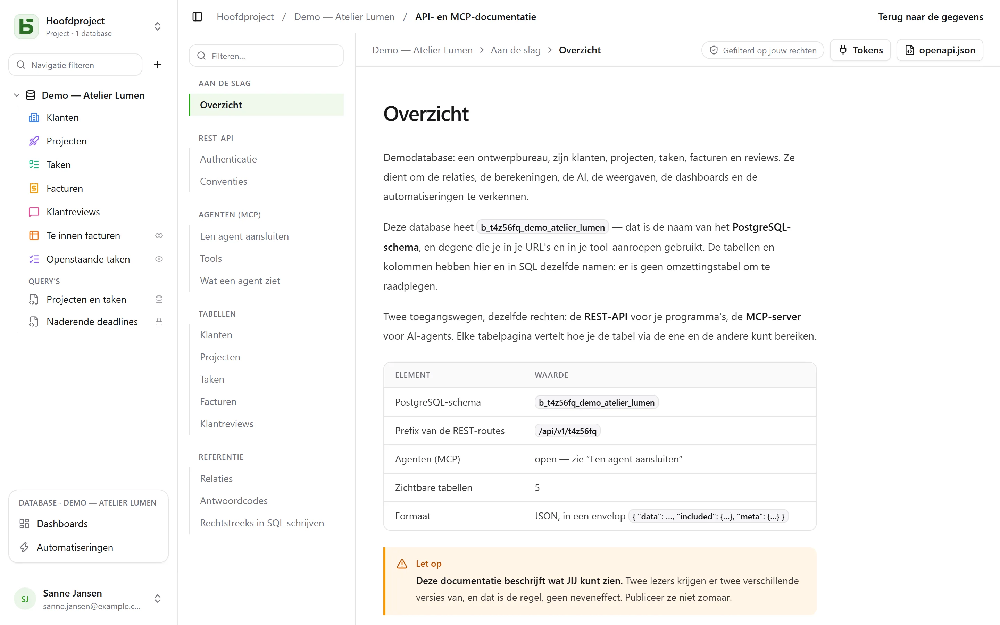

De REST-API is dezelfde die de interface gebruikt: **er bestaat geen private route**.
De URL’s bevatten de fysieke namen — dezelfde die je ook in SQL leest.

```text
/api/v1/<tenant>/data/<base>/<table>
/api/v1/t4z56fq/data/b_t4z56fq_ventes/opportunites
```

## Een token

In de interface, menu **⋯** van de database → **API en agents** → **API- en MCP-tokens…**: wie het
niveau **Beheren** heeft op de database, of op het project ervan, maakt daar een
**integratietoken** aan dat beperkt is tot deze database, standaard alleen-lezen, nadat het
wachtwoord is bevestigd — een account zonder wachtwoord, dat via een identiteitsprovider inlogt,
kan dat nog niet. Het wordt maar één keer getoond; zet het in een omgevingsvariabele.

Een token leest; het maakt aan en wijzigt als het met schrijfrechten is aangemaakt, en
**verwijdert als het daarvoor is aangemaakt** — rechten “Lezen, schrijven en verwijderen”, behalve
een rij die via een cascaderelatie andere rijen mee zou nemen. Het heeft nooit meer rechten dan de
persoon die het heeft aangemaakt.

```bash
export BASEDB_TOKEN=bdb_…
curl "http://localhost:3000/api/v1/t4z56fq/data/b_t4z56fq_ventes/opportunites?limit=20" \
  -H "Authorization: Bearer $BASEDB_TOKEN"
```

## Lezen

| Parameter | Rol |
|---|---|
| `filter` | een leesbare expressie: `statut eq "gagne" and montant gte 10000` |
| `sort` | `-montant,nom` |
| `fields` | de kolommen die moeten worden teruggegeven |
| `limit`, `after` | paginering met een versleutelde cursor: `meta.next_cursor` van een pagina, doorgegeven als `after`, geeft de volgende (`meta.has_next_page`) |
| `links=display` | de relaties met hun weergavewaarde |
| `count=exact` | het totaal, begrensd op 100 000 |
| `variables=raw` | lange teksten zoals ze geschreven zijn, `{{colonne}}` inbegrepen, in plaats van met de [waarden van de rij](/basedb/nl/fonctionnalites/tables-et-champs/#opgemaakte-tekst-en-variabelen) |

De operatoren: `eq`, `ne`, `eq_ci`, `contains`, `starts_with`, `ends_with`, `in`, `is_null`,
`gt`, `gte`, `lt`, `lte`, `between`, gecombineerd met `and`, `or`, `not` en haakjes. Een
filter gaat door een relatie heen: `clients_id.ville eq "Lyon"`.

## Schrijven

```bash
curl -X POST "http://localhost:3000/api/v1/t4z56fq/data/b_t4z56fq_ventes/opportunites" \
  -H "Authorization: Bearer $BASEDB_TOKEN" -H "content-type: application/json" \
  -d '{"values": {"nom": "Audit RGPD", "statut": "nouveau", "montant": 12000}}'
```

`PATCH …/<table>/<_id>` wijzigt een rij met dezelfde body `{"values": {…}}`. Fouten
hebben één vorm: `{ "code": "…", "details": {…}, "request_id": "…" }`, met een
stabiele code per oorzaak.

Elke schrijfactie stuurt de header `x-basedb-transaction` terug: die doorgeven aan
`POST /api/v1/<tenant>/history/undo` (`{"transaction": "…"}`) maakt haar ongedaan, zoals Ctrl+Z in
de interface — geweigerd als de rij sindsdien is gewijzigd.

## Meer dan rijen

Met hetzelfde token:

| Route | Rol |
|---|---|
| `GET …/data/<base>/<table>/aggregate` | samenvattingen over alle rijen van een filter: `aggregates=montant:sum,nom:filled`, `group=statut` |
| `GET …/data/<base>/<table>/<_id>/comments`, `POST` | de opmerkingen van een rij lezen en schrijven |
| `POST /api/v1/<tenant>/automations/<id>/run` | een automatisering met een knoptrigger starten, op een rij (`{"record": "…"}`) |
| `GET /api/v1/<tenant>/meta/bases/<base>/dashboards` | de dashboards van een database |
| `GET /api/v1/<tenant>/meta/users` | de leden van de werkruimte, voor een veld Persoon |
| `GET /api/v1/<tenant>/meta/templates` | de databasesjablonen uit de galerie |
| `GET /api/v1/<tenant>/events?base=<base>&table=<table>` | een tabel in realtime volgen: signalen, die vervolgens via de routes hierboven worden herlezen (zie [Webhooks](/basedb/nl/integrations/webhooks/#zonder-webhook-een-tabel-volgen)) |

[Gedeelde weergaven](/basedb/nl/fonctionnalites/vues-partagees/) lees je zonder account:
`GET /api/v1/views/<jeton>` en `…/rows` in JSON, `…/calendar.ics` in iCalendar.

Bouwen — een automatisering, een dashboard of een integratie aanmaken — blijft voorbehouden aan
een sessie in de interface: een token leest en schrijft rijen, het verandert de database niet.

## Een database aanmaken vanuit een sjabloon

Een applicatie die wordt geïnstalleerd, maakt haar database in **één aanroep**: de server past
het sjabloon toe — tabellen, velden, relaties, voorbeeldrijen, weergaven, dashboards,
automatiseringen — en als een stap mislukt, blijft er geen database achter.

```bash
curl -X POST "http://localhost:3000/api/v1/t4z56fq/admin/bases" \
  -H "Authorization: Bearer $ACCES" -H "content-type: application/json" \
  -d '{"template": "crm", "label": "Ventes", "rows": false}'
```

`template` is de sleutel van een sjabloon uit de galerie, of een heel sjabloon in het
[sjabloonformaat](/basedb/nl/fonctionnalites/modeles/). Met de header
`Accept: application/x-ndjson` komt het antwoord regel voor regel binnen: één regel `{"step": …}`
per stap, en dan de aangemaakte database. Deze aanroep vraagt het toegangstoken van iemand die
een database kan aanmaken (`POST /auth/session/access`, na het inloggen): een integratietoken
opent alleen een bestaande database.

## Een token controleren

Tokens van basedb worden niet buiten basedb gecontroleerd. Een applicatie die er een ontvangt —
bijvoorbeeld een tool die vanuit basedb wordt geopend met het token van de persoon — vraagt op
wat het waard is (introspectie, RFC 7662), met haar eigen integratietoken:

```bash
curl -X POST "http://localhost:3000/auth/introspect" \
  -H "Authorization: Bearer $BASEDB_TOKEN" \
  --data-urlencode "token=$JETON_RECU"
```

```json
{ "active": true, "token_type": "access_token",
  "sub": "0195a…", "email": "claire@example.com", "name": "Claire Martin",
  "tenant": "t4z56fq", "groups": ["Commerciaux"], "exp": 1790000000 }
```

Elk token dat niet geldig is — onbekend, verlopen, ingetrokken, beëindigde sessie, andere
werkruimte — antwoordt met `{"active": false}`, zonder te zeggen waarom. Het antwoord wordt live
gelezen: een uitloggen is meteen zichtbaar. Voor een integratietoken vermeldt het antwoord ook de
database die het opent (`base`), zijn toegang (`read` of `write`) en zijn oppervlakken.

## De gegenereerde documentatie

Elke database heeft een pagina **API- en MCP-documentatie**: voor elke tabel de endpoints, de
kolommen, voorbeelden in cURL en in JavaScript. Ze wordt **gefilterd op jouw rechten** — twee
lezers krijgen twee versies —, geschreven **in de taal van je scherm**, en bestaat ook in
OpenAPI 3.1 (`/api/v1/<tenant>/meta/bases/<base>/openapi.json`). De namen, de paden en de
foutcodes blijven in elke taal hetzelfde.


