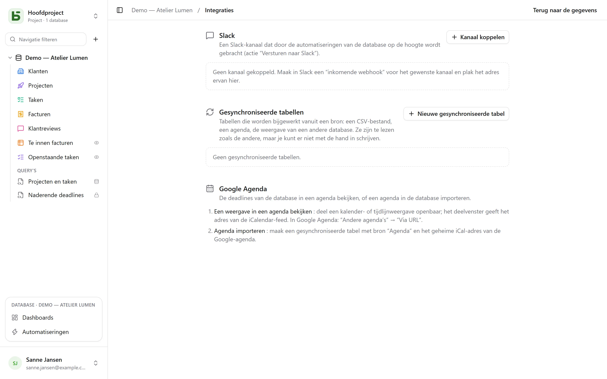

Het scherm **Integraties** van een database open je via het profielmenu, linksonder. Het
vraagt het niveau **Beheren** en brengt samen wat de database met de rest van je tools verbindt.

## Slack

**Kanaal koppelen**: maak in Slack een *incoming webhook* aan voor het gewenste kanaal, en plak daarna
het adres ervan (`https://hooks.slack.com/…`, de enige geaccepteerde oorsprong). **Testen** stuurt een
testbericht. Het adres wordt bij het opslaan meteen versleuteld en wordt nooit meer getoond.

Het gekoppelde kanaal is daarna een actie van [automatiseringen](/basedb/nl/fonctionnalites/automatisations/):
**Naar Slack sturen**, met een bericht dat de rij citeert — “Nieuwe negatieve review van
{{Auteur}}: {{Avis}}”.

## Agenda’s

Twee richtingen, twee middelen:

- **Een weergave in een agenda zien**: deel een kalender- of tijdlijnweergave openbaar; het
  dialoogvenster voor delen geeft het adres van een **iCalendar-feed**, waarop je je abonneert vanuit Google
  Agenda (“Andere agenda’s” → “Via URL”), Outlook of Apple Calendar. Zie
  [Gedeelde weergaven](/basedb/nl/fonctionnalites/vues-partagees/#een-kalender-in-je-agenda).
- **Een agenda importeren**: maak een gesynchroniseerde tabel met bron “Agenda” aan, met het geheime
  iCal-adres van de agenda.

## Gesynchroniseerde tabellen

Een gesynchroniseerde tabel wordt **bijgehouden vanuit een bron**: je kunt haar lezen, filteren en
in weergaven tonen zoals de andere tabellen, maar je kunt er niet met de hand in schrijven — een badge
“Gesynchroniseerd” herinnert daaraan, en de API weigert elke schrijfactie (`TABLE_SYNCED`).

| Bron | Wat de tabel wordt |
|---|---|
| **Online CSV-bestand** | één kolom per kolom van het bestand, getypeerd op basis van de inhoud: getal, datum of tekst |
| **Agenda** (Google Agenda, iCalendar) | één gebeurtenis per rij: titel, begin, einde, locatie, beschrijving |
| **Gedeelde weergave van een basedb** | de rijen van een [gedeelde weergave](/basedb/nl/fonctionnalites/vues-partagees/#een-bron-voor-andere-databases), op deze instantie of een andere |

**Nieuwe gesynchroniseerde tabel** kiest de bron en het interval — van elke 15 minuten tot één
keer per dag; **Synchroniseren** leest haar meteen opnieuw. Elke ronde maakt aan, wijzigt en
verwijdert wat nodig is om de tabel op de bron te laten lijken, op basis van een veld
**Synchronisatiesleutel**. Al deze schrijfacties gaan via de geschiedenis.

**Stoppen** met synchroniseren maakt de tabel weer gewoon: de rijen blijven, en kun je weer
met de hand bewerken.

## Beperkingen

- Een bron wordt gelezen tot een grens van 5 MB, 10 000 rijen en 10 seconden.
- Een bron die faalt, wist niets: de tabel houdt haar rijen tot de volgende ronde.
- Een kolom die na het aanmaken in de bron verschijnt, wordt niet toegevoegd.
- Slack wordt gekoppeld via een incoming webhook, nog niet via een Slack-app.
