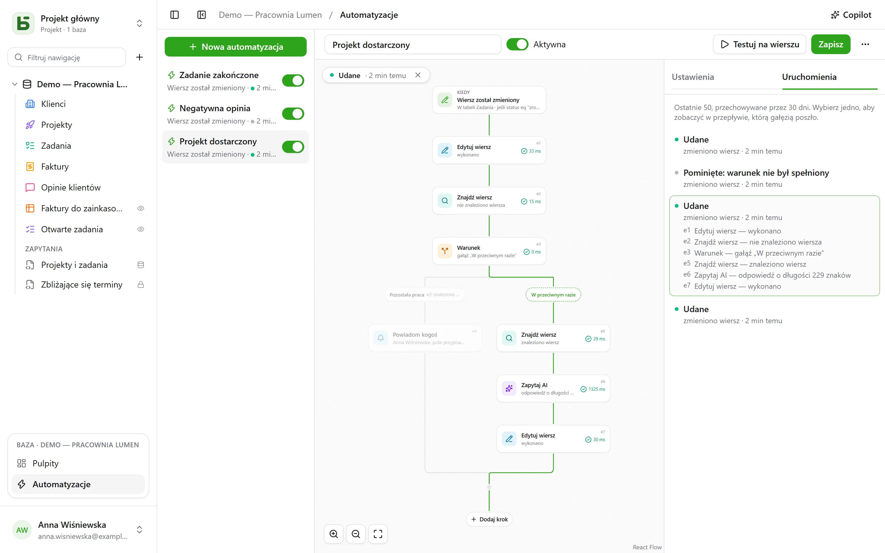

Automatyzacja mówi **kiedy**, **jeśli** i **wtedy**: gdy zadanie przechodzi do stanu „Fait”,
zanotuj godzinę; gdy przychodzi negatywna opinia, powiadom osobę odpowiedzialną i napisz na
Slacku; w każdy poniedziałek o 9:00 utwórz wiersz cotygodniowego spotkania zespołu. A gdy jedna
akcja nie wystarcza, automatyzacja podąża za **przepływem**: znajduje wiersz, wybiera tę lub
inną gałąź w zależności od tego, co w nim jest, powtarza kroki na każdym wierszu, który
odpowiada filtrowi, wykorzystuje w kroku to, co poprzedni krok znalazł lub zapisał, **czeka**
trzy dni przed ponagleniem, wysyła **PDF** w załączniku.

Otwiera się je z **Automatyzacje**, w bloku otwartej bazy na dole paska bocznego; wymagają
poziomu **Zarządzanie**.



## Przepływ

Przepływ rysuje się z góry na dół: wyzwalacz, a potem każdy krok. **+** na linii otwiera listę
kroków, podzielonych na kategorie — Wiersze, Komunikacja, Dokumenty, AI, Logika — z
wyszukiwaniem, i dodaje w tym miejscu wybrany krok; karta otwiera swoje ustawienia po prawej.
Prosta automatyzacja – wyzwalacz i jedna akcja – mieści się na dwóch kartach i konfiguruje się
ją jak dawniej.

## Kiedy

| Wyzwalacz | Ustawienia |
|---|---|
| **Wiersz został utworzony** | tabela |
| **Wiersz został zmieniony** | tabela oraz, w razie potrzeby, tylko obserwowane pola |
| **O stałej porze** | co godzinę, codziennie lub co tydzień, o wybranej godzinie i w wybranej strefie czasowej |
| **Kliknięto przycisk** | [pole Przycisk](/basedb/pl/fonctionnalites/tables-et-champs/#przycisk) tabeli |
| **Wiersz jest usuwany** | tabela; kroki przytaczają wiersz taki, jaki był |
| **Wiersz trafia do filtra** | tabela i filtr: automatyzacja uruchamia się, gdy wiersz wchodzi do filtra, i uruchamia się znowu dopiero wtedy, gdy najpierw z niego wyjdzie — „faktura staje się zaległa”, nie „zaległa faktura jest zmieniana” |
| **Nadchodzi data** | pole Data tabeli, przesunięcie — trzy dni wcześniej, tego samego dnia, tydzień później — i godzina: ponaglenia przed terminem, rocznice umowy |
| **Odebrano webhook** | nic: automatyzacja otrzymuje własny adres, który wywołuje inne oprogramowanie ([szczegóły](#usługa-wywołująca-basedb)) |

Wyzwalacz na wierszach widzi **wszystkie** zapisy: z interfejsu, API, agenta, formularza
udostępnionego, a nawet z bezpośredniego SQL – automatyzacje startują z historii, która
rejestruje je wszystkie.

## Tylko jeśli

Opcjonalny warunek w [języku filtrów](/basedb/pl/integrations/api-rest/#odczyt) –
`statut eq "fait"`, `montant gte 10000 and payee eq false` – sprawdzany na wierszu **w chwili
działania**. Uruchomienie, którego warunek nie jest spełniony, jest „pominięte” i tak jest
oznaczone.

## Wtedy

Do czterdziestu kroków, po kolei; pierwszy, który się nie powiedzie, zatrzymuje kolejne — poza
blokiem **Spróbuj** ([szczegóły](#spróbuj)).

| Krok | Co robi |
|---|---|
| **Edytuj wiersz** | zapisuje wartości w wierszu, który wyzwolił automatyzację – lub w tym, który krok znalazł albo utworzył |
| **Utwórz wiersz** | w tej lub innej tabeli bazy |
| **Znajdź wiersz** | pierwszy wiersz tabeli spełniający filtr, aby kolejne kroki mogły go przytoczyć lub zmienić |
| **Powiadom kogoś** | [powiadomienie](/basedb/pl/fonctionnalites/collaboration/#powiadomienia) do wybranych osób lub do osoby z pola Osoba |
| **Wyślij e-mail** | do osób z zespołu, do osoby z pola Osoba, na adres z pola E-mail – klienta, dostawcy – albo na wpisane adresy; temat i treść przytaczają wiersz i poprzednie kroki |
| **Wywołaj webhook** | żądanie HTTPS do usługi — metoda, adres, nagłówki i treść do własnego ustawienia ([szczegóły](#wywołaj-usługę)); jego odpowiedź można potem przytoczyć |
| **Wyślij na Slack** | wiadomość na [połączony](/basedb/pl/integrations/synchronisation/#slack) kanał |
| **Zapytaj AI** | odpowiedź [dostawcy AI](/basedb/pl/fonctionnalites/ia/) na polecenie, które przytacza wiersz i poprzednie kroki – napisz, streść, sklasyfikuj –, odczytaną jako tekst, liczba, tak lub nie, data albo wybór z listy |
| **Warunek** | kilka gałęzi: wybierana jest pierwsza, której warunek jest spełniony, a „W przeciwnym razie”, gdy żaden nie jest; gałęzie potem się łączą |
| **Dla każdego wiersza** | kroki, które zawiera, raz dla każdego wiersza tabeli spełniającego filtr ([szczegóły](#dla-każdego-wiersza)) |
| **Usuń wiersz** | wiersz, który wyzwolił automatyzację, albo ten, który znalazł krok — trafia do kosza |
| **Licz i sumuj** | liczbę wierszy filtra, ich sumę, średnią, minimum lub maksimum, do przytoczenia albo sprawdzenia później |
| **Generuj PDF** | [dokument](/basedb/pl/fonctionnalites/documents/) wiersza, zapisany w polu Plik albo załączony do e-maila |
| **Czekaj** | czas trwania, albo do daty z pola ([szczegóły](#czekaj)) |
| **Spróbuj** | kroki, i inne do wykonania, jeśli jeden z nich się nie powiedzie ([szczegóły](#spróbuj)) |
| **Uruchom automatyzację** | inną automatyzację bazy, na wierszu jej tabeli |

Wyszukiwanie, które niczego nie znajduje, nie zatrzymuje przepływu: kroki, które miały zmienić
znaleziony wiersz, są pomijane. Aby w takim przypadku zrobić coś innego, **Jeśli nie znaleziono
żadnego wiersza…**, pod wyszukiwaniem, dodaje warunek, który to sprawdza.

**Warunek** sprawdza wiersz za pomocą filtra, albo **wartość**: odpowiedź AI, kod webhooka,
sumę — „`{{e2.reponse}}` jest równe Pilne”, „`{{e3.somme.montant}}` jest większe lub równe
1000”. Liczby porównuje się jako liczby, a teksty — bez rozróżniania wielkości liter i znaków
diakrytycznych.

## Dla każdego wiersza

Krok **Dla każdego wiersza** odczytuje wiersze tabeli spełniające jego filtr — pusty:
wszystkie —, w wybranej kolejności, aż do jego limitu (domyślnie 50, najwyżej 200), po czym
wykonuje raz dla każdego z nich kroki umieszczone w jego ramce. „W każdy poniedziałek ponaglij
nieopłacone faktury” zapisuje się tak: **O stałej porze**, potem **Dla każdego wiersza** faktur
`payee eq false and relancee eq false`, a w pętli e-mail do kontaktu faktury oraz
**Edytuj wiersz**, który zaznacza „Relancée”.

W pętli identyfikator kroku nazywa **wiersz bieżącego przebiegu**: `{{e1.client}}` go
przytacza, a **Edytuj wiersz** proponuje go wśród wierszy do zmiany. Po pętli `{{e1.nombre}}`
mówi, ile wierszy przetworzyła — na przykład do podsumowania na Slacku. Filtr może przytaczać
to, co poprzedza krok: wyzwolona przez opłaconą fakturę, `facture eq {{_id}}` przechodzi przez
jej wiersze szczegółowe.

Powyżej limitu pozostałe wiersze czekają na kolejne uruchomienie, które to sygnalizuje: usuń z
filtra te już przetworzone — pole wyboru „Relancée”, datę — aby przetworzyć je wszystkie w
kolejnych uruchomieniach. Pętla nie zawiera innej pętli, a uruchomienie zatrzymuje się po
dwóch minutach.

## Czekaj

Krok **Czekaj** wstrzymuje uruchomienie — trzy godziny, dwa dni — albo do daty z pola wiersza,
z przesunięciem i godziną: „dzień przed terminem, o 9:00”. Uruchomienie pojawia się jako
**Wstrzymane** w zakładce **Uruchomienia**, z datą swojego wznowienia.

Wznawia się od kolejnego kroku, **odczytując na nowo** swoje wiersze: „trzy dni po wysłaniu
wyceny, jeśli wciąż nie jest zaakceptowana, ponaglić” zapisuje się jako **Czekaj** 3 dni, a
potem warunek na statusie wyceny, taki, jaki jest tego dnia. Wyłączenie automatyzacji zatrzymuje
wstrzymane uruchomienia; oczekiwanie nie umieszcza się ani w pętli, ani w bloku **Spróbuj**, i
trwa najwyżej rok.

## Spróbuj

Blok **Spróbuj** ma dwie gałęzie. Pierwsza jest wykonywana; jeśli jeden z jej kroków się nie
powiedzie, przepływ kontynuuje drugą, **W razie niepowodzenia**, która przytacza niepowodzenie
— `{{e4.erreur}}`, kod, i `{{e4.etape}}`, krok —, a potem wraca po bloku. Dzięki temu można
powiadomić kogoś, gdy usługa nie odpowiada, bez zatrzymywania wszystkiego.

Prościej: webhook może sam **spróbować ponownie** do trzech razy po awarii usługi, a pętla
może **kontynuować** mimo wiersza w niepowodzeniu.

## PDF i e-mail

**Generuj PDF** tworzy dokument wiersza — z [szablonu
dokumentu](/basedb/pl/fonctionnalites/documents/) jego tabeli, albo kartą wszystkich jego pól —
i może go zapisać w polu Plik. **Wyślij e-mail** może go potem załączyć, wraz z plikami z pola
Plik albo Obraz:

- e-mail **do każdego**, albo **jeden do wszystkich**, z adresatami **w kopii**;
- wiadomość w **tekście sformatowanym** — pogrubienie, listy, linki — która przytacza wiersz;
- adres **odpowiedzi**: twój domyślnie, albo z pola E-mail;
- do 50 odbiorców, 10 załączników i 15 MB.

„Gdy wycena przechodzi do statusu Zaakceptowana, wyślij fakturę do klienta, z księgowością w
kopii”: **Wiersz trafia do filtra** `statut eq "accepte"`, **Generuj PDF** z szablonem
Faktura, **Wyślij e-mail** do pola E-mail klienta, z załączoną fakturą.

## Usługa wywołująca basedb

Z wyzwalaczem **Odebrano webhook** automatyzacja ma własny, tajny adres, który trzeba podać
oprogramowaniu, które ma ją uruchamiać — sklepowi internetowemu, zewnętrznemu formularzowi,
narzędziu do automatyzacji:

```bash
curl -X POST "https://basedb.example.com/api/v1/hooks/<secret>" \
  -H "content-type: application/json" \
  -d '{"client": {"nom": "Dupont"}, "total": 120}'
```

Kroki przytaczają to, co zostało wysłane: `{{trigger.client.nom}}`, `{{trigger.total}}`;
formularz odczytuje się podobnie, tekst przez `{{trigger.texte}}`. Adres kopiuje się z ustawień
wyzwalacza; **Zmień adres** go zamienia, a stary natychmiast przestaje działać. Wywołanie
otrzymuje `202`, automatyzacja uruchamia się w ciągu sekundy.

## Wywołaj usługę

Krok **Wywołaj webhook** domyślnie wysyła, metodą `POST`, dane automatyzacji: wybrany wiersz
oraz to, co znalazły lub zapisały poprzednie kroki. Aby rozmawiać z usługą tak, jak ona tego
oczekuje, ustawia się:

- **metodę**: `POST`, `PUT`, `PATCH`, `GET` lub `DELETE` — te dwie ostatnie bez treści;
- **adres**, który po swoim hoście może przytaczać — `https://api.exemple.fr/clients/{{e2.numero}}`;
  każda wartość jest w nim kodowana;
- **nagłówki**, których wartość może przytaczać: `Idempotency-Key: {{_id}}`;
- **treść**: dane automatyzacji, **JSON do skomponowania**, **formularz** (para
  `klucz=wartość` na wiersz) lub **tekst**. W JSON-ie przytoczenie w cudzysłowie jest tekstem,
  a poza cudzysłowem — wartością: liczbą, tak lub nie, listą:

```json
{ "facture": "{{e1.numero}}", "montant": {{e1.montant}}, "payee": {{e1.payee}} }
```

Klucz API lub token umieszcza się w nagłówku **sekretnym** (kłódka): zaszyfrowany kluczem
instancji, nie jest już nigdy wyświetlany — ani na ekranie, ani przez API, ani Copilotowi — i
trafia tylko do hosta, dla którego go podano. Zmiana hosta w adresie wymaga podania go
ponownie; **Zastąp** wprowadza nowy.

## Zapytaj AI

Podobnie jak [pole AI](/basedb/pl/fonctionnalites/ia/#opcja-ai-pola), krok wysyła do dostawcy
swoje polecenie, w którym każde odwołanie jest zastąpione swoją wartością:

```text
Cet avis de {{auteur}} demande-t-il une action de notre part ? {{avis}}
```

Wybiera się **oczekiwaną odpowiedź** – tekst dowolny lub krótki, liczbę, tak lub nie, datę,
adres internetowy albo wybór z listy, którą można przejąć z pola wyboru. Model zostaje o tym
poinformowany, a odpowiedź, która jej nie zawiera, powoduje niepowodzenie kroku. Kolejne kroki
przytaczają ją przez `{{e1.reponse}}`: w tytule utworzonego zadania, w wiadomości albo w polu
wyboru, gdzie trafia do opcji o tej samej etykiecie.

To, co przytacza polecenie, trafia do dostawcy: krok wymaga twojej **zgody**, udzielanej
ponownie, gdy polecenie się zmienia. Każde wywołanie jest rejestrowane i liczone, razem z polami
AI, w `BASEDB_AI_FIELD_QUOTA` (domyślnie 300 na godzinę). AI niczego nie robi sama z siebie:
zapisują lub powiadamiają kroki umieszczone po niej.

## Przytaczanie

Wartości, wiadomości i filtry przytaczają to, co było wcześniej, za pomocą przycisku **{ }**
obok każdego tekstu:

- `{{Titre}}`, `{{_id}}`: wiersz, który wyzwolił automatyzację;
- `{{e2.titre}}`, `{{e2._id}}`: wiersz znaleziony, utworzony lub zmieniony przez krok `e2` –
  każdy krok ma swój identyfikator na swojej karcie;
- `{{e3.statut}}`, `{{e3.reponse.numero}}`: to, co odpowiedział webhook `e3`;
- `{{e4.reponse}}`: odpowiedź kroku AI `e4`;
- `{{e5.client}}` w pętli `e5`, wiersz bieżącego przebiegu; `{{e5.nombre}}` po niej, liczba
  przetworzonych wierszy;
- `{{e6.nombre}}`, `{{e6.somme.montant}}`, `{{e6.moyenne.montant}}`, `{{e6.max.echeance}}`: to,
  co policzył krok `e6`;
- `{{e7.erreur}}`, `{{e7.etape}}`: niepowodzenie, które przechwycił blok **Spróbuj** `e7`;
- `{{e8.nom}}`: nazwa PDF-a z kroku `e8`;
- `{{trigger.client.nom}}`: to, co wysłał przychodzący webhook;
- `{{_maintenant}}`: chwila uruchomienia.

Wartość złożona z jednego odwołania przekazuje samą wartość: relację, osobę, wybór – w ten
sposób utworzony wiersz łączy się z tym, który znalazło wyszukiwanie. W filtrze odwołanie jest
zawsze porównywaną wartością, nigdy częścią języka filtrów.

Krok może przytaczać tylko to, co na pewno wydarzyło się przed nim: tego, co znalazła gałąź,
nie można przytoczyć po warunku. Edytor sygnalizuje to na karcie przed zapisaniem.

## Copilot

**Copilot**, w nagłówku, otwiera po prawej rozmowę w języku naturalnym o automatyzacjach
bazy: „gdy zadanie przechodzi do przeglądu, powiadom przypisaną osobę”, „dodaj podsumowanie AI
w notatkach”, „dlaczego ostatnie uruchomienie się nie powiodło?”. Odpowiada i **proponuje**
całą automatyzację – tę, którą masz na ekranie, zmienioną, albo nową – z listą zmian.

Copilot niczego nie zapisuje: **Nałóż na przepływ** pokazuje propozycję w edytorze, gdzie
przeglądasz ją przed zapisaniem – a **Anuluj** na karcie przywraca przepływ do poprzedniego
stanu. Nowa automatyzacja otwiera się w edytorze, gotowa do utworzenia. Każda propozycja jest
sprawdzana tak jak zapis; to, co się nie trzyma, jest odrzucane z informacją o tym.

Domyślnie do dostawcy AI trafia **tylko struktura**, razem z rozmową: tabele i ich pola,
automatyzacje bazy, ta na ekranie w postaci, jaką pokazuje edytor, i jej ostatnie
uruchomienia – ich statusy i kody błędów, nigdy wartości. Osoby i kanały Slacka są wysyłane
pod oznaczeniami (`p1`, `s1`), nigdy przez swój identyfikator. Pole wyboru **Zezwól na odczyt danych**
pozwala Copilotowi, na czas rozmowy, czytać wiersze (najwyżej 50 na odczyt), a każdy odczyt jest
wymieniony pod jego odpowiedzią.

## Testowanie i śledzenie

**Testuj na wierszu** uruchamia zapisaną automatyzację na wybranym wierszu, naprawdę. Zakładka
**Uruchomienia** przechowuje 50 ostatnich przez 30 dni: oczekujące, w toku, udane, pominięte
z powodem, nieudane z kodem. Wybranie jednego nakłada je na przepływ – wybrana ścieżka jest
wyrysowana, każdy wykonany krok mówi, co zrobił i ile to trwało, reszta jest wyszarzona. W
pętli każdy krok mówi też, ile razy się wykonał.

## W czyim imieniu działa

Automatyzacja działa z **uprawnieniami osoby, która zapisała ją jako ostatnia**, ustalanymi
na nowo przy każdym uruchomieniu: jeśli ta osoba straci uprawnienie, krok, który go
potrzebował, kończy się niepowodzeniem zamiast je obejść, a wyszukiwanie znajduje tylko to, co
ta osoba może czytać. Historia pokazuje to jako „Automatyzacja «Tâche terminée» · w imieniu …”,
a jej zapisy można cofać jak wszystkie inne.

## Ograniczenia

- To, co zapisuje automatyzacja, nie wyzwala żadnej innej: to, co ma następować po sobie,
  zapisuje się w jednym przepływie, albo przez **Uruchom automatyzację**, najwyżej trzy poziomy.
- Wyszukiwanie zwraca jeden wiersz, pierwszy; pętla przetwarza ich najwyżej 200 na
  uruchomienie. Uruchomienie trwa najwyżej dwie minuty, nie licząc oczekiwań.
- Bez skryptów. E-mail wychodzi przez [serwer wysyłki](/basedb/pl/hebergement/variables/#e-maile)
  instancji.
- [Szablon bazy](/basedb/pl/fonctionnalites/modeles/) zabiera tylko automatyzacje bez
  wyszukiwania, pętli, warunku i kroku AI, i nigdy webhook.
- Webhook nie podąża za przekierowaniem i czeka najwyżej 10 sekund; odpowiedź inna niż 2xx
  powoduje niepowodzenie kroku, po jego ponownych próbach.
- Nadejście daty jest sprawdzane co minutę; liczą się tylko te, które nadeszły po zapisaniu
  automatyzacji.
- 100 uruchomień na godzinę na automatyzację; pominięty termin godzinowy jest nadrabiany tylko
  raz.
- Opóźnienie między zapisem a akcją jest rzędu sekundy.
