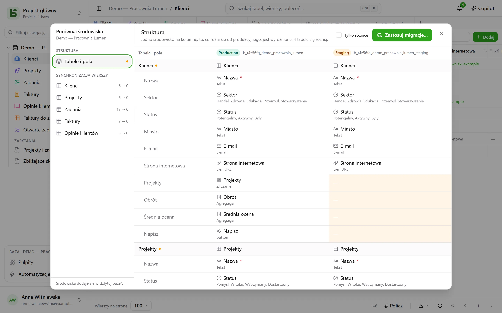

Baza może mieć **środowiska**: produkcyjne, testowe, deweloperskie… Każde jest pełnoprawną
bazą – z własnym schematem, tabelami, wierszami i uprawnieniami – a wszystkie dzielą
**rodowód** bazy, jej tabel i pól.

## W interfejsie

Pasek boczny pokazuje **jeden wiersz na bazę**, z plakietką, która wskazuje otwarte
środowisko i pozwala je zmienić. Plakietka nie pojawia się, dopóki istnieje tylko środowisko
produkcyjne.

Środowiska dodaje się, zmienia im nazwy i usuwa w **Edytuj bazę…**: nowe środowisko powstaje
z **kopii struktury** innego, bez jego wierszy.

## Porównywanie środowisk

Z menu bazy, w **Więcej działań**, **Porównaj środowiska…** otwiera okno dialogowe:

- **Struktura**: środowiska w kolumnach, tabele i pola w wierszach; to, co różni się od
  środowiska produkcyjnego, jest wyróżnione.
- **Zastosuj migracje…** przygotowuje plan przejścia z jednego środowiska do drugiego, krok
  po kroku. Nigdy nie zaznacza automatycznie tego, co cofnęłoby nowszą zmianę w środowisku
  docelowym.
- **Synchronizacja wierszy**: tabela po tabeli, przenoszenie wierszy z jednego środowiska do
  drugiego według identyfikatora.

## Skąd basedb wie, kto co zmienił

Porównanie opiera się na **historii struktur**: każde utworzenie, zmiana lub usunięcie tabeli
czy pola jest rejestrowane przez wyzwalacz w katalogu i widoczne w zakładce „Struktura”
historii. Identyfikatory rodowodu łączą pole ze środowiska testowego z jego odpowiednikiem w
środowisku produkcyjnym, nawet po zmianie nazwy.

## W SQL

Każde środowisko jest schematem: `b_t4z56fq_ventes` dla środowiska produkcyjnego,
`b_t4z56fq_ventes_recette` dla testowego. Twoje zapytania zmieniają środowisko przez zmianę
schematu – lub `search_path`.
