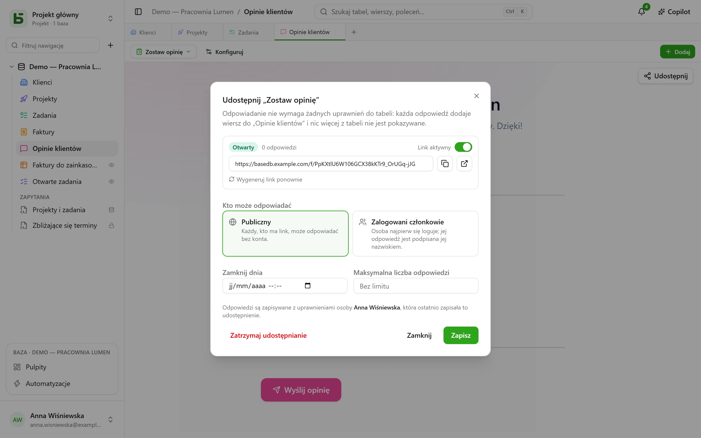
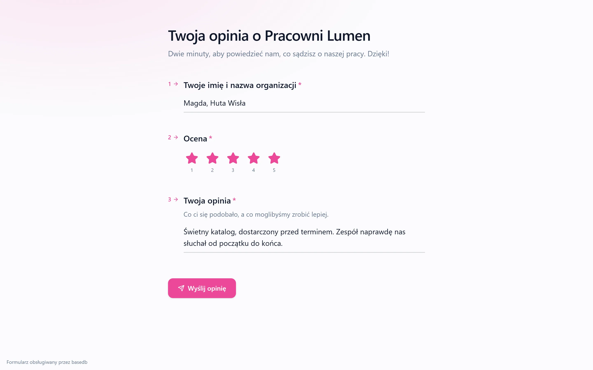

Formularz, ankietę lub quiz **udostępnia się przez link** `/f/<jeton>`. Osoba odpowiadająca nie
potrzebuje **żadnych uprawnień do tabeli**: każda odpowiedź dodaje wiersz i nic więcej z tabeli
nie jest jej pokazywane. Aby pokazywać wiersze zamiast je przyjmować, widok można udostępnić
[tylko do odczytu](/basedb/pl/fonctionnalites/vues-partagees/).

## Kto może odpowiadać

| Dostęp | Kto odpowiada | Co się wyświetla |
|---|---|---|
| **Publiczny** | każdy, kto ma link, bez konta | sam formularz |
| **Zalogowani członkowie** | członek przestrzeni roboczej – w razie potrzeby tylko z określonych grup | logowanie, a potem formularz i „Odpowiadasz jako …” |

Strona linku jest poza aplikacją: bez paska bocznego, nazwy bazy i innych wierszy. Ma wygląd
formularza — jego motyw, kolor, czcionkę —, i zadaje tylko te pytania, których wymagają
wcześniejsze odpowiedzi.

## W czyim imieniu zapisywana jest odpowiedź

Wiersz jest zapisywany z **upoważnienia osoby, która opublikowała udostępnienie** – ostatniej,
która je zapisała. Jej prawo do tworzenia wierszy jest sprawdzane **przy każdej odpowiedzi**,
w zakresie pytań formularza: jeśli je straci, formularz jest zawieszany, dopóki ktoś, kto to
prawo ma, nie zapisze go ponownie.

Historia pokazuje, kto odpowiedział, a nie kto opublikował:

- odpowiedź **członka** jest przypisywana tej osobie;
- odpowiedź **publiczna** jest przypisywana samemu formularzowi: „Formularz «Demande de
  devis» · odpowiedź publiczna · opublikował(a) Camille”.

## Otwieranie i zamykanie

Okno dialogowe ustawia:

- przełącznik **Link aktywny**;
- **datę zamknięcia**;
- **maksymalną liczbę odpowiedzi** – dokładną, nawet przy równoczesnych odpowiedziach;
- **Wygeneruj link ponownie**: stary natychmiast przestaje działać;
- **Zakończ udostępnianie**: link znika, odpowiedzi zostają w tabeli.

Zamknięty formularz informuje o tym jednym zdaniem, zanim jeszcze poprosi o zalogowanie.

## Udostępniony quiz

Strona quizu nie otrzymuje **żadnej poprawnej odpowiedzi**: tylko to, ile warte jest każde
pytanie. To serwer poprawia.

- Poprawiany **po każdym pytaniu**, strona wysyła mu każdą ocenianą odpowiedź w chwili, gdy
  zostaje udzielona, i dowiaduje się wtedy, czy jest poprawna — i która odpowiedź była poprawna.
- Przy wysyłce serwer liczy wynik **na podstawie otrzymanych odpowiedzi** i zapisuje go w polu
  wybranym dla niego, jeśli takie istnieje i osoba, która opublikowała udostępnienie, może je
  zapisywać. Strona wyświetla wynik, który on zwraca, oraz poprawne odpowiedzi, chyba że quiz
  mówi „nigdy”.

Wynik odczytuje się więc z tabeli tak, jak policzył go serwer, a nie tak, jak ogłosiłaby go
strona.

## Ograniczenia

- Pytania typu **relacja**, **plik** i **obraz** nie są zadawane przez udostępniony link; okno
  dialogowe je sygnalizuje.
- Wysyłanie jest ograniczone do 20 odpowiedzi na minutę, na adres i na link. Za dostarczonym
  proxy (Caddy) adres jest adresem odwiedzającego.

Szczegóły znajdziesz w [rozdziale 15](https://github.com/eodia/basedb/blob/main/docs/architecture/15-formulaires-partages.md)
dokumentu architektury.
