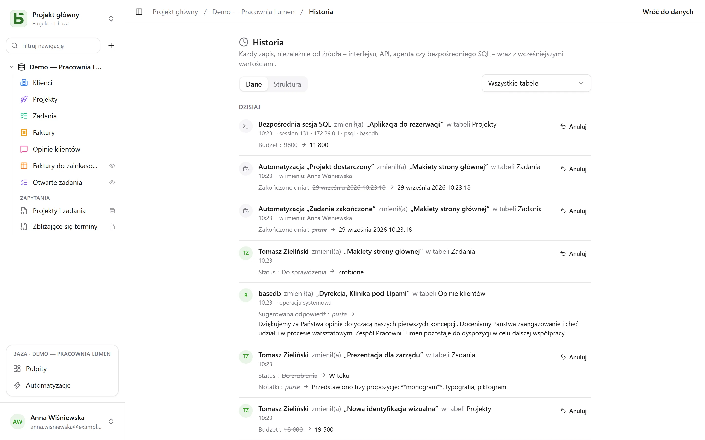

basedb zapisuje w historii **każdy zapis**, skądkolwiek pochodzi: z interfejsu, API, agenta
MCP, publicznego formularza – a nawet z zapytania SQL napisanego ręcznie w `psql`.

## Jak to jest rejestrowane

Nie przez aplikację, lecz przez **wyzwalacze PostgreSQL**, w tej samej transakcji co zapis.
Zapis, który się nie powiedzie, nie zostawia śladu; zapis, który się powiedzie, nie może go
pominąć. Rewizje trafiają następnie do niezmiennych dzienników, partycjonowanych według
miesięcy.

Tożsamość jest przekazywana przez zmienne sesji ustawiane na początku każdej transakcji. Zapis,
który ich nie niesie – bezpośredni SQL – jest rejestrowany jako taki, wraz z sesją, która go
wykonała (`psql`, adres, proces): nigdy nie jest z tego powodu odrzucany.

| Wykonawca | Wyświetlany jako |
|---|---|
| osoba | jej imię i nazwisko |
| program (API) lub agent (MCP) | osoba, która utworzyła token, „przez token …” |
| publiczny formularz | „Formularz «…» · odpowiedź publiczna” |
| automatyzacja | „Automatyzacja «…» · w imieniu” osoby, która za nią odpowiada |
| bezpośredni SQL | „Bezpośrednia sesja SQL” |

## Co można z nią zrobić

- **Czytać** historię wiersza (zakładka „Historia” w jego szczegółach), tabeli lub bazy
  (**Historia**, w menu **⋯** bazy), z filtrem według tabeli.
- **Cofnąć** zmianę: wcześniejsze wartości są przywracane pole po polu.
- **Przywrócić** usunięty wiersz z jego wpisu „usunięto”.
- Śledzić **historię struktur** (zakładka „Struktura”): utworzone, zmienione i usunięte tabele
  i pola.

## Cofanie (Ctrl+Z)

W siatce **Ctrl+Z** (⌘Z na Macu) cofa twój ostatni zapis; **Ctrl+Shift+Z** lub **Ctrl+Y**
przywraca go. Komunikat potwierdza, co zostało cofnięte – „Cofnięto: zmiana pola
«Montant»” – z przyciskiem, który anuluje cofnięcie.

W ten sposób cofa się zmianę komórki, przesunięcie karty lub paska, utworzenie lub usunięcie
wiersza, wklejenie – a także cały import, liczony jako jedna czynność. Do pięćdziesięciu
czynności, osobno dla każdej karty przeglądarki.

Nie jest to cofnięcie stanu ekranu: to **nowy zapis**, wykonany przez serwer na podstawie
historii i również zapisany w historii. Jest odrzucany, jeśli ktoś w międzyczasie zmienił
wiersz – „Nie można cofnąć: pole «Statut» zostało od tego czasu zmienione” – zamiast
nadpisywać jego pracę. W ten sposób cofa się tylko własne zapisy, z ostatnich dwudziestu
czterech godzin, i nigdy strukturę. W komórce w trakcie edycji Ctrl+Z działa jak zwykłe
cofanie w tekście.

## Uprawnienia

Historia podlega uprawnieniom do odczytu: pole ukryte przed tobą nie pojawia się w rewizjach,
które czytasz.
