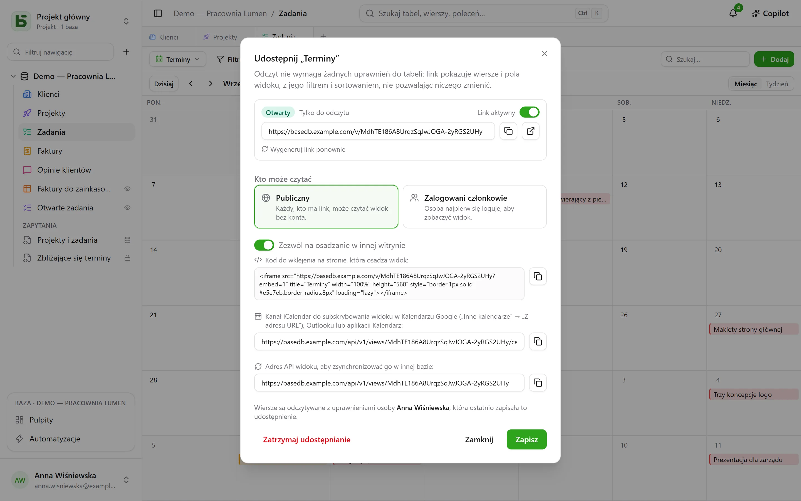
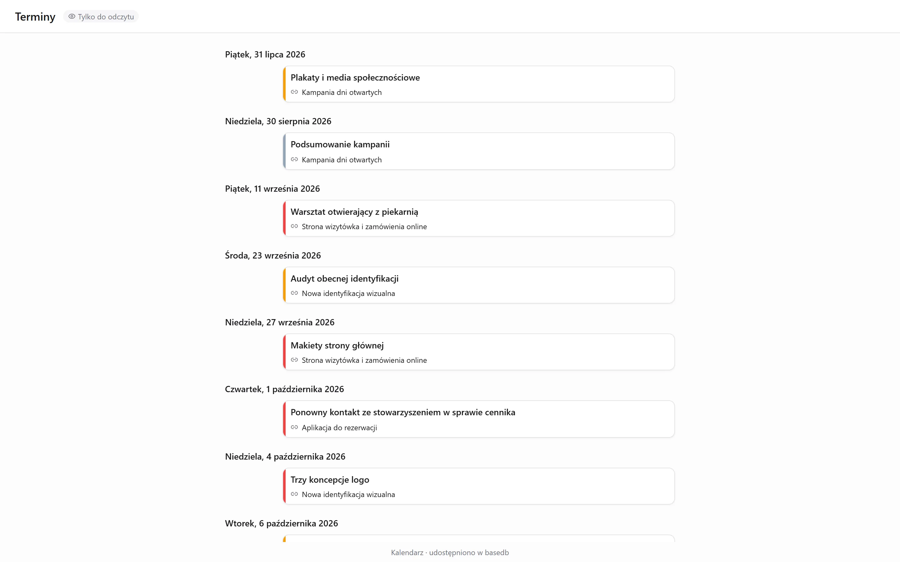

Widok danych – siatkę, kanban, kalendarz, oś czasu, galerię, listę – można **udostępnić tylko
do odczytu**: link `/v/<jeton>` pokazuje go osobom, które nie mogą otworzyć basedb, nie
pozwalając niczego zapisać. To odpowiednik [formularzy udostępnionych](/basedb/pl/fonctionnalites/formulaires-partages/),
które pozwalają odpowiadać, nie pozwalając niczego czytać.
[Pulpit](/basedb/pl/fonctionnalites/tableaux-de-bord/#udostępnianie-pulpitu) udostępnia się w
ten sam sposób.

## Udostępnianie

Menu widoku → **Udostępnij…**, a potem:

| Dostęp | Kto czyta |
|---|---|
| **Publiczny** | każdy, kto ma link, bez konta |
| **Zalogowani członkowie** | członek przestrzeni roboczej, po zalogowaniu – w razie potrzeby tylko z określonych grup |

Przełącznik **Link aktywny** zawiesza link bez jego utraty. Strona otwiera się poza
aplikacją: bez paska bocznego, nazwy bazy i nazwy tabeli – widok, jego filtry, jego kolumny i
nic więcej. Kalendarz lub oś czasu czyta się tam jak terminarz.

## W czyim imieniu następuje odczyt

Widok czyta się z **uprawnieniami osoby, która go opublikowała**, ustalanymi na nowo przy
każdym odczycie: pole ukryte przed nią się nie wyświetla, a jeśli straci ona dostęp do tabeli,
link przestaje cokolwiek pokazywać.

## Osadzanie w innej witrynie

Zaznacz **Zezwól na osadzanie w innej witrynie**: okno dialogowe poda **kod osadzenia**
`<iframe>` do wklejenia w intranecie, wiki czy witrynie firmowej. Bez tego pola wyboru strona
odmawia wyświetlenia w ramce innej witryny.

## Subskrypcja w aplikacji kalendarza

Dla kalendarza lub osi czasu udostępnionych **publicznie** okno dialogowe podaje **adres
kanału kalendarza**: kanał iCalendar (`…/calendar.ics`, najwyżej 1000 wydarzeń), który można
subskrybować w Kalendarzu Google, Outlooku czy Apple Calendar. Terminy zespołu pojawiają się w
kalendarzu każdej osoby i podążają za tabelą.

## Źródło dla innych baz

Publiczny link podaje też **adres API widoku**: wiersze, które widok pokazuje, w formacie JSON.
[Tabela synchronizowana](/basedb/pl/integrations/synchronisation/) – w tej lub innej
instancji – może go użyć jako źródła.

## Ograniczenia

- Odczyt jest ograniczony do 120 żądań na minutę, na adres i na link.
- Formularza nie udostępnia się do odczytu: udostępnia się go [do zbierania odpowiedzi](/basedb/pl/fonctionnalites/formulaires-partages/).
