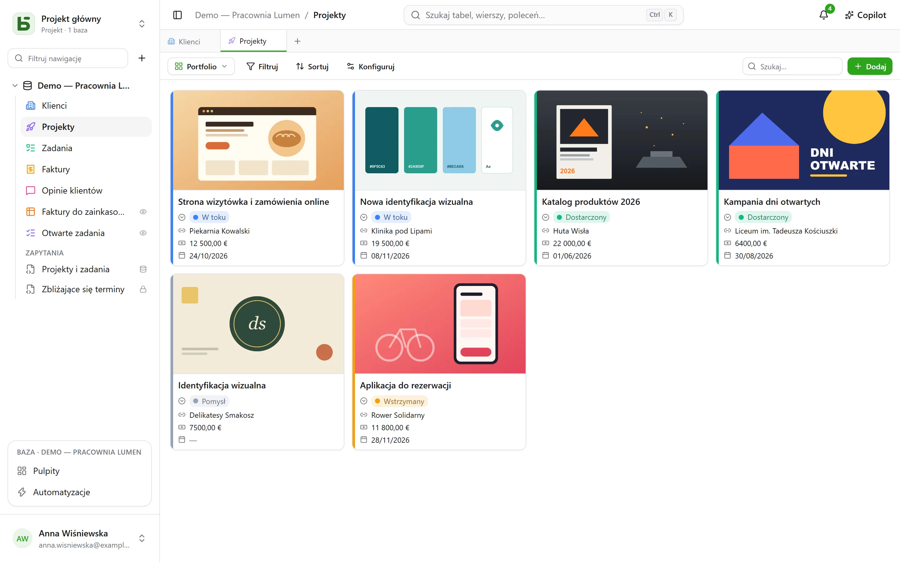
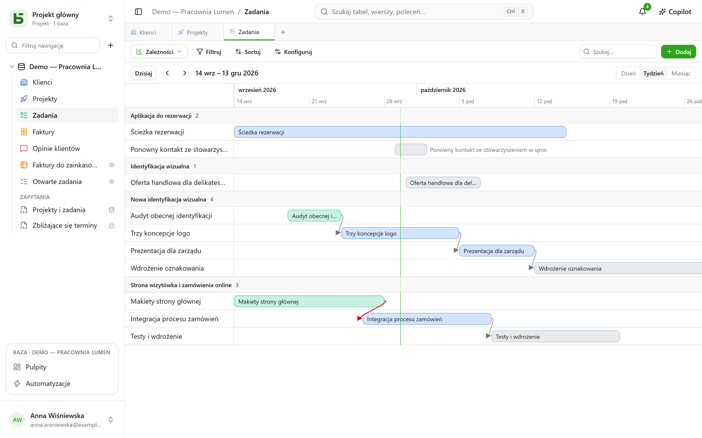
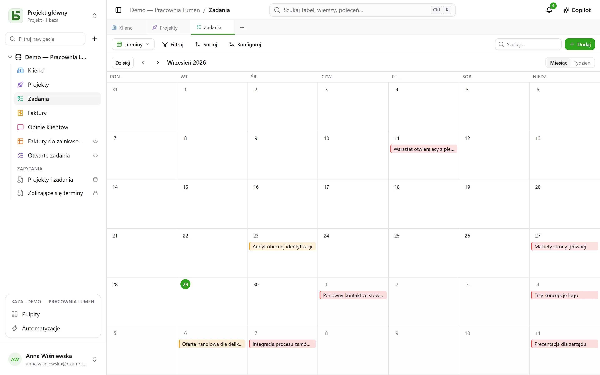
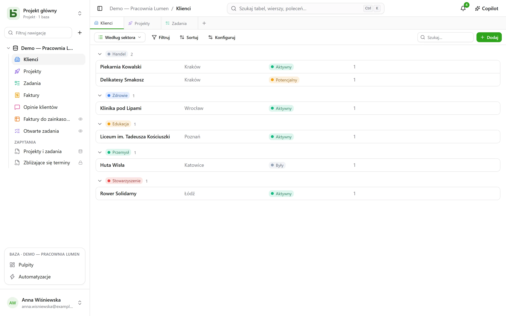

Tabelę można pokazać na **dziesięć sposobów**. Widok nie kopiuje żadnych danych i nie daje
żadnych uprawnień ponad te, które daje sama tabela.

:::note
Te widoki to sposoby pokazania **jednej** tabeli. [Widok SQL](/basedb/pl/fonctionnalites/requetes-et-vues-sql/)
to coś innego: prawdziwy widok PostgreSQL, napisany w SQL na tabelach bazy i ułożony wśród
nich na pasku bocznym.
:::

| Widok | Co pokazuje | Czego wymaga |
|---|---|---|
| **Siatka** | wiersze, filtrowane, sortowane, grupowane, z wybranymi kolumnami | – |
| **Kanban** | karty w kolumnach | pojedynczego wyboru |
| **Kalendarz** | wiersze w ich dacie, w widoku miesiąca lub tygodnia | pola daty |
| **Oś czasu** | paski między dwiema datami i ich zależności | daty początkowej |
| **Galeria** | karty z obrazem okładki | – |
| **Lista** | jeden wiersz na rekord, w zwijanych grupach | – |
| **Mapa** | każdy wiersz umieszczony na mapie | adresu albo szerokości i długości geograficznej |
| **Formularz** | stronę pytań do utworzenia wiersza | – |
| **Ankieta** | te same pytania, po jednym na ekran | – |
| **Quiz** | pytania punktowane, po jednym na ekran, i wynik na końcu | – |

## Selektor widoków

Znajduje się na lewo od „Filtruj”. „Wszystkie wiersze” to siatka tabeli, której nikt nie
zapisał i nikt nie może usunąć; dalej są **widoki wspólne**, w kolejności wybranej przez osobę
budującą bazę, a potem **Moje widoki**. Na dole **Utwórz widok** dzieli dziesięć rodzajów na
dwie rodziny: te, które **pokazują wiersze**, i te, które **zbierają odpowiedzi** (formularz,
ankieta, quiz).

- **Widok wspólny** widzą wszyscy. Jego utworzenie, konfiguracja, zmiana nazwy, kolejności
  czy usunięcie wymaga poziomu **Zarządzanie**. Może być **zablokowany**: informuje o tym
  kłódka i nikt go nie zmieni bez wcześniejszego odblokowania.
- **Widok osobisty** widzisz tylko ty i wymaga on jedynie możliwości odczytu tabeli.
  **Utwórz widok osobisty** albo **Zapisz jako widok** po przefiltrowaniu i posortowaniu:
  każdy przechowuje własne sposoby czytania, nie zmieniając niczego innym. **Duplikuj** robi
  z widoku wspólnego kopię osobistą.

## Pasek narzędzi

Nad siatką, w tej kolejności:

- **Filtruj** łączy warunki dla poszczególnych pól;
- **Kolumny** wybiera, co się wyświetla – kolumny systemowe są osobno, w grupie
  „Informacje systemowe”;
- **Grupuj** układa wiersze według pola o pojedynczej wartości – pojedynczego wyboru,
  relacji, osoby, daty, liczby, tekstu, pola wyboru… – w zwijane grupy, każda z licznikiem dla
  całego filtra;
- **Kolory** koloruje wiersze według pojedynczego wyboru albo według **reguł** – filtr i kolor,
  najwyżej dwadzieścia – jako pasek, tło lub oba;
- **Wysokość wierszy**: niska, średnia, wysoka, bardzo wysoka;
- **Szukaj…**, po prawej, przeszukuje wszystkie kolumny w trakcie pisania; Esc czyści
  wyszukiwanie. Działa też w kanbanie, kalendarzu, osi czasu, galerii i liście, i nigdy nie
  jest zapisywane w widoku.

Pod każdą kolumną **Podsumowanie** obliczane na wszystkich wierszach filtra, a nie tylko na
bieżącej stronie: wypełnione, puste, unikalne wartości, suma, średnia, minimum, maksimum,
zaznaczone pola.

## Kanban, kalendarz, oś czasu

- **Kanban** układa karty według pojedynczego wyboru; przeciągnięcie karty zmienia wiersz,
  a „+” na górze kolumny tworzy wiersz z już ustawionym tym wyborem. Każda karta pokazuje
  tytuł, obraz okładki, wybrane pola i **opis** przytaczający wartości wiersza – „Dostawa
  zaplanowana na `{{Date}}` dla `{{Client}}`” –, pisany w ustawieniach widoku za pomocą
  przycisku **Wstaw pole**.
- **Kalendarz** umieszcza każdy wiersz w jego dacie, z ewentualną datą końcową; przeciągnięcie
  wiersza z jednego dnia na inny przesuwa go.
- **Oś czasu** rysuje paski między datą początkową a końcową, pogrupowane według pojedynczego
  wyboru lub relacji. Z ustawieniem **Zależy od** – relacją tabeli do samej siebie – strzałka
  łączy każde zadanie z tymi, od których zależy, czerwona, gdy cofa się w czasie.

## Galeria i lista

- **Galeria** pokazuje karty: **obraz okładki** (przycięty lub w całości), rozmiar (małe,
  średnie, duże karty), kolor według pojedynczego wyboru.
- **Lista** pokazuje jeden wiersz na rekord, **pogrupowany** według pojedynczego wyboru,
  relacji lub osoby.

W kanbanie, galerii i liście karty i wiersze **układa się ręcznie**, przeciągając je – do
5000; wybrane sortowanie ma pierwszeństwo przed tą kolejnością.

## Mapa

**Mapa** umieszcza każdy wiersz w jego miejscu, na podstawie:

- **adresu** — krótkiego tekstu, najlepiej w formacie **Adres** (zobacz
  [Tabele i pola](/basedb/pl/fonctionnalites/tables-et-champs/)): „12 rue des Lilas, Lyon”;
- albo **szerokości** i **długości geograficznej**, dwóch pól liczbowych, umieszczanych bez zmian.

Pinezka przyjmuje **kolor** pojedynczego wyboru, pokazuje **tytuł** wiersza po najechaniu i
otwiera jego szczegóły po kliknięciu. Mapa stosuje filtr i sortowanie widoku, do 2000 wierszy.

Adres jest **lokalizowany raz na zawsze** przez usługę geokodowania instancji — domyślnie
usługę OpenStreetMap —, w tempie, jakie ona wyznacza: na nowej mapie pinezki pojawiają się
wraz z odpowiedziami, około jednej na sekundę, a przy kolejnych razach natychmiast. Plakietka
liczy umieszczone wiersze, adresy jeszcze do zlokalizowania i te, których nie udało się
zlokalizować: nieznaleziony adres trzeba sprecyzować (miasto, kod pocztowy), nigdy nie jest
odrzucany bez informacji.

:::note[Co opuszcza twój serwer]
Tekst adresów trafia do usługi geokodowania, a przeglądarka każdego czytającego wczytuje
podłoże mapy z serwera kafelków. Administrator instancji może wybrać inne usługi albo nie
chcieć żadnej: zobacz
[Zmienne środowiskowe](/basedb/pl/hebergement/variables/#mapy-i-adresy).
:::

## Formularz i ankieta

Zaznacza się pytania i ustala ich kolejność; każde ma treść, podpowiedź, przykładową
odpowiedź, i może być wymagane. Formularz ma swój tytuł, wprowadzenie, etykietę przycisku i
komunikat z podziękowaniem. Wypełnia się go w basedb albo
[udostępnia przez link](/basedb/pl/fonctionnalites/formulaires-partages/).

Na początek nie trzeba niczego ustawiać: nowy formularz pyta o to, co odpowiada dana osoba —
nie o status, osobę przypisaną ani relacje, które zespół uzupełnia później, chyba że są
wymagane —, nosi kolor swojej tabeli i jasny motyw, a każde puste pole pokazuje dopasowany
przykład. Wszystko inne zmienia się, kiedy się chce:

- **Wygląd**: osiem motywów — Jasny, Łagodny, Świt, Ocean, Las, Noc, Papier, Minimalistyczny —,
  kolor akcentu, czcionka, wyrównanie do lewej lub wyśrodkowane;
- **Wypełnij wstępnie dzisiejszą datą**: pytanie o datę jest od razu wypełnione dzisiejszym
  dniem — przy dacie z godziną także godziną — a osoba zostawia je lub zmienia;
- **Zadaj tylko, jeśli…**: pytanie pojawia się tylko wtedy, gdy wymaga tego wcześniejsza
  odpowiedź („Sentyment to Negatywny”, „Ocena wynosi najwyżej 2”). Ukryte pytanie nie jest
  ani wymagane, ani wysyłane;
- **Więcej opcji**: przyciski powitania i wysyłki, numerację, pasek postępu, automatyczne
  przechodzenie dalej, wiadomość i przycisk końcowy („Powrót do strony”), konfetti.

**Ankieta** zajmuje cały ekran: powitanie, które mówi, ile to zajmie czasu, a potem jedno
pytanie naraz, które pojawia się z przesunięciem. Wszystko działa też z klawiatury: **Enter**,
aby przejść dalej, litery **A**, **B**, **C**… dla wyboru, **T** lub **N** dla tak lub nie,
cyfry dla oceny — pojedynczy wybór sam przechodzi do następnego pytania. Wysłanie się
świętuje: rysujący się znacznik i konfetti w kolorach formularza.

## Quiz

Quiz to ankieta, która liczy punkty. Pod każdym pytaniem podaje się jego **poprawną
odpowiedź** i to, ile ona daje — **1 punkt**, jeśli nic się nie poda, aż do 100:

| Pytanie | Poprawna odpowiedź |
|---|---|
| lista wyboru | jeden wybór |
| wybór wielokrotny | wybory, które trzeba zaznaczyć, wszystkie i tylko one |
| pole wyboru | tak lub nie |
| liczba, ocena | liczba |
| data | dzień |
| tekst krótki, e-mail, URL | jedna lub kilka akceptowanych odpowiedzi, oddzielonych `;` — bez rozróżniania wielkości liter i znaków diakrytycznych |

Pytanie bez poprawnej odpowiedzi — imię, komentarz — jest zadawane, ale nie jest oceniane. Aby
utworzyć quiz, potrzebne jest co najmniej jedno oceniane pytanie.

Sekcja **Punktacja** ustala resztę:

- **Poprawianie**: **po każdym pytaniu** — odpowiedź sprawdza się od razu, na zielono, albo na
  czerwono z poprawną odpowiedzią, a wynik rośnie u góry ekranu —, **na końcu** — najpierw wynik,
  potem poprawne odpowiedzi —, albo **nigdy** — sam wynik, poprawne odpowiedzi pozostają tajne;
- **Próg zaliczenia**: procent punktów; ekran końcowy mówi wtedy „Zaliczone!” albo „Nie tym
  razem…”;
- **Zapisuj wynik w**: polu liczbowym tabeli, które otrzymuje wynik każdej odpowiedzi. Posortuj
  siatkę według niego: oto ranking. Pole nazwane „Score”, „Points” albo „Note” jest wybierane
  domyślnie.

Ekran końcowy pokazuje wynik w wypełniającym się pierścieniu, procent, a potem, poza trybem
„nigdy”, każde oceniane pytanie z udzieloną odpowiedzią i poprawną. Pytanie ukryte przez
wcześniejszą odpowiedź nie liczy się do sumy.

:::note
W aplikacji każdy, kto może czytać widok, może przeczytać jego poprawne odpowiedzi. Przez
[udostępniony link](/basedb/pl/fonctionnalites/formulaires-partages/#udostępniony-quiz), nigdy
nie opuszczają one serwera: to on poprawia i liczy.
:::

## Udostępnianie widoku

Widok danych – siatkę, kanban, kalendarz, oś czasu, galerię, listę – można **udostępnić
tylko do odczytu** przez link, osadzić w innej witrynie, a kalendarz staje się kanałem
kalendarza do subskrypcji. Zobacz [Widoki udostępnione](/basedb/pl/fonctionnalites/vues-partagees/).

## Czego czytający nie widzi

Widok jest **przeliczany dla swojego czytającego**: pole ukryte przed nim znika z kolumn, kart
i pytań. Widok, którego filtr przytacza ukryte pole, w ogóle nie jest pokazywany: pokazany bez
filtra ujawniłby więcej, niż miał pokazywać.
