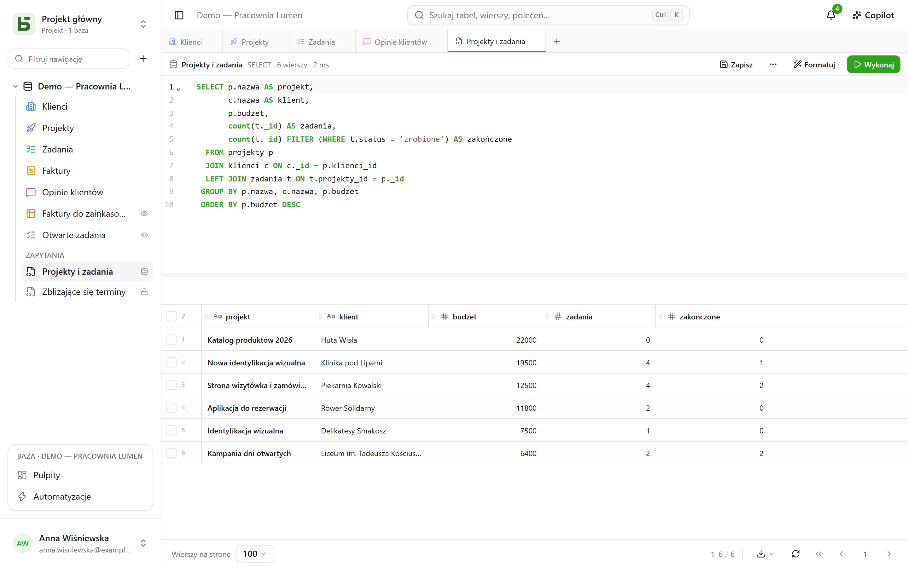

To jest racja bytu basedb: **twoje tabele są prawdziwymi tabelami**. Każdy klient PostgreSQL
czyta je pod ich nazwami.

## Nazwy

| Obiekt | Nazwa fizyczna | Przykład |
|---|---|---|
| Baza | schemat `b_<tenant>_<nom>` | `b_t4z56fq_ventes` |
| Środowisko testowe | schemat z przyrostkiem | `b_t4z56fq_ventes_recette` |
| Tabela | jej nazwa po slugifikacji | `opportunites` |
| Pole | jego nazwa po slugifikacji | `echeance` |
| Relacja | `<table cible>_id` | `clients_id` |
| [Widok SQL](/basedb/pl/fonctionnalites/requetes-et-vues-sql/) | jego nazwa techniczna, w schemacie bazy | `factures_a_encaisser` |

Strona **Dokumentacja API i MCP** każdej bazy podaje je wszystkie, a `\d` w `psql` pokazuje
opisy (`COMMENT ON`).

## W interfejsie

**+** na pasku zakładek albo menu **⋯** bazy → **Zapytanie SQL**: edytor z kolorowaniem
składni i podpowiadaniem, którego wynik wyświetla się w tej samej siatce co twoje tabele.



- **Każdy czyta tam ze swoimi uprawnieniami**: poziom Zarządzanie ma całą bazę, łącznie z
  zapisami; pozostali członkowie piszą SQL tylko do odczytu, w którym zamknięta tabela nie
  istnieje, a ukryte pole znika.
- Zapytanie **zapisuje się** pod tabelami – dla siebie, dla całej bazy lub dla grup – i staje
  się, jeśli chcesz, **widokiem SQL**: prawdziwym widokiem PostgreSQL, ułożonym wśród tabel i
  czytelnym z poziomu `psql`.

Wszystko jest szczegółowo opisane w [Zapytania i widoki SQL](/basedb/pl/fonctionnalites/requetes-et-vues-sql/).

## Z psql

Z dostarczonym `docker-compose.yml` PostgreSQL jest opublikowany na `127.0.0.1:5432`:

```bash
psql "postgres://basedb:<POSTGRES_PASSWORD>@localhost:5432/basedb"
```

```sql
SET search_path = b_t4z56fq_ventes;

SELECT o.nom, o.montant, c.nom AS client
FROM opportunites o
JOIN clients c ON c._id = o.clients_id
WHERE o.statut = 'gagne';
```

To konto jest właścicielem bazy: czyta wszystko, a uprawnienia basedb go nie obejmują. Dla
narzędzia BI stwórz raczej odrębną rolę z własnymi `GRANT`. Jeśli tabela ma
[regułę wierszy](/basedb/pl/fonctionnalites/droits/#aż-do-wiersza), PostgreSQL włącza na niej
bezpieczeństwo na poziomie wiersza: taka rola nie widzi w niej żadnego wiersza bez atrybutu
`BYPASSRLS` albo własnej polityki.

## Zapis w SQL

Jest dozwolony. Ograniczeń (pojedynczy wybór, relacje, URL, wymagane) pilnuje PostgreSQL, który
odrzuca nieprawidłową wartość, tak jak w interfejsie. A zapis **trafia do historii**: historia
wyświetla go jako „Bezpośrednia sesja SQL”, wraz z sesją, która go wykonała, i można go cofnąć
jak każdy inny.

:::caution
Zmiana **struktury** w SQL (`ALTER TABLE`) omija katalog basedb, który by o niej nie wiedział.
Korzystaj z interfejsu, API lub propozycji agenta: silnik migracji planuje, blokuje na krótko i
utrzymuje katalog w zgodności.
:::
