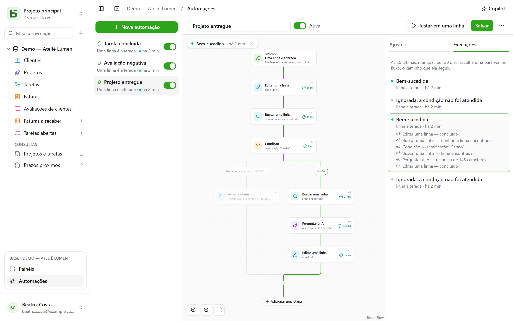

Uma automação diz **quando**, **se** e **então**: quando uma tarefa passa para “Fait”, registrar
a hora; quando chega uma avaliação negativa, notificar a responsável e escrever no Slack; toda
segunda-feira às 9h, criar a linha da reunião de equipe. E quando uma ação não basta, ela segue um
**fluxo**: buscar uma linha, seguir uma ramificação ou outra conforme o que ela diz, reutilizar
em uma etapa o que uma etapa anterior encontrou ou escreveu.

Elas são abertas em **Automações**, no bloco da base aberta, na parte de baixo da barra
lateral, e exigem o nível **Gerenciamento**.



## O fluxo

O fluxo é desenhado de cima para baixo: o gatilho e depois cada etapa. Um **+** sobre uma linha
adiciona uma etapa naquele ponto; um cartão abre suas configurações à direita. Uma automação
simples — um gatilho e uma ação — cabe em dois cartões e se configura como antes.

## Quando

| Gatilho | Configurações |
|---|---|
| **Uma linha é criada** | a tabela |
| **Uma linha é alterada** | a tabela e, se necessário, apenas os campos a monitorar |
| **Em horário fixo** | a cada hora, todo dia ou toda semana, no horário e no fuso escolhidos |
| **Um botão é clicado** | um [campo Botão](/basedb/pt-br/fonctionnalites/tables-et-champs/#botão) da tabela |

Um gatilho sobre as linhas vê **todas** as escritas: a interface, a API, um agente, um
formulário compartilhado e até o SQL direto — as automações partem do histórico, que
captura todas elas.

## Somente se

Uma condição opcional, na [linguagem dos filtros](/basedb/pt-br/integrations/api-rest/#ler) —
`statut eq "fait"`, `montant gte 10000 and payee eq false` — avaliada sobre a linha **no momento
de agir**. Uma execução cuja condição não é atendida é “descartada”, e informa isso.

## Então

Até trinta etapas, em ordem; a primeira que falha interrompe as seguintes.

| Etapa | O que ela faz |
|---|---|
| **Editar uma linha** | escreve valores na linha que disparou — ou naquela que uma etapa encontrou ou criou |
| **Criar uma linha** | nesta tabela ou em outra da base |
| **Buscar uma linha** | a primeira linha de uma tabela que atende a um filtro, para que as etapas seguintes a citem ou a alterem |
| **Notificar alguém** | uma [notificação](/basedb/pt-br/fonctionnalites/collaboration/#notificações) para pessoas escolhidas, ou para a de um campo Pessoa |
| **Enviar um e-mail** | para pessoas da equipe, para a de um campo Pessoa, para o endereço de um campo E-mail — um cliente, um fornecedor — ou para endereços escritos; o assunto e o texto citam a linha e as etapas anteriores |
| **Chamar um webhook** | um `POST` em HTTPS para o endereço que você escolher; a resposta pode ser citada depois |
| **Enviar para o Slack** | uma mensagem em um canal [conectado](/basedb/pt-br/integrations/synchronisation/#slack) |
| **Perguntar à IA** | uma resposta do [provedor de IA](/basedb/pt-br/fonctionnalites/ia/) a uma instrução que cita a linha e as etapas anteriores — redigir, resumir, classificar —, lida como um texto, um número, sim ou não, uma data ou uma opção de uma lista |
| **Condição** | várias ramificações: a primeira cuja condição é atendida é seguida, “Senão” quando nenhuma é; as ramificações se juntam depois |

Uma busca que não encontra nada não interrompe o fluxo: as etapas que deveriam alterar a linha
dela são puladas. Para fazer outra coisa nesse caso, uma condição testa isso — uma ramificação
cujo filtro está vazio é seguida assim que a busca encontra algo.

## Perguntar à IA

Como um [campo de IA](/basedb/pt-br/fonctionnalites/ia/#a-opção-de-ia-de-um-campo), a etapa envia ao
provedor a sua instrução, em que cada citação é substituída pelo seu valor:

```text
Esta avaliação de {{auteur}} exige alguma ação da nossa parte? {{avis}}
```

Você escolhe a **resposta esperada** — um texto livre ou curto, um número, sim ou não, uma data,
um endereço web ou uma opção de uma lista, que pode ser reaproveitada de um campo de seleção. O modelo
é avisado disso, e uma resposta que não contenha nada disso faz a etapa falhar. As etapas seguintes
a citam por `{{e1.reponse}}`: no título de uma tarefa criada, em uma mensagem ou em um campo de seleção,
em que ela é colocada na opção de mesmo rótulo.

O que a instrução cita vai para o provedor: a etapa pede o seu **consentimento**, que deve ser dado de novo
quando a instrução muda. Cada chamada é registrada em log e conta, junto com os campos de IA, em
`BASEDB_AI_FIELD_QUOTA` (300 por hora por padrão). A IA não faz nada por conta própria: são as
etapas colocadas depois dela que escrevem ou notificam.

## Citar

Os valores, as mensagens e os filtros citam o que vem antes, pelo botão **{ }** ao lado
de cada texto:

- `{{Titre}}`, `{{_id}}`: a linha que disparou;
- `{{e2.titre}}`, `{{e2._id}}`: a linha encontrada, criada ou alterada pela etapa `e2` — cada
  etapa mostra seu identificador no cartão;
- `{{e3.statut}}`, `{{e3.reponse.numero}}`: o que o webhook `e3` respondeu;
- `{{e4.reponse}}`: a resposta da etapa de IA `e4`;
- `{{_maintenant}}`: o instante da execução.

Um valor formado por uma única citação passa o próprio valor: uma relação, uma pessoa, uma
opção — é assim que uma linha criada se liga àquela que uma busca encontrou. Em um
filtro, uma citação é sempre um valor comparado, nunca linguagem de filtro.

Uma etapa só pode citar o que com certeza aconteceu antes dela: o que uma ramificação encontrou
não pode mais ser citado depois da condição. O editor sinaliza isso no cartão antes de salvar.

## O Copilot

**Copilot**, no cabeçalho, abre à direita uma conversa em linguagem natural sobre as
automações da base: “quando uma tarefa passar para revisão, avise a pessoa
responsável”, “adicione um resumo feito pela IA nas notas”, “por que a última execução
falhou?”. Ele responde e **propõe** uma automação inteira — a que está na tela,
alterada, ou uma nova —, com a lista do que muda.

Nada é salvo pelo Copilot: **Aplicar ao fluxo** mostra a proposta no editor,
onde você a revisa antes de salvar — e **Cancelar**, no cartão, devolve o fluxo ao estado em que
estava. Uma nova automação abre no editor, pronta para ser criada. Cada proposta é
verificada como um salvamento seria; o que não se sustenta é descartado, e isso é informado.

Por padrão, **somente a estrutura** vai para o provedor de IA, junto com a conversa: as tabelas
e seus campos, as automações da base, a que está na tela tal como o editor a mostra, e
suas últimas execuções — seus status e seus códigos de erro, nunca um valor. As pessoas
e os canais do Slack são enviados sob marcadores (`p1`, `s1`), nunca pelo identificador. A caixa
**Permitir a leitura dos dados** permite que o Copilot, durante a conversa, leia linhas
(no máximo 50 por leitura), com cada leitura listada abaixo da resposta.

## Testar, acompanhar

**Testar em uma linha** executa a automação salva em uma linha escolhida, de
verdade. A aba **Execuções** guarda as 50 últimas, por 30 dias: pendente, em andamento, bem-sucedida,
descartada com o motivo, com falha e o código. Escolher uma a sobrepõe ao fluxo — a ramificação
seguida é destacada, cada etapa executada diz o que fez e em quanto tempo, o resto fica
esmaecido.

## Em nome de quem ela age

Uma automação age com as **permissões da pessoa que a salvou por último**,
reavaliadas a cada execução: se essa pessoa perder uma permissão, a etapa que precisava dela
falha em vez de ignorá-la, e uma busca só encontra o que essa pessoa pode ler.
O histórico a exibe como “Automação ‘Tâche terminée’ · em nome de …”, e suas escritas
podem ser desfeitas como as outras.

## Limites

- O que uma automação escreve não dispara nenhuma outra: o que precisa ser encadeado é escrito
  em um único fluxo.
- Uma busca retorna uma linha, a primeira; ainda não há “para cada linha”, nem
  espera (“três dias depois”).
- Sem script. Um e-mail parte em texto simples, um por destinatário — vinte no máximo por
  etapa —, pelo [servidor de envio](/basedb/pt-br/hebergement/variables/#e-mails) da instância;
  uma resposta chega à pessoa dona da automação.
- Uma condição testa uma linha: para seguir uma ramificação conforme a resposta da IA, escreva-a
  primeiro em um campo da linha.
- Um [modelo de base](/basedb/pt-br/fonctionnalites/modeles/) só leva as automações sem
  busca, condição nem etapa de IA.
- 100 execuções por hora e por automação; um horário agendado perdido só é recuperado
  uma vez.
- O intervalo entre a escrita e a ação é da ordem de um segundo.
