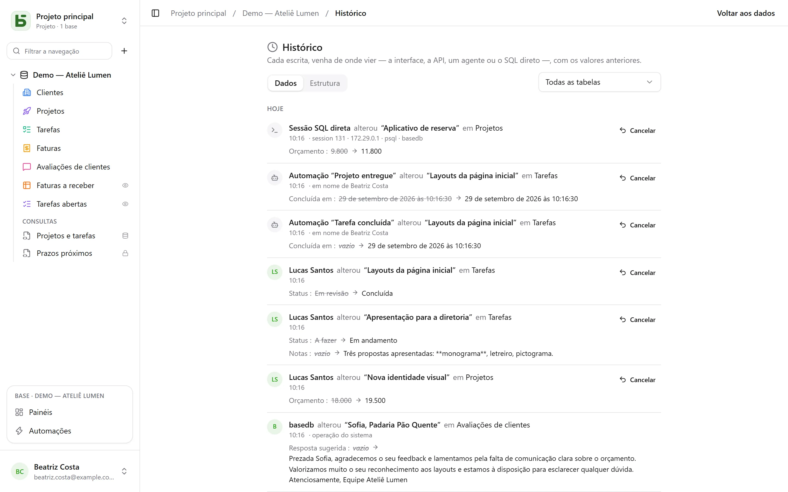

O basedb registra no histórico **cada escrita**, venha de onde vier: a interface, a API, um agente MCP,
um formulário público — e até uma consulta SQL escrita à mão no `psql`.

## Como é capturado

Não pelo aplicativo, mas por **triggers do PostgreSQL**, dentro da própria transação da
escrita. Uma escrita que falha não deixa nenhum rastro; uma escrita bem-sucedida não pode
deixar de ter o seu. As revisões são depois transferidas para logs imutáveis, particionados por
mês.

A identidade viaja por variáveis de sessão definidas no início de cada transação. Uma
escrita que não as traz — SQL direto — é registrada como tal, com a sessão que
a fez (`psql`, endereço, processo): nem por isso ela é recusada.

| Ator | Exibido como |
|---|---|
| uma pessoa | o nome dela |
| um programa (API) ou um agente (MCP) | a pessoa que criou o token, “pelo token …” |
| um formulário público | “Formulário ‘…’ · resposta pública” |
| uma automação | “Automação ‘…’ · em nome de” a pessoa responsável por ela |
| SQL direto | “Sessão SQL direta” |

## O que se pode fazer com ele

- **Ler** o histórico de uma linha (aba “Histórico” dos detalhes da linha), de uma tabela ou de uma
  base (**Histórico**, no menu **⋯** da base), filtrado por tabela.
- **Desfazer** uma alteração: os valores anteriores são reaplicados campo por campo.
- **Restaurar** uma linha excluída a partir da entrada “excluiu”.
- Acompanhar o **histórico de estruturas** (aba “Estrutura”): tabelas e campos criados,
  alterados, excluídos.

## Desfazer (Ctrl+Z)

Na grade, **Ctrl+Z** (⌘Z no Mac) desfaz a sua última escrita; **Ctrl+Shift+Z** ou
**Ctrl+Y** a refaz. Uma mensagem confirma o que foi desfeito — “Desfeito: alteração de
‘Montant’” — com um botão para voltar atrás.

Podem ser desfeitos assim uma célula, um cartão ou uma barra movidos, uma linha criada ou excluída, uma
colagem — e uma importação inteira, contada como um único gesto. Até cinquenta gestos, aba por
aba.

Não é um retrocesso da tela: é uma **nova escrita**, feita pelo
servidor a partir do histórico e registrada no histórico ela também. Ela é recusada se alguém tiver
alterado a linha desde então — “Não é possível desfazer: ‘Statut’ foi alterado desde então” — em vez
de sobrescrever o trabalho dessa pessoa. Assim, só se desfazem as próprias escritas, das últimas
vinte e quatro horas, e nunca a estrutura. Em uma célula em edição, Ctrl+Z continua
sendo o do texto.

## Permissões

O histórico segue as permissões de leitura: um campo oculto para você não aparece nas
revisões que você lê.
