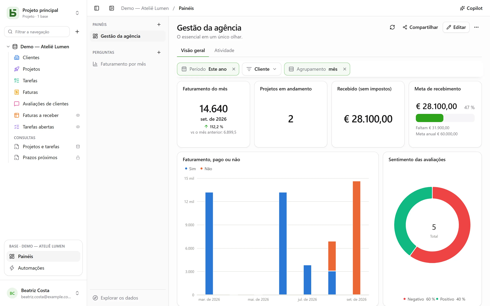
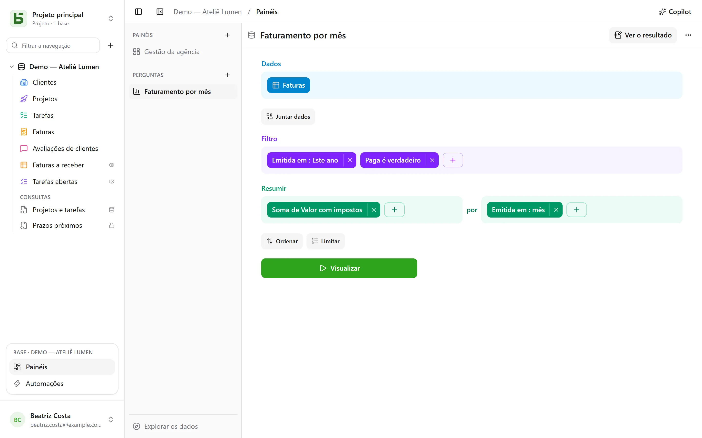
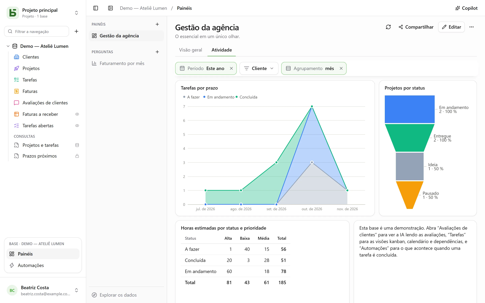

Um **painel** reúne em uma página o que uma equipe olha todos os dias: os
números que importam, sua evolução mês a mês, a distribuição de um status, os
próximos prazos. Cada cartão mostra uma **pergunta** — uma leitura da base,
construída com o mouse ou escrita em SQL — e **filtros** no topo da página controlam os
cartões vinculados a eles.



Tudo abre em **Painéis**, no bloco da base aberta, na parte de baixo da barra
lateral. À esquerda, os painéis e as perguntas salvas da base, e
**Explorar os dados** para fazer uma pergunta sem salvar nada. Todo leitor da base
pode consultá-los, explorá-los e salvar suas próprias perguntas; criar um painel e compartilhar
uma pergunta exigem o nível **Gerenciamento**.

Uma pergunta salva é **pessoal** — só você a vê —, para **toda a base** ou para **grupos**. Seu
menu, com um clique com o botão direito ou por **⋯**, a abre em uma aba ao lado das tabelas, muda
seu nome e seu compartilhamento, ou a exclui. O **+** da barra de abas também oferece **Nova
pergunta** e **Nova pergunta SQL**.

**Salvar**, no cabeçalho de uma pergunta, a mantém; uma pergunta que você não pode editar
oferece em vez disso **Salvar uma cópia**, que se torna sua. **⋯** (Mais ações) também oferece
**Nome e compartilhamento…**, **Salvar uma cópia…** e **Excluir a pergunta**; uma aba que a
mostrava mantém o conteúdo, agora não salvo.

## Fazer uma pergunta com o mouse

Uma pergunta é construída em etapas, uma abaixo da outra:



| Etapa | O que se escolhe nela |
|---|---|
| **Dados** | a tabela de partida e as colunas mostradas quando nada é resumido |
| **Juntar dados** | outra tabela da base, ligada por uma relação — sugerida automaticamente — ou por duas colunas de mesma natureza; junção à esquerda, interna, à direita ou completa |
| **Filtro** | por coluna, com o que o tipo dela oferece: é / não é, contém, entre, vazio…; para uma data, um **período**: hoje, últimos 30 dias, este mês, trimestre passado, de … a …; ou uma expressão escrita como na barra das visões |
| **Resumir** | medidas — número de linhas, soma, média, mediana, mínimo, máximo, valores distintos, desvio padrão, somas acumuladas — **por** uma a três colunas |
| **Ordenar**, **Limitar** | a ordem das linhas, e quantas no máximo |

Uma data é agrupada **por dia, semana, mês, trimestre ou ano**, ou por posição — dia da
semana, mês do ano, hora do dia; um número, em faixas. Uma seleção múltipla
conta cada linha em cada uma de suas opções. Os períodos são lidos no seu fuso horário e a
semana começa no dia definido nas suas configurações.

**Visualizar** executa a pergunta. O resultado é mostrado da forma que melhor lhe convém — um
número, uma curva, barras, uma tabela — e pode ser alterado na parte de baixo da tela:

| Visualização | Para mostrar |
|---|---|
| **Número**, **Tendência**, **Progresso**, **Medidor** | um valor; o último período em relação ao anterior e ao mesmo do ano passado; o avanço em direção a uma meta |
| **Histograma**, **Barras**, **Curva**, **Áreas**, **Combinado** | medidas ao longo de uma dimensão, em séries lado a lado, empilhadas ou em 100% |
| **Pizza**, **Funil** | partes, etapas |
| **Dispersão** | duas medidas uma contra a outra, uma terceira como tamanho |
| **Tabela**, **Tabela dinâmica** | as linhas, ordenáveis; as linhas por uma dimensão, as colunas por outra, com seus totais |
| **Mapa** | as regiões ou departamentos da França, ou os países, coloridos por um valor; ou pontos por latitude e longitude |

**Ajustes** define o que é mostrado, e o resultado pode ser baixado em **CSV**.

### Personalizar um gráfico

| Visualização | O que **Ajustes** oferece |
|---|---|
| **Barras, curvas, áreas, combinado** | a cor e o nome de cada série; o empilhamento, com o total acima das pilhas; a largura das barras; curvas suavizadas ou em degraus, com ou sem pontos; a ordem das categorias; os títulos dos eixos, as graduações, a inclinação dos rótulos, os limites, uma escala logarítmica; os valores no gráfico; uma meta |
| **Pizza** | uma rosca e sua espessura, um semicírculo, uma rosa; o total no centro; o número de fatias antes de “Outros”; a cor e o nome de cada fatia; os rótulos nas fatias ou ao lado; a posição da legenda |
| **Funil** | a cor e o nome de cada etapa, a ordem delas |
| **Número, tendência, progresso, medidor** | a cor, cores conforme o valor, uma legenda abaixo do número, a comparação — e se uma queda é uma boa notícia |
| **Tabela, tabela dinâmica** | renomear e reordenar as colunas, barras nas células, cores conforme o valor — por célula ou por linha —, a densidade, as linhas por página, os números de linha, os totais |
| **Mapa** | a tonalidade, os nomes das regiões |

Para todos, o formato dos números: casas decimais, prefixo e sufixo, abreviado como `1,2 k`.

## Explorar com um clique

Um clique em uma barra, um ponto ou uma fatia abre o que ele representa:

- **Ver estas linhas**: as linhas por trás do ponto, filtradas pelo que ele representa;
- **Detalhar por semana**: um período aberto em um mais fino — um ano em seus
  trimestres, um mês em suas semanas;
- **Dividir por…**: a mesma medida, para esse ponto, por outra coluna;
- **Somente este valor**, **Excluir este valor**.

Cada passo é uma pergunta à parte, que pode ser salva se você quiser; a seta de voltar retorna
ao passo anterior. Uma linha de uma tabela abre os detalhes da linha.

Em um painel, o mesmo clique também oferece **Filtrar o painel: “Lyon”**, com o
número de cartões afetados: um filtro **temporário**, nunca salvo, exibido com borda tracejada
na barra de filtros e removível com um clique, que se aplica a cada cartão cuja pergunta
lê a mesma coluna — pela tabela dela ou por uma junção. Ele só é oferecido se nenhum filtro do
painel já estiver vinculado a essa coluna no cartão, e fica desativado (“único cartão”) quando
nenhum outro cartão a lê. As perguntas SQL não o levam em conta.

## Escrever uma pergunta em SQL

Uma **pergunta SQL** é um `SELECT` sobre as tabelas da base, com o nome verdadeiro. Ela
é executada **somente para leitura, com as suas próprias permissões** — para todo mundo, gestores
incluídos: uma tabela fechada para você não existe, um campo oculto é recusado e uma
escrita é impossível. Para simplesmente guardar uma consulta abaixo das tabelas, sem gráfico, ou
transformá-la em uma visão PostgreSQL de verdade, veja [Consultas e visões SQL](/basedb/pt-br/fonctionnalites/requetes-et-vues-sql/).

Uma **variável** é escrita `{{nom}}`; uma parte a remover quando ela não tem valor fica entre
`[[` e `]]`:

```sql
SELECT statut, count(*) AS taches
  FROM taches
 WHERE {{periode}} [[AND priorite = {{priorite}}]]
 GROUP BY statut
```

Uma variável é um texto, um número, uma data — ou um **filtro de coluna**: `{{periode}}`
se torna então uma condição inteira sobre a coluna escolhida, `echeance` aqui, ou `TRUE` quando nada
é escolhido. É isso que permite que um filtro do painel controle uma pergunta SQL
como as outras.

## Organizar um painel

**Editar** coloca o painel em modo de edição:

- **Pergunta** posiciona uma pergunta salva — uma pergunta pessoal é copiada nela —, ou cria uma
  exclusiva do cartão;
- **Título** adiciona um título de seção, **Texto** um texto formatado — títulos, listas,
  links — que pode citar números (veja mais abaixo);
- **Página incorporada** exibe um endereço `https://` em um frame isolado, que não recebe
  sessão nem dados;
- **Aba** distribui os cartões em várias páginas; um clique duplo renomeia uma aba.

Os cartões são movidos pela alça e redimensionados pelo canto, em uma grade de
24 colunas. **Salvar** guarda tudo; **Cancelar** volta à versão anterior. O título
de um cartão, em modo de leitura, abre sua pergunta para explorá-la, incluindo os filtros do painel.

### Números no texto

Um texto cita um valor por um nome entre chaves duplas: “Este mês, `{{chiffre_affaires}}` de
faturamento em `{{commandes}}` pedidos.” Cada nome se torna uma etiqueta, para vincular com um
clique — ou por **Variável** na barra do editor — a:

| Fonte | O que o texto mostra |
|---|---|
| **um cartão** do painel | o que ele mostra, sob os próprios filtros |
| **uma pergunta salva** de toda a base | seu valor, e os filtros do painel se vinculam a ela como a um cartão |
| **uma pergunta guardada no texto** | seu valor; é assim que se cita uma pergunta pessoal |
| **um filtro** do painel | o valor escolhido, como o comando dele diz |

O valor de uma pergunta é o que o seu **Número** mostraria: sua primeira medida, na última
linha. Ele é calculado com as permissões do leitor, e sempre é exibido como texto. Um texto cita
no máximo 20 valores; um nome se escreve em minúsculas, dígitos e `_`. Os textos escritos em
Markdown antes do editor continuam sendo lidos como antes, e passam a ser formatados assim que
são reescritos. Já o Copilot escreve seus textos em Markdown.

## Os filtros

**Filtro** adiciona um controle no topo do painel: uma **data** (um período), uma
**categoria** (valores a marcar), um **texto**, um **número** ou um **agrupamento de
data** que faz as curvas passarem de mês para semana ou ano.

Um filtro controla os cartões vinculados a ele — um, vários ou todos. Ao ser criado, ele se
vincula automaticamente às colunas adequadas; selecionado, mostra em cada cartão a
coluna que filtra, que pode ser alterada ou removida, e **Vincular a todos os cartões compatíveis**
completa o resto. Ele pode ter um **valor padrão** — “Este ano”, por exemplo.

Em modo de leitura, um clique em um ponto também pode definir um filtro: **Filtrar por “Lyon”** em um
cartão cuja coluna de cidades está vinculada ao filtro “Ville”.



## O Copilot

**Copilot**, no cabeçalho da seção Painéis, abre à direita uma conversa em
linguagem natural sobre a base: “o faturamento por mês”, “adicione um filtro por cliente”,
“por que agosto caiu?”. Cada proposta chega como um cartão, que se aplica com um clique:

| Proposta | O que ela faz |
|---|---|
| **Uma pergunta** | executada e desenhada na conversa; ela abre no editor ou é adicionada ao painel |
| **Alterações no painel**, ou um painel novo | cartões adicionados, alterados ou removidos, textos, filtros vinculados automaticamente aos cartões que têm a coluna, abas, nome — um único salvamento, **reversível** a partir do cartão |
| **Valores para os filtros exibidos** | “mostre o mês passado”: os filtros são ajustados, nada é salvo |

Fazer uma pergunta ou ajustar os filtros está aberto a todo leitor da base; editar ou criar
um painel exige o nível **Gerenciamento**.

Por padrão, **somente a estrutura** vai para o provedor de IA, junto com a conversa: as
tabelas e seus campos, os painéis e as perguntas salvas da base, e o painel
exibido — suas abas, seus filtros, a definição de seus cartões (suas perguntas, seus textos).
Nem as linhas, nem os resultados dos cartões, nem os **valores escolhidos nos filtros**, que
podem ser dados: de um filtro só vai a informação de que ele tem um valor. Um campo marcado como
invisível para os agentes não é enviado, nem a pergunta de um cartão que o cita.

A caixa **Permitir a leitura dos dados** adiciona, durante a conversa, os valores dos
filtros exibidos e os resultados dos cartões sob esses filtros (no máximo 50 linhas por leitura,
listadas abaixo da resposta), para comentar os números com base neles. Veja
[Inteligência artificial](/basedb/pt-br/fonctionnalites/ia/).

## Compartilhar um painel

**Compartilhar**, no cabeçalho de um painel, está disponível para quem tem o nível **Gerenciamento** na
base. Dois caminhos:

- **Compartilhar a base…** convida pessoas para a base: elas abrem o painel no basedb, e
  cada cartão lê com as próprias permissões delas;
- **Criar link** fornece um link para **apenas** esse painel, que não exige nenhuma permissão na base.

| Acesso do link | Quem lê |
|---|---|
| **Público** | qualquer pessoa com o link, sem conta |
| **Membros conectados** | um membro do espaço de trabalho, após o login — se necessário, apenas de certos grupos |

A página do link mostra as abas, os filtros e os cartões do painel, **somente para leitura**:
nem exploração, nem acesso às linhas, nem perguntas próprias. Seus cartões leem com as **permissões da
pessoa que publicou o link**, reavaliadas a cada leitura: se ela perder o acesso à base, o
link fica **suspenso**. O interruptor **Link ativo** o desativa sem perdê-lo, **Regenerar**
invalida o antigo.

Marque **Permitir incorporação em outro site**: a caixa de diálogo fornece um **código de incorporação**
`<iframe>`, para exibir o painel em uma intranet ou uma wiki. É o mesmo mecanismo das
[visões compartilhadas](/basedb/pt-br/fonctionnalites/vues-partagees/).

## Cada um com suas permissões

Cada cartão lê **com as permissões de quem olha**: o mesmo painel mostra a cada pessoa o que ela tem
permissão para ver — exceto por um link de compartilhamento, que lê com as da pessoa que o publicou. Um cartão que trata de uma tabela ou de um campo fechado para você exibe
“Dado inacessível”, em vez de um número que mentiria por omissão. Salvar uma
pergunta compartilha apenas a pergunta, nunca o que o autor dela pode ler.

## Limites

- Uma pergunta retorna no máximo 2.000 linhas; um resumo quase sempre se contenta com isso.
- Cada cartão faz sua consulta ao abrir e a cada filtro, sem cache.
- Os mapas de fundo cobrem a França metropolitana (regiões, departamentos) e os países do
  mundo. Fonte: IGN, Admin Express (Licence Ouverte); Natural Earth.
