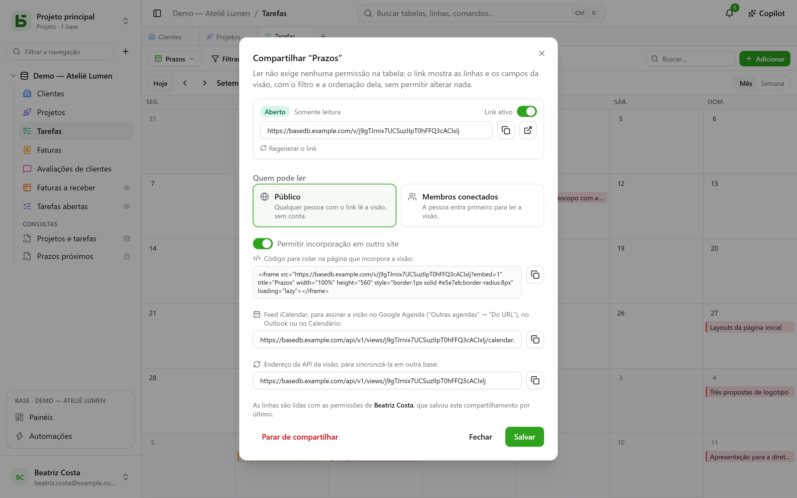
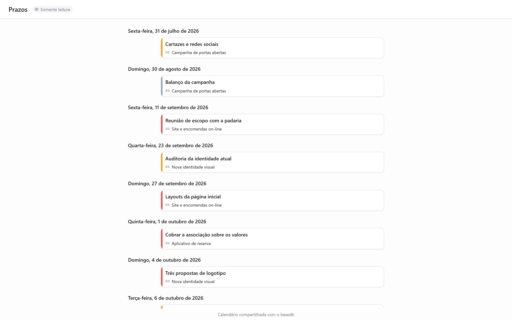

Uma visão de dados — grade, kanban, calendário, linha do tempo, galeria, lista — é **compartilhada
somente para leitura**: um link `/v/<jeton>` a mostra para quem não pode abrir o basedb, sem
permitir escrever nada. É a contrapartida dos [formulários compartilhados](/basedb/pt-br/fonctionnalites/formulaires-partages/),
que permitem responder sem deixar ler nada. Um [painel](/basedb/pt-br/fonctionnalites/tableaux-de-bord/#compartilhar-um-painel)
é compartilhado da mesma forma.

## Compartilhar

Menu da visão → **Compartilhar…**, depois:

| Acesso | Quem lê |
|---|---|
| **Público** | qualquer pessoa com o link, sem conta |
| **Membros conectados** | um membro do espaço de trabalho, após o login — se necessário, apenas de certos grupos |

O interruptor **Link ativo** suspende o link sem perdê-lo. A página abre fora do
aplicativo: nem barra lateral, nem nome da base, nem nome da tabela — a visão, seus filtros, suas
colunas e nada mais. Um calendário ou uma linha do tempo é lido ali como uma agenda.

## Em nome de quem se lê

A visão é lida com as **permissões da pessoa que a publicou**, reavaliadas a cada leitura:
um campo oculto para ela não é exibido e, se ela perder o acesso à tabela, o link deixa
de mostrar qualquer coisa.

## Incorporar a outro site

Marque **Permitir incorporação em outro site**: a caixa de diálogo fornece um **código
de incorporação** `<iframe>`, para colar em uma intranet, uma wiki, um site institucional. Sem essa
caixa marcada, a página se recusa a ser exibida dentro de um frame de outro site.

## Um calendário na sua agenda

Para um calendário ou uma linha do tempo compartilhados como **público**, a caixa de diálogo fornece o **endereço do
feed de agenda**: um feed iCalendar (`…/calendar.ics`, no máximo 1.000 eventos) que
o Google Agenda, o Outlook ou o Apple Calendar podem assinar. Os prazos da equipe aparecem
na agenda de cada pessoa e acompanham a tabela.

## Uma fonte para outras bases

Um link público também fornece o **endereço da API da visão**: as linhas que ela mostra, em
JSON. Uma [tabela sincronizada](/basedb/pt-br/integrations/synchronisation/) — nesta instância ou
em outra — pode usá-la como fonte.

## Limites

- A leitura é limitada a 120 requisições por minuto, por endereço e por link.
- Um formulário não é compartilhado para leitura: ele é compartilhado [para receber respostas](/basedb/pt-br/fonctionnalites/formulaires-partages/).
