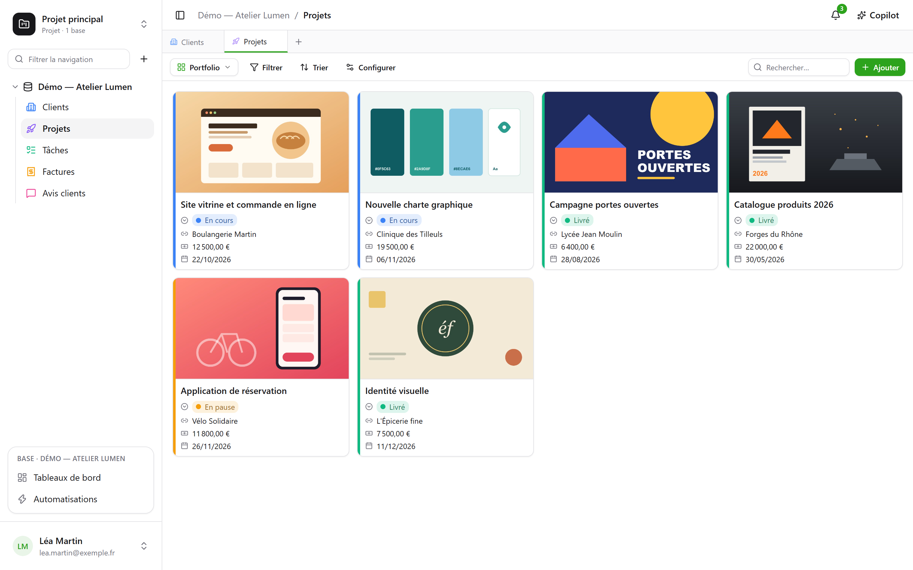
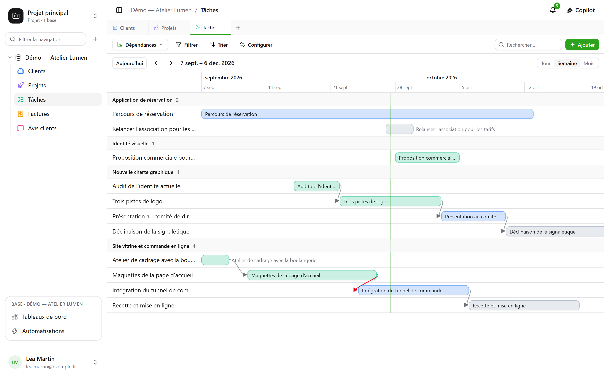
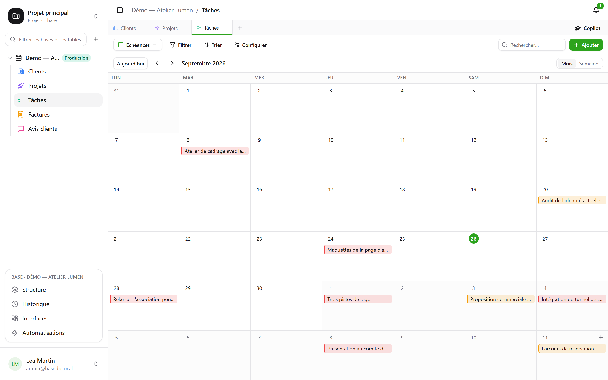
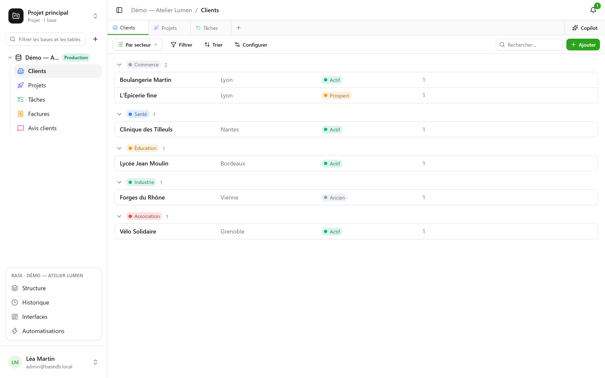

Uma tabela pode ser mostrada de **oito formas**. Uma visão não copia nenhum dado e não dá nenhuma permissão
além da própria tabela.

:::note
Essas visões são formas de mostrar **uma** tabela. Uma [visão SQL](/basedb/pt-br/fonctionnalites/requetes-et-vues-sql/)
é outra coisa: uma visão PostgreSQL de verdade, escrita em SQL sobre as tabelas da base e organizada entre
elas na barra lateral.
:::

| Visão | O que ela mostra | Do que ela precisa |
|---|---|---|
| **Grade** | linhas, filtradas, ordenadas, agrupadas, com colunas escolhidas | — |
| **Kanban** | cartões em colunas | uma seleção única |
| **Calendário** | linhas na sua data, por mês ou por semana | um campo de data |
| **Linha do tempo** | barras entre duas datas, e suas dependências | uma data de início |
| **Galeria** | cartões, com uma imagem de capa | — |
| **Lista** | uma linha por registro, em grupos recolhíveis | — |
| **Formulário** | uma página de perguntas para criar uma linha | — |
| **Questionário** | as mesmas perguntas, uma por tela | — |

## O seletor de visões

Ele fica à esquerda de “Filtrar”. “Todas as linhas” é a grade da tabela, que ninguém
salvou nem pode excluir; em seguida vêm as **visões colaborativas**, na
ordem escolhida por quem constrói a base, e depois **Minhas visões**.

- Uma **visão colaborativa** é vista por todos. Criá-la, configurá-la, renomeá-la,
  reordená-la ou excluí-la exige o nível **Gerenciamento**. Ela pode ser **bloqueada**: um
  cadeado indica isso, e ninguém mais a altera antes de desbloqueá-la.
- Uma **visão pessoal** é vista só por você e exige apenas poder ler a tabela.
  **Criar visão pessoal**, ou **Salvar como visão** depois de filtrar e ordenar:
  cada pessoa guarda suas próprias formas de ler, sem mudar nada para as outras. **Duplicar** uma
  visão colaborativa cria uma cópia pessoal.

## A barra de ferramentas

Acima da grade, nesta ordem:

- **Filtrar** combina condições por campo;
- **Colunas** escolhe o que é exibido — as colunas de sistema ficam à parte, em
  “Informações do sistema”;
- **Agrupar** organiza as linhas segundo um campo de valor único — seleção única, relação,
  pessoa, data, número, texto, caixa de seleção… — em grupos recolhíveis, cada um com sua
  contagem sobre todo o filtro;
- **Cores** colore as linhas segundo uma seleção única ou segundo **regras** — um filtro e
  uma cor, no máximo vinte — como traço, como fundo, ou ambos;
- **Altura das linhas**: baixa, média, alta, muito alta;
- **Buscar…**, à direita, procura em todas as colunas enquanto você digita; Esc
  limpa a busca. Ela vale também para o kanban, o calendário, a linha do tempo, a galeria
  e a lista, e nunca é salva na visão.

Abaixo de cada coluna, um **Resumo** calculado sobre todas as linhas do filtro, não apenas sobre
a página: preenchidas, vazias, valores únicos, soma, média, mínimo, máximo, caixas marcadas.

## Kanban, calendário, linha do tempo

- O **kanban** organiza os cartões segundo uma seleção única; arrastar um cartão altera a linha,
  um “+” no topo da coluna cria uma linha já com essa opção. Cada cartão mostra um
  título, uma imagem de capa, os campos escolhidos e uma **descrição** que cita os
  valores da linha — “Entrega prevista em `{{Date}}` para `{{Client}}`” —, escrita na
  configuração da visão com o botão **Inserir campo**.
- O **calendário** coloca cada linha na sua data, com uma eventual data de término; arrastar uma
  linha de um dia para outro a desloca.
- A **linha do tempo** traça barras entre uma data de início e uma data de término, agrupadas por
  uma seleção única ou uma relação. Com a configuração **Depende de** — uma relação da tabela
  com ela mesma — uma seta liga cada tarefa àquelas de que ela depende, vermelha quando
  volta no tempo.

## Galeria e lista

- A **galeria** mostra cartões: uma **imagem de capa** (recortada ou inteira), um
  tamanho (cartões pequenos, médios, grandes), uma cor segundo uma seleção única.
- A **lista** mostra uma linha por registro, **agrupada** por uma seleção única, uma
  relação ou uma pessoa.

No kanban, na galeria e na lista, os cartões e as linhas são **organizados à mão**,
arrastando-os — até 5.000; uma ordenação escolhida prevalece sobre essa ordem.

## Formulário e questionário

Você marca as perguntas e as ordena; cada uma tem um enunciado, uma ajuda, um exemplo de
resposta, e pode ser tornada obrigatória. O formulário tem seu título, sua apresentação, o
rótulo do botão e a mensagem de agradecimento. Ele é preenchido no basedb ou
[compartilhado por um link](/basedb/pt-br/fonctionnalites/formulaires-partages/).

Não há nada para configurar para começar: um formulário novo pergunta o que uma pessoa
responde — não o status, a pessoa atribuída nem as relações que a equipe preenche depois, a
menos que sejam obrigatórias —, usa a cor da sua tabela e um tema claro, e cada campo vazio
mostra um exemplo adequado. Tudo o resto muda quando você quiser:

- **Aparência**: oito temas — Claro, Suave, Aurora, Oceano, Floresta, Noite, Papel, Minimalista —,
  uma cor de destaque, uma fonte, um alinhamento à esquerda ou centralizado;
- **Perguntar somente se…**: uma pergunta só é feita se uma resposta anterior exigir isso
  (“Sentimento é Negativo”, “Avaliação é no máximo 2”). Uma pergunta oculta não é obrigatória
  nem é enviada;
- **Mais opções**: os botões de boas-vindas e de envio, os números, a barra de progresso, o
  avanço automático para a próxima, a mensagem e um botão final (“Voltar ao site”), os
  confetes.

O **questionário** ocupa a tela inteira: uma tela de boas-vindas que diz quanto tempo leva,
depois uma pergunta de cada vez, que chega deslizando. Tudo também funciona pelo teclado:
**Enter** para continuar, as letras **A**, **B**, **C**… para uma escolha, **S** ou **N** para
sim ou não, os números para uma avaliação — uma escolha única passa sozinha para a próxima
pergunta. O envio é comemorado: uma marca de verificação que se desenha e confetes nas cores
do formulário.

## Compartilhar uma visão

Uma visão de dados — grade, kanban, calendário, linha do tempo, galeria, lista — é **compartilhada
somente para leitura** por um link, pode ser incorporada a outro site, e um calendário se torna um feed
de agenda. Veja [Visões compartilhadas](/basedb/pt-br/fonctionnalites/vues-partagees/).

## O que o leitor não vê

Uma visão é **reprojetada para quem a lê**: um campo oculto para essa pessoa desaparece das
colunas, dos cartões e das perguntas. Uma visão cujo filtro cita um campo oculto não é
mostrada de jeito nenhum: mostrada sem o filtro, ela mostraria mais do que foi feita para
mostrar.
