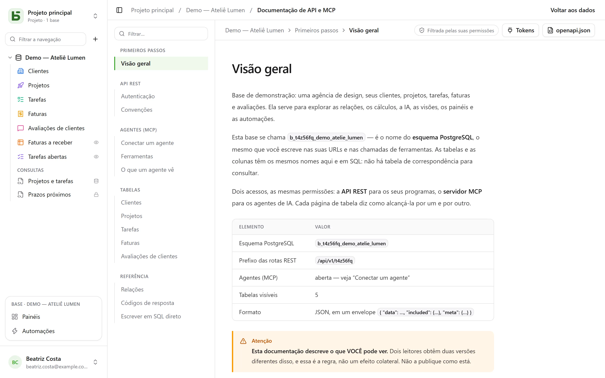

A API REST é a mesma que a interface usa: **não existe rota privada**.
Suas URLs levam os nomes físicos — os mesmos que você lê em SQL.

```text
/api/v1/<tenant>/data/<base>/<table>
/api/v1/t4z56fq/data/b_t4z56fq_ventes/opportunites
```

## Um token

Na interface, menu **⋯** da base → **API e agentes** → **Tokens de API e MCP…**: ali você cria um **token
de integração** limitado a essa base, somente para leitura por padrão, depois de confirmar a sua
senha. Ele só é exibido uma vez; coloque-o em uma variável de ambiente.

Um token lê, cria e altera se tiver sido criado com escrita, **nunca exclui** e nunca tem
mais permissões do que a pessoa que o criou.

```bash
export BASEDB_TOKEN=bdb_…
curl "http://localhost:3000/api/v1/t4z56fq/data/b_t4z56fq_ventes/opportunites?limit=20" \
  -H "Authorization: Bearer $BASEDB_TOKEN"
```

## Ler

| Parâmetro | Função |
|---|---|
| `filter` | uma expressão legível: `statut eq "gagne" and montant gte 10000` |
| `sort` | `-montant,nom` |
| `fields` | as colunas a retornar |
| `limit`, `after` | paginação por cursor criptografado: `meta.next_cursor` de uma página, passado em `after`, dá a seguinte (`meta.has_next_page`) |
| `links=display` | as relações com seu valor de exibição |
| `count=exact` | o total, limitado a 100.000 |
| `variables=raw` | os textos longos tal como foram escritos, incluindo `{{colonne}}`, em vez de com os [valores da linha](/basedb/pt-br/fonctionnalites/tables-et-champs/#texto-formatado-e-variáveis) |

Os operadores: `eq`, `ne`, `eq_ci`, `contains`, `starts_with`, `ends_with`, `in`, `is_null`,
`gt`, `gte`, `lt`, `lte`, `between`, combinados por `and`, `or`, `not` e parênteses. Um
filtro atravessa uma relação: `clients_id.ville eq "Lyon"`.

## Escrever

```bash
curl -X POST "http://localhost:3000/api/v1/t4z56fq/data/b_t4z56fq_ventes/opportunites" \
  -H "Authorization: Bearer $BASEDB_TOKEN" -H "content-type: application/json" \
  -d '{"values": {"nom": "Audit RGPD", "statut": "nouveau", "montant": 12000}}'
```

`PATCH …/<table>/<_id>` altera uma linha com o mesmo corpo `{"values": {…}}`. Os
erros têm um formato único: `{ "code": "…", "details": {…}, "request_id": "…" }`, com um
código estável por causa.

Cada escrita retorna o cabeçalho `x-basedb-transaction`: passá-lo para
`POST /api/v1/<tenant>/history/undo` (`{"transaction": "…"}`) a desfaz, como Ctrl+Z na
interface — recusado se a linha tiver sido alterada desde então.

## Além das linhas

Com o mesmo token:

| Rota | Função |
|---|---|
| `GET …/data/<base>/<table>/aggregate` | resumos sobre todas as linhas de um filtro: `aggregates=montant:sum,nom:filled`, `group=statut` |
| `GET …/data/<base>/<table>/<_id>/comments`, `POST` | ler e escrever os comentários de uma linha |
| `POST /api/v1/<tenant>/automations/<id>/run` | disparar uma automação acionada por um botão, em uma linha (`{"record": "…"}`) |
| `GET /api/v1/<tenant>/meta/bases/<base>/dashboards` | os painéis de uma base |
| `GET /api/v1/<tenant>/meta/users` | os membros do espaço de trabalho, para um campo Pessoa |
| `GET /api/v1/<tenant>/meta/templates` | os modelos de base da galeria |

As [visões compartilhadas](/basedb/pt-br/fonctionnalites/vues-partagees/) são lidas sem conta:
`GET /api/v1/views/<jeton>` e `…/rows` em JSON, `…/calendar.ics` em iCalendar.

Construir — criar uma automação, um painel, uma integração — continua reservado a
uma sessão da interface: um token lê e escreve linhas, ele não muda a base.

## A documentação gerada

Cada base tem sua página **Documentação de API e MCP**: para cada tabela, seus endpoints, suas
colunas, exemplos em cURL e em JavaScript. Ela é **filtrada pelas suas permissões** — dois
leitores obtêm duas versões —, escrita **no idioma da sua tela**, e existe também em OpenAPI 3.1
(`/api/v1/<tenant>/meta/bases/<base>/openapi.json`). Os nomes, os caminhos e os códigos de erro
continuam os mesmos em todos os idiomas.


