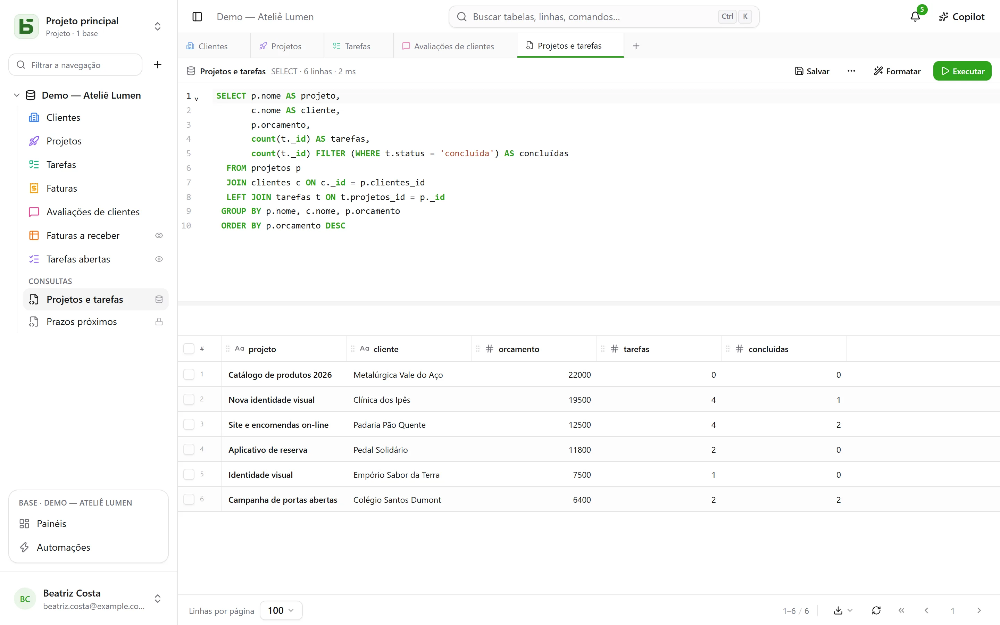

É a razão de ser do basedb: **suas tabelas são tabelas de verdade**. Qualquer cliente PostgreSQL
as lê pelo nome.

## Os nomes

| Objeto | Nome físico | Exemplo |
|---|---|---|
| Base | um schema `b_<tenant>_<nom>` | `b_t4z56fq_ventes` |
| Ambiente de homologação | o schema com sufixo | `b_t4z56fq_ventes_recette` |
| Tabela | seu nome slugificado | `opportunites` |
| Campo | seu nome slugificado | `echeance` |
| Relação | `<table cible>_id` | `clients_id` |
| [Visão SQL](/basedb/pt-br/fonctionnalites/requetes-et-vues-sql/) | seu nome técnico, no schema da base | `factures_a_encaisser` |

A página **Documentação de API e MCP** de cada base informa todos eles, e `\d` no `psql` mostra
as descrições (`COMMENT ON`).

## Na interface

O **+** da barra de abas, ou o menu **⋯** da base → **Consulta SQL**: um editor
com realce de sintaxe e autocompletar, cujo resultado aparece na mesma grade das suas tabelas.



- **Cada pessoa lê ali com as próprias permissões**: o nível Gerenciamento tem a base inteira, inclusive escritas; os
  outros membros escrevem SQL somente para leitura, em que uma tabela fechada não existe e um campo
  oculto desaparece.
- Uma consulta **pode ser salva** abaixo das tabelas — para si, para toda a base ou para
  grupos — e se torna, se você quiser, uma **visão SQL**: uma visão PostgreSQL de verdade, organizada entre
  as tabelas e legível pelo `psql`.

Tudo está detalhado em [Consultas e visões SQL](/basedb/pt-br/fonctionnalites/requetes-et-vues-sql/).

## Pelo psql

Com o `docker-compose.yml` fornecido, o PostgreSQL é publicado em `127.0.0.1:5432`:

```bash
psql "postgres://basedb:<POSTGRES_PASSWORD>@localhost:5432/basedb"
```

```sql
SET search_path = b_t4z56fq_ventes;

SELECT o.nom, o.montant, c.nom AS client
FROM opportunites o
JOIN clients c ON c._id = o.clients_id
WHERE o.statut = 'gagne';
```

Essa conta é a proprietária da base: ela lê tudo, e as permissões do basedb não se aplicam a
ela. Para uma ferramenta de BI, crie em vez disso um papel separado com seus próprios `GRANT`.
Se uma tabela tiver uma [regra de linhas](/basedb/pt-br/fonctionnalites/droits/#até-a-linha), o
PostgreSQL aplica a ela a segurança por linha: um papel desse tipo não vê nenhuma linha nela sem
o atributo `BYPASSRLS` ou uma política própria.

## Escrever em SQL

É permitido. As restrições (seleções únicas, relações, URLs, obrigatório) são mantidas
pelo PostgreSQL e recusam um valor inválido, como na interface. E a escrita é
**registrada no histórico**: o histórico a exibe como “Sessão SQL direta”, com a sessão que a
fez, e ela pode ser desfeita como as outras.

:::caution
Mudar a **estrutura** em SQL (`ALTER TABLE`) contorna o catálogo do basedb, que não
tomaria conhecimento dela. Passe pela interface, pela API ou por uma proposta de agente: o motor de
migrações planeja, bloqueia por pouco tempo e mantém o catálogo exato.
:::
