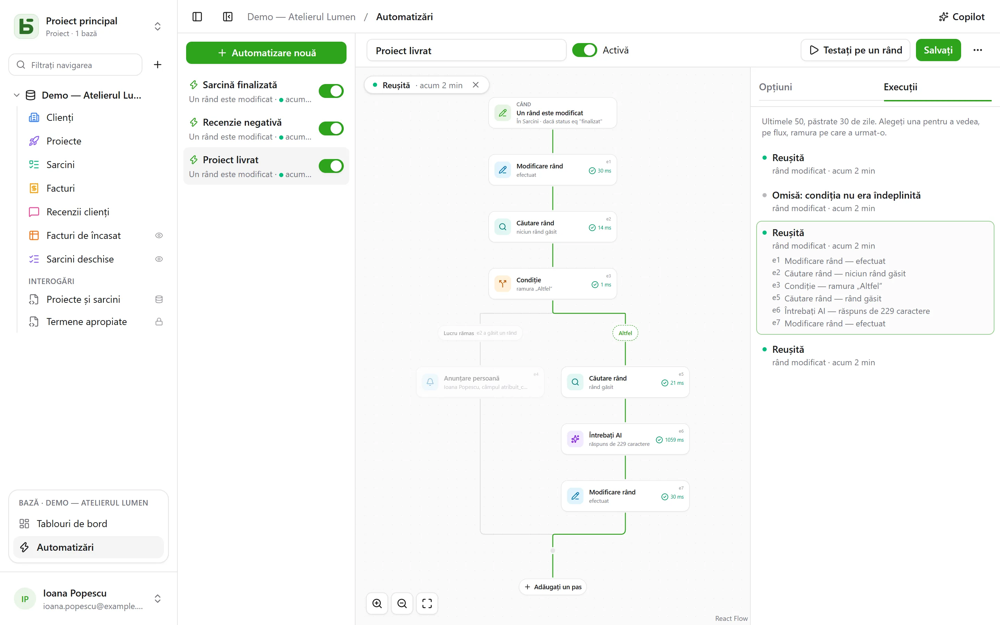

O automatizare spune **când**, **dacă** și **atunci**: când o sarcină trece la „Fait”, notați
ora; când sosește o recenzie negativă, anunțați responsabila și scrieți pe Slack; în fiecare
luni la ora 9, creați rândul pentru ședința echipei. Iar când o singură acțiune nu este
suficientă, automatizarea urmează un **flux**: caută un rând, ia o ramură sau alta în funcție
de ce conține acesta, repetă pași pe fiecare rând care răspunde unui filtru, reutilizează
într-un pas ce a găsit sau a scris un pas anterior.

Automatizările se deschid din **Automatizări**, în blocul bazei deschise din partea de jos a
barei laterale, și cer nivelul **Gestionare**.



## Fluxul

Fluxul se desenează de sus în jos: declanșatorul, apoi fiecare pas. Un **+** pe o linie adaugă
un pas în acel loc; un card își deschide setările în dreapta. O automatizare simplă — un
declanșator și o acțiune — încape în două carduri și se configurează ca înainte.

## Când

| Declanșator | Setări |
|---|---|
| **Un rând este creat** | tabelul |
| **Un rând este modificat** | tabelul și, la nevoie, doar câmpurile de urmărit |
| **La oră fixă** | în fiecare oră, în fiecare zi sau în fiecare săptămână, la ora și în fusul orar alese |
| **Se face clic pe un buton** | un [câmp Buton](/basedb/ro/fonctionnalites/tables-et-champs/#buton) al tabelului |

Un declanșator pe rânduri vede **toate** scrierile: interfața, API-ul, un agent, un formular
partajat și chiar SQL-ul direct — automatizările pornesc din istoric, care le captează pe
toate.

## Doar dacă

O condiție opțională, în [limbajul filtrelor](/basedb/ro/integrations/api-rest/#citire) —
`statut eq "fait"`, `montant gte 10000 and payee eq false` — evaluată pe rând **în momentul
acțiunii**. O execuție a cărei condiție nu este îndeplinită este „ignorată” și spune acest
lucru.

## Atunci

Până la treizeci de pași, în ordine; primul care eșuează îi oprește pe următorii.

| Pas | Ce face |
|---|---|
| **Editați un rând** | scrie valori în rândul care a declanșat automatizarea — sau în cel pe care un pas l-a găsit ori l-a creat |
| **Creați un rând** | în acest tabel sau în altul din bază |
| **Căutați un rând** | primul rând dintr-un tabel care corespunde unui filtru, pentru ca pașii următori să îl citeze sau să îl modifice |
| **Anunțați pe cineva** | o [notificare](/basedb/ro/fonctionnalites/collaboration/#notificări) către persoane alese sau către persoana dintr-un câmp Persoană |
| **Trimiteți un e-mail** | către persoane din echipă, către cea dintr-un câmp Persoană, la adresa dintr-un câmp E-mail — un client, un furnizor — sau la adrese scrise; subiectul și textul citează rândul și pașii anteriori |
| **Apelați un webhook** | o cerere HTTPS către un serviciu — metodă, adresă, anteturi și corp după cum doriți ([detalii](#apelați-un-serviciu)); răspunsul lui poate fi citat apoi |
| **Trimiteți pe Slack** | un mesaj într-un canal [conectat](/basedb/ro/integrations/synchronisation/#slack) |
| **Întrebați AI** | un răspuns al [furnizorului de AI](/basedb/ro/fonctionnalites/ia/) la o instrucțiune care citează rândul și pașii anteriori — redactare, rezumat, clasificare —, citit ca text, număr, da sau nu, dată sau opțiune dintr-o listă |
| **Condiție** | mai multe ramuri: este luată prima a cărei condiție este îndeplinită, „Altfel” când niciuna nu este; ramurile se reunesc apoi |
| **Pentru fiecare rând** | pașii pe care îi conține, o dată pentru fiecare rând dintr-un tabel care răspunde unui filtru ([detalii](#pentru-fiecare-rând)) |

O căutare care nu găsește nimic nu oprește fluxul: pașii care trebuiau să modifice rândul ei
sunt săriți. Pentru a face altceva în acest caz, o condiție testează situația — o ramură cu
filtrul gol este luată imediat ce căutarea a găsit ceva.

## Pentru fiecare rând

Pasul **Pentru fiecare rând** citește rândurile unui tabel care răspund filtrului său — gol:
toate —, în ordinea aleasă, până la limita sa (50 în mod implicit, cel mult 200), apoi execută
o dată pentru fiecare dintre ele pașii așezați în cadrul său. „În fiecare luni, retrimiteți
facturile neplătite” se scrie astfel: **La oră fixă**, apoi **Pentru fiecare rând** din
facturile `payee eq false and relancee eq false`, iar în buclă un e-mail către contactul
facturii și **Modificare rând** care bifează „Relancée”.

În buclă, identificatorul pasului numește **rândul curent**: `{{e1.client}}` îl citează, iar
**Modificare rând** îl propune printre rândurile de modificat. După buclă, `{{e1.nombre}}`
spune câte rânduri a parcurs — pentru un rezumat pe Slack, de exemplu. Filtrul poate cita ce
precede: declanșată de o factură plătită, `facture eq {{_id}}` parcurge rândurile ei de
detaliu.

Dincolo de limită, rândurile rămase așteaptă următoarea execuție, care semnalează acest lucru:
scoateți din filtru rândurile deja tratate — o casetă „relancée”, o dată — pentru a le trata
pe toate de-a lungul execuțiilor. O buclă nu conține altă buclă, iar o execuție se oprește
după două minute.

## Apelați un serviciu

Pasul **Apelați un webhook** trimite în mod implicit, prin `POST`, datele automatizării:
rândul ales și ce au găsit sau au scris pașii anteriori. Pentru a vorbi cu un serviciu așa cum
îl așteaptă acesta, se reglează:

- **metoda**: `POST`, `PUT`, `PATCH`, `GET` sau `DELETE` — ultimele două fără corp;
- **adresa**, care poate cita după gazda ei — `https://api.exemple.fr/clients/{{e2.numero}}`;
  fiecare valoare este codificată acolo;
- **anteturi**, a căror valoare poate cita: `Idempotency-Key: {{_id}}`;
- **corpul**: datele automatizării, un **JSON de compus**, un **formular** (o pereche
  `cheie=valoare` pe rând) sau un **text**. Într-un JSON, o citare între ghilimele este text,
  iar în afara ghilimelelor este o valoare — un număr, da sau nu, o listă:

```json
{ "facture": "{{e1.numero}}", "montant": {{e1.montant}}, "payee": {{e1.payee}} }
```

O cheie de API sau un token se pune într-un antet **secret** (lacătul): criptat de cheia
instanței, nu mai este afișat niciodată — nici pe ecran, nici de API, nici de Copilot — și
pleacă doar către gazda pentru care l-ați dat. Schimbarea gazdei adresei cere să îl dați din
nou; **Înlocuiți** introduce unul nou.

## Întrebați AI

La fel ca un [câmp AI](/basedb/ro/fonctionnalites/ia/#opțiunea-ai-a-unui-câmp), pasul îi trimite
furnizorului instrucțiunea sa, în care fiecare citare este înlocuită cu valoarea ei:

```text
Această recenzie de la {{auteur}} necesită o acțiune din partea noastră? {{avis}}
```

Alegeți **răspunsul așteptat** — un text liber sau scurt, un număr, da sau nu, o dată, o
adresă web sau o opțiune dintr-o listă, pe care o puteți prelua dintr-un câmp de selecție.
Modelul este informat, iar un răspuns care nu conține așa ceva face pasul să eșueze. Pașii
următori îl citează prin `{{e1.reponse}}`: în titlul unei sarcini create, într-un mesaj sau
într-un câmp de selecție, unde este plasat la opțiunea cu aceeași etichetă.

Ceea ce citează instrucțiunea pleacă la furnizor: pasul vă cere **acordul**, care trebuie dat
din nou atunci când instrucțiunea se schimbă. Fiecare apel este jurnalizat și se socotește,
împreună cu câmpurile AI, în `BASEDB_AI_FIELD_QUOTA` (300 pe oră în mod implicit). AI-ul nu face
nimic de la sine: pașii plasați după el sunt cei care scriu sau anunță.

## Citare

Valorile, mesajele și filtrele citează ceea ce precedă, din butonul **{ }** de lângă fiecare
text:

- `{{Titre}}`, `{{_id}}`: rândul care a declanșat automatizarea;
- `{{e2.titre}}`, `{{e2._id}}`: rândul găsit, creat sau modificat de pasul `e2` — fiecare pas
  își poartă identificatorul pe card;
- `{{e3.statut}}`, `{{e3.reponse.numero}}`: ce a răspuns webhook-ul `e3`;
- `{{e4.reponse}}`: răspunsul pasului AI `e4`;
- `{{e5.client}}` în bucla `e5`, rândul curent; `{{e5.nombre}}` după ea, numărul de rânduri
  parcurse;
- `{{_maintenant}}`: momentul execuției.

O valoare formată dintr-o singură citare transmite valoarea însăși: o relație, o persoană, o
opțiune — astfel se leagă un rând creat de cel pe care l-a găsit o căutare. Într-un filtru, o
citare este întotdeauna o valoare comparată, niciodată limbaj de filtrare.

Un pas nu poate cita decât ceea ce s-a petrecut cu siguranță înaintea lui: ce a găsit o ramură
nu mai poate fi citat după condiție. Editorul semnalează acest lucru pe card înainte de
salvare.

## Copilot

**Copilot**, în antet, deschide în dreapta o conversație în limbaj natural despre
automatizările bazei: „când o sarcină trece în revizuire, anunță persoana asignată”, „adaugă
un rezumat făcut de AI în note”, „de ce a eșuat ultima execuție?”. Răspunde și **propune** o
automatizare întreagă — cea pe care o aveți pe ecran, modificată, sau una nouă —, cu lista a
ceea ce se schimbă.

Copilot nu salvează nimic: **Aplicați pe flux** arată propunerea în editor, unde o recitiți
înainte de a salva — iar **Anulați**, pe card, readuce fluxul la cum era. O automatizare nouă
se deschide în editor, gata de creat. Fiecare propunere este verificată așa cum ar fi o
salvare; ce nu este valid este eliminat, și se spune acest lucru.

În mod implicit, **doar structura** pleacă la furnizorul de AI, împreună cu conversația:
tabelele și câmpurile lor, automatizările bazei, cea de pe ecran așa cum o arată editorul și
ultimele ei execuții — stările și codurile lor de eroare, niciodată o valoare. Persoanele și
canalele Slack pleacă sub repere (`p1`, `s1`), niciodată cu identificatorul lor. Caseta
**Permiteți citirea datelor** îi permite lui Copilot, pentru conversația respectivă, să citească
rânduri (cel mult 50 la o citire), fiecare citire fiind listată sub răspunsul său.

## Testare, urmărire

**Testați pe un rând** execută automatizarea salvată pe un rând ales, de-adevăratelea. Fila
**Execuții** le păstrează pe ultimele 50, timp de 30 de zile: în așteptare, în curs, reușită,
ignorată cu motivul ei, eșuată cu codul ei. Alegerea uneia o afișează peste flux — ramura
luată este trasată, fiecare pas parcurs spune ce a făcut și în cât timp, restul este estompat.
Într-o buclă, fiecare pas spune și de câte ori a rulat.

## În numele cui acționează

O automatizare acționează cu **permisiunile persoanei care a salvat-o ultima**, reevaluate la
fiecare execuție: dacă această persoană pierde o permisiune, pasul care avea nevoie de ea
eșuează în loc să treacă peste, iar o căutare găsește doar ce poate citi persoana respectivă.
Istoricul o afișează „Automatizare «Tâche terminée» · în numele lui …”, iar scrierile ei se
anulează ca toate celelalte.

## Limite

- Ce scrie o automatizare nu declanșează nicio altă automatizare: ce trebuie înlănțuit se
  scrie într-un singur flux.
- O căutare dă un singur rând, primul; o buclă parcurge cel mult 200 pe execuție, iar primul
  pas care eșuează o oprește. Fără așteptare („trei zile mai târziu”).
- Fără script. Un e-mail este trimis ca text simplu, unul pe destinatar — cel mult douăzeci pe
  pas —, prin [serverul de trimitere](/basedb/ro/hebergement/variables/#e-mailuri) al instanței;
  un răspuns ajunge la persoana care deține automatizarea.
- O condiție testează un rând: pentru a lua o ramură după răspunsul AI, scrieți-l mai întâi
  într-un câmp al rândului.
- Un [șablon pentru bază](/basedb/ro/fonctionnalites/modeles/) nu preia decât automatizările
  fără căutare, buclă, condiție sau pas AI, și niciodată un webhook.
- Un webhook nu urmează nicio redirecționare și așteaptă cel mult 10 secunde; un răspuns
  altul decât 2xx face pasul să eșueze.
- 100 de execuții pe oră pentru fiecare automatizare; o programare orară ratată este recuperată
  o singură dată.
- Întârzierea dintre scriere și acțiune este de ordinul unei secunde.
