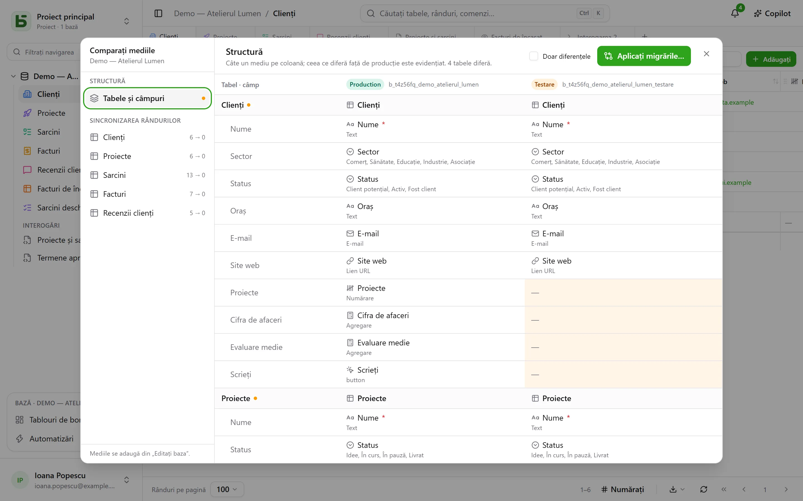

O bază poate avea **medii**: producție, testare, dezvoltare… Fiecare este o bază de sine
stătătoare — cu schema, tabelele, rândurile și permisiunile ei — și toate împart **filiația**
bazei, a tabelelor și a câmpurilor ei.

## În interfață

Bara laterală arată **un singur rând pe bază**, cu o insignă care indică mediul deschis și
permite schimbarea lui. Insigna nu apare cât timp există doar producția.

Mediile se adaugă, se redenumesc și se șterg în **Editați baza…**: un mediu nou se naște
dintr-o **copie a structurii** altui mediu, fără rândurile lui.

## Compararea mediilor

Din meniul bazei, sub **Alte acțiuni**, **Comparați mediile…** deschide un dialog:

- **Structură**: mediile pe coloane, tabelele și câmpurile pe rânduri; ce diferă de producție
  este evidențiat.
- **Aplicați migrările…** pregătește planul pentru a trece de la un mediu la altul, pas cu pas.
  Nu bifează niciodată din oficiu ce ar anula o modificare mai recentă a țintei.
- **Sincronizarea rândurilor**: tabel cu tabel, transferați rânduri dintr-un mediu în altul,
  după identificator.

## Cum știe basedb cine a schimbat ce

Comparația se sprijină pe **istoricul structurilor**: fiecare creare, modificare sau ștergere
de tabel ori de câmp este captată de un trigger pe catalog și se citește în fila „Structură” a
istoricului. Identificatorii de filiație leagă un câmp din testare de omologul său din
producție, chiar dacă a fost redenumit.

## Prin API, SDK și MCP

Un **token creat pentru toată baza** deschide toate mediile ei, cele de azi și cele care se vor
adăuga: un singur token pentru producție și testare. Programul sau agentul alege mediul la fiecare
apel:

| Unde | Cum |
|---|---|
| [API REST](/basedb/ro/integrations/api-rest/#alegerea-mediului) | antetul `X-Basedb-Environment: recette`, sau `?environment=recette` |
| [SDK](/basedb/ro/integrations/sdk/#mediile) | `db.environment('recette')` |
| [MCP](/basedb/ro/integrations/mcp/#alegerea-mediului) | adresa `…/mcp?environment=recette`, sau argumentul `environment` al unui instrument |
| [n8n](/basedb/ro/integrations/n8n/#datele-de-conectare) | câmpul **Environment** al datelor de conectare |

Fără nimic din toate acestea, fiecare bază desemnează propriul mediu: numele producției deschide
producția, cel al testării testarea. Un token poate fi, de asemenea, limitat la crearea sa la
mediul afișat: nu vede atunci niciun altul. În ambele cazuri, permisiunile sale sunt verificate
încrucișat, mediu cu mediu, cu cele ale persoanei care l-a creat.

## În SQL

Fiecare mediu este o schemă: `b_t4z56fq_ventes` pentru producție, `b_t4z56fq_ventes_recette`
pentru testare. Interogările dumneavoastră schimbă mediul schimbând schema — sau
`search_path`-ul.
