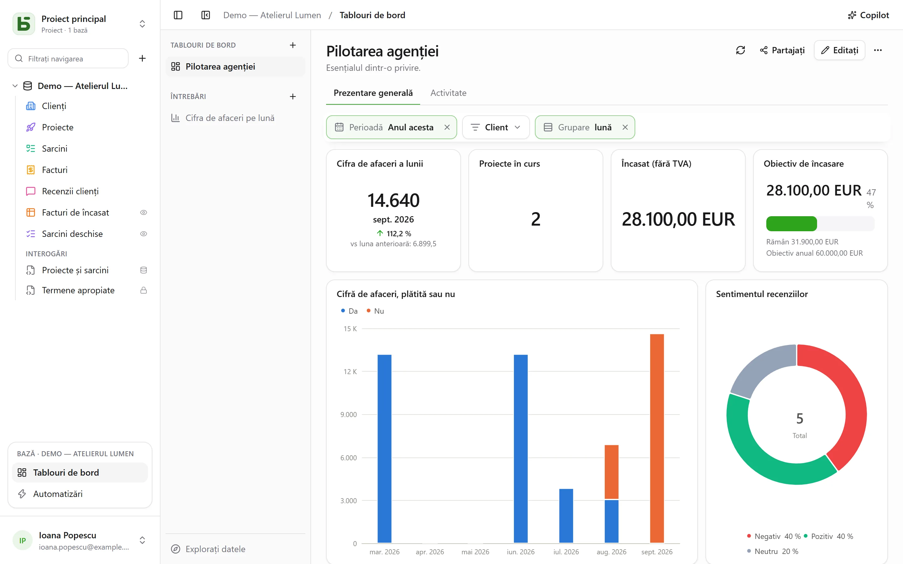
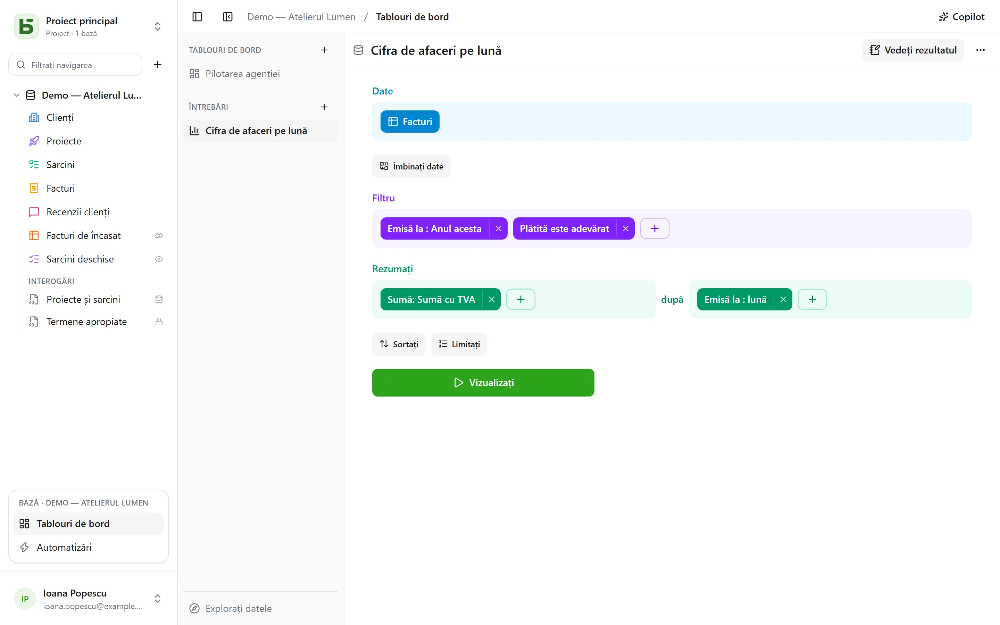
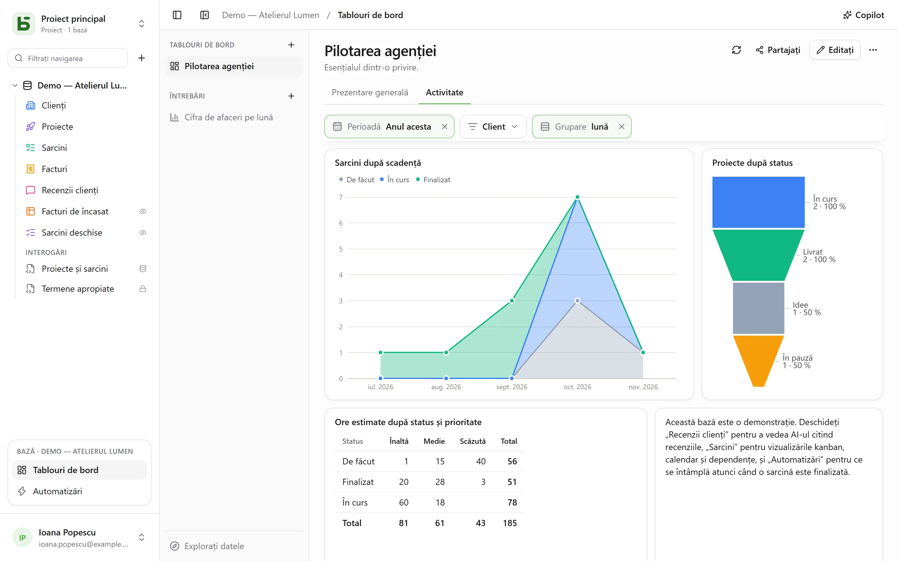

Un **tablou de bord** reunește pe o pagină ceea ce o echipă urmărește în fiecare zi: cifrele
care contează, evoluția lor de la o lună la alta, distribuția unui statut, termenele următoare.
Fiecare card arată acolo o **întrebare** — o citire a bazei, construită cu mouse-ul sau scrisă
în SQL — iar **filtrele** din partea de sus a paginii controlează cardurile legate de ele.



Totul se deschide din **Tablouri de bord**, în blocul bazei deschise din partea de jos a barei
laterale. În stânga, tablourile de bord și întrebările salvate ale bazei, precum și
**Explorați datele** pentru a pune o întrebare fără a salva nimic. Orice cititor al bazei le
poate consulta, le poate explora și își poate salva propriile întrebări; construirea unui
tablou de bord și partajarea unei întrebări cer nivelul **Gestionare**.

O întrebare salvată este **personală** — doar dumneavoastră o vedeți —, pentru **toată baza**
sau pentru **grupuri**. Meniul ei, cu un clic dreapta sau prin **⋯**, o deschide într-o filă
alături de tabele, îi schimbă numele și partajarea sau o șterge. Butonul **+** din bara de file
propune, de asemenea, **Întrebare nouă** și **Întrebare SQL nouă**.

**Salvați**, în antetul unei întrebări, o păstrează; o întrebare pe care nu o puteți modifica
propune în schimb **Salvați o copie**, care devine a dumneavoastră. **⋯** (**Mai multe
acțiuni**) oferă, de asemenea, **Nume și partajare…**, **Salvați o copie…** și **Ștergeți
întrebarea**; o filă care o arăta își păstrează conținutul, redevenit nesalvat.

## Formularea unei întrebări cu mouse-ul

O întrebare se construiește în pași, unul sub altul:



| Pas | Ce alegeți aici |
|---|---|
| **Date** | tabelul de pornire și coloanele arătate atunci când nu se rezumă nimic |
| **Uniți date** | un alt tabel al bazei, legat printr-o relație — propusă automat — sau prin două coloane de aceeași natură; uniune la stânga, interioară, la dreapta sau completă |
| **Filtru** | pe coloană, cu ce propune tipul ei: este / nu este, conține, între, gol…; pentru o dată, o **perioadă**: azi, ultimele 30 de zile, luna aceasta, trimestrul trecut, de la … până la …; sau o expresie scrisă ca în bara vizualizărilor |
| **Rezumați** | măsuri — număr de rânduri, sumă, medie, mediană, minim, maxim, valori distincte, abatere standard, cumulări — **după** una până la trei coloane |
| **Sortați**, **Limitați** | ordinea rândurilor și câte cel mult |

O dată se grupează **pe zi, săptămână, lună, trimestru sau an**, ori pe rang — ziua
săptămânii, luna anului, ora din zi; un număr, pe intervale. O selecție multiplă numără
fiecare rând în fiecare dintre opțiunile sale. Perioadele se citesc în fusul dumneavoastră
orar, iar săptămâna începe în ziua din setările dumneavoastră.

**Vizualizați** lansează întrebarea. Rezultatul se arată în modul care i se potrivește — o
cifră, o linie, bare, un tabel — și se poate schimba din partea de jos a ecranului:

| Reprezentare vizuală | Pentru a arăta |
|---|---|
| **Cifră**, **Tendință**, **Progres**, **Cadran** | o valoare; ultima perioadă față de cea anterioară și față de aceeași de anul trecut; înaintarea spre un obiectiv |
| **Histogramă**, **Bare**, **Linie**, **Arii**, **Combinat** | măsuri de-a lungul unei dimensiuni, în serii alăturate, stivuite sau la 100 % |
| **Sectoare**, **Pâlnie** | părți, etape |
| **Nor de puncte** | două măsuri una față de cealaltă, o a treia ca mărime |
| **Tabel**, **Tabel încrucișat** | rândurile, sortabile; rândurile după o dimensiune, coloanele după alta, cu totalurile lor |
| **Hartă** | regiunile sau departamentele Franței ori țările, colorate după o valoare; sau puncte după latitudine și longitudine |

**Opțiuni** setează ce se arată, iar rezultatul se descarcă în **CSV**.

### Personalizarea unui grafic

| Reprezentare vizuală | Ce propune **Opțiuni** |
|---|---|
| **Bare, linii, arii, combinat** | culoarea și numele fiecărei serii; stivuirea, cu totalul deasupra stivelor; lățimea barelor; linii netezite sau în trepte, cu sau fără puncte; ordinea categoriilor; titlurile axelor, gradațiile, înclinarea etichetelor, limitele, o scară logaritmică; valorile pe grafic; un obiectiv |
| **Sectoare** | un inel și grosimea lui, un semicerc, o rozetă; totalul în centru; numărul de părți înainte de „Altele”; culoarea și numele fiecărei părți; etichetele pe părți sau alături; poziția legendei |
| **Pâlnie** | culoarea și numele fiecărei etape, ordinea lor |
| **Cifră, tendință, progres, cadran** | culoarea, culori în funcție de valoare, o legendă sub cifră, comparația — și dacă o scădere este o veste bună |
| **Tabel, tabel încrucișat** | redenumirea și reordonarea coloanelor, bare în celule, culori în funcție de valoare — pe celulă sau pe rând —, densitatea, rândurile pe pagină, numerele de rând, totalurile |
| **Hartă** | nuanța, numele regiunilor |

Pentru toate, formatul numerelor: zecimale, prefix și sufix, abreviere de tipul `1,2 k`.

## Explorare cu un clic

Un clic pe o bară, un punct sau o parte deschide ce reprezintă acestea:

- **Vedeți aceste rânduri**: rândurile din spatele punctului, filtrate după ce reprezintă el;
- **Detaliați pe săptămână**: o perioadă deschisă pe una mai fină — un an pe trimestrele lui, o
  lună pe săptămânile ei;
- **Împărțiți după…**: aceeași măsură, pentru acest punct, după o altă coloană;
- **Doar această valoare**, **Excludeți această valoare**.

Fiecare pas este o întrebare separată, care se poate salva dacă doriți; săgeata înapoi revine
la pasul anterior. Un rând dintr-un tabel își deschide detaliile.

Pe un tablou de bord, același clic propune și **Filtrați tabloul: „Lyon”**, cu numărul de
carduri vizate: un filtru **temporar**, niciodată salvat, afișat punctat în bara filtrelor și
care se poate elimina cu un clic, aplicat fiecărui card a cărui întrebare citește aceeași
coloană — prin tabelul ei sau printr-o uniune. Este propus doar dacă niciun filtru al
tabloului nu este deja legat de această coloană pe card și rămâne estompat („singurul card”)
atunci când niciun alt card nu o citește. Întrebările SQL nu țin cont de el.

## Scrierea unei întrebări în SQL

O **întrebare SQL** este un `SELECT` pe tabelele bazei, sub numele lor real. Se execută
**doar în citire, cu propriile dumneavoastră permisiuni** — pentru toată lumea, inclusiv pentru
cei care gestionează baza: un tabel care vă este închis nu există, un câmp ascuns este refuzat,
iar o scriere este imposibilă. Pentru a așeza pur și simplu o interogare sub tabele, fără
grafic, sau pentru a face din ea o vizualizare PostgreSQL reală, consultați
[Interogări și vizualizări SQL](/basedb/ro/fonctionnalites/requetes-et-vues-sql/).

O **variabilă** se scrie `{{nom}}`; o parte de eliminat atunci când nu are valoare, între
`[[` și `]]`:

```sql
SELECT statut, count(*) AS taches
  FROM taches
 WHERE {{periode}} [[AND priorite = {{priorite}}]]
 GROUP BY statut
```

O variabilă este un text, un număr, o dată — sau un **filtru de coloană**: `{{periode}}`
devine atunci o condiție întreagă pe coloana aleasă, aici `echeance`, sau `TRUE` când nu este
ales nimic. Astfel un filtru al tabloului de bord poate controla o întrebare SQL ca pe
celelalte.

## Aranjarea unui tablou de bord

**Editați** trece tabloul în modul de editare:

- **Întrebare** plasează o întrebare salvată — o întrebare personală este copiată aici —, sau
  creează una proprie cardului;
- **Titlu** adaugă un titlu de secțiune, **Text** un text formatat — titluri, liste,
  linkuri — care poate cita cifre (vedeți mai jos);
- **Pagină încorporată** afișează o adresă `https://` într-un cadru izolat, care nu primește
  nici sesiune, nici date;
- **Filă** repartizează cardurile pe mai multe pagini; un dublu clic redenumește o filă.

Cardurile se mută trăgând de mânerul lor și se redimensionează din colț, pe o grilă de 24 de
coloane. **Salvați** păstrează totul; **Anulați** revine la versiunea anterioară. Titlul unui
card, în modul de citire, îi deschide întrebarea pentru explorare, inclusiv cu filtrele
tabloului.

### Cifre în text

Un text citează o valoare printr-un nume între acolade duble: „În luna aceasta,
`{{chiffre_affaires}}` cifră de afaceri din `{{commandes}}` comenzi.” Fiecare nume devine o
pastilă, de legat cu un clic — sau prin **Variabilă** din bara editorului — de:

| Sursă | Ce arată textul |
|---|---|
| **un card** al tabloului | ceea ce arată el, sub propriile sale filtre |
| **o întrebare salvată** din toată baza | valoarea ei, iar filtrele tabloului se leagă de ea ca de un card |
| **o întrebare păstrată în text** | valoarea ei; astfel se citează o întrebare personală |
| **un filtru** al tabloului | valoarea aleasă, așa cum o spune comanda lui |

Valoarea unei întrebări este cea pe care ar arăta-o **Cifra** ei: prima ei măsură, pe ultimul
rând. Se calculează cu permisiunile cititorului și se afișează întotdeauna ca text. Un text
citează cel mult 20 de valori; un nume se scrie cu litere mici, cifre și `_`. Textele scrise în
Markdown înainte de editor se citesc ca înainte și devin formatate de îndată ce sunt rescrise.
Copilot, la rândul lui, își scrie textele în Markdown.

## Filtrele

**Filtru** adaugă un control în partea de sus a tabloului: o **dată** (o perioadă), o
**categorie** (valori de bifat), un **text**, un **număr** sau o **grupare de dată** care
trece liniile de la lună la săptămână sau la an.

Un filtru controlează cardurile legate de el — unul, mai multe sau toate. La creare se leagă
singur de coloanele potrivite; selectat, arată pe fiecare card coloana pe care o filtrează, de
schimbat sau de eliminat, iar **Legați de toate cardurile compatibile** completează restul.
Poate avea o **valoare implicită** — „Anul acesta”, de exemplu.

În modul de citire, un clic pe un punct poate seta și un filtru: **Filtrați după „Lyon”** pe un
card a cărui coloană de orașe este legată de filtrul „Ville”.



## Copilot

**Copilot**, în antetul secțiunii Tablouri de bord, deschide în dreapta o conversație în limbaj
natural despre bază: „cifra de afaceri pe lună”, „adaugă un filtru pe client”, „de ce scade
august?”. Fiecare propunere sosește ca un card, care se aplică cu un clic:

| Propunere | Ce face |
|---|---|
| **O întrebare** | executată și desenată în conversație; se deschide în editor sau se adaugă în tablou |
| **Modificări ale tabloului** sau un tablou nou | carduri adăugate, modificate sau eliminate, texte, filtre legate automat de cardurile care au coloana, file, nume — o singură salvare, **anulabilă** din card |
| **Valori pentru filtrele afișate** | „arată-mi luna trecută”: filtrele se setează, nimic nu este salvat |

Formularea unei întrebări sau setarea filtrelor este deschisă oricărui cititor al bazei;
modificarea sau crearea unui tablou cere nivelul **Gestionare**.

În mod implicit, **doar structura** pleacă la furnizorul de AI, împreună cu conversația:
tabelele și câmpurile lor, tablourile și întrebările salvate ale bazei și tabloul afișat —
filele, filtrele, definiția cardurilor lui (întrebările lor, textele lor). Nici rândurile, nici
rezultatele cardurilor, nici **valorile alese în filtre**, care pot fi date: dintr-un filtru
pleacă doar faptul că are o valoare. Un câmp marcat ca invizibil pentru agenți nu pleacă, nici
întrebarea unui card care îl citează.

Caseta **Permiteți citirea datelor** adaugă, pentru conversația respectivă, valorile filtrelor
afișate și rezultatele cardurilor sub aceste filtre (cel mult 50 de rânduri la o citire,
listate sub răspuns), pentru a comenta cifrele cu argumente. Consultați
[Inteligență artificială](/basedb/ro/fonctionnalites/ia/).

## Partajarea unui tablou de bord

**Partajați**, în antetul unui tablou de bord, este disponibil pentru cine are nivelul
**Gestionare** pe bază. Două căi:

- **Partajați baza…** invită persoane în bază: ele deschid tabloul în basedb, iar fiecare card
  citește cu propriile lor permisiuni;
- **Creați linkul** dă un link către **doar** acest tablou, care nu cere nicio permisiune
  asupra bazei.

| Accesul linkului | Cine citește |
|---|---|
| **Public** | oricine are linkul, fără cont |
| **Membri conectați** | un membru al spațiului de lucru, după conectare — la nevoie, doar din anumite grupuri |

Pagina linkului arată filele, filtrele și cardurile tabloului, **doar în citire**: fără
explorare, fără acces la rânduri, fără întrebări proprii. Cardurile ei citesc cu
**permisiunile persoanei care a publicat linkul**, reevaluate la fiecare citire: dacă aceasta
pierde accesul la bază, linkul este **suspendat**. Comutatorul **Link activ** îl oprește fără
a-l pierde, **Regenerați** îl invalidează pe cel vechi.

Bifați **Permiteți încorporarea în alt site**: dialogul oferă un **cod de încorporare**
`<iframe>`, pentru a afișa tabloul într-un intranet sau într-un wiki. Este același mecanism ca
pentru [vizualizările partajate](/basedb/ro/fonctionnalites/vues-partagees/).

## Fiecare cu permisiunile sale

Fiecare card citește **cu permisiunile celui care privește**: același tablou îi arată
fiecăruia ce are dreptul să vadă — cu excepția unui link de partajare, care citește cu
permisiunile persoanei care l-a publicat. Un card care privește un tabel sau un câmp care vă
este închis afișează „Date inaccesibile”, în loc de o cifră care ar minți prin omisiune.
Salvarea unei întrebări partajează doar întrebarea, niciodată ce poate citi autorul ei.

## Limite

- O întrebare returnează cel mult 2 000 de rânduri; un rezumat se mulțumește aproape
  întotdeauna cu atât.
- Fiecare card își face interogarea la deschidere și la fiecare filtru, fără cache.
- Fundalurile de hartă acoperă Franța metropolitană (regiuni, departamente) și țările lumii.
  Sursă: IGN, Admin Express (Licence ouverte); Natural Earth.
