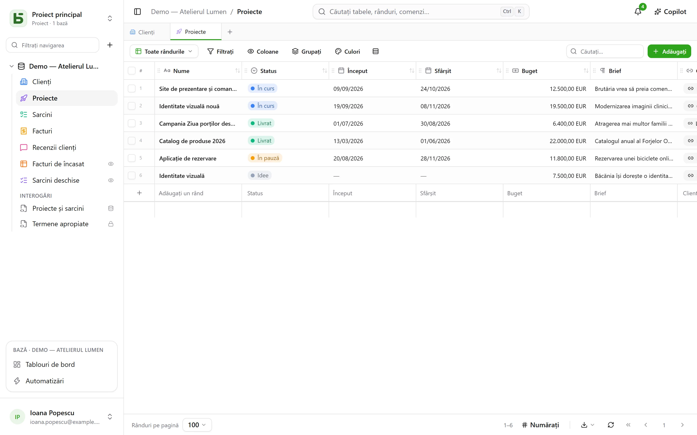
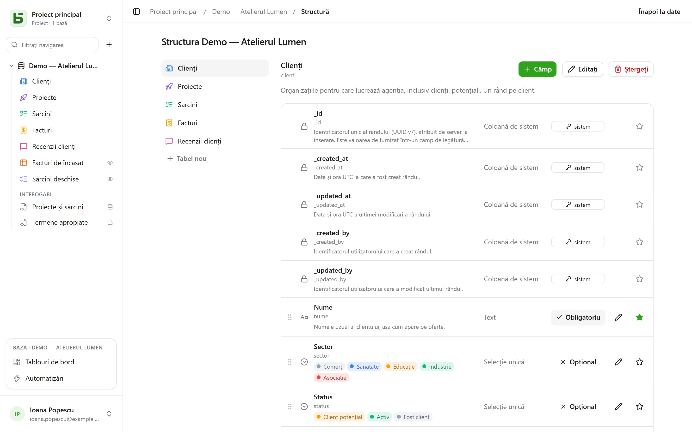

Fiecare tabel din basedb este un tabel PostgreSQL; fiecare câmp, o coloană tipizată. Eticheta
pe care o introduceți („Échéance”) devine un nume fizic lizibil (`echeance`) printr-o
**slugificare** stabilă: fără diacritice, cu litere mici, fără cuvinte rezervate.

## Tipurile

| Tip | Coloană PostgreSQL | Observații |
|---|---|---|
| Text scurt | `text` | un singur rând |
| Text lung | `text` | Markdown: un fragment în grilă, randarea la trecerea cu mouse-ul, un editor dedicat; poate [cita o coloană](#text-formatat-și-variabile) |
| Text formatat | `text` + `CHECK` | HTML curățat la scriere, redactat într-un editor vizual — [vedeți mai jos](#text-formatat-și-variabile) |
| Număr | `numeric` | niciodată virgulă mobilă: o sumă nu derivă |
| Monedă, Procent, Durată, Evaluare | `numeric` | un număr și [formatul său de afișare](#formate-de-afișare): `12,50 €`, `15 %`, `1:30`, ★★★★☆ |
| Casetă de selectare | `boolean` | |
| Dată | `date` | |
| Dată și oră | `timestamptz` | un moment absolut, afișat în fusul orar al cititorului |
| Selecție unică | `text` + `CHECK` | culoare, pictogramă sau imagine pentru fiecare opțiune |
| Selecție multiplă | `text[]` + `CHECK` | filtrabilă cu operatorii de tablou |
| E-mail | `text` + `CHECK` | o adresă verificată de baza de date, deschisă cu un clic |
| Telefon, Cod de bare, Adresă | `text` | un text scurt și formatul său: link de apel, font monospațiat, link către hartă |
| URL | `text` + `CHECK` | completat la introducere (`exemple.fr` → `https://exemple.fr`) |
| Persoană | `uuid` | un membru al spațiului de lucru; desemnarea lui îl [anunță](/basedb/ro/fonctionnalites/collaboration/) |
| Număr automat | `bigint` identitate | numerotează și rândurile deja existente; nimeni nu îl introduce |
| Relație | `uuid` + `FOREIGN KEY` | o cheie străină reală către tabelul țintă |
| Relație multiplă | `uuid[]` | mai multe rânduri legate, a căror integritate este asigurată de un trigger |
| Formulă | coloană generată `STORED` | calculată de PostgreSQL — sau la citire, vedeți [Formule](#formule) |
| Căutare, Agregare, Numărare | niciuna | calculate la citire, printr-o relație |
| Buton | niciuna | deschide o adresă sau lansează o [automatizare](/basedb/ro/fonctionnalites/automatisations/) |
| Fișier, Imagine | `jsonb` (metadate) | octeții merg în [stocarea de fișiere](/basedb/ro/fonctionnalites/fichiers/) |

Fiecare tabel are și **coloanele de sistem**: `_id` (UUID v7), `_created_at`,
`_updated_at`, `_created_by`, `_updated_by` — întreținute de un trigger, niciodată
inscriptibile prin API. Grila le grupează sub **Informații de sistem**, în meniul coloanelor:
există în fiecare tabel și sunt utile în puține.



## Constrângeri garantate de baza de date

Ce promite interfața, garantează PostgreSQL. O selecție unică este o constrângere `CHECK`; o
relație, o `FOREIGN KEY`; un URL sau o adresă de e-mail, o expresie regulată. O scriere în
SQL direct care le încalcă este refuzată, ca în interfață:

```text
Check constraints:
  "ck_opportunites__statut__enum" CHECK (statut = ANY (ARRAY['nouveau', 'qualifie', …]))
Foreign-key constraints:
  "fk_opportunites__clients_id" FOREIGN KEY (clients_id) REFERENCES b_t4z56fq_ventes.clients(_id)
```

## Formate de afișare

Monedă, Procent, Durată, Evaluare, Telefon, Cod de bare și Adresă se aleg ca tipuri, dar sunt
**formate**: coloana rămâne un număr sau un text, doar citirea se schimbă.

| Format | Pe | Se citește și se introduce |
|---|---|---|
| Monedă | un număr | `12 500,00 €` — euro, dolar, liră sterlină, franc elvețian, dolar canadian, yen |
| Procent | un număr | `15 %` |
| Durată | un număr de secunde | `1:30`, și se introduce `1h30`, `90 min` |
| Evaluare | un număr | de la 1 la 10 stele, setată cu un clic |
| Telefon | un text scurt | un link de apel |
| Cod de bare | un text scurt | cu font monospațiat |
| Adresă | un text scurt | un link către hartă; în fișă, **Găsiți adresa** propune adresele care corespund, scrise integral; vizualizarea [Hartă](/basedb/ro/fonctionnalites/vues/#hartă) o așază |

Un format se poate schimba ulterior (**Afișare**, la editarea câmpului) fără a atinge valorile
salvate. El nu limitează valoarea: o evaluare de 7 pe o scară de 5 rămâne 7.

## Valori implicite

La modificarea unui câmp, **Valoare implicită** fixează ce primește un rând creat fără el:

| Alegere | Pe | Rândul creat primește |
|---|---|---|
| O valoare fixă | majoritatea tipurilor | valoarea aleasă — un statut „Nou”, o prioritate 3 |
| Data de astăzi | o dată | ziua creării sale, în fusul orar al persoanei |
| Momentul creării | o dată și oră | ora exactă |
| Persoana care creează rândul | o persoană | cine l-a creat — „Responsabil: eu” |

Fișa nouă și formularele se deschid precompletate; golirea câmpului îl lasă gol. Valoarea
implicită se aplică la orice creare — interfață, API, MCP, import, formular partajat,
automatizare —, inclusiv pe un câmp pe care persoana nu îl poate modifica: aceasta este regula
tabelului. Rândurile existente nu se schimbă, iar o inserare în SQL direct nu primește niciuna:
basedb o aplică, nu coloana.

## Formule

O formulă se scrie în engleză (merg și numele în franceză), cu câmpurile între paranteze drepte și argumentele separate prin `,`:

```text
ROUND([Montant HT] * (1 + [Taux de TVA]), 2)
IF([Payée], FALSE, DAYS(TODAY(), [Échéance]) > 0)
DAYS([Fin], [Début])
```

Editorul propune câmpurile de inserat și un panou cu funcțiile; o eroare numește câmpul sau
caracterul în cauză.

| Familie | Funcții |
|---|---|
| Logică | `IF`, `IFBLANK`, `ISBLANK`, `AND`, `OR`, `NOT`, `TRUE`, `FALSE` |
| Numere | `ROUND`, `ABS`, `CEILING`, `FLOOR`, `MIN`, `MAX` |
| Text | `UPPER`, `LOWER`, `TRIM`, `LEFT`, `RIGHT`, `LEN`, `TEXT`, `VALUE` |
| Date | `YEAR`, `MONTH`, `DAY`, `WEEKDAY`, `DAYS`, `ADD_DAYS`, `DATE`, `TODAY`, `NOW` |
| Operatori | `+ - * /`, `&` pentru a alătura text, `= <> < <= > >=` |

O formulă devine o **coloană generată** de PostgreSQL: `psql` și instrumentele dumneavoastră
o citesc ca pe celelalte. Cea care depinde de ziua curentă (`TODAY()`, `NOW()`)
sau care citează o căutare ori o agregare este **calculată la citire**: se poate filtra și
sorta în basedb, dar nu există în SQL direct.

O formulă nu citează nici o altă formulă, nici direct o relație — o căutare face asta.
Extragerea sau înlocuirea unei părți dintr-un text vor veni ulterior.

## Căutări, agregări și numărări

Trei câmpuri citesc **printr-o relație**, într-un sens sau în celălalt — „clientul
proiectului”, dar și „sarcinile legate prin Proiect”:

- o **căutare** aduce o valoare din rândul legat sau lista valorilor: orașul clientului unui
  proiect;
- o **agregare** calculează pe rândurile legate: numărul de valori, suma, media, minimul,
  maximul — cifra de afaceri a unui client, evaluarea medie a recenziilor sale;
- o **numărare** numără rândurile legate: numărul de sarcini ale unui proiect.

Sunt calculate la fiecare citire, **cu permisiunile celui care citește**: dacă tabelul legat
vă este închis, câmpul este și el închis. Se pot filtra și sorta. Urmează o singură relație,
nu se pot scrie, nu au coloană — deci nu există în SQL direct — și nu apar nici în import,
nici în formulare, nici în istoric.

## Relațiile

O **relație** leagă un rând de un rând dintr-un alt tabel al aceleiași baze. Grila afișează
**valoarea de afișare** a rândului țintă — coloana pe care o desemnați ca atare pentru tabelul
său — iar filtrele traversează relația (`clients_id.ville eq "Lyon"`). Rândurile care trimit
către un rând apar în detaliile acelui rând.

Bifați **Mai multe rânduri pe înregistrare** și relația devine **multiplă**: o sarcină depinde
de mai multe sarcini, un articol aparține mai multor categorii. Rândurile legate apar ca
etichete, se aleg printr-o căutare și se deschid cu un clic din detaliile rândului. Ștergerea
unui rând țintă îl scoate din listele care îl citau — sau este refuzată, dacă ați ales asta.
Filtrele `has_any`, `has_all` și `is_null` se aplică și traversează și ele relația
(`taches_ids.titre contains "logo"`). O relație multiplă nu se sortează, nu grupează și nu se
importă încă.

## Buton

Un câmp **Buton** nu are valoare: acționează. **Deschide o adresă** — `https://` sau
`mailto:`, care poate cita rândul (`mailto:{{E-mail}}`) — sau **lansează o automatizare**
declanșată de un buton pe același tabel. Apare în celulă, pe card și în detaliile rândului.

## Descrieri

O bază, un tabel și un câmp au o **descriere**, modificabilă fără migrare. Ea este copiată în
`COMMENT ON` pe care îl citește `psql`, în documentația generată și în ceea ce citește un agent
prin `describe_table`.

## Text formatat și variabile

**Textul formatat** este varianta HTML a textului lung, aleasă la crearea câmpului
(„Text formatat (HTML)”): titluri, aldin, cursiv, subliniat, tăiat, liste, citate, cod, linkuri
și separatoare, într-un editor vizual. HTML-ul este **curățat la scriere**, fie că vine din
interfață, din API, din serverul MCP sau dintr-un import, iar o constrângere `CHECK` refuză în
plus formele periculoase scrise direct în SQL (`<script>`, atribute `on…`, `javascript:`).
Nici imagini, nici tabele, nici culori: ce nu ar păstra baza de date nu este propus.

Un text lung — simplu sau formatat — poate **cita o coloană a rândului său**. Meniul
**Coloană** al editorului inserează citarea la cursor: o etichetă în textul formatat,
`{{Ville}}` în Markdown.

> Livrare prevăzută pe `{{Livraison}}` la `{{Ville}}`.

- Coloana păstrează citarea așa cum a fost scrisă — `{{ville}}`, după numele ei fizic: asta
  citește `psql`.
- Peste tot în altă parte — grila, detaliile rândului, API-ul, serverul MCP, vizualizările
  partajate, automatizările — textul se citește **cu valoarea din rând**: „Livrare prevăzută
  pe 02/10/2026 la Lyon.” Schimbarea orașului schimbă textul.
- O selecție unică se citește după eticheta ei, o persoană după numele ei, o dată în formatul
  dumneavoastră; o valoare inserată în text formatat nu este niciodată marcaj.
- O coloană pe care cititorul nu o poate citi nu dă nimic: nici valoarea, nici numele ei.

Textul formatat nu poate fi completat de AI: un model scrie text, nu HTML curățat.

## Modificarea structurii

Ecranul **Structură** al bazei — în meniul ei **⋯** din bara laterală — listează tabelele și câmpurile lor: adăugare, redenumire, marcare ca obligatoriu, reordonare,
descriere, desemnarea câmpului de afișare.



Modificarea structurii cere nivelul **Gestionare**. Fără el, ecranul poate fi consultat și nu
propune nimic: niciun buton, niciun creion, niciun mâner — caracterul obligatoriu și câmpul de
afișare sunt indicate, nu oferite. Serverul refuză oricum fiecare modificare; ecranul nu mai
pretinde că o acceptă.

Adăugarea, redenumirea sau schimbarea tipului unui câmp trec prin **motorul de migrări**: un
plan în pași, blocări scurte și un refuz explicit atunci când o valoare nu se poate converti.

**Redenumirea** unei baze, a unui tabel sau a unui câmp se face într-un singur dialog. Eticheta
se schimbă întotdeauna, fără migrare. Un administrator vede dedesubt „Redenumiți și în baza de
date: `clients` → `comptes`”: bifată, opțiunea schimbă și numele fizic, iar analiza de impact
se afișează — interogările, vizualizările SQL și automatizările care citează vechiul nume.
Vechiul nume rămâne servit de un **alias de compatibilitate** — o vizualizare — cât timp vă
actualizați interogările.

Ștergerea nu elimină nimic imediat: tabelul sau baza este retrogradată
(`zz_supprime_…`) și rămâne lizibilă în SQL. O bază ștearsă se poate restaura; readucerea unui
singur tabel din interfață [va veni](/basedb/ro/feuille-de-route/). **Purjarea** definitivă
este rezervată administrării, după treizeci de zile, și începe cu un export CSV verificat.
