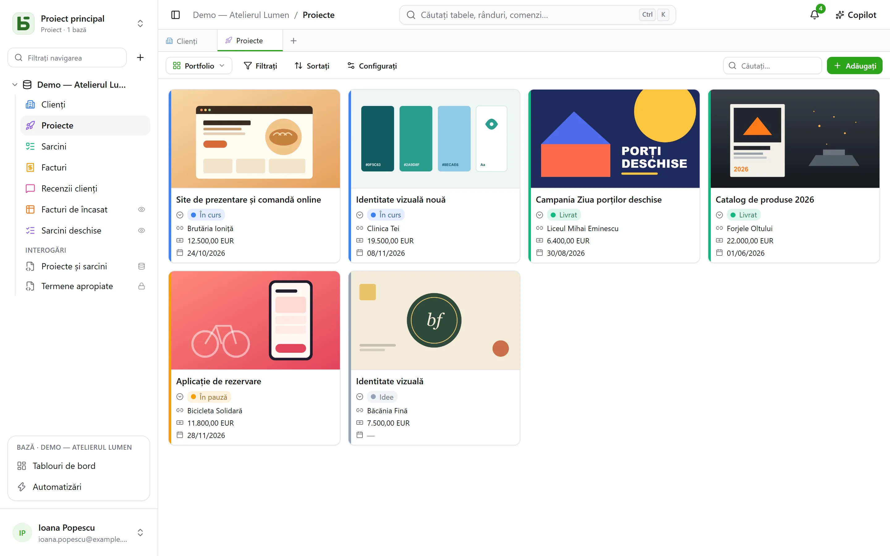
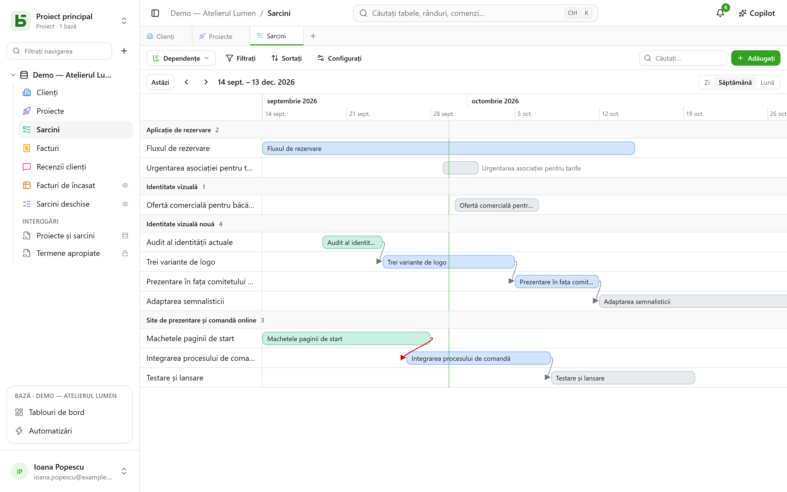
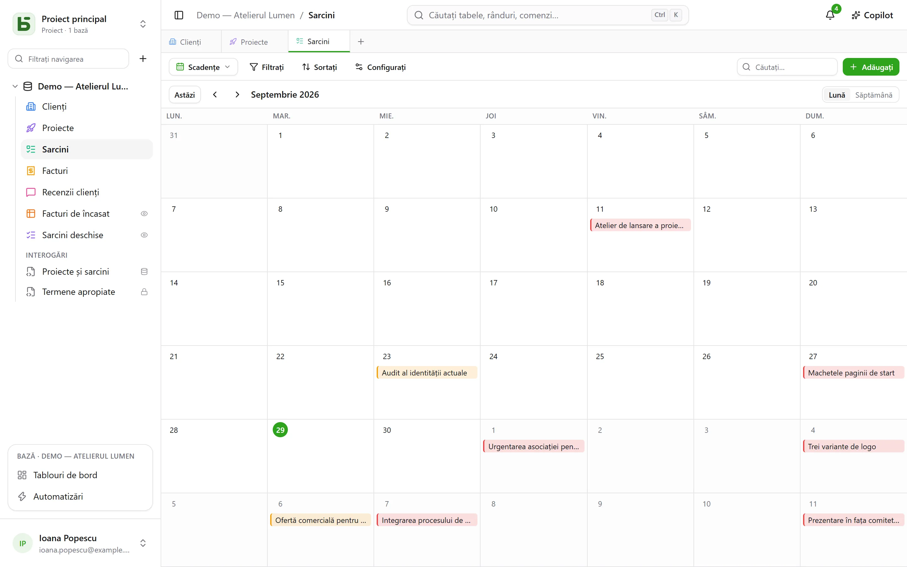
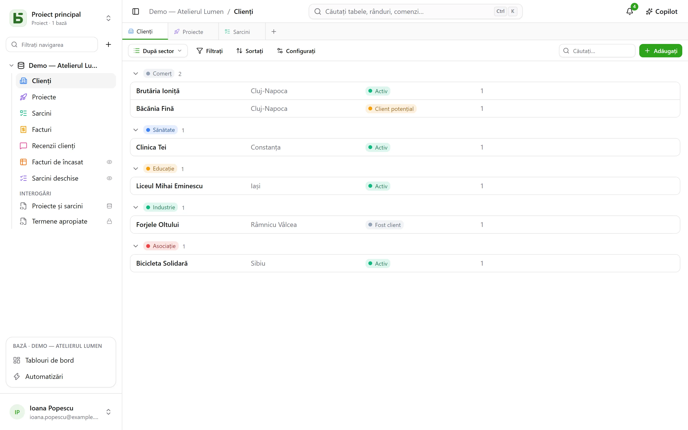

Un tabel se arată în **zece moduri**. O vizualizare nu copiază nicio dată și nu dă nicio
permisiune în plus față de tabelul însuși.

:::note
Aceste vizualizări sunt moduri de a arăta **un** tabel. O [vizualizare SQL](/basedb/ro/fonctionnalites/requetes-et-vues-sql/)
este altceva: o vizualizare PostgreSQL reală, scrisă în SQL pe tabelele bazei și așezată
printre ele în bara laterală.
:::

| Vizualizare | Ce arată | De ce are nevoie |
|---|---|---|
| **Grilă** | rânduri filtrate, sortate, grupate, cu coloanele alese | — |
| **Kanban** | carduri pe coloane | o selecție unică |
| **Calendar** | rânduri la data lor, pe lună sau pe săptămână | un câmp de tip dată |
| **Cronologie** | bare între două date și dependențele lor | o dată de început |
| **Galerie** | carduri, cu o imagine de copertă | — |
| **Listă** | un rând pe înregistrare, în grupuri care se pot restrânge | — |
| **Hartă** | fiecare rând așezat pe o hartă | o adresă, sau o latitudine și o longitudine |
| **Formular** | o pagină de întrebări pentru a crea un rând | — |
| **Chestionar** | aceleași întrebări, câte una pe ecran | — |
| **Quiz** | întrebări notate, una pe ecran, și punctajul la final | — |

## Selectorul de vizualizări

Se află în stânga butonului „Filtrați”. „Toate rândurile” este grila tabelului, pe care nimeni
nu a salvat-o și nimeni nu o poate șterge; urmează **vizualizările colaborative**, în ordinea
aleasă de cine construiește baza, apoi **Vizualizările mele**. Mai jos, **Creați o vizualizare**
așază cele zece tipuri în două familii: cele care **arată rândurile** și cele care **colectează
răspunsuri** (formular, chestionar, quiz).

- O **vizualizare colaborativă** este văzută de toți. Crearea, configurarea, redenumirea,
  reordonarea sau ștergerea ei cer nivelul **Gestionare**. Poate fi **blocată**: un lacăt
  indică acest lucru și nimeni nu o mai modifică înainte de a o debloca.
- O **vizualizare personală** este văzută doar de dumneavoastră și cere doar posibilitatea de
  a citi tabelul. **Creați o vizualizare personală** sau **Salvați ca vizualizare** după ce ați
  filtrat și sortat: fiecare își păstrează propriile moduri de citire, fără a schimba nimic
  pentru ceilalți. **Duplicați**, pe o vizualizare colaborativă, face din ea o copie personală.

## Bara de instrumente

Deasupra grilei, în această ordine:

- **Filtrați** combină condiții pe câmpuri;
- **Coloane** alege ce se afișează — coloanele de sistem sunt separate, sub
  „Informații de sistem”;
- **Grupați** așază rândurile după un câmp cu valoare unică — selecție unică, relație,
  persoană, dată, număr, text, casetă de selectare… — în grupuri care se pot restrânge, fiecare
  cu numărătoarea sa pe întregul filtru;
- **Culori** colorează rândurile după o selecție unică sau după **reguli** — un filtru și o
  culoare, cel mult douăzeci — ca linie, ca fundal sau ambele;
- **Înălțimea rândurilor**: scurtă, medie, înaltă, foarte înaltă;
- **Căutați…**, în dreapta, caută în toate coloanele pe măsură ce tastați; Esc golește
  căutarea. Funcționează și pentru kanban, calendar, cronologie, galerie și listă și nu este
  niciodată salvată în vizualizare.

Sub fiecare coloană, un **Rezumat** calculat pe toate rândurile filtrului, nu doar pe pagină:
completate, goale, valori unice, sumă, medie, minim, maxim, casete bifate.

## Kanban, calendar, cronologie

- **Kanbanul** așază cardurile după o selecție unică; tragerea unui card modifică rândul, un
  „+” în capul coloanei creează un rând care are deja această opțiune. Fiecare card arată un
  titlu, o imagine de copertă, câmpurile alese și o **descriere** care citează valorile
  rândului — „Livrare prevăzută pe `{{Date}}` pentru `{{Client}}`” —, scrisă în setările
  vizualizării cu butonul **Inserați un câmp**.
- **Calendarul** plasează fiecare rând la data sa, cu o eventuală dată de sfârșit; tragerea
  unui rând de pe o zi pe alta îl mută.
- **Cronologia** trasează bare între o dată de început și o dată de sfârșit, grupate după o
  selecție unică sau o relație. Cu setarea **Depinde de** — o relație a tabelului către el
  însuși — o săgeată leagă fiecare sarcină de cele de care depinde, roșie atunci când merge
  înapoi în timp.

## Galerie și listă

- **Galeria** arată carduri: o **imagine de copertă** (decupată sau întreagă), o dimensiune
  (carduri mici, medii, mari), o culoare după o selecție unică.
- **Lista** arată un rând pe înregistrare, **grupat** după o selecție unică, o relație sau o
  persoană.

În kanban, galerie și listă, cardurile și rândurile se **ordonează manual** prin tragere — până
la 5 000; o sortare aleasă are prioritate față de această ordine.

## Hartă

**Harta** așază fiecare rând la locul lui, pe baza:

- unei **adrese** — un text scurt, de preferință în formatul **Adresă** (vedeți
  [Tabele și câmpuri](/basedb/ro/fonctionnalites/tables-et-champs/)): „12 rue des Lilas, Lyon”;
- sau a unei **latitudini** și a unei **longitudini**, două câmpuri număr, plasate ca atare.

Un pin ia **culoarea** unei selecții unice, arată **titlul** rândului la trecerea cu mouse-ul, și
îi deschide fișa la clic. Harta urmează filtrul și sortarea vizualizării, până la 2 000 de
rânduri.

O adresă este **localizată o singură dată pentru totdeauna** de serviciul de geocodare al
instanței — cel al OpenStreetMap în mod implicit —, în ritmul pe care acesta îl impune: pe o
hartă nouă, pinii apar pe măsura răspunsurilor, unul pe secundă aproximativ, apoi imediat de
fiecare dată următoare. O pastilă numără rândurile plasate, adresele încă de localizat și cele
care nu au putut fi: o adresă negăsită trebuie precizată (oraș, cod poștal), niciodată înlăturată
în tăcere.

:::note[Ce părăsește serverul dumneavoastră]
Textul adreselor pleacă spre serviciul de geocodare, iar browserul fiecărui cititor încarcă
fondul de hartă de pe serverul de tile-uri. Operatorul instanței poate alege alte servicii, sau
poate să nu vrea niciunul: vedeți
[Variabile de mediu](/basedb/ro/hebergement/variables/#hărți-și-adrese).
:::

## Formular și chestionar

Bifați întrebările și ordonați-le; fiecare are un enunț, un text de ajutor, un exemplu de răspuns
și poate fi făcută obligatorie. Formularul are titlul său, prezentarea sa, eticheta butonului și
mesajul de mulțumire. Se completează în basedb sau se [partajează printr-un link](/basedb/ro/fonctionnalites/formulaires-partages/).

Nu trebuie reglat nimic pentru a începe: un formular nou întreabă ce răspunde o persoană — nu
starea, persoana desemnată sau relațiile pe care echipa le completează ulterior, cu excepția
cazului în care sunt obligatorii —, poartă culoarea tabelului său și o temă deschisă la culoare, iar
fiecare câmp gol arată un exemplu potrivit. Tot restul se schimbă oricând:

- **Aspect**: opt teme — Luminoasă, Blândă, Auroră, Ocean, Pădure, Noapte, Hârtie, Minimalistă —,
  o culoare de accent, un font, o aliniere la stânga sau centrată;
- **Completează în prealabil cu data de azi**: o întrebare de tip dată vine deja completată cu
  ziua de azi — și cu ora, pentru dată și oră —, pe care persoana o păstrează sau o schimbă;
- **Întrebați doar dacă…**: o întrebare se pune doar dacă un răspuns anterior o cere („Sentiment
  este Negativ”, „Notă este cel mult 2”). O întrebare ascunsă nu este nici obligatorie, nici
  trimisă;
- **Mai multe opțiuni**: butoanele de bun venit și de trimitere, numerele, bara de progres,
  trecerea automată la următoarea, mesajul și un buton de final („Înapoi la site”), confetti.

**Chestionarul** ocupă tot ecranul: un mesaj de bun venit care spune cât timp durează, apoi câte o
întrebare pe rând, care apare alunecând. Totul se poate face și de la tastatură: **Enter** pentru a
continua, literele **A**, **B**, **C**… pentru o alegere, **D** sau **N** pentru da sau nu, cifrele
pentru o notă — o alegere unică trece singură la întrebarea următoare. Trimiterea se sărbătorește:
o bifă care se desenează și confetti în culorile formularului.

## Quiz

Un quiz este un chestionar care numără punctele. Sub fiecare întrebare, dați **răspunsul
corect** și cât valorează el — **1 punct** dacă nu spuneți nimic, până la 100:

| Întrebare | Răspuns corect |
|---|---|
| selecție unică | o opțiune |
| selecție multiplă | opțiunile care trebuie bifate, toate și numai ele |
| casetă de selectare | da sau nu |
| număr, evaluare | un număr |
| dată | o zi |
| text scurt, e-mail, URL | unul sau mai multe răspunsuri acceptate, separate prin `;` — fără a ține cont de majuscule sau de diacritice |

O întrebare fără răspuns corect — un prenume, un comentariu — este pusă fără a fi notată. Este
nevoie de cel puțin una notată pentru a crea quizul.

Secțiunea **Notare** reglează restul:

- **Corectare**: **după fiecare întrebare** — răspunsul se verifică imediat, verde, sau roșu cu
  răspunsul corect, iar punctajul crește în partea de sus a ecranului —, **la final** — punctajul,
  apoi corectarea —, sau **niciodată** — doar punctajul, răspunsurile corecte rămân secrete;
- **Pragul de promovare**: un procent din puncte; ecranul final spune atunci „Promovat!” sau
  „Nu de data aceasta…”;
- **Salvați punctajul în**: un câmp număr al tabelului, care primește punctajul fiecărui
  răspuns. Sortați grila după el: iată clasamentul. Un câmp numit „Punctaj”, „Puncte” sau
  „Notă” este ales automat.

Ecranul final arată punctajul într-un inel care se umple, procentul și, cu excepția lui
„niciodată”, fiecare întrebare notată cu răspunsul dat și cel corect. O întrebare pe care un
răspuns anterior a ascuns-o nu contează în total.

:::note
În aplicație, cine poate citi vizualizarea îi poate citi răspunsurile corecte. Printr-un
[link partajat](/basedb/ro/fonctionnalites/formulaires-partages/#un-quiz-partajat), acestea nu
părăsesc niciodată serverul: el este cel care corectează și numără.
:::

## Partajarea unei vizualizări

O vizualizare de date — grilă, kanban, calendar, cronologie, galerie, listă — se **partajează
doar în citire** printr-un link, se încorporează în alt site, iar un calendar devine un flux de
calendar. Consultați [Vizualizări partajate](/basedb/ro/fonctionnalites/vues-partagees/).

## Ce nu vede cititorul

O vizualizare este **reproiectată pentru cititorul ei**: un câmp ascuns pentru acesta dispare
din coloane, din carduri și din întrebări. O vizualizare al cărei filtru citează un câmp ascuns
nu este arătată deloc: arătată fără filtrul ei, ar dezvălui mai mult decât a fost făcută să
arate.
