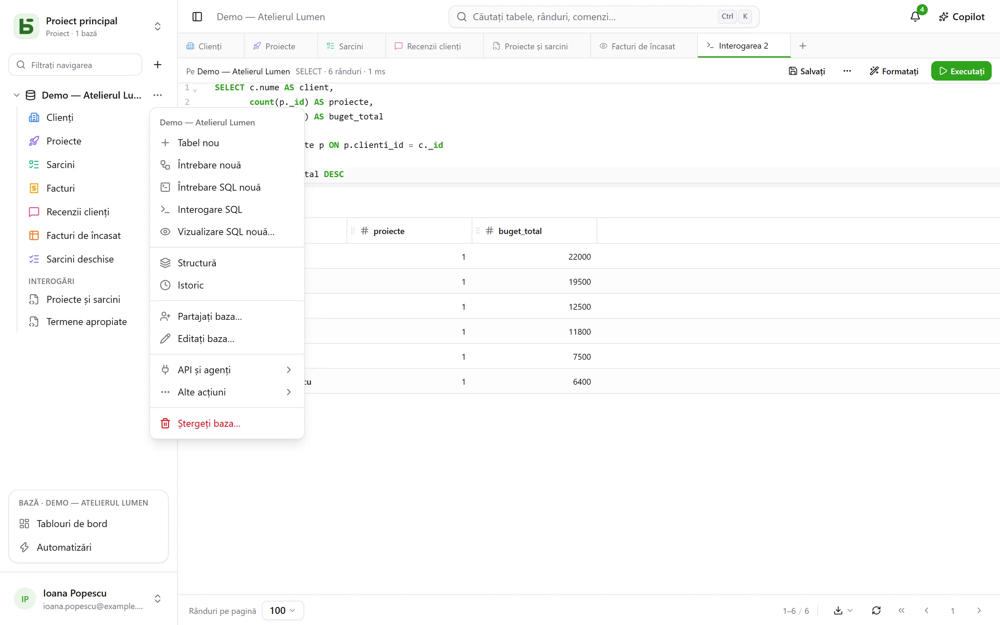
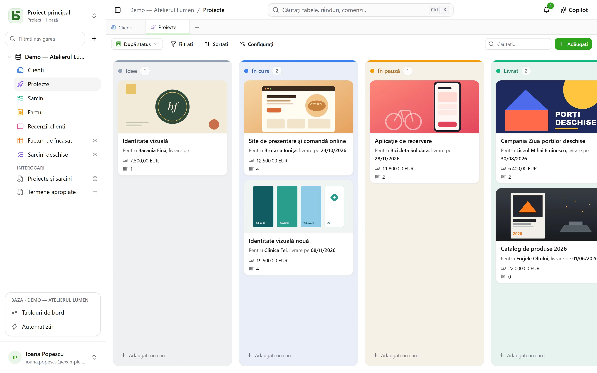

Acest parcurs durează zece minute și acoperă esențialul: la final veți avea un tabel, o
vizualizare kanban și un formular public care scrie în el.

:::tip[Pentru a vedea totul dintr-odată]
Un proiect gol propune **baza demonstrativă**: o mică agenție, cu clienții, proiectele,
sarcinile, facturile și recenziile ei, cu formule, vizualizări de toate felurile, un tablou de
bord și automatizări. **Bază nouă** deschide și [galeria de șabloane](/basedb/ro/fonctionnalites/modeles/),
unde vă puteți descrie baza pentru AI.
:::

## 1. Creați o bază

Totul se organizează pe **proiecte**: selectorul din partea de sus a barei laterale schimbă
proiectul sau creează unul nou. În bară, butonul **+** din dreapta filtrului creează o bază.
Dați-i o etichetă — „Ventes” — și, dacă doriți, o descriere, o culoare, o pictogramă.

Baza devine o **schemă PostgreSQL**: numele ei fizic (`b_t4z56fq_ventes`) apare în formular și
în documentația generată.

## 2. Creați un tabel și câmpurile lui

Din meniul **⋯** al bazei: **Tabel nou**. Adăugați apoi câmpurile din **Structură** — în
același meniu — cu butonul
**Câmp**:

| Câmp | Tip |
|---|---|
| Nom | Text scurt |
| Statut | Selecție unică — Nouveau, Qualifié, Gagné, Perdu |
| Montant | Monedă |
| Échéance | Dată |
| Client | Relație → Clients |
| Notes | Text lung (Markdown) |

Mai târziu, o formulă (`DAYS([Échéance], TODAY())`), o căutare (orașul clientului) sau
o agregare (suma totală pe client) se adaugă în același mod — consultați
[Tabele și câmpuri](/basedb/ro/fonctionnalites/tables-et-champs/).

Puteți și **importa un fișier** — un registru de lucru Excel (`.xlsx`), un CSV sau un JSON:
importul ghicește tipurile, vă lasă să le corectați, creează tabelul sau completează un tabel
existent și spune, rând cu rând, ce refuză. Dintr-un registru de lucru cu mai multe foi,
alegeți foaia; datele, sumele și casetele de selectare sunt reluate așa cum le ține Excel, iar o
formulă își dă valoarea.



## 3. Introduceți și filtrați

Grila se editează ca o foaie de calcul: dublu clic sau Enter pentru a modifica o celulă, Esc
pentru a anula. **Filtrați** combină condiții pe câmpuri; sortarea se face din antetul
coloanei; **Căutați…**, în dreapta barei, caută în toate coloanele. Fiecare modificare este
salvată imediat — și [înregistrată în istoric](/basedb/ro/fonctionnalites/historique/):
**Ctrl+Z** o anulează pe ultima.

## 4. Adăugați o vizualizare

Selectorul de vizualizări, în stânga butonului „Filtrați”, propune „Toate rândurile”, apoi
vizualizările dumneavoastră. Creați un **kanban** grupat după „Statut”: tragerea unui card
dintr-o coloană în alta modifică rândul.



## 5. Partajați un formular

Creați o vizualizare **Formular**, bifați întrebările, apoi **Partajați**: alegeți „Public”,
copiați linkul. Fiecare răspuns adaugă un rând în tabel, fără a-i da vreo permisiune celui
care răspunde. Detalii în [Formulare partajate](/basedb/ro/fonctionnalites/formulaires-partages/).

## 6. Citiți în SQL

Meniul **⋯** al bazei → **Interogare SQL**: tabelele dumneavoastră sunt acolo, sub numele
lor real.

```sql
SELECT nom, statut, montant
FROM b_t4z56fq_ventes.opportunites
WHERE statut = 'gagne'
ORDER BY montant DESC;
```

**Salvați** o așază sub tabele, la rubrica „Interogări” — pentru dumneavoastră sau pentru
întreaga bază — iar **⋯** → **Creați o vizualizare SQL…** o transformă într-o vizualizare
PostgreSQL reală, așezată printre tabele. Fiecare le citește cu propriile sale permisiuni.
Consultați [Interogări și vizualizări SQL](/basedb/ro/fonctionnalites/requetes-et-vues-sql/).

Este același lucru din `psql` sau din instrumentul dumneavoastră de BI. Consultați
[SQL direct](/basedb/ro/integrations/sql/).
