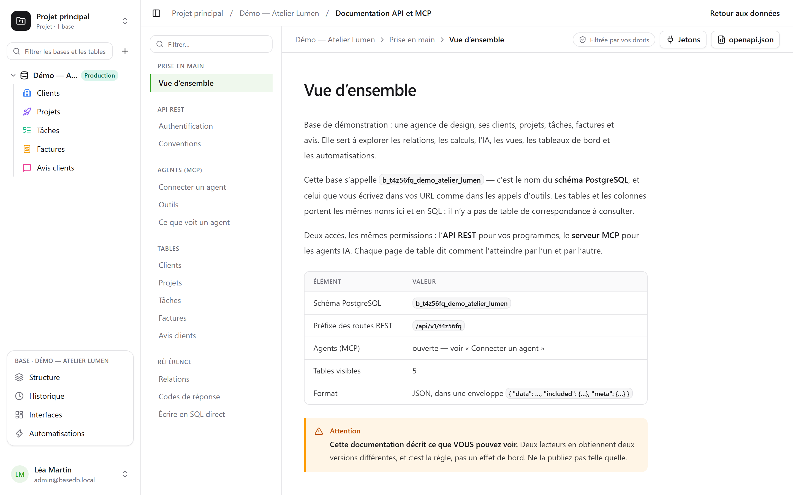

API-ul REST este același pe care îl folosește interfața: **nu există nicio rută privată**.
URL-urile lui poartă numele fizice — cele pe care le citiți și în SQL.

```text
/api/v1/<tenant>/data/<base>/<table>
/api/v1/t4z56fq/data/b_t4z56fq_ventes/opportunites
```

## Un token

În interfață, meniul **⋯** al bazei → **API și agenți** → **Tokenuri API și MCP…**: acolo creați
un **token de integrare** limitat la această bază, doar în citire în mod implicit, după ce v-ați
confirmat parola. Este afișat o singură dată; puneți-l într-o variabilă de mediu.

Un token citește, creează și modifică dacă a fost creat cu drept de scriere, **nu șterge
niciodată** și nu are niciodată mai multe permisiuni decât persoana care l-a creat.

```bash
export BASEDB_TOKEN=bdb_…
curl "http://localhost:3000/api/v1/t4z56fq/data/b_t4z56fq_ventes/opportunites?limit=20" \
  -H "Authorization: Bearer $BASEDB_TOKEN"
```

## Citire

| Parametru | Rol |
|---|---|
| `filter` | o expresie lizibilă: `statut eq "gagne" and montant gte 10000` |
| `sort` | `-montant,nom` |
| `fields` | coloanele de returnat |
| `limit`, `cursor` | paginare prin cursor criptat (`next_cursor` în răspuns) |
| `links=display` | relațiile cu valoarea lor de afișare |
| `count=exact` | totalul, plafonat la 100 000 |
| `variables=raw` | textele lungi așa cum au fost scrise, inclusiv `{{colonne}}`, în loc de [valorile din rând](/basedb/ro/fonctionnalites/tables-et-champs/#text-formatat-și-variabile) |

Operatorii: `eq`, `ne`, `eq_ci`, `contains`, `starts_with`, `ends_with`, `in`, `is_null`,
`gt`, `gte`, `lt`, `lte`, `between`, combinați prin `and`, `or`, `not` și paranteze. Un
filtru traversează o relație: `clients_id.ville eq "Lyon"`.

## Scriere

```bash
curl -X POST "http://localhost:3000/api/v1/t4z56fq/data/b_t4z56fq_ventes/opportunites" \
  -H "Authorization: Bearer $BASEDB_TOKEN" -H "content-type: application/json" \
  -d '{"values": {"nom": "Audit RGPD", "statut": "nouveau", "montant": 12000}}'
```

`PATCH …/<table>/<_id>` modifică un rând cu același corp `{"values": {…}}`. Erorile au o
formă unică: `{ "code": "…", "details": {…}, "request_id": "…" }`, cu un cod stabil pentru
fiecare cauză.

Fiecare scriere returnează antetul `x-basedb-transaction`: transmis către
`POST /api/v1/<tenant>/history/undo` (`{"transaction": "…"}`), o anulează, ca Ctrl+Z în
interfață — refuzat dacă rândul a fost modificat între timp.

## Dincolo de rânduri

Cu același token:

| Rută | Rol |
|---|---|
| `GET …/data/<base>/<table>/aggregate` | rezumate pe toate rândurile unui filtru: `aggregates=montant:sum,nom:filled`, `group=statut` |
| `GET …/data/<base>/<table>/<_id>/comments`, `POST` | citirea și scrierea comentariilor unui rând |
| `POST /api/v1/<tenant>/automations/<id>/run` | lansarea unei automatizări declanșate de un buton, pe un rând (`{"record": "…"}`) |
| `GET /api/v1/<tenant>/meta/bases/<base>/dashboards` | tablourile de bord ale unei baze |
| `GET /api/v1/<tenant>/meta/users` | membrii spațiului de lucru, pentru un câmp Persoană |
| `GET /api/v1/<tenant>/meta/templates` | șabloanele pentru baze din galerie |

[Vizualizările partajate](/basedb/ro/fonctionnalites/vues-partagees/) se citesc fără cont:
`GET /api/v1/views/<jeton>` și `…/rows` în JSON, `…/calendar.ics` în iCalendar.

Construirea — crearea unei automatizări, a unui tablou de bord, a unei integrări — rămâne
rezervată unei sesiuni din interfață: un token citește și scrie rânduri, nu schimbă baza.

## Documentația generată

Fiecare bază are pagina sa **Documentație API și MCP**: pentru fiecare tabel, punctele de acces,
coloanele, exemple în cURL și în JavaScript. Este **filtrată după permisiunile dumneavoastră** —
doi cititori obțin două versiuni — și există și în OpenAPI 3.1
(`/api/v1/<tenant>/meta/bases/<base>/openapi.json`).


