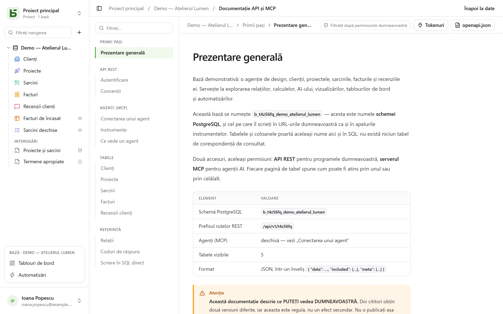

API-ul REST este același pe care îl folosește interfața: **nu există nicio rută privată**.
URL-urile lui poartă numele fizice — cele pe care le citiți și în SQL.

```text
/api/v1/<tenant>/data/<base>/<table>
/api/v1/t4z56fq/data/b_t4z56fq_ventes/opportunites
```

## Un token

În interfață, meniul **⋯** al bazei → **API și agenți** → **Tokenuri API și MCP…**: cine are
nivelul **Gestionare** pe bază, sau pe proiectul ei, creează acolo un **token de integrare**
limitat la această bază — toate mediile sale sau doar unul —, doar în citire în mod implicit,
după confirmarea parolei — un cont fără parolă, care se conectează printr-un furnizor de
identitate, nu poate încă face asta. Este afișat o singură dată; puneți-l într-o variabilă de
mediu.

Un token citește; creează și modifică dacă a fost creat cu drept de scriere, și **șterge dacă a
fost creat pentru aceasta** — drepturile „Citire, scriere și ștergere” —, cu excepția unui rând
pe care o relație în cascadă l-ar antrena împreună cu altele. Nu are niciodată mai multe
permisiuni decât persoana care l-a creat.

```bash
export BASEDB_TOKEN=bdb_…
curl "http://localhost:3000/api/v1/t4z56fq/data/b_t4z56fq_ventes/opportunites?limit=20" \
  -H "Authorization: Bearer $BASEDB_TOKEN"
```

## Alegerea mediului

O bază cu mai multe [medii](/basedb/ro/fonctionnalites/environnements/) — producție,
testare… — rămâne **o singură** bază pentru un token creat pentru toată baza. Calea numește baza
prin numele producției sale, iar antetul `X-Basedb-Environment` alege mediul:

```bash
curl "http://localhost:3000/api/v1/t4z56fq/data/b_t4z56fq_ventes/opportunites" \
  -H "Authorization: Bearer $BASEDB_TOKEN" \
  -H "X-Basedb-Environment: recette"
```

- Fără antet, este mediul pe care îl numește calea: `b_t4z56fq_ventes` este producția,
  `b_t4z56fq_ventes_recette` testarea — ambele forme rămân valabile.
- `?environment=recette` face același lucru pentru un client care nu trimite antet.
- Un mediu se numește prin insigna sa, fără a ține cont de majuscule sau de diacritice, sau prin
  `production`. Un mediu pe care baza nu îl are răspunde `404`, ca orice resursă absentă.
- `GET /api/v1/<tenant>/meta/bases` listează fiecare mediu cu blocul său `environment`
  (`label`, `production`); cu antetul, îl listează doar pe acesta.

Un token limitat la un singur mediu, la crearea sa, nu le deschide pe celelalte: antetul nu
schimbă nimic. Permisiunile sale sunt întotdeauna verificate încrucișat, mediu cu mediu, cu cele
ale persoanei care l-a creat.

## Citire

| Parametru | Rol |
|---|---|
| `filter` | o expresie lizibilă: `statut eq "gagne" and montant gte 10000` |
| `sort` | `-montant,nom` |
| `fields` | coloanele de returnat |
| `limit`, `after` | paginare prin cursor criptat: `meta.next_cursor` al unei pagini, transmis ca `after`, dă pagina următoare (`meta.has_next_page`) |
| `links=display` | relațiile cu valoarea lor de afișare |
| `count=exact` | totalul, plafonat la 100 000 |
| `variables=raw` | textele lungi așa cum au fost scrise, inclusiv `{{colonne}}`, în loc de [valorile din rând](/basedb/ro/fonctionnalites/tables-et-champs/#text-formatat-și-variabile) |

Operatorii: `eq`, `ne`, `eq_ci`, `contains`, `starts_with`, `ends_with`, `in`, `is_null`,
`gt`, `gte`, `lt`, `lte`, `between`, combinați prin `and`, `or`, `not` și paranteze. Un
filtru traversează o relație: `clients_id.ville eq "Lyon"`.

## Scriere

```bash
curl -X POST "http://localhost:3000/api/v1/t4z56fq/data/b_t4z56fq_ventes/opportunites" \
  -H "Authorization: Bearer $BASEDB_TOKEN" -H "content-type: application/json" \
  -d '{"values": {"nom": "Audit RGPD", "statut": "nouveau", "montant": 12000}}'
```

`PATCH …/<table>/<_id>` modifică un rând cu același corp `{"values": {…}}`. Erorile au o
formă unică: `{ "code": "…", "details": {…}, "request_id": "…" }`, cu un cod stabil pentru
fiecare cauză.

Fiecare scriere returnează antetul `x-basedb-transaction`: transmis către
`POST /api/v1/<tenant>/history/undo` (`{"transaction": "…"}`), o anulează, ca Ctrl+Z în
interfață — refuzat dacă rândul a fost modificat între timp.

## Dincolo de rânduri

Cu același token:

| Rută | Rol |
|---|---|
| `GET …/data/<base>/<table>/aggregate` | rezumate pe toate rândurile unui filtru: `aggregates=montant:sum,nom:filled`, `group=statut` |
| `GET …/data/<base>/<table>/<_id>/comments`, `POST` | citirea și scrierea comentariilor unui rând |
| `POST /api/v1/<tenant>/automations/<id>/run` | lansarea unei automatizări declanșate de un buton, pe un rând (`{"record": "…"}`) |
| `GET /api/v1/<tenant>/meta/bases/<base>/dashboards` | tablourile de bord ale unei baze |
| `GET /api/v1/<tenant>/meta/users` | membrii spațiului de lucru, pentru un câmp Persoană |
| `GET /api/v1/<tenant>/meta/templates` | șabloanele pentru baze din galerie |
| `GET /api/v1/<tenant>/events?base=<base>&table=<table>` | urmărirea unui tabel în timp real: semnale, recitite apoi prin rutele de mai sus (consultați [Webhook-uri](/basedb/ro/integrations/webhooks/#fără-webhook-urmărirea-unui-tabel)) |

[Vizualizările partajate](/basedb/ro/fonctionnalites/vues-partagees/) se citesc fără cont:
`GET /api/v1/views/<jeton>` și `…/rows` în JSON, `…/calendar.ics` în iCalendar.

Construirea — crearea unei automatizări, a unui tablou de bord, a unei integrări — rămâne
rezervată unei sesiuni din interfață: un token citește și scrie rânduri, nu schimbă baza.

## Culori și pictograme

Un tabel și fiecare opțiune a unei liste de selecție au o culoare (`color`, `#rrggbb`) și o
pictogramă (`icon`, numele unei icoane [Lucide](https://lucide.dev/icons/) pe care interfața o
desenează: `truck`, `circle-check`, `flame`…). `GET …/meta/bases/<base>` le returnează pentru
bază, pentru tabelele ei și pentru opțiunile câmpurilor ei.

Pentru a le alege, cu token-ul de acces al unei persoane care poate modifica structura
(`POST /auth/session/access`) — un token de integrare nu schimbă baza:

| Rută | Corp |
|---|---|
| `POST …/admin/bases/<base>/tables` | `{"label": "Tickets", "color": "#dc2626", "icon": "flame", "fields": […]}` |
| `PATCH …/admin/bases/<base>/tables/<table>` | `{"color": "#2563eb", "icon": "inbox"}` — cele trei chei `color`, `icon`, `image` circulă împreună: a numi una le înlocuiește pe toate trei |
| `POST …/admin/bases/<base>/tables/<table>/fields` | `{"label": "Priorité", "kind": "select", "options": [{"value": "haute", "color": "#dc2626", "icon": "flame"}, …]}` |
| `PUT …/admin/bases/<base>/tables/<table>/fields/<champ>/options` | lista întreagă a opțiunilor, în ordine, fiecare cu culoarea și pictograma ei |

Un agent trece prin [serverul MCP](/basedb/ro/integrations/mcp/#culori-și-pictograme), unde
**propune** aceste modificări. Un câmp nu are o pictogramă de ales: interfața o desenează pe cea a
tipului său.

## Crearea unei baze dintr-un model

O aplicație care se instalează își creează baza într-**un singur apel**: serverul aplică
modelul — tabele, câmpuri, relații, rânduri de exemplu, vizualizări, tablouri de bord,
automatizări — și, dacă o etapă eșuează, nu lasă nicio bază în urmă.

```bash
curl -X POST "http://localhost:3000/api/v1/t4z56fq/admin/bases" \
  -H "Authorization: Bearer $ACCES" -H "content-type: application/json" \
  -d '{"template": "crm", "label": "Ventes", "rows": false}'
```

`template` este cheia unui model din galerie, sau un model întreg în
[formatul modelelor](/basedb/ro/fonctionnalites/modeles/). Cu antetul
`Accept: application/x-ndjson`, răspunsul ajunge linie cu linie: câte o linie `{"step": …}` pe
etapă, apoi baza creată. Acest apel cere token-ul de acces al unei persoane care poate crea o
bază (`POST /auth/session/access`, după conectare): un token de integrare deschide doar o bază
existentă.

## Verificarea unui token

Token-urile basedb nu se verifică în afara basedb. O aplicație care primește unul — un
instrument deschis din basedb cu token-ul persoanei, de exemplu — cere ce valorează
(introspecție, RFC 7662), cu propriul ei token de integrare:

```bash
curl -X POST "http://localhost:3000/auth/introspect" \
  -H "Authorization: Bearer $BASEDB_TOKEN" \
  --data-urlencode "token=$JETON_RECU"
```

```json
{ "active": true, "token_type": "access_token",
  "sub": "0195a…", "email": "claire@example.com", "name": "Claire Martin",
  "tenant": "t4z56fq", "groups": ["Commerciaux"], "exp": 1790000000 }
```

Orice token care nu este valid — necunoscut, expirat, revocat, sesiune închisă, alt spațiu de
lucru — răspunde `{"active": false}`, fără să spună de ce. Răspunsul este citit în direct: o
deconectare se vede imediat. Pentru un token de integrare, răspunsul indică și baza pe care o
deschide (`base`, producția ei), dacă îi deschide toate mediile (`environments`: `all`) sau doar
unul (`one`), accesul lui (`read`, `write` sau `delete`) și suprafețele lui.

## Documentația generată

Fiecare bază are pagina sa **Documentație API și MCP**: pentru fiecare tabel, punctele de acces,
coloanele, exemple în cURL și în JavaScript. Este **filtrată după permisiunile dumneavoastră** —
doi cititori obțin două versiuni —, scrisă **în limba ecranului dumneavoastră**, și există și în
OpenAPI 3.1 (`/api/v1/<tenant>/meta/bases/<base>/openapi.json`), care declară tokenul Bearer și
antetul `X-Basedb-Environment`. Numele, căile și codurile de eroare rămân aceleași în toate
limbile.


