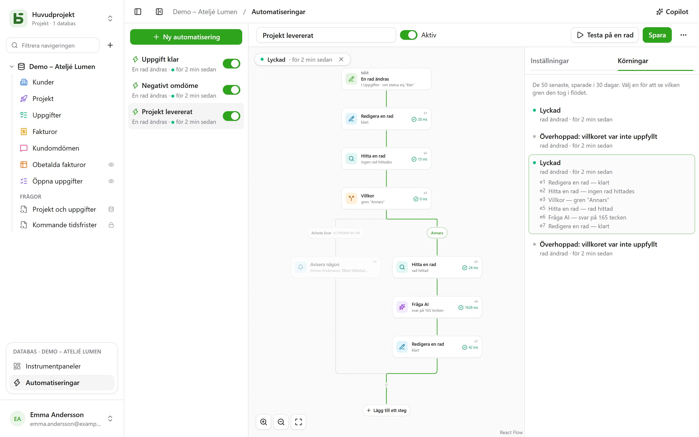

En automatisering anger **när**, **om** och **då**: när en uppgift går till ”Fait”, anteckna
tiden; när ett negativt omdöme kommer in, avisera den ansvariga och skriv i Slack; varje måndag
kl. 9, skapa raden för teamets avstämning. Och när en åtgärd inte räcker följer den ett
**flöde**: hitta en rad, ta en gren eller en annan beroende på vad den säger, upprepa steg på
varje rad som matchar ett filter, återanvänd i ett steg det som ett tidigare steg har hittat
eller skrivit.

De öppnas från **Automatiseringar**, i blocket för den öppna databasen längst ned i sidofältet,
och kräver nivån **Hantera**.



## Flödet

Flödet ritas uppifrån och ned: utlösaren, sedan varje steg. Ett **+** på en linje lägger till ett
steg på det stället; ett kort öppnar sina inställningar till höger. En enkel automatisering –
en utlösare och en åtgärd – ryms på två kort och ställs in som förut.

## När

| Utlösare | Inställningar |
|---|---|
| **En rad skapas** | tabellen |
| **En rad ändras** | tabellen, och vid behov bara de fält som ska bevakas |
| **Vid en fast tid** | varje timme, varje dag eller varje vecka, vid vald tid och i vald tidszon |
| **Någon klickar på en knapp** | ett [Knapp-fält](/basedb/sv/fonctionnalites/tables-et-champs/#knapp) i tabellen |

En utlösare för rader ser **alla** skrivningar: gränssnittet, API:et, en agent, ett delat
formulär och till och med direkt SQL – automatiseringarna utgår från historiken, som fångar
dem alla.

## Bara om

Ett valfritt villkor, i [filterspråket](/basedb/sv/integrations/api-rest/#läsa) –
`statut eq "fait"`, `montant gte 10000 and payee eq false` – som utvärderas på raden **i det
ögonblick åtgärden ska utföras**. En körning vars villkor inte är uppfyllt blir ”överhoppad”,
och säger det.

## Då

Upp till trettio steg, i ordning; det första som misslyckas stoppar de följande.

| Steg | Vad det gör |
|---|---|
| **Redigera en rad** | skriver värden i raden som utlöste – eller i den som ett steg har hittat eller skapat |
| **Skapa en rad** | i den här tabellen eller en annan i databasen |
| **Hitta en rad** | den första raden i en tabell som matchar ett filter, så att de följande stegen kan citera eller ändra den |
| **Avisera någon** | en [avisering](/basedb/sv/fonctionnalites/collaboration/#aviseringar) till valda personer, eller till personen i ett Person-fält |
| **Skicka e-post** | till personer i teamet, till personen i ett Person-fält, till adressen i ett E-post-fält – en kund, en leverantör – eller till skrivna adresser; ämnet och texten citerar raden och de tidigare stegen |
| **Anropa en webhook** | en HTTPS-begäran till en tjänst – metod, adress, huvuden och innehåll som du själv ställer in ([detaljer](#anropa-en-tjänst)); svaret kan sedan citeras |
| **Skicka till Slack** | ett meddelande i en [ansluten](/basedb/sv/integrations/synchronisation/#slack) kanal |
| **Fråga AI** | ett svar från [AI-leverantören](/basedb/sv/fonctionnalites/ia/) på en instruktion som citerar raden och de tidigare stegen – formulera, sammanfatta, klassificera –, tolkat som en text, ett tal, ja eller nej, ett datum eller ett val i en lista |
| **Villkor** | flera grenar: den första vars villkor är uppfyllt tas, ”Annars” när inget är det; grenarna går sedan ihop igen |
| **För varje rad** | de steg den innehåller, en gång för varje rad i en tabell som matchar ett filter ([detaljer](#för-varje-rad)) |

En sökning som inte hittar något stoppar inte flödet: de steg som skulle ha ändrat dess rad
hoppas över. Vill du göra något annat i det fallet testar ett villkor det – en gren med tomt
filter tas så snart sökningen har hittat något.

## För varje rad

Steget **För varje rad** läser raderna i en tabell som matchar dess filter – tomt: alla –, i
vald ordning, upp till sin gräns (50 som standard, högst 200), och kör sedan en gång för varje
rad de steg som ligger i dess ram. ”Varje måndag, skicka en påminnelse för alla obetalda
fakturor” skrivs: **Vid fast tid**, sedan **För varje rad** av fakturor
`payee eq false and relancee eq false`, och i loopen ett e-postmeddelande till fakturans kontakt
och **Redigera en rad** som kryssar i ”Påmind”.

I loopen namnger stegets identifierare **varvets rad**: `{{e1.client}}` citerar den, och
**Redigera en rad** föreslår den bland raderna att ändra. Efter loopen anger `{{e1.nombre}}`
hur många rader den har gått igenom – till exempel för en sammanfattning på Slack. Filtret kan
citera det som kommit före: utlöst av en betald faktura, går `facture eq {{_id}}` igenom dess
detaljrader.

Utöver gränsen väntar de återstående raderna på nästa körning, som säger det: ta bort de som
redan är behandlade ur filtret – en kryssruta ”Påmind”, ett datum – för att med tiden behandla
dem alla, körning efter körning. En loop innehåller ingen annan loop, och en körning stoppas
efter högst två minuter.

## Anropa en tjänst

Steget **Anropa en webhook** skickar som standard, i `POST`, automatiseringens data: den valda
raden och det som de tidigare stegen har hittat eller skrivit. För att tala med en tjänst på
det sätt den förväntar sig ställer du in:

- **metoden**: `POST`, `PUT`, `PATCH`, `GET` eller `DELETE` – de två sistnämnda utan innehåll;
- **adressen**, som kan citera efter sin värd – `https://api.exemple.fr/clients/{{e2.numero}}`;
  varje värde kodas där;
- **huvuden**, vars värde kan citera: `Idempotency-Key: {{_id}}`;
- **innehållet**: automatiseringens data, en **JSON att skriva**, ett **formulär**
  (ett `nyckel=värde`-par per rad) eller en **text**. I en JSON är ett citat inom
  citattecken text, och utanför citattecken ett värde – ett tal, ja eller nej, en lista:

```json
{ "facture": "{{e1.numero}}", "montant": {{e1.montant}}, "payee": {{e1.payee}} }
```

En API-nyckel eller en token sätts i ett **hemligt** huvud (hänglåset): krypterad med
instansnyckeln visas den aldrig igen – varken på skärmen, i API:et eller för Copiloten – och
skickas bara till den värd du angav den för. Ändrar du adressens värd måste du ange den igen;
**Ersätt** anger en ny.

## Fråga AI

Precis som ett [AI-fält](/basedb/sv/fonctionnalites/ia/#ai-alternativet-för-ett-fält) skickar
steget sin instruktion till leverantören, där varje citat har ersatts med sitt värde:

```text
Cet avis de {{auteur}} demande-t-il une action de notre part ? {{avis}}
```

Du väljer vilket **förväntat svar** – en fri eller kort text, ett tal, ja eller nej, ett datum,
en webbadress eller ett val i en lista, som kan hämtas från ett Enkelval-fält. Modellen får veta
det, och ett svar som inte innehåller något sådant får steget att misslyckas. De följande stegen
citerar det som `{{e1.reponse}}`: i rubriken på en skapad uppgift, i ett meddelande eller i ett
Enkelval-fält, där det placeras på valet med samma etikett.

Det som instruktionen citerar skickas till leverantören: steget kräver ditt **godkännande**, som
måste ges på nytt när instruktionen ändras. Varje anrop loggas och räknas, tillsammans med
AI-fälten, mot `BASEDB_AI_FIELD_QUOTA` (300 per timme som standard). AI gör ingenting på egen
hand: det är stegen efter den som skriver eller aviserar.

## Citera

Värden, meddelanden och filter kan citera det som kommit före, via knappen **{ }** bredvid varje
text:

- `{{Titre}}`, `{{_id}}`: raden som utlöste;
- `{{e2.titre}}`, `{{e2._id}}`: raden som hittades, skapades eller ändrades av steget `e2` –
  varje steg visar sin identifierare på sitt kort;
- `{{e3.statut}}`, `{{e3.reponse.numero}}`: det som webhooken `e3` svarade;
- `{{e4.reponse}}`: svaret från AI-steget `e4`;
- `{{e5.client}}` i loopen `e5`, varvets rad; `{{e5.nombre}}` efter den, antalet rader den har
  gått igenom;
- `{{_maintenant}}`: tidpunkten för körningen.

Ett värde som består av ett enda citat skickar vidare själva värdet: en relation, en person, ett
val – det är så en skapad rad kopplas till den som en sökning hittade. I ett filter är ett citat
alltid ett värde som jämförs, aldrig filterspråk.

Ett steg kan bara citera det som med säkerhet har hänt före det: det som en gren har hittat kan
inte längre citeras efter villkoret. Redigeraren påpekar det på kortet innan du sparar.

## Copilot

**Copilot**, i sidhuvudet, öppnar till höger en konversation på naturligt språk om databasens
automatiseringar: ”när en uppgift går till granskning, avisera den tilldelade personen”, ”lägg
till en AI-sammanfattning i anteckningarna”, ”varför misslyckades den senaste körningen?”. Den
svarar och **föreslår** en hel automatisering – den du har på skärmen, ändrad, eller en ny –,
med en lista över vad som ändras.

Copilot sparar ingenting: **Lägg på flödet** visar förslaget i redigeraren, där du läser igenom
det innan du sparar – och **Ångra**, på kortet, återställer flödet som det var. En ny
automatisering öppnas i redigeraren, redo att skapas. Varje förslag kontrolleras som en
sparning skulle göra; det som inte håller tas bort, och det sägs.

Som standard skickas **bara strukturen** till AI-leverantören, tillsammans med konversationen:
tabellerna och deras fält, databasens automatiseringar, den som visas på skärmen så som
redigeraren visar den, och dess senaste körningar – deras status och felkoder, aldrig ett
värde. Personer och Slack-kanaler skickas under platshållare (`p1`, `s1`), aldrig med sina
identifierare. Rutan **Tillåt läsning av data** låter Copilot, under konversationen, läsa rader
(högst 50 per läsning), och varje läsning listas under svaret.

## Testa och följa upp

**Testa på en rad** kör den sparade automatiseringen på en vald rad, på riktigt. Fliken
**Körningar** sparar de 50 senaste i 30 dagar: väntande, pågående, lyckad, överhoppad med sitt
skäl, misslyckad med sin felkod. Väljer du en läggs den på flödet – grenen som togs ritas ut,
varje genomfört steg visar vad det gjorde och hur lång tid det tog, resten tonas ned. I en loop
anger varje steg också hur många gånger det har körts.

## I vems namn den agerar

En automatisering agerar med **behörigheterna hos den som senast sparade den**, som prövas på
nytt vid varje körning: förlorar personen en behörighet misslyckas steget som behövde den i
stället för att kringgå den, och en sökning hittar bara det personen får läsa. Historiken visar
den som ”Automatisering ’Tâche terminée’ · på uppdrag av …”, och dess skrivningar kan ångras
som alla andra.

## Begränsningar

- Det en automatisering skriver utlöser inga andra: det som ska ske i följd skrivs i ett enda
  flöde.
- En sökning ger en rad, den första; en loop går igenom högst 200 per körning, och det första
  steget som misslyckas stoppar den. Ingen väntan (”tre dagar senare”).
- Inga skript. Ett e-postmeddelande skickas som ren text, ett per mottagare – högst tjugo per
  steg –, via instansens [sändningsserver](/basedb/sv/hebergement/variables/#e-post); ett svar
  går till personen som äger automatiseringen.
- Ett villkor testar en rad: vill du välja gren utifrån AI:ns svar skriver du det först i ett
  fält på raden.
- En [databasmall](/basedb/sv/fonctionnalites/modeles/) tar bara med automatiseringar utan
  sökning, loop, villkor eller AI-steg, och aldrig en webhook.
- En webhook följer ingen omdirigering och väntar högst 10 sekunder; ett annat svar än
  2xx gör att steget misslyckas.
- 100 körningar per timme och automatisering; en missad timkörning tas bara igen en gång.
- Fördröjningen mellan skrivningen och åtgärden är i storleksordningen en sekund.
