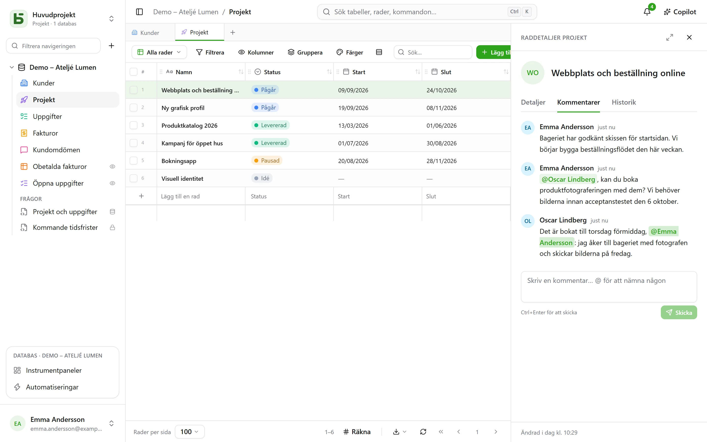
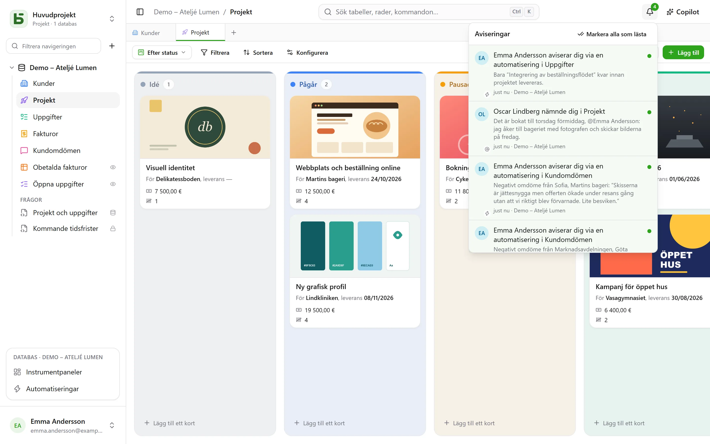

Flera personer arbetar i samma databas samtidigt: var och en ser de andras skrivningar komma in,
vet vem som tittar på vad och diskuterar en rad där den finns.

## Kommentarer

En rads raddetaljer har en flik **Kommentarer**, mellan ”Detaljer” och ”Historik”. Skriv `@` för
att **nämna** en medlem och Ctrl+Enter för att skicka. Var och en kan redigera eller ta bort sina
egna kommentarer.

Det räcker att kunna läsa raden för att kommentera den. En person som nämns men inte kan läsa
raden får ingen avisering – och författaren får veta det i stället för att tro att meddelandet
har gått fram.

## Aviseringar

Klockan uppe till höger räknar det som är oläst. Fyra saker hamnar där:

- någon **nämner** dig i en kommentar;
- någon **svarar** i en konversation där du har skrivit;
- någon **anger** dig i ett Person-fält – från gränssnittet, API:et, ett formulär eller en
  automatisering;
- en [automatisering](/basedb/sv/fonctionnalites/automatisations/) **aviserar** dig.

Öppnar du en avisering öppnas raden. **Markera alla som lästa** nollställer räknaren;
aviseringarna sparas i 90 dagar.

### Via e-post

Om instansen har en [sändningsserver](/basedb/sv/hebergement/variables/#e-post), skickas en
avisering som har varit **oläst i tio minuter** också som e-post: ett enda e-postmeddelande för
alla som väntar, med en länk till varje rad. Det du hinner läsa i tid skickas inte. Under
**Inställningar › Aviseringar** har varje typ två reglage: i basedb, och som e-post.

## Realtid

De andras skrivningar visas **utan att sidan laddas om**: en ändrad cell, ett flyttat kort, en
tillagd rad – oavsett om de kommer från gränssnittet, API:et, en agent eller direkt SQL. Servern
skickar bara en **signal**, aldrig data: det är skärmen som läser om, med dina behörigheter. En
cell som du håller på att redigera ersätts aldrig mitt under fingrarna på dig.

## Närvaro

Ansiktena på dem som tittar på **samma tabell** visas högst upp på skärmen; de som har öppnat
**samma rad** visas i sidhuvudet i dess raddetaljer. I rutnätet syns de andras pekare på den
cell de hovrar över.

## En länk till varje skärm

Webbläsarens adress följer det du tittar på: en tabell, en av dess vyer, raddetaljerna för en
rad, en instrumentpanel, en automatisering, en fråga, dina inställningar. Klistra in den i ett
meddelande: din kollega hamnar på samma ställe, med sina egna behörigheter. Lägg den som
bokmärke; webbläsarens bakåt- och framåtknappar tar dig tillbaka dit du var.

| Adress | Vad den öppnar |
|---|---|
| `/bases/ventes/tables/opportunites` | tabellen ”Opportunités” i databasen ”Ventes” |
| `/bases/ventes/tables/opportunites?vue=…` | en av dess vyer |
| `/bases/ventes/tables/opportunites?ligne=…` | raddetaljerna för en av dess rader |
| `/bases/ventes/tableaux-de-bord/…` | en instrumentpanel |
| `/bases/ventes/automatisations/…` | en automatisering |
| `/parametres/apparence` | dina inställningar |

En adress namnger en **plats**, inte det tillstånd du lämnade den i: filter, sorteringar och
kolumnbredder följer varje webbläsare för sig. En databas och en tabell skrivs där med sitt
PostgreSQL-namn: byts det namnet, leder den gamla adressen ingenstans. En adress som inte leder
någonstans — ett skrivfel, ett borttaget objekt, eller något du inte har rätt att se — visar
”Den här sidan finns inte”.

## Ångra

Ctrl+Z ångrar din senaste skrivning – se [historiken](/basedb/sv/fonctionnalites/historique/#ångra-ctrlz).

## Begränsningar

- Inget e-postmeddelande skickas utan en sändningsserver konfigurerad av driftansvarig.
- När fler än hundra rader ändras på en gång laddar skärmen om hela sidan i stället för rad
  för rad.
