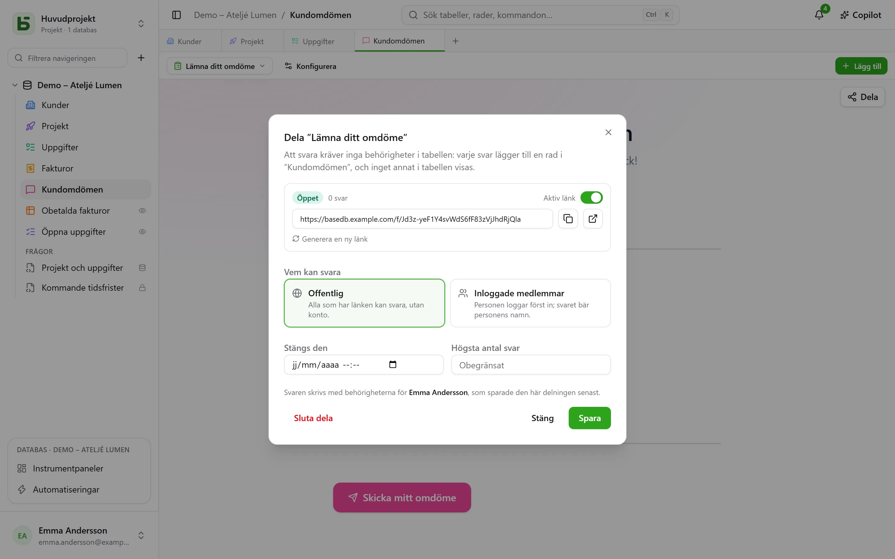
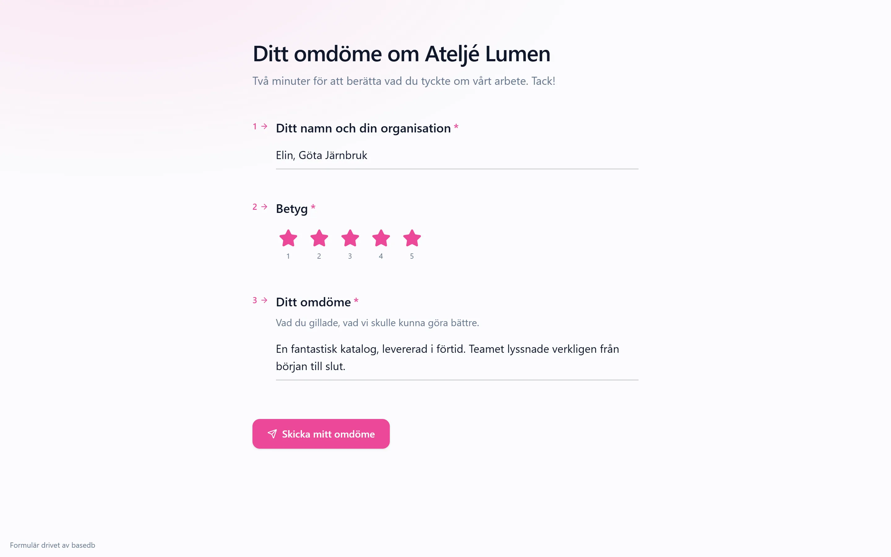

Ett formulär, en enkät eller ett quiz **delas via en länk** `/f/<jeton>`. Den som svarar behöver **inga
behörigheter i tabellen**: varje svar lägger till en rad, och inget annat i tabellen visas för
hen. Vill du visa rader i stället för att ta emot dem kan en vy delas
[skrivskyddad](/basedb/sv/fonctionnalites/vues-partagees/).

## Vem kan svara

| Åtkomst | Vem svarar | Vad som visas |
|---|---|---|
| **Offentlig** | alla som har länken, utan konto | formuläret, ingenting annat |
| **Inloggade medlemmar** | en medlem i arbetsytan – vid behov bara i vissa grupper | inloggningen, sedan formuläret och ”Du svarar som …” |

Länkens sida ligger utanför programmet: inget sidofält, inget databasnamn, inga andra rader.
Den bär formulärets utseende — dess tema, färg, typsnitt —, och ställer bara de frågor som
tidigare svar kräver.

## I vems namn svaret skrivs

Raden skrivs med **behörigheten hos den som publicerade delningen** – den som senast sparade
den. Hens rätt att skapa rader kontrolleras **vid varje svar**, begränsat till formulärets
frågor: förlorar hen den rätten pausas formuläret tills någon som har den sparar det igen.

Historiken visar vem som svarade, inte vem som publicerade:

- ett svar från en **medlem** tillskrivs personen;
- ett **offentligt** svar tillskrivs själva formuläret: ”Formulär ’Demande de devis’ ·
  offentligt svar · publicerat av Camille”.

## Öppna och stänga

I dialogen ställer du in:

- reglaget **Aktiv länk**;
- ett **stängningsdatum**;
- ett **högsta antal svar** – exakt, även när svar kommer in samtidigt;
- **Generera ny länk**: den gamla slutar genast att fungera;
- **Sluta dela**: länken försvinner, svaren finns kvar i tabellen.

Ett stängt formulär säger det med en mening, redan innan någon inloggning begärs.

## Ett delat quiz

Sidan för ett quiz tar **inte emot något rätt svar**: bara vad varje fråga är värd. Det är
servern som rättar.

- Vid rättning **efter varje fråga** skickar sidan servern varje bedömt svar i samma ögonblick
  det ges, och får då veta om det är rätt – och vilket som var det rätta.
- Vid inskickning räknar servern poängen **utifrån de mottagna svaren** och skriver den i det
  fält som valts för det, om det finns ett och personen som publicerade delningen får skriva i
  det. Sidan visar poängen den får tillbaka, och facit, om inte quizet säger ”aldrig”.

En poäng läses alltså av i tabellen så som servern har räknat den, inte så som en sida skulle ha
meddelat den.

## Begränsningar

- Frågor av typen **relation**, **fil** och **bild** ställs inte via en delad länk; dialogen
  påpekar dem.
- Inskickningen är begränsad till 20 svar per minut, per adress och per länk. Bakom den
  medföljande proxyn (Caddy) är adressen besökarens.

Detaljerna finns i [kapitel 15](https://github.com/eodia/basedb/blob/main/docs/architecture/15-formulaires-partages.md)
i arkitekturdokumentet.
