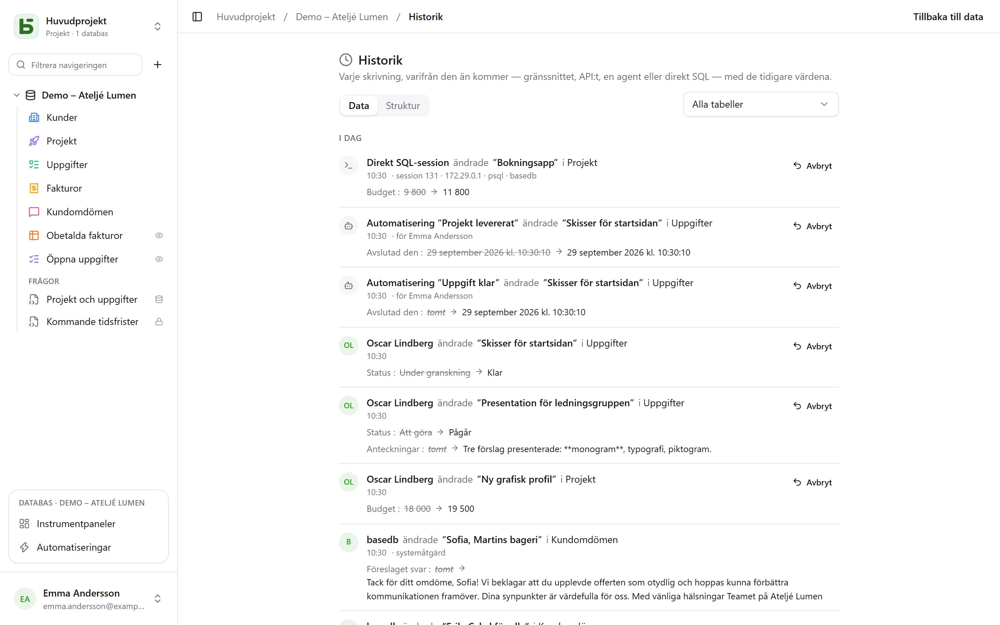

basedb sparar **varje skrivning** i historiken, var den än kommer ifrån: gränssnittet, API:et,
en MCP-agent, ett offentligt formulär – och till och med en SQL-fråga som skrivits för hand i
`psql`.

## Hur den registreras

Inte av programmet, utan av **PostgreSQL-triggrar**, i skrivningens egen transaktion. En
skrivning som misslyckas lämnar inga spår; en skrivning som lyckas kan inte undgå att lämna
spår. Revisionerna förs sedan över till oföränderliga loggar, partitionerade per månad.

Identiteten följer med via sessionsvariabler som sätts i början av varje transaktion. En
skrivning som saknar dem – direkt SQL – registreras som sådan, tillsammans med sessionen som
gjorde den (`psql`, adress, process): den avvisas aldrig för det.

| Aktör | Visas som |
|---|---|
| en person | personens namn |
| ett program (API) eller en agent (MCP) | personen som skapade token, ”via token …” |
| ett offentligt formulär | ”Formulär ’…’ · offentligt svar” |
| en automatisering | ”Automatisering ’…’ · på uppdrag av” den person som ansvarar för den |
| direkt SQL | ”Direkt SQL-session” |

## Vad du kan göra med den

- **Läsa** historiken för en rad (fliken ”Historik” i dess raddetaljer), en tabell eller en
  databas (**Historik**, i databasens **⋯**-meny), filtrerad per tabell.
- **Ångra** en ändring: de tidigare värdena tillämpas på nytt, fält för fält.
- **Återställa** en borttagen rad från dess post ”tog bort”.
- Följa **strukturhistoriken** (fliken ”Struktur”): tabeller och fält som skapats, ändrats och
  tagits bort.

## Ångra (Ctrl+Z)

I rutnätet ångrar **Ctrl+Z** (⌘Z på Mac) din senaste skrivning; **Ctrl+Skift+Z** eller
**Ctrl+Y** gör om den. Ett meddelande bekräftar vad som ångrades – ”Ångrat: ändring av
’Montant’” – med en knapp för att ta tillbaka ångrandet.

Så kan du ångra en cell, ett flyttat kort eller en flyttad stapel, en skapad eller borttagen
rad, en inklistring – och en hel import, som räknas som en enda åtgärd. Upp till femtio
åtgärder, flik för flik.

Det är inte skärmen som går bakåt: det är en **ny skrivning**, som servern gör utifrån
historiken och som också sparas i historiken. Den avvisas om någon har ändrat raden sedan dess –
”Kan inte ångra: ’Statut’ har ändrats sedan dess” – i stället för att skriva över den personens
arbete. Du kan på det här sättet bara ångra dina egna skrivningar, från de senaste
tjugofyra timmarna, och aldrig strukturen. I en cell som du håller på att skriva i ångrar
Ctrl+Z texten, som vanligt.

## Behörigheter

Historiken följer läsbehörigheterna: ett fält som är dolt för dig syns inte i de revisioner du
läser.
