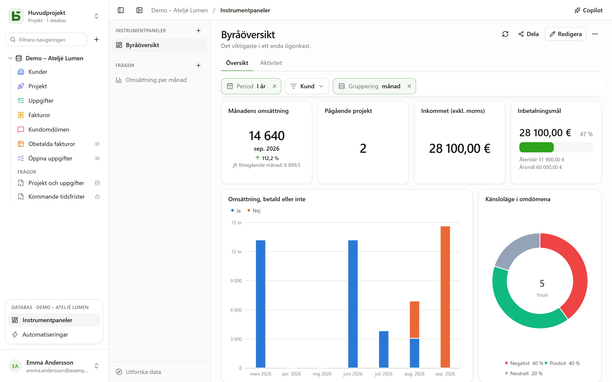
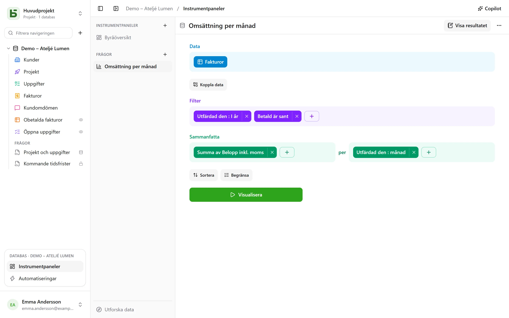
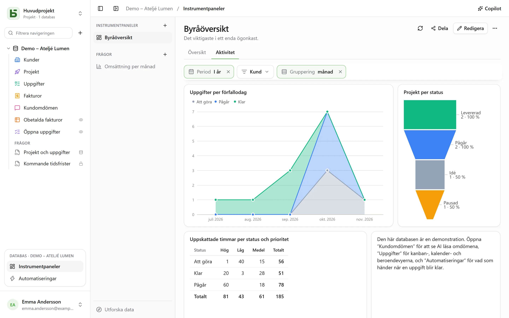

En **instrumentpanel** samlar på en sida det som ett team tittar på varje dag: siffrorna som
räknas, hur de utvecklas månad för månad, fördelningen av en status, de närmaste
förfallodatumen. Varje kort visar en **fråga** – en läsning av databasen, byggd med musen eller
skriven i SQL – och **filter** högst upp på sidan styr de kort som kopplas till dem.



Allt öppnas från **Instrumentpaneler**, i blocket för den öppna databasen längst ned i
sidofältet. Till vänster finns databasens instrumentpaneler och sparade frågor, och **Utforska
data** för att ställa en fråga utan att spara något. Alla som kan läsa databasen kan visa,
utforska och spara egna frågor; att bygga en instrumentpanel och dela en fråga kräver nivån
**Hantera**.

En sparad fråga är **personlig** — bara du ser den —, för **hela databasen** eller för
**grupper**. Dess meny, med högerklick eller via **⋯**, öppnar den i en flik bredvid tabellerna,
ändrar dess namn och delning, eller tar bort den. **+** i flikfältet erbjuder också **Ny fråga**
och **Ny SQL-fråga**.

**Spara**, i en frågas sidhuvud, behåller den; en fråga du inte får ändra erbjuder i stället
**Spara en kopia**, som blir din egen. **⋯** (**Fler åtgärder**) erbjuder också **Namn och
delning…**, **Spara en kopia…** och **Ta bort frågan**; en flik som visade den behåller sitt
innehåll, nu åter osparat.

## Ställa en fråga med musen

En fråga byggs i steg, det ena under det andra:



| Steg | Vad du väljer där |
|---|---|
| **Data** | starttabellen, och kolumnerna som visas när inget sammanfattas |
| **Sammanfoga data** | en annan tabell i databasen, kopplad via en relation – som föreslås automatiskt – eller via två kolumner av samma slag; vänster, inre, höger eller fullständig koppling |
| **Filter** | per kolumn, med det som dess typ erbjuder: är / är inte, innehåller, mellan, tom …; för ett datum en **period**: i dag, de senaste 30 dagarna, den här månaden, förra kvartalet, från … till …; eller ett uttryck skrivet som i vyernas verktygsfält |
| **Sammanfatta** | mått – antal rader, summa, medelvärde, median, minimum, maximum, unika värden, standardavvikelse, löpande summor – **per** en till tre kolumner |
| **Sortera**, **Begränsa** | radernas ordning, och hur många som mest |

Ett datum grupperas **per dag, vecka, månad, kvartal eller år**, eller per position – veckodag,
månad på året, timme på dygnet; ett tal i intervall. Ett flerval räknar varje rad i vart och ett
av sina val. Perioderna läses i din tidszon, och veckan börjar på den dag du har angett i dina
inställningar.

**Visualisera** kör frågan. Resultatet visas på det sätt som passar det – en siffra, en kurva,
staplar, en tabell – och kan ändras längst ned på skärmen:

| Visualisering | För att visa |
|---|---|
| **Tal**, **Trend**, **Framsteg**, **Mätare** | ett värde; den senaste perioden jämfört med den föregående och med samma period förra året; hur långt det är kvar till ett mål |
| **Kolumndiagram**, **Stapeldiagram**, **Linjediagram**, **Ytdiagram**, **Kombinerat** | mått längs en dimension, i serier sida vid sida, staplade eller till 100 % |
| **Cirkeldiagram**, **Tratt** | andelar, steg |
| **Punktdiagram** | två mått mot varandra, ett tredje som storlek |
| **Tabell**, **Pivottabell** | raderna, sorterbara; raderna efter en dimension, kolumnerna efter en annan, med sina summor |
| **Karta** | Frankrikes regioner eller departement, eller länder, färgade efter ett värde; eller punkter efter latitud och longitud |

**Inställningar** styr vad som visas, och resultatet kan laddas ned som **CSV**.

### Anpassa ett diagram

| Visualisering | Vad **Inställningar** erbjuder |
|---|---|
| **Stapel-, linje-, yt- och kombinerade diagram** | färg och namn för varje serie; staplingen, med summan ovanför staplarna; staplarnas bredd; utjämnade kurvor eller trappkurvor, med eller utan punkter; kategoriernas ordning; axlarnas rubriker, skalstrecken, etiketternas lutning, gränserna, en logaritmisk skala; värdena i diagrammet; ett mål |
| **Cirkeldiagram** | en ring och dess tjocklek, en halvcirkel, ett rosdiagram; summan i mitten; antalet andelar före ”Övrigt”; färg och namn för varje andel; etiketterna på andelarna eller bredvid; förklaringens placering |
| **Tratt** | färg och namn för varje steg, deras ordning |
| **Tal, trend, framsteg, mätare** | färgen, färger efter värdet, en förklaring under siffran, jämförelsen – och om en minskning är goda nyheter |
| **Tabell, pivottabell** | byta namn på och ändra ordning på kolumnerna, staplar i cellerna, färger efter värdet – per cell eller per rad –, tätheten, rader per sida, radnummer, summorna |
| **Karta** | färgtonen, regionernas namn |

För alla: talformatet – decimaler, prefix och suffix, förkortat till `1,2 k`.

## Utforska med ett klick

Ett klick på en stapel, en punkt eller en andel öppnar det som den representerar:

- **Visa de här raderna**: raderna bakom punkten, filtrerade efter det den representerar;
- **Detaljera per vecka**: en period öppnad på en finare nivå – ett år på sina kvartal, en
  månad på sina veckor;
- **Dela upp efter…**: samma mått, för den här punkten, efter en annan kolumn;
- **Bara det här värdet**, **Uteslut det här värdet**.

Varje steg är en egen fråga, som kan sparas om du vill; bakåtpilen går tillbaka till föregående
steg. En rad i en tabell öppnar sina raddetaljer.

På en instrumentpanel erbjuder samma klick också **Filtrera panelen: ”Lyon”**, med antalet
berörda kort: ett **tillfälligt** filter, som aldrig sparas, visas streckat i filterfältet och
tas bort med ett klick, och som gäller för varje kort vars fråga läser samma kolumn – via sin
tabell eller via en koppling. Det erbjuds bara om inget av panelens filter redan är kopplat till
den kolumnen på kortet, och förblir nedtonat (”enda kortet”) när inget annat kort läser den.
SQL-frågor tar ingen hänsyn till det.

## Skriva en fråga i SQL

En **SQL-fråga** är en `SELECT` mot databasens tabeller, under deras riktiga namn. Den körs
**skrivskyddat, med dina egna behörigheter** – för alla, även för dem som har nivån Hantera: en
tabell som är stängd för dig finns inte, ett dolt fält avvisas och en skrivning är omöjlig. Vill
du bara spara en fråga under tabellerna, utan diagram, eller göra en riktig PostgreSQL-vy av den,
se [SQL-frågor och SQL-vyer](/basedb/sv/fonctionnalites/requetes-et-vues-sql/).

En **variabel** skrivs `{{nom}}`; en del som ska tas bort när den saknar värde skrivs mellan
`[[` och `]]`:

```sql
SELECT statut, count(*) AS taches
  FROM taches
 WHERE {{periode}} [[AND priorite = {{priorite}}]]
 GROUP BY statut
```

En variabel är en text, ett tal, ett datum – eller ett **kolumnfilter**: `{{periode}}` blir då
ett helt villkor på den valda kolumnen, här `echeance`, eller `TRUE` när inget är valt. Det är
det som gör att ett filter på instrumentpanelen kan styra en SQL-fråga precis som de andra.

## Ordna en instrumentpanel

**Redigera** växlar panelen till redigeringsläge:

- **Fråga** placerar en sparad fråga — en personlig fråga kopieras då in —, eller skapar en som
  hör till kortet;
- **Rubrik** lägger till en avsnittsrubrik, **Text** en formaterad text — rubriker, listor,
  länkar — som kan citera siffror (se nedan);
- **Inbäddad sida** visar en `https://`-adress i en isolerad ram, som varken får session eller
  data;
- **Flik** fördelar korten på flera sidor; ett dubbelklick byter namn på en flik.

Korten flyttas med sitt handtag och ändrar storlek med sitt hörn, på ett rutnät med 24
kolumner. **Spara** behåller alltihop; **Avbryt** går tillbaka till den tidigare versionen. I
läsläge öppnar ett korts rubrik dess fråga så att du kan utforska den, med panelens filter.

### Tal i texten

En text citerar ett värde med ett namn inom dubbla måsvingar: ”Den här månaden:
`{{chiffre_affaires}}` i omsättning på `{{commandes}}` beställningar.” Varje namn blir en
pastill, som kopplas med ett klick — eller via **Variabel** i redigerarens verktygsfält — till:

| Källa | Vad texten visar |
|---|---|
| **ett kort** i panelen | det det visar, under sina egna filter |
| **en sparad fråga** i hela databasen | dess värde, och panelens filter kopplas till den som till ett kort |
| **en fråga som behålls i texten** | dess värde; så citerar du en personlig fråga |
| **ett filter** i panelen | det valda värdet, som dess kommando säger |

En frågas värde är det som dess **Tal** skulle visa: dess första mått, på den sista raden. Det
beräknas med läsarens behörigheter och visas alltid som text. En text citerar högst 20 värden;
ett namn skrivs med gemener, siffror och `_`. Texter som skrevs i Markdown innan redigeraren
fanns läses som förut, och blir formaterade så fort de skrivs om. Copilot däremot skriver sina
texter i Markdown.

## Filtren

**Filter** lägger till en kontroll högst upp på panelen: ett **datum** (en period), en
**kategori** (värden att kryssa i), en **text**, ett **tal** eller en **datumgruppering** som
växlar kurvorna från månad till vecka eller år.

Ett filter styr de kort som kopplas till det – ett, flera eller alla. När det skapas kopplar det
sig självt till de kolumner som passar; när det är markerat visar det på varje kort vilken
kolumn det filtrerar, som kan bytas eller tas bort, och **Koppla till alla kompatibla kort**
kompletterar resten. Det kan ha ett **standardvärde** – ”I år”, till exempel.

I läsläge kan ett klick på en punkt också ställa in ett filter: **Filtrera efter ”Lyon”** på ett
kort vars kolumn med städer är kopplad till filtret ”Ville”.



## Copilot

**Copilot**, i sidhuvudet för avsnittet Instrumentpaneler, öppnar till höger en konversation på
naturligt språk om databasen: ”omsättningen per månad”, ”lägg till ett filter per kund”,
”varför går augusti ned?”. Varje förslag kommer som ett kort, som tillämpas med ett klick:

| Förslag | Vad det gör |
|---|---|
| **En fråga** | körs och ritas upp i konversationen; den öppnas i redigeraren eller läggs till på panelen |
| **Ändringar i panelen**, eller en ny panel | kort som läggs till, ändras eller tas bort, texter, filter som kopplar sig själva till korten som har kolumnen, flikar, namn – en enda sparning, som **kan ångras** från kortet |
| **Värden för de visade filtren** | ”visa förra månaden”: filtren ställs in, ingenting sparas |

Att ställa en fråga eller ställa in filtren är öppet för alla som kan läsa databasen; att
redigera eller skapa en panel kräver nivån **Hantera**.

Som standard skickas **bara strukturen** till AI-leverantören, tillsammans med konversationen:
tabellerna och deras fält, databasens paneler och sparade frågor, och den visade panelen – dess
flikar, dess filter, definitionen av dess kort (deras frågor, deras texter). Varken raderna,
kortens resultat eller **värdena som valts i filtren**, som kan vara data: från ett filter
skickas bara det faktum att det har ett värde. Ett fält som är markerat som osynligt för agenter
skickas inte, och inte heller frågan för ett kort som citerar det.

Rutan **Tillåt läsning av data** lägger, under konversationen, till värdena i de visade filtren
och kortens resultat under de filtren (högst 50 rader per läsning, listade under svaret), så att
Copilot kan kommentera siffrorna med stöd av dem. Se
[Artificiell intelligens](/basedb/sv/fonctionnalites/ia/).

## Dela en instrumentpanel

**Dela**, i en instrumentpanels sidhuvud, erbjuds den som har nivån **Hantera** på databasen.
Två vägar:

- **Dela databasen…** bjuder in personer till databasen: de öppnar panelen i basedb, och varje
  kort läser med deras egna behörigheter;
- **Skapa länk** ger en länk till **bara** den här panelen, som inte kräver några behörigheter i
  databasen.

| Länkens åtkomst | Vem läser |
|---|---|
| **Offentlig** | alla som har länken, utan konto |
| **Inloggade medlemmar** | en medlem i arbetsytan, efter inloggning – vid behov bara i vissa grupper |

Länkens sida visar panelens flikar, filter och kort, **skrivskyddat**: ingen utforskning, ingen
åtkomst till raderna, inga egna frågor. Dess kort läser med **behörigheterna hos den som
publicerade länken**, som prövas på nytt vid varje läsning: förlorar hen åtkomsten till
databasen **pausas** länken. Reglaget **Aktiv länk** stänger av den utan att den går förlorad,
och **Generera ny** gör den gamla ogiltig.

Kryssa i **Tillåt inbäddning på en annan webbplats**: dialogen ger dig en **inbäddningskod**
`<iframe>`, för att visa panelen på ett intranät eller i en wiki. Det är samma mekanism som för
[delade vyer](/basedb/sv/fonctionnalites/vues-partagees/).

## Var och en med sina behörigheter

Varje kort läser **med behörigheterna hos den som tittar**: samma panel visar var och en det hen
har rätt att se – utom via en delningslänk, som läser med behörigheterna hos den som publicerade
den. Ett kort som bygger på en tabell eller ett fält som är stängt för dig visar
”Otillgänglig data”, i stället för en siffra som skulle ljuga genom att utelämna något. Att
spara en fråga delar bara frågan, aldrig det som dess författare kan läsa.

## Begränsningar

- En fråga returnerar högst 2 000 rader; en sammanfattning klarar sig nästan alltid med det.
- Varje kort kör sin fråga när panelen öppnas och vid varje filterändring, utan cache.
- Kartunderlagen täcker det franska fastlandet (regioner, departement) och världens länder.
  Källa: IGN, Admin Express (Licence ouverte); Natural Earth.
