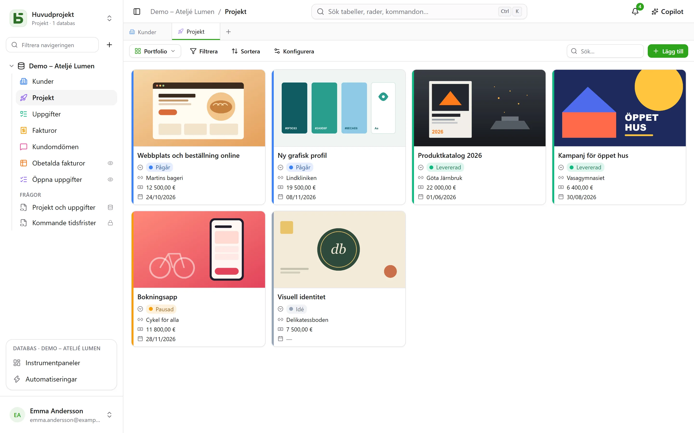
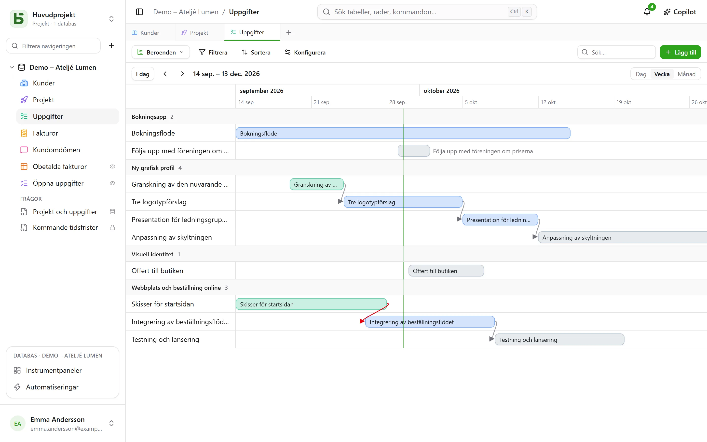
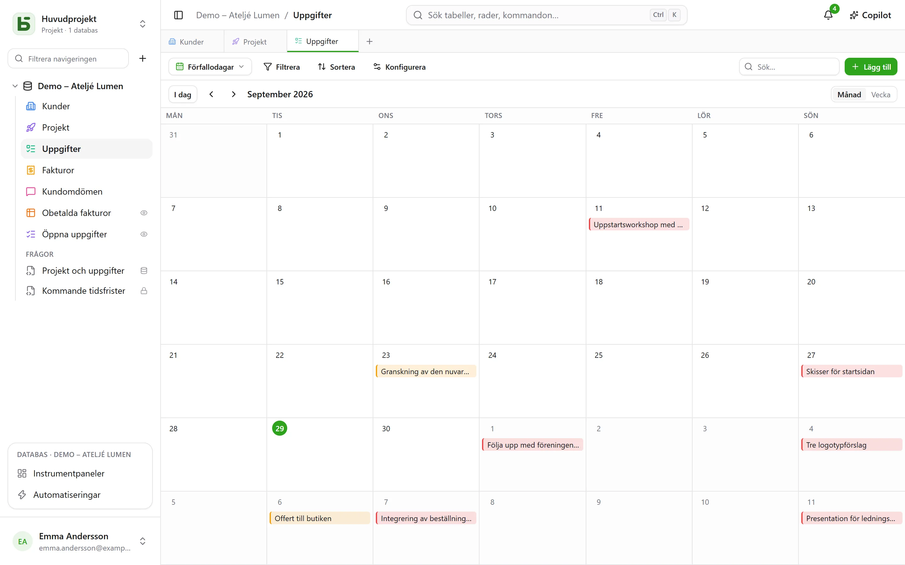
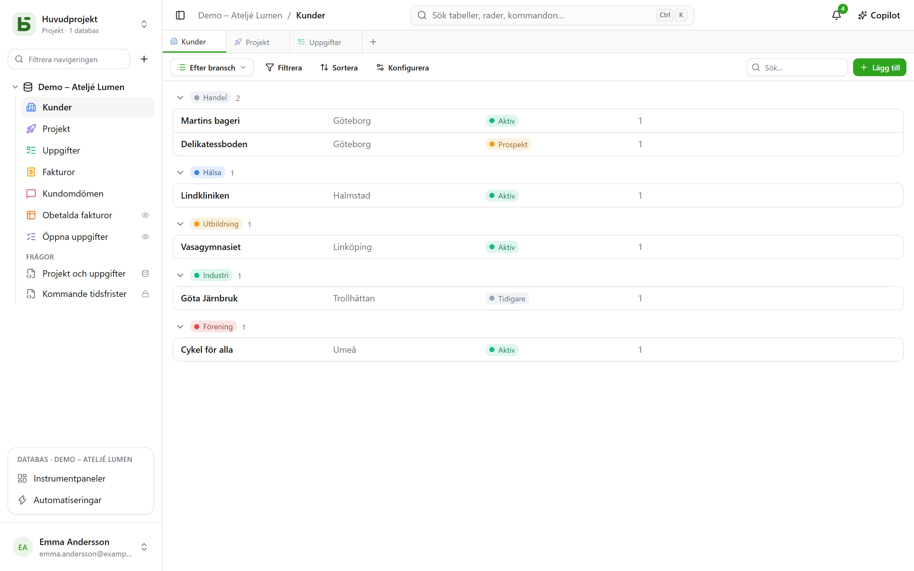

En tabell kan visas på **tio sätt**. En vy kopierar inga data och ger inga fler behörigheter
än tabellen själv.

:::note
De här vyerna är sätt att visa **en** tabell. En [SQL-vy](/basedb/sv/fonctionnalites/requetes-et-vues-sql/)
är något annat: en riktig PostgreSQL-vy, skriven i SQL mot databasens tabeller och placerad
bland dem i sidofältet.
:::

| Vy | Vad den visar | Vad den behöver |
|---|---|---|
| **Rutnät** | rader, filtrerade, sorterade, grupperade, med valda kolumner | – |
| **Kanban** | kort i kolumner | ett enkelval |
| **Kalender** | rader på sitt datum, per månad eller vecka | ett datumfält |
| **Tidslinje** | staplar mellan två datum, och deras beroenden | ett startdatum |
| **Galleri** | kort, med en omslagsbild | – |
| **Lista** | en rad per post, i hopfällbara grupper | – |
| **Karta** | varje rad placerad på en karta | en adress, eller en latitud och en longitud |
| **Formulär** | en sida med frågor för att skapa en rad | – |
| **Enkät** | samma frågor, en per skärm | – |
| **Quiz** | poängsatta frågor, en per skärm, och poängen i slutet | – |

## Vyväljaren

Den finns till vänster om ”Filtrera”. ”Alla rader” är tabellens rutnät, som ingen har sparat och
ingen kan ta bort; sedan kommer de **gemensamma vyerna**, i den ordning som den som bygger
databasen har valt, och därefter **Mina vyer**. Längst ned delar **Skapa en vy** in de tio
sorterna i två familjer: **Se raderna** och **Samla svar** (formulär, enkät, quiz).

- En **gemensam vy** syns för alla. Att skapa, konfigurera, byta namn på, ändra ordning på
  eller ta bort den kräver nivån **Hantera**. Den kan vara **låst**: ett hänglås visar det, och
  ingen kan ändra den förrän den har låsts upp.
- En **personlig vy** syns bara för dig och kräver bara att du kan läsa tabellen.
  **Skapa personlig vy**, eller **Spara som vy** efter att du har filtrerat och sorterat: var och
  en sparar sina egna sätt att läsa, utan att ändra något för andra. **Duplicera** på en
  gemensam vy ger en personlig kopia.

## Verktygsfältet

Ovanför rutnätet, i den här ordningen:

- **Filtrera** kombinerar villkor per fält;
- **Kolumner** väljer vad som visas – systemkolumnerna ligger för sig, under
  ”Systeminformation”;
- **Gruppera** delar in raderna efter ett fält med ett enda värde – enkelval, relation,
  person, datum, tal, text, kryssruta … – i hopfällbara grupper, var och en med sitt antal
  räknat över hela filtret;
- **Färger** färgar raderna efter ett enkelval eller efter **regler** – ett filter och en färg,
  högst tjugo – som en kantlinje, som bakgrund eller både och;
- **Radhöjd**: låg, medel, hög, mycket hög;
- **Sök…**, längst till höger, söker i alla kolumner medan du skriver; Esc tömmer sökningen.
  Den fungerar också i kanban, kalender, tidslinje, galleri och lista, och sparas aldrig i vyn.

Under varje kolumn finns en **Sammanfattning** som beräknas över alla rader i filtret, inte bara
på sidan: ifyllda, tomma, unika värden, summa, medelvärde, minimum, maximum, ikryssade rutor.

## Kanban, kalender, tidslinje

- **Kanban** ordnar korten efter ett enkelval; drar du ett kort ändras raden, och ett ”+” högst
  upp i en kolumn skapar en rad som redan har det valet. Varje kort visar en rubrik, en
  omslagsbild, de valda fälten och en **beskrivning** som citerar radens värden – ”Leverans
  planerad den `{{Date}}` för `{{Client}}`” –, skriven i vyns inställningar med knappen
  **Infoga fält**.
- **Kalendern** placerar varje rad på sitt datum, med ett eventuellt slutdatum; drar du en rad
  från en dag till en annan flyttas den.
- **Tidslinjen** ritar staplar mellan ett startdatum och ett slutdatum, grupperade efter ett
  enkelval eller en relation. Med inställningen **Beror på** – en relation från tabellen till sig
  själv – kopplar en pil varje uppgift till dem den beror på, röd när den går bakåt i tiden.

## Galleri och lista

- **Galleriet** visar kort: en **omslagsbild** (beskuren eller hel), en storlek (små, medelstora,
  stora kort), en färg efter ett enkelval.
- **Listan** visar en rad per post, **grupperad** efter ett enkelval, en relation eller en
  person.

I kanban, galleri och lista kan korten och raderna **ordnas för hand** genom att du drar dem –
upp till 5 000; en vald sortering har företräde framför den ordningen.

## Karta

**Kartan** placerar varje rad på sin plats, utifrån:

- en **adress** – en kort text, gärna i formatet **Adress** (se
  [Tabeller och fält](/basedb/sv/fonctionnalites/tables-et-champs/)): ”12 rue des Lilas, Lyon”;
- eller en **latitud** och en **longitud**, två talfält, placerade som de är.

En nål får sin **färg** från ett enkelval, visar radens **titel** vid hovring och öppnar dess
raddetaljer med ett klick. Kartan följer vyns filter och sortering, upp till 2 000 rader.

En adress **lokaliseras en gång för alla** av instansens geokodningstjänst – OpenStreetMaps som
standard –, i den takt tjänsten tillåter: på en ny karta dyker nålarna upp allteftersom svaren
kommer in, ungefär en i sekunden, och sedan direkt nästa gång. En etikett räknar de placerade
raderna, adresserna som återstår att lokalisera och de som inte gick att lokalisera: en adress
som inte hittas ska preciseras (stad, postnummer), aldrig hoppas över i tysthet.

:::note[Det som lämnar din server]
Adressernas text skickas till geokodningstjänsten, och varje läsares webbläsare hämtar
kartunderlaget direkt från tjänsten för karttiles. Instansens driftansvarig kan välja andra
tjänster, eller inga alls: se
[Miljövariabler](/basedb/sv/hebergement/variables/#kartor-och-adresser).
:::

## Formulär och enkät

Du kryssar i frågorna och ordnar dem; var och en har en rubrik, en hjälptext, ett
exempelsvar och kan göras obligatorisk. Formuläret har sin titel, sin introduktion, texten på
sin knapp och sitt tackmeddelande. Det fylls i inne i basedb eller
[delas via en länk](/basedb/sv/fonctionnalites/formulaires-partages/).

Inget behöver ställas in för att komma igång: ett nytt formulär frågar vad en person svarar —
inte statusen, den tilldelade personen eller relationerna som teamet fyller i senare, om de
inte är obligatoriska —, bär färgen från sin tabell och ett ljust tema, och varje tomt fält
visar ett passande exempel. Allt annat ändrar du när du vill:

- **Utseende**: åtta teman — Ljust, Mjuk, Gryning, Hav, Skog, Natt, Papper, Minimal —, en accentfärg, ett typsnitt, en justering till vänster eller centrerad;
- **Förifyll med dagens datum**: en datumfråga är redan ifylld med dagens datum — och klockslaget, för datum och tid — som personen behåller eller ändrar;
- **Fråga endast om…**: en fråga ställs bara om ett tidigare svar kräver det (”Sentiment är
  Negativt”, ”Betyg är högst 2”). En dold fråga är varken obligatorisk eller skickas;
- **Fler alternativ**: knapparna för välkomnande och skickande, numreringen,
  förloppsindikatorn, den automatiska övergången till nästa, meddelandet och en slutknapp
  (”Tillbaka till webbplatsen”), konfetti.

**Enkäten** tar upp hela skärmen: ett välkomnande som säger hur lång tid det tar, sedan en
fråga i taget, som glider in. Allt går också att göra med tangentbordet: **Enter** för att
fortsätta, bokstäverna **A**, **B**, **C**… för ett val, **J** eller **N** för ja eller nej,
siffrorna för ett betyg — ett enda val går vidare till nästa fråga av sig själv. Att skicka
in firas: en bock som ritas upp och konfetti i formulärets färger.

## Quiz

Ett quiz är en enkät som räknar poäng. Under varje fråga anger du dess **rätta svar** och vad det
ger – **1 poäng** om du inte anger något, upp till 100:

| Fråga | Rätt svar |
|---|---|
| enkelval | ett val |
| flerval | de val som ska kryssas i, alla och bara de |
| kryssruta | ja eller nej |
| tal, betyg | ett tal |
| datum | en dag |
| kort text, e-post, URL | ett eller flera godkända svar, separerade med `;` – utan hänsyn till versaler eller diakritiska tecken |

En fråga utan rätt svar – ett förnamn, en kommentar – ställs utan att bedömas. Det krävs minst en
bedömd fråga för att skapa quizet.

Avsnittet **Poängsättning** reglerar resten:

- **Rättning**: **efter varje fråga** – svaret kontrolleras direkt, i grönt, eller i rött med det
  rätta svaret, och poängen växer högst upp på skärmen –, **i slutet** – poängen, sedan facit –,
  eller **aldrig** – bara poängen, de rätta svaren förblir hemliga;
- **Gräns för godkänt**: en procentandel av poängen; slutskärmen säger då ”Godkänt!” eller
  ”Inte den här gången…”;
- **Spara poängen i**: ett talfält i tabellen, som tar emot poängen för varje svar. Sortera
  rutnätet efter det: där är rankningen. Ett fält som heter ”Score”, ”Poäng” eller ”Betyg” väljs
  automatiskt.

Slutskärmen visar poängen i en ring som fylls, procentandelen, och sedan, utom vid ”aldrig”,
varje bedömd fråga med det givna svaret och det rätta. En fråga som ett tidigare svar har dolt
räknas inte med i totalen.

:::note
I applikationen kan den som får läsa vyn också läsa de rätta svaren. Via en
[delad länk](/basedb/sv/fonctionnalites/formulaires-partages/#ett-delat-quiz) lämnar de aldrig
servern: det är den som rättar och räknar.
:::

## Dela en vy

En datavy – rutnät, kanban, kalender, tidslinje, galleri, lista – kan **delas skrivskyddad** via
en länk och bäddas in på en annan webbplats, och en kalender blir ett kalenderflöde. Se
[Delade vyer](/basedb/sv/fonctionnalites/vues-partagees/).

## Det läsaren inte ser

En vy **anpassas efter sin läsare**: ett fält som är dolt för läsaren försvinner ur kolumnerna,
korten och frågorna. En vy vars filter citerar ett dolt fält visas inte alls: utan sitt filter
skulle den visa mer än den skapades för att visa.
