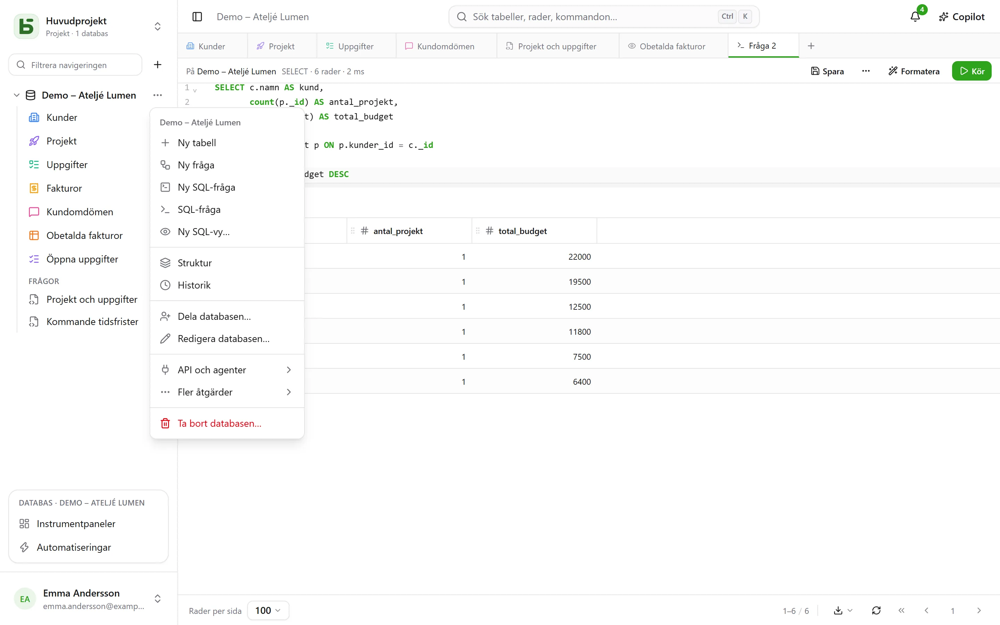

Den här genomgången tar tio minuter och täcker det viktigaste: när du är klar har du en tabell,
en kanbanvy och ett offentligt formulär som skriver till den.

:::tip[Se allt på en gång]
Ett tomt projekt erbjuder **demodatabasen**: en liten byrå med kunder, projekt, uppgifter,
fakturor och omdömen, med formler, vyer av alla slag, en instrumentpanel och automatiseringar.
**Ny databas** öppnar också [mallgalleriet](/basedb/sv/fonctionnalites/modeles/), där du kan
beskriva din databas för AI.
:::

## 1. Skapa en databas

Allt organiseras i **projekt**: väljaren högst upp i sidofältet byter projekt eller skapar ett.
I fältet skapar **+** till höger om filtret en databas. Ge den en etikett – ”Ventes” – och, om
du vill, en beskrivning, en färg och en ikon.

Databasen blir ett **PostgreSQL-schema**: dess fysiska namn (`b_t4z56fq_ventes`) visas i
formuläret och i den genererade dokumentationen.

## 2. Skapa en tabell och dess fält

I databasens **⋯**-meny: **Ny tabell**. Lägg sedan till dess fält från **Struktur** – i samma
meny – och dess knapp **Fält**:

| Fält | Typ |
|---|---|
| Nom | Kort text |
| Statut | Enkelval – Nouveau, Qualifié, Gagné, Perdu |
| Montant | Valuta |
| Échéance | Datum |
| Client | Relation → Clients |
| Notes | Lång text (Markdown) |

Senare läggs en formel (`DAYS([Échéance], TODAY())`), ett uppslag (kundens stad) eller en
aggregering (totalbeloppet per kund) till på samma sätt – se
[Tabeller och fält](/basedb/sv/fonctionnalites/tables-et-champs/).

Du kan också **importera en fil** – en Excel-arbetsbok (`.xlsx`), en CSV eller en JSON: importen
gissar typerna, låter dig rätta dem, skapar tabellen eller kompletterar en befintlig tabell och
talar om rad för rad vad den avvisar. Har arbetsboken flera blad väljer du vilket; datum, belopp
och kryssrutor tas emot precis som Excel håller dem, och en formel ger sitt värde.



## 3. Mata in och filtrera

Rutnätet redigeras som ett kalkylark: dubbelklicka eller tryck Enter för att redigera en cell,
Esc för att avbryta. **Filtrera** kombinerar villkor per fält; sorteringen görs från
kolumnrubriken; **Sök…**, till höger i fältet, söker i alla kolumner. Varje ändring sparas
direkt – och [hamnar i historiken](/basedb/sv/fonctionnalites/historique/): **Ctrl+Z** ångrar
den senaste.

## 4. Lägg till en vy

Vyväljaren, till vänster om ”Filtrera”, erbjuder ”Alla rader” och sedan dina vyer. Skapa en
**kanban** grupperad efter ”Statut”: drar du ett kort från en kolumn till en annan ändras raden.


## 5. Dela ett formulär

Skapa en vy av typen **Formulär**, kryssa i frågorna och välj sedan **Dela**: välj ”Offentlig”
och kopiera länken. Varje svar lägger till en rad i tabellen, utan att den som svarar får några
behörigheter. Detaljer finns i [Delade formulär](/basedb/sv/fonctionnalites/formulaires-partages/).

## 6. Läs i SQL

Databasens **⋯**-meny → **SQL-fråga**: dina tabeller finns där, under sina riktiga namn.

```sql
SELECT nom, statut, montant
FROM b_t4z56fq_ventes.opportunites
WHERE statut = 'gagne'
ORDER BY montant DESC;
```

**Spara** placerar den under tabellerna, i avsnittet ”Frågor” – för dig eller för hela
databasen – och **⋯** → **Skapa SQL-vy…** gör en riktig PostgreSQL-vy av den, placerad bland
tabellerna. Var och en läser dem med sina egna behörigheter. Se
[SQL-frågor och SQL-vyer](/basedb/sv/fonctionnalites/requetes-et-vues-sql/).

Det fungerar likadant från `psql` eller ditt BI-verktyg. Se [Direkt SQL](/basedb/sv/integrations/sql/).
