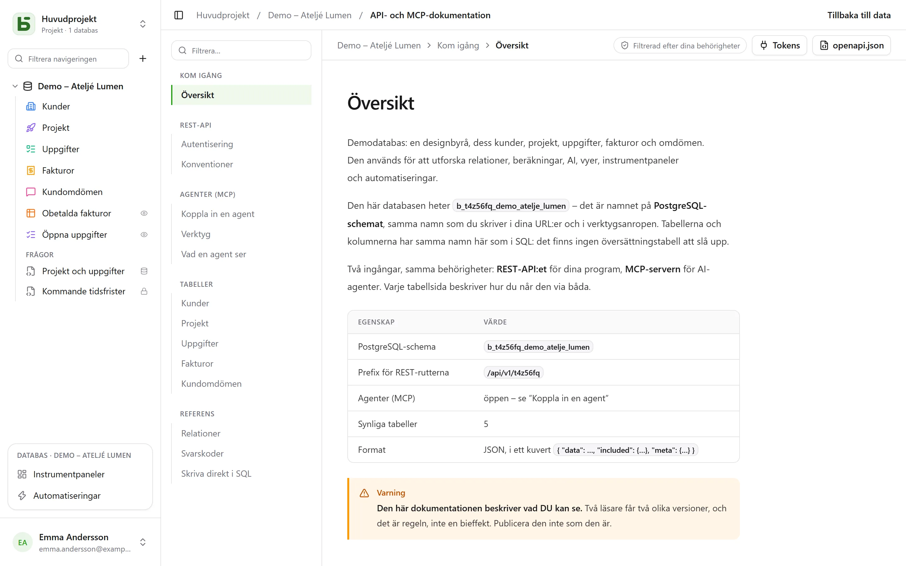

REST-API:et är samma som gränssnittet använder: **det finns ingen privat väg**. Dess URL:er
innehåller de fysiska namnen – samma som du läser i SQL.

```text
/api/v1/<tenant>/data/<base>/<table>
/api/v1/t4z56fq/data/b_t4z56fq_ventes/opportunites
```

## En token

I gränssnittet, databasens **⋯**-meny → **API och agenter** → **API- och MCP-tokens…**: den som
har nivån **Hantera** på databasen, eller på dess projekt, skapar där en **integrationstoken**
som är begränsad till den här databasen (alla dess miljöer, eller bara en), skrivskyddad som
standard, efter att lösenordet har bekräftats – ett konto utan lösenord, som loggar in via en
identitetsleverantör, kan inte göra det än. Den visas bara en gång; lägg den i en
miljövariabel.

En token läser; den skapar och ändrar om den har skapats med skrivrätt, och **tar bort om den har
skapats för det** – rättigheten **Läsa, skriva och ta bort** – utom en rad som en kaskadrelation
skulle ta med sig andra rader. Den har aldrig fler behörigheter än personen som skapade den.

```bash
export BASEDB_TOKEN=bdb_…
curl "http://localhost:3000/api/v1/t4z56fq/data/b_t4z56fq_ventes/opportunites?limit=20" \
  -H "Authorization: Bearer $BASEDB_TOKEN"
```

## Välja miljö

En databas som har flera [miljöer](/basedb/sv/fonctionnalites/environnements/) – produktion,
test … – förblir **en** databas för en token som skapats för hela databasen. Sökvägen anger
databasen med produktionens namn, och huvudet `X-Basedb-Environment` väljer miljön:

```bash
curl "http://localhost:3000/api/v1/t4z56fq/data/b_t4z56fq_ventes/opportunites" \
  -H "Authorization: Bearer $BASEDB_TOKEN" \
  -H "X-Basedb-Environment: recette"
```

- Utan huvudet gäller den miljö som sökvägen anger: `b_t4z56fq_ventes` är produktionen,
  `b_t4z56fq_ventes_recette` är testmiljön – båda skrivsätten fungerar fortfarande.
- `?environment=recette` gör detsamma för en klient som inte sätter något huvud.
- En miljö anges med sin etikett, utan hänsyn till versaler och accenter, eller med
  `production`. En miljö som databasen inte har svarar med `404`, som vilken saknad resurs som
  helst.
- `GET /api/v1/<tenant>/meta/bases` listar varje miljö med sitt block `environment`
  (`label`, `production`); med huvudet listar den bara den miljön.

En token som vid skapandet har begränsats till en enda miljö öppnar ingen annan: huvudet ändrar
ingenting. Dess behörigheter begränsas alltid till skärningen med personens, miljö för miljö.

## Läsa

| Parameter | Roll |
|---|---|
| `filter` | ett läsbart uttryck: `statut eq "gagne" and montant gte 10000` |
| `sort` | `-montant,nom` |
| `fields` | kolumnerna som ska returneras |
| `limit`, `after` | paginering med krypterad markör: `meta.next_cursor` för en sida, skickad som `after`, ger nästa (`meta.has_next_page`) |
| `links=display` | relationerna med sitt visningsvärde |
| `count=exact` | totalen, med ett tak på 100 000 |
| `variables=raw` | långa texter som de skrevs, `{{colonne}}` inräknat, i stället för med [radens värden](/basedb/sv/fonctionnalites/tables-et-champs/#formaterad-text-och-variabler) |

Operatorerna: `eq`, `ne`, `eq_ci`, `contains`, `starts_with`, `ends_with`, `in`, `is_null`,
`gt`, `gte`, `lt`, `lte`, `between`, kombinerade med `and`, `or`, `not` och parenteser. Ett
filter kan gå genom en relation: `clients_id.ville eq "Lyon"`.

## Skriva

```bash
curl -X POST "http://localhost:3000/api/v1/t4z56fq/data/b_t4z56fq_ventes/opportunites" \
  -H "Authorization: Bearer $BASEDB_TOKEN" -H "content-type: application/json" \
  -d '{"values": {"nom": "Audit RGPD", "statut": "nouveau", "montant": 12000}}'
```

`PATCH …/<table>/<_id>` ändrar en rad med samma kropp `{"values": {…}}`. Felen har en enda
form: `{ "code": "…", "details": {…}, "request_id": "…" }`, med en stabil kod per orsak.

Varje skrivning returnerar sidhuvudet `x-basedb-transaction`: skickar du det till
`POST /api/v1/<tenant>/history/undo` (`{"transaction": "…"}`) ångras skrivningen, precis som med
Ctrl+Z i gränssnittet – det avvisas om raden har ändrats sedan dess.

## Mer än rader

Med samma token:

| Väg | Roll |
|---|---|
| `GET …/data/<base>/<table>/aggregate` | sammanfattningar över alla rader i ett filter: `aggregates=montant:sum,nom:filled`, `group=statut` |
| `GET …/data/<base>/<table>/<_id>/comments`, `POST` | läsa och skriva kommentarerna på en rad |
| `POST /api/v1/<tenant>/automations/<id>/run` | starta en automatisering som utlöses av en knapp, på en rad (`{"record": "…"}`) |
| `GET /api/v1/<tenant>/meta/bases/<base>/dashboards` | instrumentpanelerna i en databas |
| `GET /api/v1/<tenant>/meta/users` | medlemmarna i arbetsytan, för ett Person-fält |
| `GET /api/v1/<tenant>/meta/templates` | databasmallarna i galleriet |
| `GET /api/v1/<tenant>/events?base=<base>&table=<table>` | följa en tabell i realtid: signaler, som sedan läses igen via rutterna ovan (se [Webhooks](/basedb/sv/integrations/webhooks/#utan-webhook-följa-en-tabell)) |

[Delade vyer](/basedb/sv/fonctionnalites/vues-partagees/) kan läsas utan konto:
`GET /api/v1/views/<jeton>` och `…/rows` i JSON, `…/calendar.ics` i iCalendar.

Att bygga – skapa en automatisering, en instrumentpanel, en integration – är förbehållet en
session i gränssnittet: en token läser och skriver rader, den ändrar inte databasen.

## Färger och ikoner

En tabell och varje alternativ i ett enkelval har en färg (`color`, `#rrggbb`) och en ikon
(`icon`, namnet på en [Lucide](https://lucide.dev/icons/)-ikon som gränssnittet ritar: `truck`,
`circle-check`, `flame` …). `GET …/meta/bases/<base>` returnerar dem för databasen, dess
tabeller och alternativen i dess fält.

För att välja dem, med åtkomsttoken för en person som kan ändra strukturen
(`POST /auth/session/access`) – en integrationstoken ändrar inte databasen:

| Väg | Kropp |
|---|---|
| `POST …/admin/bases/<base>/tables` | `{"label": "Tickets", "color": "#dc2626", "icon": "flame", "fields": […]}` |
| `PATCH …/admin/bases/<base>/tables/<table>` | `{"color": "#2563eb", "icon": "inbox"}` – de tre nycklarna `color`, `icon` och `image` hänger ihop: nämner du en ersätter den alla tre |
| `POST …/admin/bases/<base>/tables/<table>/fields` | `{"label": "Priorité", "kind": "select", "options": [{"value": "haute", "color": "#dc2626", "icon": "flame"}, …]}` |
| `PUT …/admin/bases/<base>/tables/<table>/fields/<champ>/options` | hela listan med alternativ, i ordning, vart och ett med sin färg och sin ikon |

En agent går via [MCP-servern](/basedb/sv/integrations/mcp/#färger-och-ikoner), där den
**föreslår** de här ändringarna. Ett fält har ingen ikon att välja: gränssnittet ritar den som
hör till dess typ.

## Skapa en databas från en mall

Ett program som installeras skapar sin databas i **ett anrop**: servern tillämpar mallen –
tabeller, fält, relationer, exempelrader, vyer, instrumentpaneler, automatiseringar – och om
ett steg misslyckas lämnas ingen databas kvar.

```bash
curl -X POST "http://localhost:3000/api/v1/t4z56fq/admin/bases" \
  -H "Authorization: Bearer $ACCES" -H "content-type: application/json" \
  -d '{"template": "crm", "label": "Ventes", "rows": false}'
```

`template` är nyckeln för en mall i galleriet, eller en hel mall i
[mallformatet](/basedb/sv/fonctionnalites/modeles/). Med sidhuvudet
`Accept: application/x-ndjson` kommer svaret rad för rad: en rad `{"step": …}` per steg, sedan
den skapade databasen. Det här anropet kräver åtkomsttoken för en person som kan skapa en
databas (`POST /auth/session/access`, efter inloggning): en integrationstoken öppnar bara en
befintlig databas.

## Kontrollera en token

basedbs tokens kan inte kontrolleras utanför basedb. Ett program som tar emot en – ett verktyg
som öppnas från basedb med personens token, till exempel – frågar vad den är värd
(introspektion, RFC 7662), med sin egen integrationstoken:

```bash
curl -X POST "http://localhost:3000/auth/introspect" \
  -H "Authorization: Bearer $BASEDB_TOKEN" \
  --data-urlencode "token=$JETON_RECU"
```

```json
{ "active": true, "token_type": "access_token",
  "sub": "0195a…", "email": "claire@example.com", "name": "Claire Martin",
  "tenant": "t4z56fq", "groups": ["Commerciaux"], "exp": 1790000000 }
```

En token som inte är giltig – okänd, utgången, återkallad, avslutad session, annan arbetsyta –
svarar `{"active": false}`, utan att säga varför. Svaret läses direkt: en utloggning syns
omedelbart. För en integrationstoken anger svaret också databasen den öppnar (`base`, dess
produktion), om den öppnar alla miljöer (`environments`: `all`) eller bara en (`one`), dess
åtkomst (`read`, `write` eller `delete`) och dess ytor.

## Den genererade dokumentationen

Varje databas har sin sida **API- och MCP-dokumentation**: för varje tabell dess slutpunkter,
dess kolumner, exempel i cURL och i JavaScript. Den är **filtrerad efter dina behörigheter** –
två läsare får två olika versioner –, skriven **på skärmens språk**, och finns också i OpenAPI 3.1
(`/api/v1/<tenant>/meta/bases/<base>/openapi.json`), som deklarerar Bearer-token och huvudet
`X-Basedb-Environment`. Namnen, sökvägarna och felkoderna är desamma på alla språk.


