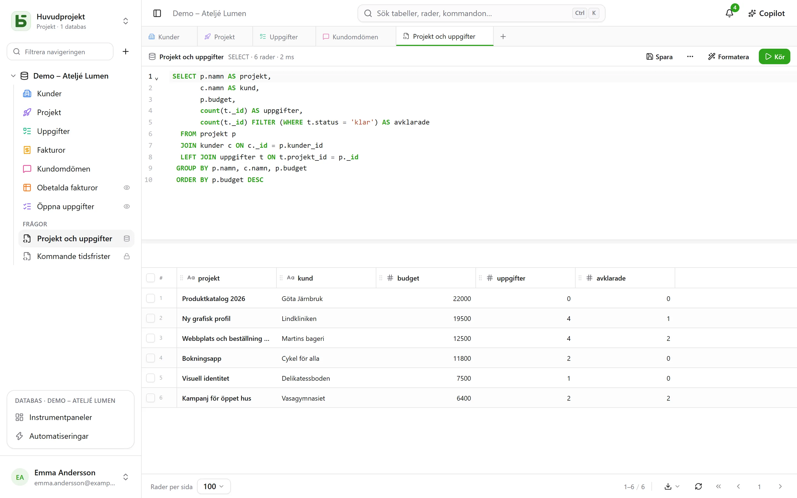

Det är själva meningen med basedb: **dina tabeller är riktiga tabeller**. Alla
PostgreSQL-klienter läser dem under deras namn.

## Namnen

| Objekt | Fysiskt namn | Exempel |
|---|---|---|
| Databas | ett schema `b_<tenant>_<nom>` | `b_t4z56fq_ventes` |
| Testmiljö | schemat med ett suffix | `b_t4z56fq_ventes_recette` |
| Tabell | dess slugifierade namn | `opportunites` |
| Fält | dess slugifierade namn | `echeance` |
| Relation | `<table cible>_id` | `clients_id` |
| [SQL-vy](/basedb/sv/fonctionnalites/requetes-et-vues-sql/) | dess tekniska namn, i databasens schema | `factures_a_encaisser` |

Sidan **API- och MCP-dokumentation** för varje databas anger dem alla, och `\d` i `psql` visar
beskrivningarna (`COMMENT ON`).

## I gränssnittet

**+** i flikfältet, eller databasens **⋯**-meny → **SQL-fråga**: en redigerare med
syntaxfärgning och komplettering, vars resultat visas i samma rutnät som dina tabeller.



- **Var och en läser där med sina behörigheter**: nivån Hantera når hela databasen, skrivningar
  inräknade; övriga medlemmar skriver skrivskyddad SQL, där en stängd tabell inte finns och ett
  dolt fält försvinner.
- En fråga **sparas** under tabellerna – för dig själv, för hela databasen eller för grupper –
  och blir, om du vill, en **SQL-vy**: en riktig PostgreSQL-vy, placerad bland tabellerna och
  läsbar från `psql`.

Allt beskrivs i detalj i [SQL-frågor och SQL-vyer](/basedb/sv/fonctionnalites/requetes-et-vues-sql/).

## Från psql

Med den medföljande `docker-compose.yml` publiceras PostgreSQL på `127.0.0.1:5432`:

```bash
psql "postgres://basedb:<POSTGRES_PASSWORD>@localhost:5432/basedb"
```

```sql
SET search_path = b_t4z56fq_ventes;

SELECT o.nom, o.montant, c.nom AS client
FROM opportunites o
JOIN clients c ON c._id = o.clients_id
WHERE o.statut = 'gagne';
```

Det här kontot är databasens ägare: det läser allt, och basedbs behörigheter gäller inte för
det. Skapa i stället en egen roll med sina egna `GRANT` för ett BI-verktyg. Om en tabell har en
[radregel](/basedb/sv/fonctionnalites/droits/#ända-ned-till-raden), tillämpar PostgreSQL
radsäkerhet på den: en sådan roll ser inga rader i den utan attributet `BYPASSRLS` eller en egen
policy.

## Skriva i SQL

Det är tillåtet. Villkoren (enkelval, relationer, URL:er, obligatoriskt) upprätthålls av
PostgreSQL och avvisar ett ogiltigt värde, precis som i gränssnittet. Och skrivningen **hamnar i
historiken**: historiken visar den som ”Direkt SQL-session”, med sessionen som gjorde den, och
den kan ångras som alla andra.

:::caution
Att ändra **strukturen** i SQL (`ALTER TABLE`) går förbi basedbs katalog, som inte skulle känna
till ändringen. Gå via gränssnittet, API:et eller ett agentförslag: migreringsmotorn planerar,
låser kort och håller katalogen korrekt.
:::
