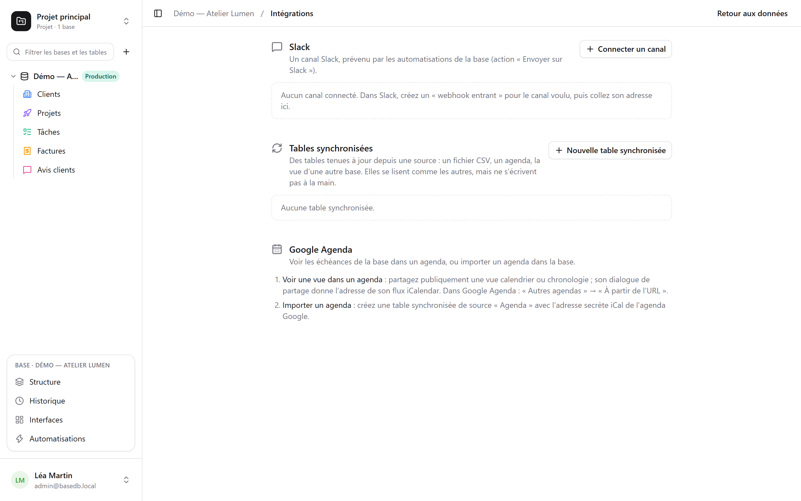

Skärmen **Integrationer** för en databas öppnas från profilmenyn, längst ned till vänster. Den kräver
nivån **Hantera** och samlar det som kopplar databasen till resten av dina verktyg.

## Slack

**Anslut en kanal**: skapa en *inkommande webhook* i Slack för önskad kanal och klistra sedan in
dess adress (`https://hooks.slack.com/…`, det enda ursprung som accepteras). **Testa** skickar
ett testmeddelande. Adressen krypteras så snart den sparas och visas aldrig mer.

Den anslutna kanalen blir sedan en åtgärd i [automatiseringarna](/basedb/sv/fonctionnalites/automatisations/):
**Skicka till Slack**, med ett meddelande som citerar raden – ”Nytt negativt omdöme från
{{Auteur}}: {{Avis}}”.

## Kalendrar

Två riktningar, två sätt:

- **Visa en vy i en kalender**: dela en kalender- eller tidslinjevy offentligt; dess
  delningsdialog ger adressen till ett **iCalendar-flöde**, som du prenumererar på från Google
  Kalender (”Andra kalendrar” → ”Från webbadress”), Outlook eller Apple Kalender. Se
  [Delade vyer](/basedb/sv/fonctionnalites/vues-partagees/#en-kalender-i-din-kalenderapp).
- **Importera en kalender**: skapa en synkroniserad tabell med källan ”Kalender” och kalenderns
  hemliga iCal-adress.

## Synkroniserade tabeller

En synkroniserad tabell **hålls uppdaterad från en källa**: den läses, filtreras och visas i
vyer som alla andra, men kan inte skrivas för hand – en etikett ”Synkroniserad” påminner om det,
och API:et avvisar alla skrivningar (`TABLE_SYNCED`).

| Källa | Vad tabellen blir |
|---|---|
| **CSV-fil på webben** | en kolumn per kolumn i filen, typad efter innehållet: tal, datum eller text |
| **Kalender** (Google Kalender, iCalendar) | en händelse per rad: rubrik, start, slut, plats, beskrivning |
| **Delad vy från en basedb** | raderna i en [delad vy](/basedb/sv/fonctionnalites/vues-partagees/#en-källa-för-andra-databaser), på den här instansen eller en annan |

**Ny synkroniserad tabell** väljer källan och intervallet – från var 15:e minut till en gång om
dagen; **Synkronisera** läser om den direkt. Varje körning skapar, ändrar och tar bort det som
behövs för att tabellen ska likna källan, och orienterar sig efter ett fält som är
**Synkroniseringsnyckel**. Alla dessa skrivningar går via historiken.

**Stoppa** synkroniseringen gör tabellen till en vanlig tabell: raderna finns kvar och kan åter
skrivas för hand.

## Begränsningar

- En källa läses med en gräns på 5 MB, 10 000 rader och 10 sekunder.
- En källa som misslyckas raderar ingenting: tabellen behåller sina rader till nästa körning.
- En kolumn som dyker upp i källan efter att tabellen skapats läggs inte till.
- Slack ansluts via inkommande webhook, ännu inte via en Slack-app.
