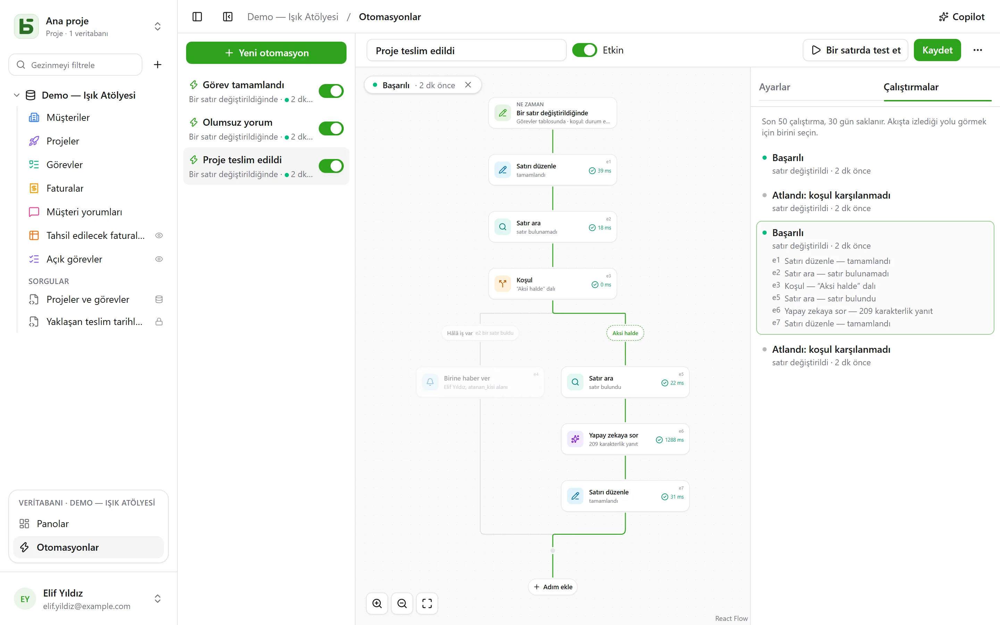

Bir otomasyon **ne zaman**, **eğer** ve **o hâlde** sorularını yanıtlar: bir görev “Fait”
durumuna geçtiğinde saati not etmek; olumsuz bir değerlendirme geldiğinde sorumluya haber vermek
ve Slack'e yazmak; her pazartesi saat 9'da ekip toplantısının satırını oluşturmak. Tek bir eylem
yetmediğinde otomasyon bir **akış** izler: bir satır aramak, satırın söylediğine göre bir dala
ya da diğerine girmek, bir filtreye uyan her satırda adımları yinelemek, bir adımda önceki bir
adımın bulduğunu ya da yazdığını yeniden kullanmak, bir hatırlatmadan önce üç gün **beklemek**,
bir **PDF**'i ek olarak göndermek.

Otomasyonlar, kenar çubuğunun altındaki açık veritabanı bloğunda yer alan **Otomasyonlar**
bağlantısından açılır ve **Yönetim** düzeyini gerektirir.



## Akış

Akış yukarıdan aşağıya çizilir: tetikleyici, ardından her adım. Bir çizgi üzerindeki **+**,
kategoriye göre sıralanmış — Satırlar, İletişim, Belgeler, Yapay zeka, Mantık — ve aranabilir
adımlar listesini açar, seçileni o noktaya ekler; bir kart, ayarlarını sağda açar. Basit bir
otomasyon — bir tetikleyici ve bir eylem — iki karta sığar ve eskisi gibi ayarlanır.

## Ne zaman

| Tetikleyici | Ayarlar |
|---|---|
| **Bir satır oluşturulduğunda** | tablo |
| **Bir satır değiştirildiğinde** | tablo ve gerekirse yalnızca izlenecek alanlar |
| **Belirli bir saatte** | her saat, her gün ya da her hafta, seçilen saatte ve saat diliminde |
| **Bir düğmeye tıklandığında** | tablonun bir [Düğme alanı](/basedb/tr/fonctionnalites/tables-et-champs/#düğme) |
| **Bir satır silinir** | tablo; adımlar satırı o anki hâliyle anar |
| **Bir satır bir filtreye girer** | tablo ve filtre: otomasyon bir satır filtreye girdiğinde başlar, ondan çıkana kadar yeniden başlamaz — “bir fatura gecikmiş duruma geçer”, “gecikmiş bir fatura değiştirilir” değil |
| **Bir tarih gelir** | tablonun bir Tarih alanı, bir kaydırma — üç gün önce, aynı gün, bir hafta sonra — ve saat: vade hatırlatmaları, sözleşme yıldönümleri |
| **Bir webhook alınır** | hiçbir şey: otomasyon, başka bir yazılımın çağıracağı kendi adresini alır ([ayrıntılar](#bir-servis-basedbyi-çağırdığında)) |

Satırlar üzerindeki bir tetikleyici **tüm** yazmaları görür: arayüz, API, bir ajan, paylaşılan
bir form, hatta doğrudan SQL — otomasyonlar, bunların hepsini kaydeden geçmişten yola çıkar.

## Yalnızca şu durumda

[Filtre dilinde](/basedb/tr/integrations/api-rest/#okuma) yazılan isteğe bağlı bir koşul —
`statut eq "fait"`, `montant gte 10000 and payee eq false` — satır üzerinde **eylem anında**
değerlendirilir. Koşulu sağlanmayan bir çalıştırma “atlanır” ve bunu belirtir.

## O hâlde

Sırayla kırk adıma kadar; başarısız olan ilk adım sonrakileri durdurur — bir **Deneme** bloğu
içinde değilse ([ayrıntılar](#deneme)).

| Adım | Ne yapar |
|---|---|
| **Satırı düzenle** | tetikleyen satıra — ya da bir adımın bulduğu veya oluşturduğu satıra — değerler yazar |
| **Satır oluştur** | bu tabloda ya da veritabanının başka bir tablosunda |
| **Satır ara** | bir tablonun bir filtreye uyan ilk satırını bulur; sonraki adımlar ona atıf yapabilsin ya da onu değiştirebilsin diye |
| **Birine haber ver** | seçilen kişilere ya da bir Kişi alanındaki kişiye bir [bildirim](/basedb/tr/fonctionnalites/collaboration/#bildirimler) gönderir |
| **E-posta gönder** | ekipten kişilere, bir Kişi alanındakine, bir E-posta alanının adresine — bir müşteri, bir tedarikçi — ya da yazılan adreslere; konu ve metin satıra ve önceki adımlara atıf yapar |
| **Webhook çağır** | bir servise HTTPS isteği — yöntemine, adresine, üst bilgilerine ve gövdesine siz karar verirsiniz ([ayrıntılar](#bir-servis-çağırma)) ; yanıtına ardından atıf yapılabilir |
| **Slack'e gönder** | [bağlı](/basedb/tr/integrations/synchronisation/#slack) bir kanala bir mesaj |
| **Yapay zekaya sor** | [yapay zeka sağlayıcısından](/basedb/tr/fonctionnalites/ia/), satıra ve önceki adımlara atıf yapan bir talimata yanıt — yazmak, özetlemek, sınıflandırmak —; yanıt bir metin, bir sayı, evet ya da hayır, bir tarih ya da bir listeden bir seçim olarak okunur |
| **Koşul** | birkaç dal: koşulu sağlanan ilk dal izlenir, hiçbiri sağlanmadığında “Aksi halde”; dallar ardından yeniden birleşir |
| **Her satır için** | içerdiği adımları, bir filtreye uyan bir tablonun her satırı için bir kez ([ayrıntılar](#her-satır-için)) |
| **Satırı sil** | tetikleyen satırı, ya da bir adımın bulduğunu — çöp kutusuna gider |
| **Say ve topla** | bir filtrenin satır sayısını, toplamını, ortalamasını, minimumunu ya da maksimumunu, sonradan anılacak ya da test edilecek şekilde |
| **PDF oluştur** | bir satırın [belgesini](/basedb/tr/fonctionnalites/documents/), bir Dosya alanına koyar ya da bir e-postaya ekler |
| **Bekle** | bir süre, ya da bir alanın tarihine kadar ([ayrıntılar](#bekle)) |
| **Deneme** | bazı adımları, ve biri başarısız olursa yapılacak başkalarını ([ayrıntılar](#deneme)) |
| **Otomasyon başlat** | veritabanının başka bir otomasyonunu, kendi tablosunun bir satırı üzerinde |

Hiçbir şey bulamayan bir arama akışı durdurmaz: onun satırını değiştirecek adımlar atlanır. Bu
durumda başka bir şey yapmak için, aramanın altındaki **Hiçbir satır bulunamazsa…**, bunu test
eden bir koşul ekler.

Bir **koşul**, bir satırı bir filtreyle, ya da bir **değeri** test eder: yapay zekanın yanıtı,
bir webhook'un kodu, bir toplam — “`{{e2.reponse}}` Urgent'a eşittir”, “`{{e3.somme.montant}}`
1000'den büyük ya da eşittir”. Sayılar sayı olarak, metinler ise aksansız ve küçük harfle
karşılaştırılır.

## Her satır için

**Her satır için** adımı, bir tablonun filtresine uyan satırlarını — filtre boşsa hepsini —
seçilen sırayla, sınırına kadar (varsayılan 50, en fazla 200) okur, ardından içindeki
adımları her satır için bir kez çalıştırır. “Her pazartesi, ödenmemiş faturaları hatırlat”
şöyle yazılır: **Belirli bir saatte**, ardından `payee eq false and relancee eq false`
filtresiyle faturalar üzerinde **Her satır için**; döngü içinde faturanın kişisine bir
e-posta ve “relancée” kutusunu işaretleyen **Satırı düzenle**.

Döngü içinde, adımın kimliği **turun satırını** adlandırır: `{{e1.client}}` ona atıf yapar,
ve **Satırı düzenle** onu değiştirilecek satırlar arasında önerir. Döngüden sonra,
`{{e1.nombre}}` kaç satır taradığını söyler — örneğin Slack'te bir özet için. Filtre
öncekine atıf yapabilir: ödenmiş bir fatura tarafından tetiklendiğinde, `facture eq {{_id}}`
onun kalem satırlarını tarar.

Sınırın ötesindeki kalan satırlar bir sonraki çalıştırmayı bekler ve bu belirtilir:
işlenenleri — bir “relancée” kutusu, bir tarih — filtreden çıkarın ki hepsi çalıştırmalar
boyunca işlensin. Bir döngü başka bir döngü içermez, ve bir çalıştırma iki dakikanın
sonunda durur.

## Bekle

**Bekle** adımı çalıştırmayı duraklatır — üç saat, iki gün — ya da bir satırın bir alanının
tarihine kadar, bir kaydırma ve bir saatle: “vadeden bir gün önce, saat 9'da”. Çalıştırma,
**Çalıştırmalar** sekmesinde, yeniden başlayacağı tarihle birlikte **Duraklatıldı** olarak
görünür.

Sonraki adıma, satırlarını **yeniden okuyarak** devam eder: “teklifin gönderilmesinden üç gün
sonra, hâlâ kabul edilmediyse yeniden hatırlat” şöyle yazılır: 3 gün **Bekle**, ardından o
günkü hâliyle teklifin durumu üzerine bir koşul. Otomasyonu devre dışı bırakmak duraklatılmış
çalıştırmaları durdurur; bir bekleme ne bir döngünün ne de bir **Deneme** bloğunun içine
yerleştirilemez ve en fazla bir yıl sürer.

## Deneme

**Deneme** bloğunun iki yolu vardır. İlki çalıştırılır; adımlarından biri başarısız olursa
akış, hatayı — `{{e4.erreur}}`, kodu, ve `{{e4.etape}}`, adımı — anan ikinci yolla,
**Başarısız olursa**, sürer, ardından bloktan sonra devam eder. Bir servis yanıt vermediğinde
her şeyi durdurmadan birine haber vermenin bir yolu.

Daha basiti: bir webhook, serviste bir arıza sonrasında kendiliğinden üç kere kadar **yeniden
deneyebilir**, ve bir döngü başarısız bir satıra karşın **sürebilir**.

## PDF ve e-posta

**PDF oluştur**, bir satırın belgesini yapar — tablosunun bir [belge
modeliyle](/basedb/tr/fonctionnalites/documents/), ya da tüm alanlarının föyüyle — ve bunu bir
Dosya alanına koyabilir. **E-posta gönder** ardından bunu, bir Dosya ya da Görsel alanının
dosyalarıyla birlikte ekleyebilir:

- **her birine** bir e-posta, ya da **herkese tek bir tane**, **bilgi** alıcılarıyla birlikte;
- satırı anan bir **zengin metin** iletisi (kalın, listeler, bağlantılar);
- bir **yanıt** adresi: varsayılan olarak sizinki, ya da bir E-posta alanınınki;
- en fazla 50 alıcı, 10 ek dosya ve 15 MB.

“Bir teklif Kabul edildi durumuna geçtiğinde, faturayı müşteriye gönder, muhasebeyi bilgiye
ekle”: `statut eq "accepte"` ile **Bir satır bir filtreye girer**, Fatura şablonuyla **PDF
oluştur**, müşterinin E-posta alanına **E-posta gönder**, fatura ekli.

## Bir servis basedb'yi çağırdığında

**Bir webhook alınır** tetikleyicisiyle otomasyon, onu başlatması gereken yazılıma verilecek
kendi gizli adresine sahip olur — çevrim içi bir mağaza, harici bir form, bir otomasyon aracı:

```bash
curl -X POST "https://basedb.example.com/api/v1/hooks/<secret>" \
  -H "content-type: application/json" \
  -d '{"client": {"nom": "Dupont"}, "total": 120}'
```

Adımlar onun gönderdiğini anar: `{{trigger.client.nom}}`, `{{trigger.total}}`; bir form da
aynı şekilde okunur, bir metin `{{trigger.texte}}` ile. Adres, tetikleyicinin ayarlarından
kopyalanır; **Adresi değiştir** onu yenisiyle değiştirir ve eskisi anında durur. Bir çağrı
`202` alır, otomasyon bir saniye içinde çalışır.

## Bir servis çağırma

**Webhook çağır** adımı, varsayılan olarak `POST` yöntemiyle otomasyonun verilerini
gönderir: seçilen satırı ve önceki adımların bulduğu ya da yazdığı şeyi. Bir servisle onun
beklediği biçimde konuşmak için şunlar ayarlanır:

- **yöntem**: `POST`, `PUT`, `PATCH`, `GET` ya da `DELETE` — bu son ikisinde gövde yoktur;
- sunucusundan sonra atıf yapabilen **adres** — `https://api.exemple.fr/clients/{{e2.numero}}` ;
  her değer orada kodlanır;
- değeri atıf yapabilen **üst bilgiler**: `Idempotency-Key: {{_id}}` ;
- **gövde**: otomasyonun verileri, **oluşturulacak bir JSON**, satır başına bir
  `anahtar=değer` çifti içeren bir **form** ya da bir **metin**. Bir JSON'da tırnak içindeki
  bir atıf metindir, tırnak dışındaki ise bir değerdir — bir sayı, evet ya da hayır, bir liste:

```json
{ "facture": "{{e1.numero}}", "montant": {{e1.montant}}, "payee": {{e1.payee}} }
```

Bir API anahtarı ya da bir token, **gizli** bir üst bilgiye (kilit simgesi) konur: kurulum
anahtarıyla şifrelenir, bir daha asla gösterilmez — ne ekranda, ne API'de, ne de Copilot'ta —
ve yalnızca kendisi için verildiği sunucuya gider. Adresin sunucusunu değiştirmek onu yeniden
vermenizi gerektirir; **Değiştir** yenisini girer.

## Yapay zekaya sor

Bir [yapay zeka alanı](/basedb/tr/fonctionnalites/ia/#bir-alanın-yapay-zeka-seçeneği) gibi,
adım da her atfın yerine değerinin konduğu talimatını sağlayıcıya gönderir:

```text
Cet avis de {{auteur}} demande-t-il une action de notre part ? {{avis}}
```

**Beklenen yanıt** seçilir — serbest ya da kısa bir metin, bir sayı, evet ya da hayır, bir
tarih, bir web adresi ya da bir listeden bir seçim; liste bir seçim alanından alınabilir. Model
bundan haberdar edilir ve beklenen türü içermeyen bir yanıt adımı başarısız kılar. Sonraki
adımlar yanıta `{{e1.reponse}}` ile atıf yapar: oluşturulan bir görevin başlığında, bir mesajda
ya da yanıtın aynı etiketli seçeneğe yerleştirildiği bir seçim alanında.

Talimatın atıf yaptığı şey sağlayıcıya gider: adım sizin **onayınızı** ister; talimat
değiştiğinde onayın yeniden verilmesi gerekir. Her çağrı günlüğe kaydedilir ve yapay zeka
alanlarıyla birlikte `BASEDB_AI_FIELD_QUOTA` kotasına sayılır (varsayılan olarak saatte 300).
Yapay zeka kendi başına hiçbir şey yapmaz: yazan ya da haber veren, ondan sonra yerleştirilen
adımlardır.

## Atıf yapma

Değerler, mesajlar ve filtreler, her metnin yanındaki **{ }** düğmesiyle öncekilere atıf yapar:

- `{{Titre}}`, `{{_id}}`: tetikleyen satır;
- `{{e2.titre}}`, `{{e2._id}}`: `e2` adımının bulduğu, oluşturduğu ya da değiştirdiği satır —
  her adımın kimliği kartında yazılıdır;
- `{{e3.statut}}`, `{{e3.reponse.numero}}`: `e3` webhook'unun verdiği yanıt;
- `{{e4.reponse}}`: `e4` yapay zeka adımının yanıtı;
- `{{e5.client}}`, `e5` döngüsünde turun satırı; ondan sonra `{{e5.nombre}}`, taranan satır
  sayısı;
- `{{e6.nombre}}`, `{{e6.somme.montant}}`, `{{e6.moyenne.montant}}`, `{{e6.max.echeance}}`:
  `e6` adımının saydığı;
- `{{e7.erreur}}`, `{{e7.etape}}`: `e7` **Deneme** bloğunun yakaladığı hata;
- `{{e8.nom}}`: `e8` adımının PDF'inin adı;
- `{{trigger.client.nom}}`: gelen bir webhook'un gönderdiği;
- `{{_maintenant}}`: çalıştırmanın anı.

Tek bir atıftan oluşan bir değer, değerin kendisini aktarır: bir ilişki, bir kişi, bir seçim —
oluşturulan bir satır, bir aramanın bulduğu satıra bu şekilde bağlanır. Bir filtrede atıf her
zaman karşılaştırılan bir değerdir, asla filtre dilinin bir parçası değildir.

Bir adım yalnızca kendisinden önce kesinlikle gerçekleşmiş olana atıf yapabilir: bir dalın
bulduğu şeye koşuldan sonra artık atıf yapılamaz. Düzenleyici bunu, kaydetmeden önce kartın
üzerinde belirtir.

## Copilot

Başlıktaki **Copilot**, sağda veritabanının otomasyonları üzerine doğal dilde bir konuşma açar:
“bir görev incelemeye geçtiğinde atanan kişiye haber ver”, “notlara yapay zekayla bir özet
ekle”, “son çalıştırma neden başarısız oldu?”. Yanıt verir ve eksiksiz bir otomasyon
**önerir** — ekrandaki otomasyonun değiştirilmiş hâli ya da yeni bir otomasyon —; nelerin
değiştiğinin listesiyle birlikte.

Copilot hiçbir şeyi kaydetmez: **Akışa yerleştir** öneriyi düzenleyicide gösterir; kaydetmeden
önce onu orada gözden geçirirsiniz — ve kart üzerindeki **İptal**, akışı önceki hâline
döndürür. Yeni bir otomasyon düzenleyicide, oluşturulmayı bekler hâlde açılır. Her öneri bir
kaydetme gibi doğrulanır; tutarsız olan atılır ve bu belirtilir.

Varsayılan olarak yapay zeka sağlayıcısına konuşmayla birlikte **yalnızca yapı** gider: tablolar
ve alanları, veritabanının otomasyonları, ekrandaki otomasyon (düzenleyicinin gösterdiği
hâliyle) ve son çalıştırmaları — durumları ve hata kodları, asla bir değer değil. Kişiler ve
Slack kanalları asla kimlikleriyle değil, takma işaretlerle (`p1`, `s1`) gönderilir.
**Verilerin okunmasına izin ver** kutusu, Copilot'un konuşma süresince satırları okumasına izin
verir (okuma başına en fazla 50); her okuma, yanıtın altında listelenir.

## Test etme, izleme

**Bir satırda test et**, kayıtlı otomasyonu seçilen bir satırda gerçekten çalıştırır.
**Çalıştırmalar** sekmesi son 50 çalıştırmayı 30 gün boyunca saklar: beklemede, devam ediyor,
başarılı, gerekçesiyle atlandı, koduyla başarısız oldu. Birini seçmek onu akışın üzerine
yerleştirir — izlenen dal çizilir, geçilen her adım ne yaptığını ve ne kadar sürdüğünü söyler,
geri kalanı soluklaşır. Bir döngüde, her adım kaç kez çalıştığını da söyler.

## Kimin adına çalışır

Bir otomasyon **onu en son kaydeden kişinin izinleriyle** çalışır ve bu izinler her
çalıştırmada yeniden değerlendirilir: bu kişi bir izni kaybederse, o izne ihtiyaç duyan adım
onu yok saymak yerine başarısız olur ve bir arama yalnızca kişinin okuyabildiğini bulur. Geçmiş
bunu “‘Tâche terminée’ otomasyonu · … adına” olarak gösterir ve otomasyonun yazmaları diğerleri
gibi geri alınabilir.

## Sınırlar

- Bir otomasyonun yazdığı şey başka hiçbir otomasyonu tetiklemez: art arda gelmesi gerekenler
  tek bir akışta, ya da en fazla üç düzeye kadar **Otomasyon başlat** ile yazılır.
- Bir arama tek bir satır verir, ilkini; bir döngü çalıştırma başına en fazla 200 satır tarar.
  Bir çalıştırma, beklemeler hariç, en fazla iki dakika sürer.
- Betik yok. Bir e-posta, kurulumun [gönderim sunucusu](/basedb/tr/hebergement/variables/#e-postalar)
  üzerinden gönderilir.
- Bir [veritabanı şablonu](/basedb/tr/fonctionnalites/modeles/) yalnızca arama, döngü, koşul
  ya da yapay zeka adımı içermeyen otomasyonları taşır, ve asla bir webhook.
- Bir webhook yönlendirmeleri izlemez ve en fazla 10 saniye bekler; 2xx dışında bir yanıt,
  yeniden denemelerinden sonra adımı başarısız kılar.
- Bir tarih her dakika aranır; yalnızca otomasyonun kaydından sonra gelenler sayılır.
- Otomasyon başına saatte 100 çalıştırma; kaçırılan bir saatlik zamanlama yalnızca bir kez
  telafi edilir.
- Yazma ile eylem arasındaki gecikme saniye mertebesindedir.
