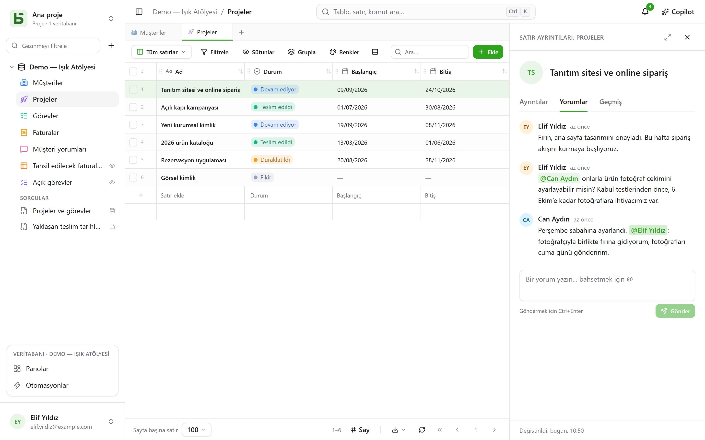

Birkaç kişi aynı veritabanı üzerinde aynı anda çalışır: her biri diğerlerinin yazdıklarının
geldiğini görür, kimin neye baktığını bilir ve bir satırı tam bulunduğu yerde tartışır.

## Yorumlar

Bir satırın ayrıntılarında, “Ayrıntılar” ile “Geçmiş” arasında bir **Yorumlar** sekmesi vardır.
Bir üyeden **bahsetmek** için `@` yazın, göndermek için Ctrl+Enter'a basın. Herkes kendi
yorumlarını düzenler ya da siler.

Satırı okuyabilmek, ona yorum yapmak için yeterlidir. Kendisinden bahsedilen ama satırı
okuyamayan bir kişiye haber verilmez — ve yazar, mesajın gittiğini sanmak yerine bu konuda
uyarılır.

## Bildirimler

Sağ üstteki zil okunmamış olanları sayar. Oraya dört şey gelir:

- biri bir yorumda sizden **bahseder**;
- biri, sizin de yazdığınız bir konuşmada **yanıt verir**;
- biri sizi bir Kişi alanına **atar** — arayüzden, API'den, bir formdan ya da bir
  otomasyondan;
- bir [otomasyon](/basedb/tr/fonctionnalites/automatisations/) size **haber verir**.

Bir bildirimi açmak satırı açar. **Tümünü okundu olarak işaretle** sayacı sıfırlar; bildirimler
90 gün saklanır.

### E-postayla

Kurulumun bir [gönderim sunucusu](/basedb/tr/hebergement/variables/#e-postalar) olduğunda,
**on dakika okunmadan kalan** bir bildirim e-postayla da gönderilir: bekleyenlerin tümü için
tek bir e-posta, her satıra giden bir bağlantıyla. Zamanında okuduğunuz gönderilmez. **Ayarlar
› Bildirimler**'de her tür için iki anahtar vardır: basedb içinde ve e-postayla.

## Gerçek zamanlı

Başkalarının yazdıkları **sayfayı yenilemeden** görüntülenir: değiştirilen bir hücre, taşınan
bir kart, eklenen bir satır — ister arayüzden, ister API'den, bir ajandan ya da doğrudan
SQL'den gelsin. Sunucu yalnızca bir **sinyal** gönderir, asla veri göndermez: verileri sizin
izinlerinizle yeniden okuyan ekrandır. Düzenlemekte olduğunuz bir hücre asla elinizin altından
değiştirilmez.

## Çevrimiçi durum

**Aynı tabloya** bakan kişilerin yüzleri ekranın üstünde görünür; **aynı satırı** açmış
olanlarınki ise satır ayrıntılarının başlığında. Izgarada, diğerlerinin imleci üzerinde
gezindikleri hücrede görünür.

## Her ekrana giden bir bağlantı

Tarayıcının adresi baktığınız şeyi izler: bir tablo, onun bir görünümü, bir satırın
ayrıntıları, bir pano, bir otomasyon, bir soru, ayarlarınız. Bunu bir mesaja yapıştırın: iş
arkadaşınız aynı yere, kendi izinleriyle ulaşır. Sık kullanılanlara ekleyin; tarayıcının geri ve
ileri düğmeleri bulunduğunuz yere geri götürür.

| Adres | Neyi açar |
|---|---|
| `/bases/ventes/tables/opportunites` | “Ventes” veritabanının “Opportunités” tablosu |
| `/bases/ventes/tables/opportunites?vue=…` | tablonun bir görünümü |
| `/bases/ventes/tables/opportunites?ligne=…` | bir satırının ayrıntıları |
| `/bases/ventes/tableaux-de-bord/…` | bir pano |
| `/bases/ventes/automatisations/…` | bir otomasyon |
| `/parametres/apparence` | ayarlarınız |

Bir adres bir **yeri** adlandırır, onu bıraktığınız durumu değil: filtreler, sıralamalar ve
sütun genişlikleri her tarayıcıya özgü kalır. Bir veritabanı ve bir tablo, oraya PostgreSQL
adlarıyla yazılır: yeniden adlandırıldıklarında eski adres artık hiçbir yere götürmez. Hiçbir
yere götürmeyen bir adres — bir yazım hatası, silinmiş bir nesne ya da görmeye hakkınız
olmayan bir şey — “Bu sayfa mevcut değil” gösterir.

## Geri alma

Ctrl+Z son yazmanızı geri alır — bkz. [geçmiş](/basedb/tr/fonctionnalites/historique/#geri-al-ctrlz).

## Sınırlar

- İşletmecinin ayarladığı bir gönderim sunucusu yoksa e-posta gönderilmez.
- Bir kerede yüzden fazla satır değiştiğinde ekran, satır satır güncellemek yerine sayfanın
  tamamını yeniden yükler.
