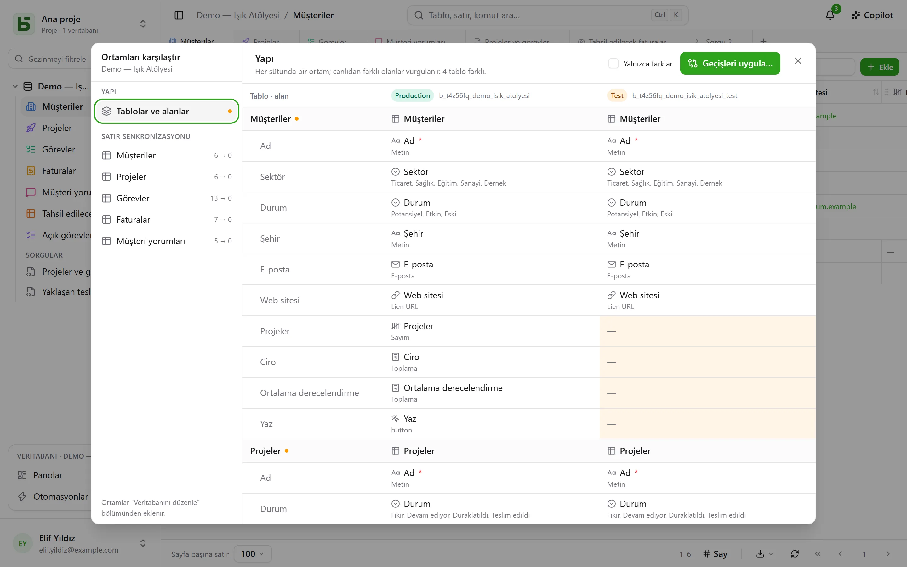

Bir veritabanının **ortamları** olabilir: canlı, test, geliştirme… Her biri kendi başına tam
bir veritabanıdır — şeması, tabloları, satırları, izinleri — ve hepsi veritabanının,
tablolarının ve alanlarının **kökenini** paylaşır.

## Arayüzde

Kenar çubuğu **veritabanı başına bir satır** gösterir; yanında açık olan ortamı belirten ve
ortam değiştirmeye izin veren bir rozet bulunur. Yalnızca canlı ortam olduğu sürece rozet
görünmez.

Ortamlar **Veritabanını düzenle…** içinde eklenir, yeniden adlandırılır ve silinir: yeni bir
ortam, başka bir ortamın satırları olmadan **yapısının bir kopyasından** doğar.

## Ortamları karşılaştırma

Veritabanının menüsünde, **Diğer eylemler** altında, **Ortamları karşılaştır…** bir iletişim
kutusu açar:

- **Yapı**: sütunlarda ortamlar, satırlarda tablolar ve alanlar; canlı ortamdan farklı olan
  vurgulanır.
- **Geçişleri uygula…** bir ortamdan diğerine geçiş planını adım adım hazırlar. Hedefteki daha
  yeni bir değişikliği geri alacak bir şeyi asla kendiliğinden işaretlemez.
- **Satır senkronizasyonu**: tablo tablo, satırları kimliklerine göre bir ortamdan diğerine
  aktarmak.

## basedb kimin neyi değiştirdiğini nasıl bilir

Karşılaştırma **yapı geçmişine** dayanır: bir tablonun ya da alanın her oluşturulması,
değiştirilmesi ya da silinmesi, katalog üzerindeki bir tetikleyici tarafından kaydedilir ve
geçmişin “Yapı” sekmesinde okunur. Köken kimlikleri, test ortamındaki bir alanı — yeniden
adlandırılmış olsa bile — canlı ortamdaki karşılığına bağlar.

## API, SDK ve MCP üzerinden

**Tüm veritabanı için oluşturulmuş bir token**, tüm ortamlarını açar; bugün olanları da,
sonradan ekleyeceklerinizi de: canlı ortam ve test için tek bir token. Program ya da ajan
ortamı her çağrıda seçer:

| Nerede | Nasıl |
|---|---|
| [REST API](/basedb/tr/integrations/api-rest/#ortamı-seçme) | `X-Basedb-Environment: recette` başlığı ya da `?environment=recette` |
| [SDK](/basedb/tr/integrations/sdk/#ortamlar) | `db.environment('recette')` |
| [MCP](/basedb/tr/integrations/mcp/#ortamı-seçme) | `…/mcp?environment=recette` adresi ya da bir aracın `environment` argümanı |
| [n8n](/basedb/tr/integrations/n8n/#kimlik-bilgileri) | kimlik bilgisinin **Environment** alanı |

Bunların hiçbiri yoksa, her veritabanı kendi ortamını belirtir: canlı ortamın adı canlı ortamı,
test ortamının adı test ortamını açar. Bir token ayrıca, oluşturulurken, gösterilen ortamla
sınırlanabilir: o zaman başka hiçbirini görmez. Her iki durumda da izinleri, ortam ortam, onu
oluşturan kişinin izinleriyle kesiştirilir.

## SQL'de

Her ortam bir şemadır: canlı ortam için `b_t4z56fq_ventes`, test ortamı için
`b_t4z56fq_ventes_recette`. Sorgularınız şema — ya da `search_path` — değiştirerek ortam
değiştirir.
